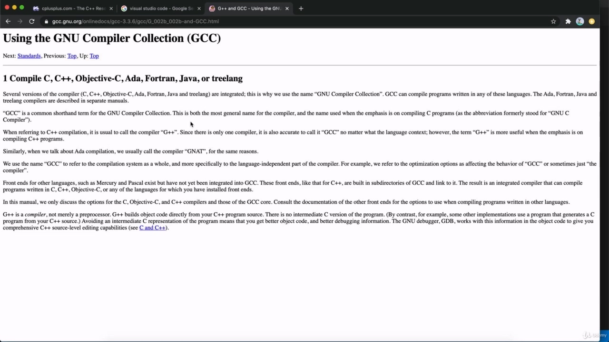
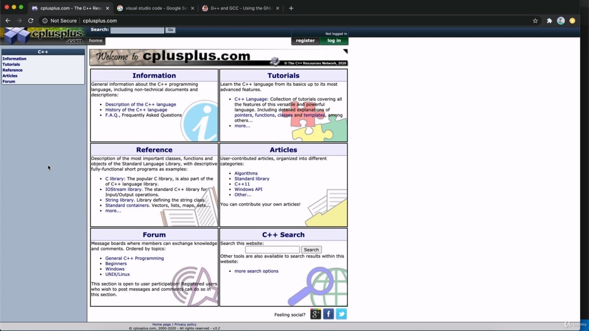
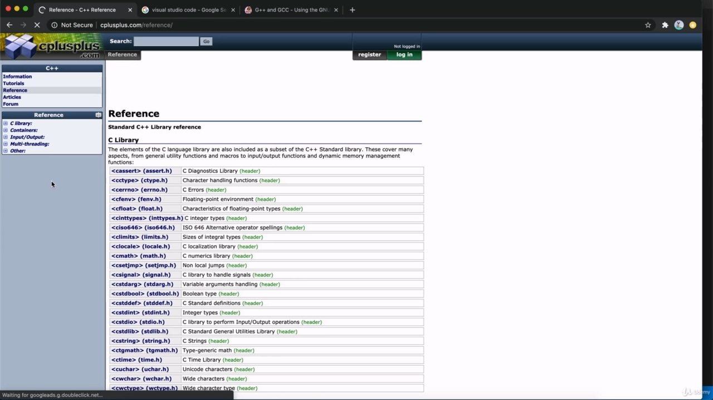

Hello, my name's John Purcell, and this is, of course, on multithreaded in C++, so to follow this course, I'm going to assume that you already know how to write C++ programs to some degree. So you have a compiler installed and you can compile and run C++ programs and you have like at least a reasonable kind of advanced beginners knowledge of C++.

> 大家好，我叫 John Purcell，当然，这是关于 C++中的多线程的，所以为了学习本课程，我假设您已经在某种程度上知道如何编写 C++程序。所以你已经安装了一个编译器，你可以编译和运行 C++程序，你至少有一种合理的 C++高级初学者知识。

## img - 36110

So I'm going to be using Visual Studio Code as my editor, and that's a free lightweight programmers editor from Microsoft. And it's really, really good. And I'm going to be compiling just on the command line in a bus terminal. The compiler that I'm using is going to be C++ and I'm actually using it on the Mac. But you should be able to follow this course using any reasonable modern compiler.

> 所以我将使用 Visual Studio 代码作为我的编辑器，这是一个来自 Microsoft 的免费轻量级程序员编辑器。这真的，真的很好。我将在总线终端的命令行上进行编译。我使用的编译器将是 C++，我实际上在 Mac 上使用它。但您应该能够使用任何合理的现代编译器来学习本课程。

## img - 105210

The kind of multithreaded that we're going to be talking about in this course is the or the multi threading extensions that have been added to C++, starting with C++ 11. So it's possible you may need to do something to activate C++, let's say, 14 or 17 onwards support in your compiler. But if you can write, for example, lambda expressions, then you can probably follow this course with your compiler. Any reasonably modern compiler should basically do the trick. So if you want to follow along with exactly what I'm doing, then you probably want to install G.G plus Plastiki or some kind of support of it, your system, like for Windows or whatever, and install visual studio code. But you should be able to follow this in, let's say, visual studio or whatever compiler you're using within reason.

> 我们将在本课程中讨论的多线程类型是从 C++11 开始添加到 C++中的多线程扩展。因此，您可能需要做一些事情来激活 C++，比方说，编译器中对 14 或 17 以上版本的支持。但是，如果您可以编写 lambda 表达式，那么您可能可以使用编译器遵循本课程。任何合理的现代编译器基本上都应该做到这一点。所以，如果你想完全按照我所做的做，那么你可能想安装 G.G 加上 Plastiki 或某种支持，你的系统，比如 Windows 或其他，并安装 visual studio 代码。但你应该能够在 visual studio 或任何你在合理范围内使用的编译器中遵循这一点。

## img - 206010

And if you want a reference for the material that were going to cover C++, dot com is pretty good. That's got a reference section and in there you can find a section on multi threading. So I'll leave you to explore that.

> 如果你想要一个关于 C++的参考资料，dot-com 是非常好的。这有一个参考部分，在那里你可以找到一个关于多线程的部分。所以我会让你去探索。
