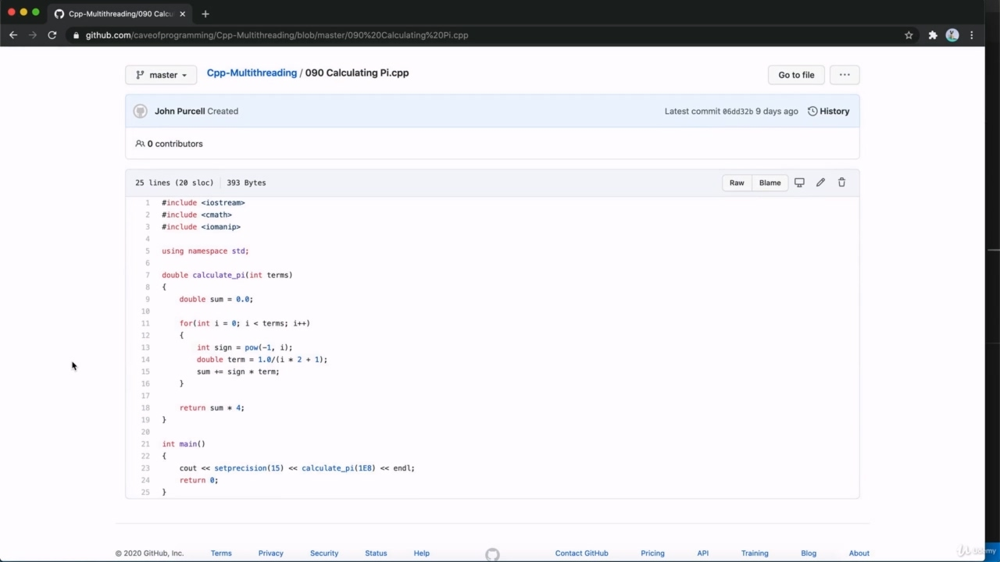

## img - 109860

Hello, you can find the source code for this course on guitar. So if you go to get to dot com slash. Cave of programming, that's all one word. And go to repositories. And KPG multithreaded. From there, you can download the source code, so if you want to direct your URL, it's setup dot com slash cave of programming, SICP, hyphen multithreaded or just go to get to dot com slash cave of programming and browse to the right repository. And you could download this here. If you do use get you can just do get clone and copy in this wall here or there is, as you can see, an option to download the zip code or you could open it. We get a desktop. If you install that or just browse it online is probably the most useful option because instead of having to rewind the videos to look at source code, you can simply find it all here and figure out what you to rewind the videos to look at source code, you can simply find it all here and figure out what you have to type. OK, so until next time HAPI coding.
