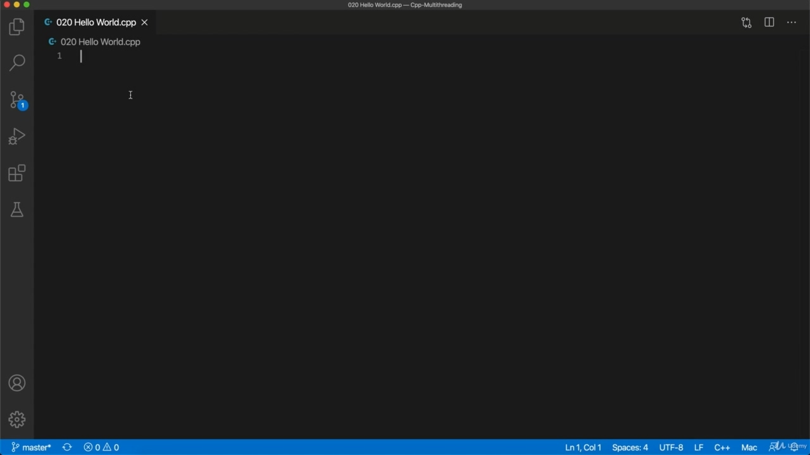
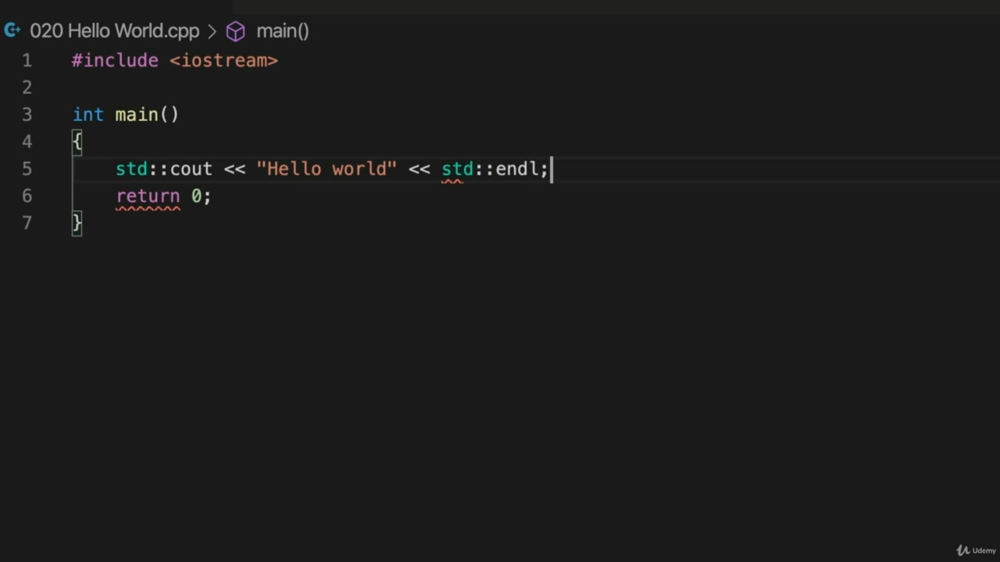
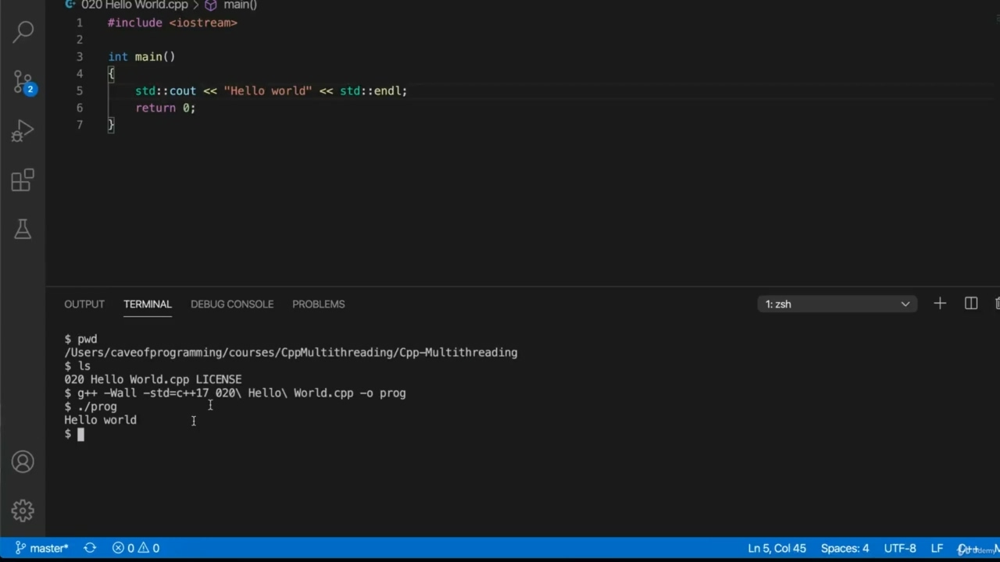
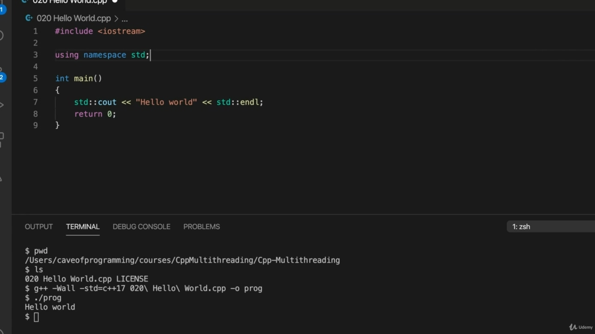
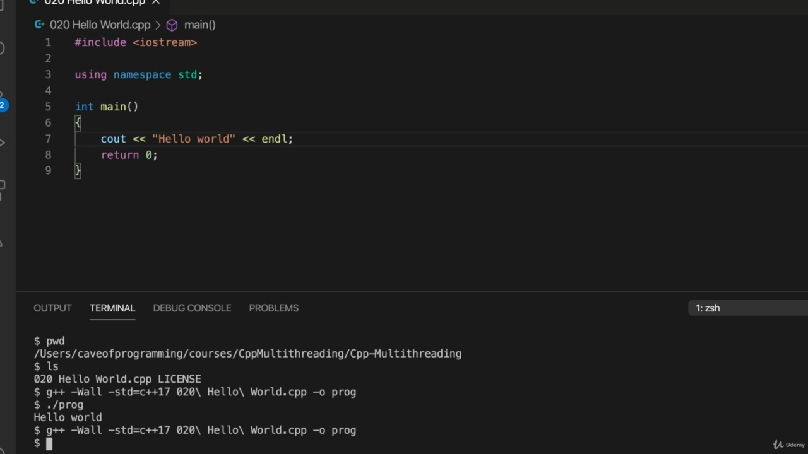
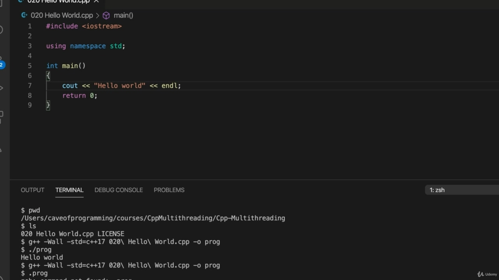

Hello, in this video, I'm just going to create a hello world program in C++, so you should already Hello, in this video, I'm just going to create a hello world program in C++, so you should already know how to do this if you're following this course. But I'm just going to show you my set up here. So I've got Visual Studio Code and I'm going to create a new file says a file explorer sort of thing here. Let's go to file new file and select a built-In editor. And I'm going to save this as 020. Hello, World Cup.

> 你好，在这个视频中，我将用 C++创建一个 Hello world 程序，所以你应该已经知道了。但我只想让你看看我在这里的设置。所以我有了 Visual Studio 代码，我要创建一个新的文件，就像这里的文件浏览器一样。让我们去归档新文件并选择一个内置编辑器。我将把这个保存为 020。你好，世界杯。

## img - 32380

Hello, World Cup. When you say the CPFL file for the first time in Visual Studio Code, if you are using visual studio code, it will ask you if you want to install C++ extensions usually and you definitely want to install them. You can install various text extensions in an official studio code and you want an extension that will do automatic formatting, which I'm a big fan of personally, and syntax highlighting at the very least. So let's do the usual kind of stuff.

> 你好，世界杯。当您第一次在 Visual Studio 代码中使用 CPFL 文件时，如果您正在使用 Visual Studio 代码，它会询问您是否希望通常安装 C++扩展，并且您确实希望安装它们。你可以在一个官方的工作室代码中安装各种文本扩展，你想要一个可以自动格式化的扩展，我个人非常喜欢，并且至少可以突出显示语法。所以，让我们做通常的事情。

## img - 107730

So let's do the usual kind of stuff. So I'm going to include. Extreme and most compilers these days, I think if you write a program like this, it's probably actually always been the case. They will usually compile that, but, you know, hopefully, you know how to do this on your system. So let's do standard call and call on out. Hello, world. And standard coal and Andell. And to compile it, I'm going to use a terminal so I can do view terminal in visual studio code.

> 所以，让我们做通常的事情。所以我要包括在内。我认为，如果你编写一个这样的程序，事实上可能总是如此。他们通常会编译这些，但是，你知道，希望你知道如何在你的系统上这样做。所以，让我们进行标准通话和通话。你好，世界。还有标准煤和 Andell。为了编译它，我将使用一个终端，这样我就可以在 visual studio 代码中查看终端。

## img - 151870

And to compile it, I'm going to use a terminal so I can do view terminal in visual studio code. And I can compile it with Jacqui, so I'm using a Mac this this will be different probably if you're on windows, although if you install C++ and you enable the bus terminal and Windows 10, it probably wouldn't be much different. But regardless, I'll leave this up to you how you compile your program. So I'm going to use plus plus and I'm going to switch on or warnings and enable support for C++. 17, although so we want to be using at least C++ 11 and probably occasionally going to use features that are found in C++ 14 and as or turn on C++ 17 support so that we've got something reasonably recent past few years. Let's compile this. And I'm just going to output it to a program. I'll just call it prog. And will execute prog and it should say hello world.

> 为了编译它，我将使用一个终端，这样我就可以在 visual studio 代码中查看终端。我可以用 Jacqui 编译它，所以我使用的是 Mac，如果你在 windows 上，这可能会有所不同，尽管如果你安装 C++并启用总线终端和 windows 10，这可能不会有太大不同。但不管怎样，我将把这个问题留给你如何编译你的程序。所以我将使用 plus plus，我将打开或警告并启用对 C++的支持。17，尽管我们希望至少使用 C++11，并且可能偶尔会使用 C++14 中的功能，或者启用 C++17 支持，所以我们在过去几年中得到了一些合理的东西。让我们编译一下。我将把它输出到一个程序中。我就叫它 prog。并将执行 prog，它应该向世界问好。

## img - 254490

And will execute prog and it should say hello world. So now it's not considered good practice to write using namespace standard at the top because that means

> 并将执行 prog，它应该向世界问好。因此，现在在顶部使用名称空间标准编写被认为是不好的做法，因为这意味着

## img - 305850

So now it's not considered good practice to write using namespace standard at the top because that means you don't have to prefix things like C Out and Andell and many other things with standard colon colon, which could mean, of course, that you things that you write in your program conflict with things in the standard library. But I am going to do this because the programs that we're going to be writing are going to be pretty small and there's no point me typing standard colon colon over and over again and you looking at it

> 因此，现在在顶部使用命名空间标准编写被认为是不好的做法，因为这意味着你不必在像 C Out 和 Andell 这样的东西以及其他许多东西前面加上标准冒号冒号，这当然意味着你在程序中编写的东西与标准库中的东西冲突。但我会这样做，因为我们将要编写的程序将非常小，我没有必要一遍又一遍地键入标准冒号，然后你再看看它

## img - 333210

small and there's no point me typing standard colon colon over and over again and you looking at it over and over again, all it's going to do is clutter up our code here. So please demo programs. I'm going to be writing using namespace standard at the top. So those are Hello World Program.

> 我一遍又一遍地输入标准冒号，你一遍又一遍的看着它，它所要做的就是把我们的代码弄得乱七八糟。所以请演示程序。我将在顶部使用命名空间标准来编写。这些就是 Hello World 节目。
