Hello, in this video, we're going to create a basic multithreaded program, because I want to show you this working before we talk about how this actually works and what kind of thing it actually does. And so let's go to the top here and include thread. I'm going to create a function that's going to contain some code that we want to run in its own thread, so at the top here, let's create a function just called I'll just call it work.

> 大家好，在这个视频中，我们将创建一个基本的多线程程序，因为我想在讨论这个程序的实际工作方式以及它实际做的事情之前向大家展示这个程序的工作原理。所以，让我们到这里的顶部，包括线程。我将创建一个函数，它将包含一些我们希望在它自己的线程中运行的代码，所以在这里的顶部，让我们创建一个刚刚调用的函数，我将其称为 work。

## img - 56300

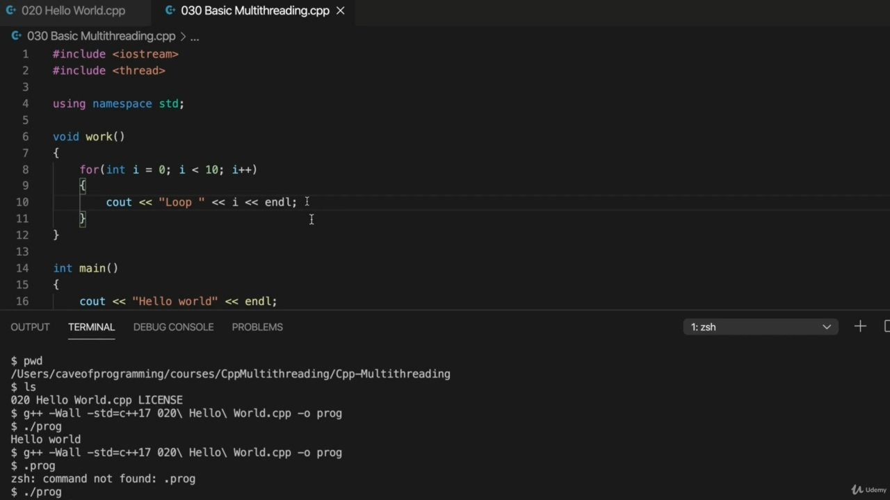

And we'll just do a see out, I'll do Scouts' and I'll write and loop and let's put the loop counter and Al.

> 我们会做一个观察，我会做童子军，我会写循环，让我们把循环计数器和 Al 放在一起。

## img - 106940

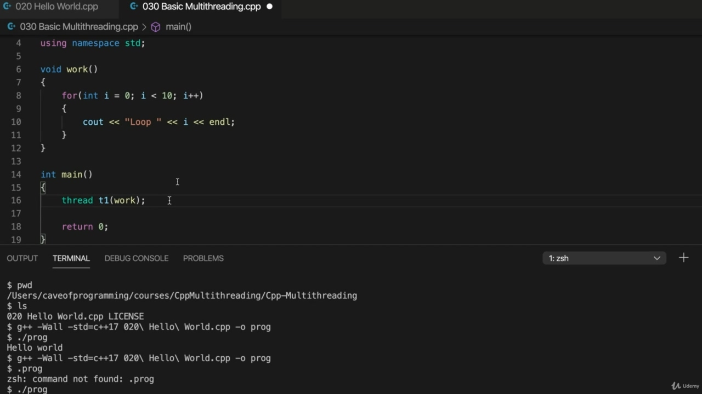

So how can we run this code in its own thread, so let's go to Maine and in Maine, I'm going to declare an object of the type thread. So of course, I'm doing using namespace standard. So if you weren't doing that, which normally wouldn't you be typing standard STD, colon, colon thread rather than just thread by itself? That's right. Thread I call it twan. Give a really short name and. I'm going to pass to the constructor appointed to this function. So I'm just going to type the name of the function in the.

> 所以我们如何在它自己的线程中运行这段代码，让我们去缅因州，在缅因州，我将声明一个线程类型的对象。当然，我使用的是命名空间标准。所以，如果你不这样做，你通常不会键入标准的 STD、冒号、冒号线程，而不仅仅是线程本身吗？这是正确的。线程我称之为 twan。给我一个很短的名字。我将传递给指定给此函数的构造函数。所以我只需要在中键入函数的名称。

## img - 144090

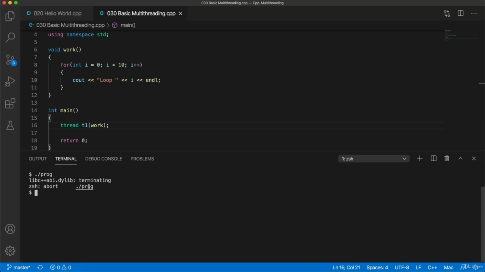

Let's actually see what that does. So I compile it and run it. And it felt like a nasty looking era.

> 让我们来看看这有什么作用。所以我编译并运行了它，感觉就像是一个肮脏的时代。

## img - 158960

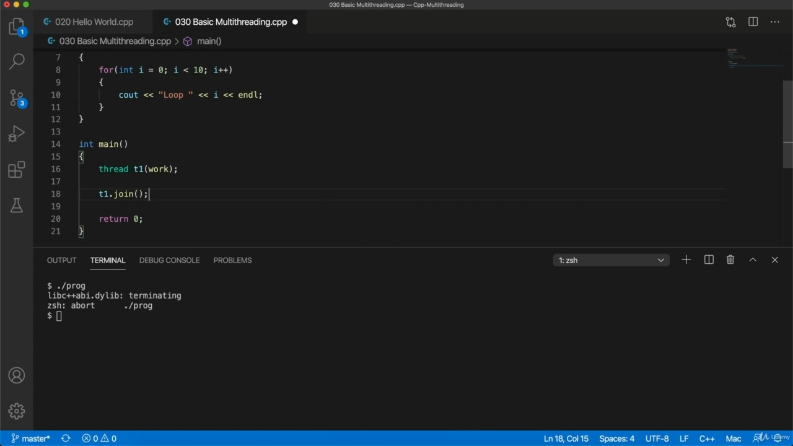

Is it says something about terminating? It may be different on your system, you may even not get an error, it might actually work. But here what happens is. This thread tries to run this code in its own thread, so and then the main thread just quits and that terminates this thread prematurely so the whole thing doesn't work. What we want to do here is wait until this thread has actually finished working before we quit the main program.

> 它是关于终止的吗？它可能在您的系统上有所不同，您甚至可能不会收到错误，它可能会实际工作。但这里发生的是，这个线程试图在自己的线程中运行这段代码，然后主线程就退出了，这就过早地终止了这个线程，所以整个事情都不起作用。我们在这里要做的是等到这个线程真正完成工作后，再退出主程序。

## img - 234040

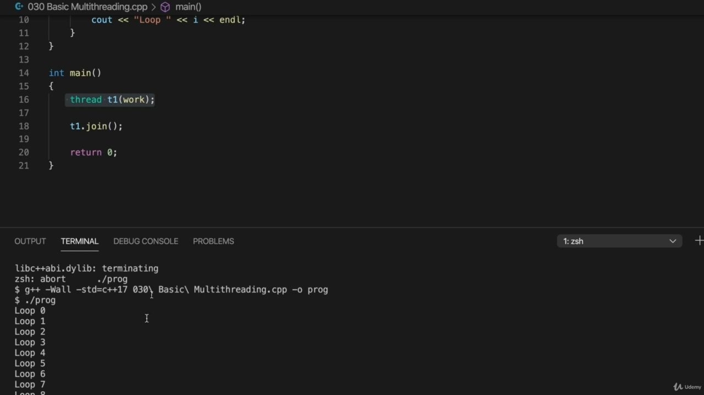

So to do that, I use the join method of the thread class. And what that does is it it just waits. It's just going to wait there until this thread is finished doing whatever it's doing. Let's try this now. Saw, compile it and run it.

> 为此，我使用线程类的 join 方法。它所做的只是等待。它只是在那里等待，直到这个线程完成它正在做的任何事情。让我们现在就试试。Saw，编译并运行它。

## img - 258020

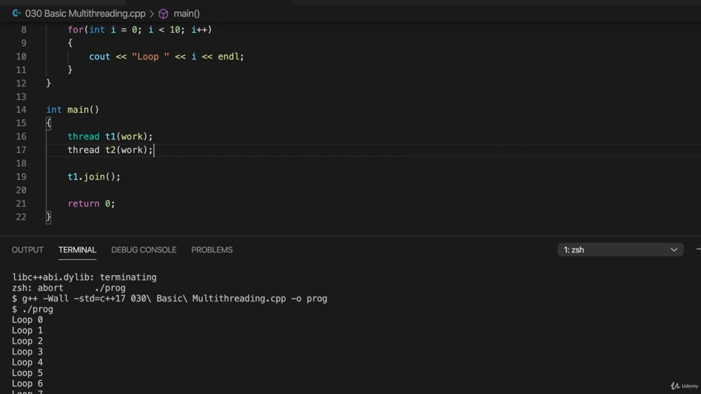

And it loop zero through to nine, but that's not very exciting, let's try running two threads at the same time. So in this program so far, we've got the main thread and that just creates another thread. So now there's two threads and the main thread waits for this second thread that it's just created until it quits. And the thread that it's created is simply outputting this stuff here. Let's create another Wambo.

> 它从 0 循环到 9，但这不是很令人兴奋，让我们尝试同时运行两个线程。所以到目前为止，在这个程序中，我们有一个主线程，它只是创建了另一个线程。现在有两个线程，主线程等待刚刚创建的第二个线程，直到退出。它创建的线程只是在这里输出这些东西。让我们再创造一个万博。

## img - 328290

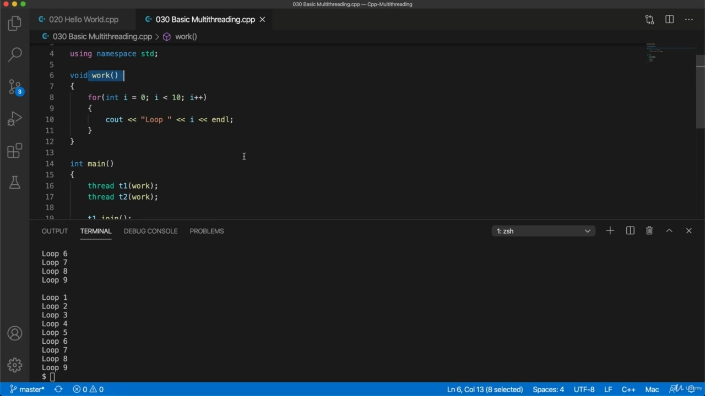

So thread two, and I also use that to run the same function, and we need to also add T to join. I'm going to compile it. And runit. So now we get some output, and in this case, it's we got one, two, three, four, five, six, seven, eight, nine and 10, the same same thing. Again, you may get that. You may get something a little bit different. But what's happened in this case is that this thread has started this code and the code is just finished running before this second thread could do anything. So it doesn't look multithreaded on my system here. It looks like we just run this loop twice, one after the other, which looks completely useless. It looks here as though this is equivalent to just calling this function twice, one after the other. What I need to do to really show that this is multithreaded is put a delay in this loop.

> 所以线程 2，我也使用它来运行相同的函数，我们还需要添加 T 来连接。我要编译它并运行它。现在我们得到了一些输出，在这个例子中，我们得到了 1，2，3，4，5，6，7，8，9 和 10，同样的东西。同样，你可能会明白。你可能会得到一些不同的东西。但在这种情况下发生的是，这个线程已经启动了这段代码，并且在第二个线程可以执行任何操作之前，代码刚刚完成运行。所以在我的系统中它看起来不是多线程的。看起来我们只运行了两次这个循环，一次接着一次，这看起来完全没用。在这里看起来，这相当于一个接一个地调用这个函数两次。为了真正证明这是多线程的，我需要做的是在这个循环中添加一个延迟。

## img - 426290

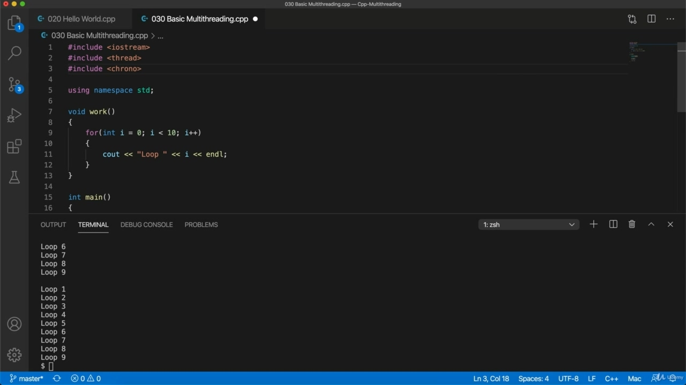

What I need to do to really show that this is multithreaded is put a delay in this loop. So to do that, I'm going to include at the top. Crono.

> 为了真正证明这是多线程的，我需要做的是在这个循环中添加一个延迟。因此，为了做到这一点，我将包括在顶部。克罗诺。

## img - 440890

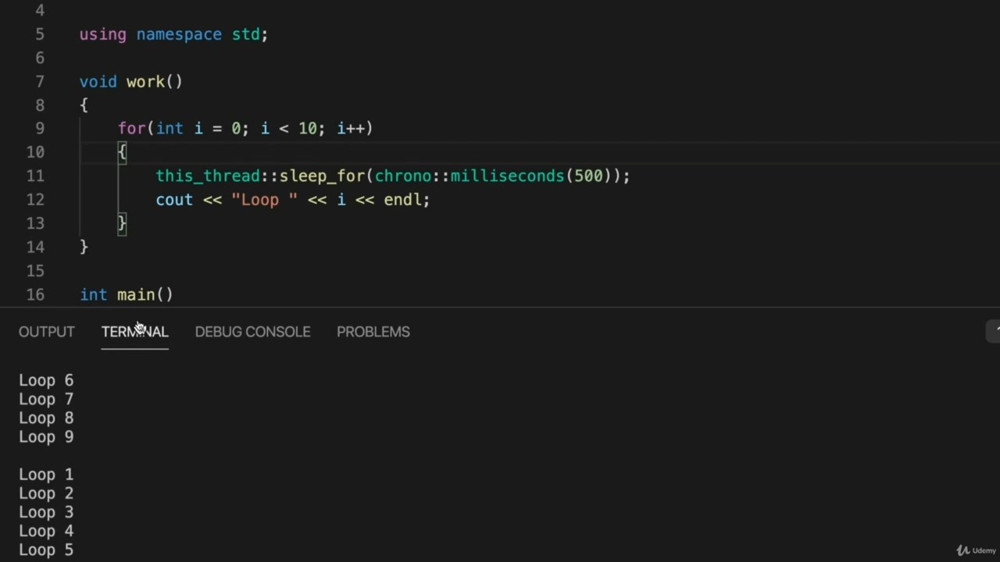

Which is now a standard part of C++ and within the loop, that's right. This thread on Kolon sleep for. And I'm going to pass to that. Crono, Kolon, Kolon. Milliseconds. Brackett's 500.

> 这现在是 C++的标准部分，在循环中，没错。这条科龙睡觉的线索。我将转到这一点。克罗诺，科伦，科伦。毫秒。布雷克特是 500。

## img - 509140

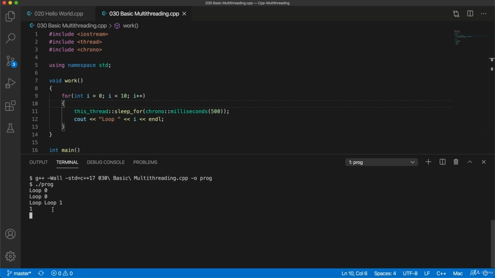

So this this is a way of getting whatever the current thread it is, whatever the thread this is in, it's way for getting the thread to sleep for a while, in this case, 500 milliseconds at a time. So you should find that that works on your system. It's a standard part of C++. Now, if not, you can use some other technique. If you've got some some other way of sleeping for your compiler, then that should work just as well. But this is now standard. It should work for you, I think. Now, let's try our program again, so I'm going to compile it. And I'm going to run it.

> 所以这是一种获取当前线程的方法，无论它在哪个线程中，这是一个让线程休眠一段时间的方法，在本例中，每次 500 毫秒。因此，您应该发现这在您的系统上有效。这是 C++的标准部分。现在，如果没有，你可以使用其他技术。如果你已经为你的编译器提供了一些其他的睡眠方式，那么这也同样有效。但这是现在的标准。我想这应该对你有用。现在，让我们再次尝试我们的程序，所以我要编译它。我要运行它。

## img - 544800

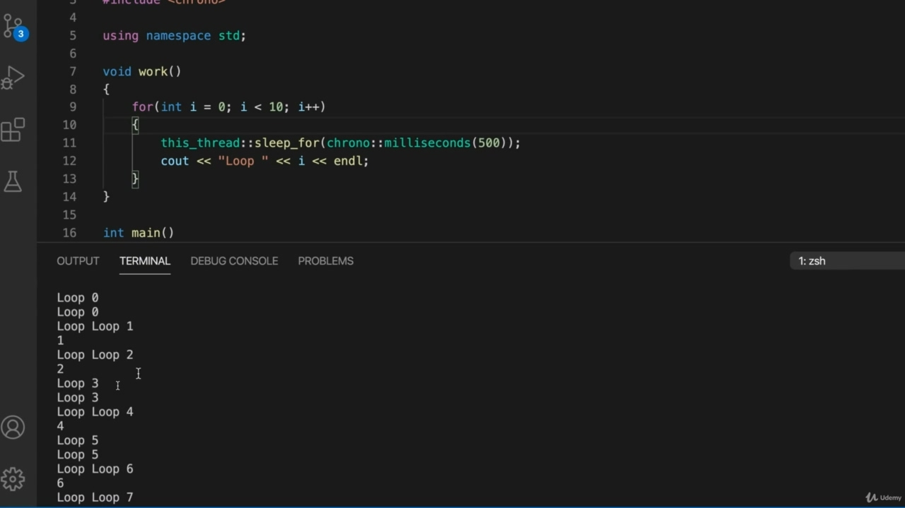

And now you see something quite different. So the output from the two threads is interleaved and in fact, it's also mangled, so it says here,

> 现在你看到了完全不同的东西。所以两个线程的输出是交错的，事实上，它也被破坏了，所以这里说，

## img - 555660

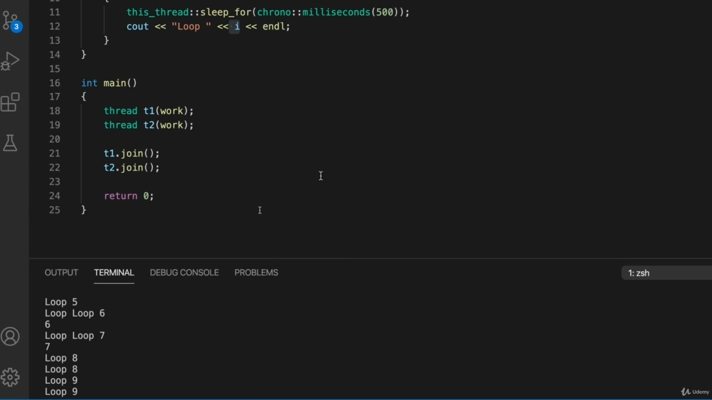

So the output from the two threads is interleaved and in fact, it's also mangled, so it says here, you know, what you get is going to be look at the draw, really, but you should see interleaved output of some kind. I'm actually finding that in some cases, one thread can output loop and then it doesn't manage to output the number before the other thread also outputs the loop. So it's not kind of tidy output at all. Here we can see that it's got extremely interleaved and mixed up. Now we're going to delve into this, so I'm going to talk about what's going on and how to make threats,

> 所以两个线程的输出是交错的，事实上，它也被破坏了，所以它在这里说，你知道，你得到的将是看画，真的，但你应该看到某种交错的输出。我实际上发现，在某些情况下，一个线程可以输出循环，然后它无法在另一个线程也输出循环之前输出数字。因此，这根本不是一种整洁的输出。在这里，我们可以看到它被极度交织和混合。现在我们将深入研究这个问题，所以我将讨论发生了什么以及如何制造威胁，

## img - 633180

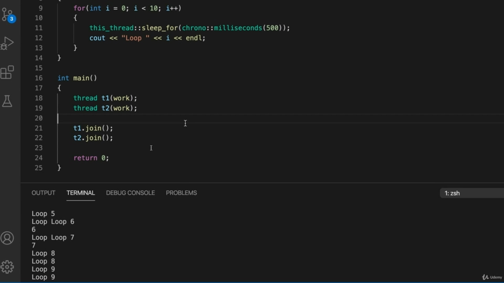

cooperate properly with each other, but I just wanted to show you this. And the point is that these two threads are running essentially at the same time. So. This thread is running its code essentially at the same time as this thread here, and that's why we're getting interleaved outputs and we can start lots of threads and run them all at the same time.

> 彼此配合得当，但我只是想向你展示一下。关键是这两个线程基本上同时运行。所以，这个线程基本上与这个线程同时运行代码，这就是为什么我们得到交错输出，我们可以启动很多线程并同时运行它们。
