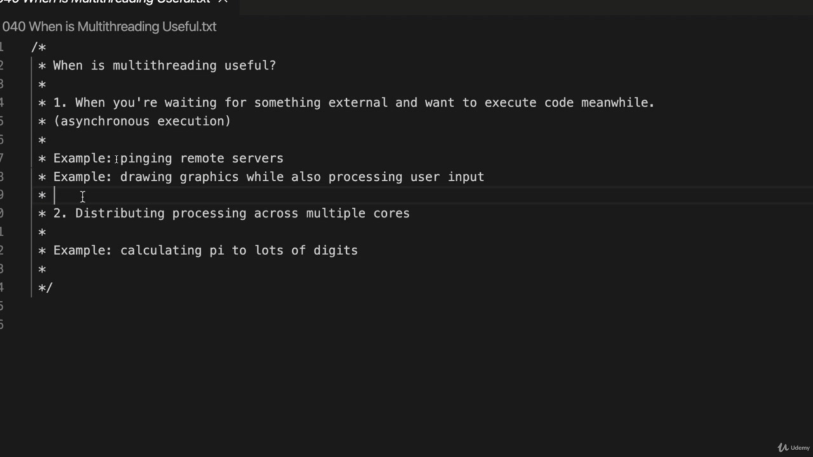
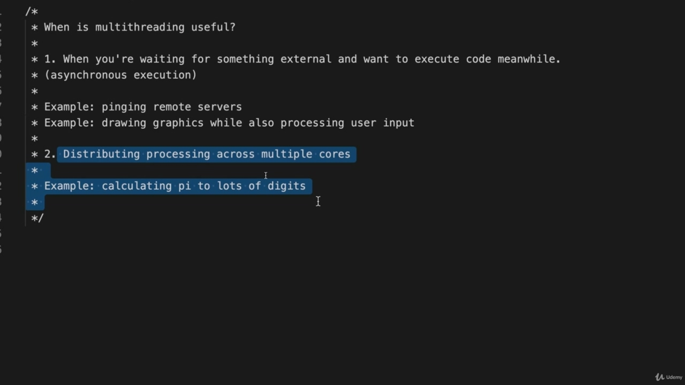
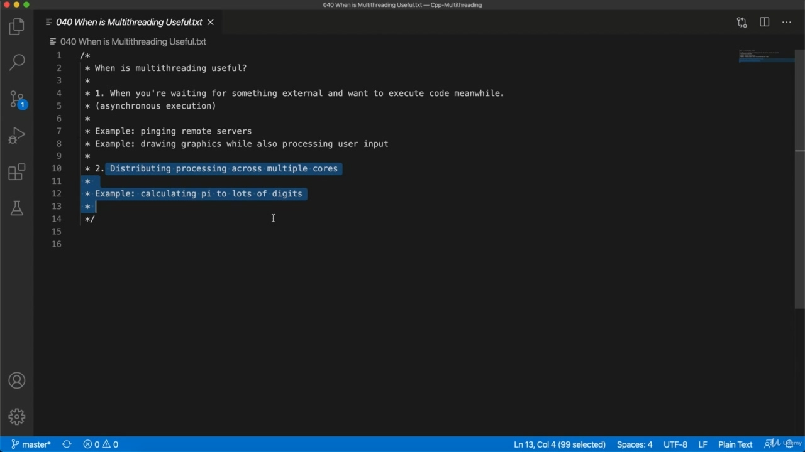

Hello, in this video, we're going to talk about when multithreaded is actually useful and in fact, Hello, in this video, we're going to talk about when multithreaded is actually useful and in fact, there are basically two separate situations where you might want to use multithreaded in the first situation is when you're waiting for something to happen external to your computer and you want to execute code while you're waiting. So you want a synchronous execution. In other words, synchronous execution would be if we let's say we run a function and we have to wait for it to finish and then we run another function. So the functions are synchronized with each other. That's synchronous. Multi threading gives us asynchronous execution, a synchronous execution. This is where functions are not synchronized with each other. They can run at the same time. So let's say, for example, you're pinging a bunch of remote servers. This is something that I once had to do for a large company that I worked for. They had a massive internal network and they had many routers and switches on that network. And I had to ping each one and it would send some information back. And then I had to collect the information from all the different servers. Now, in that situation, because there are thousands of them, I don't want to ping a server and then wait for that to reply and then ping the next server and so on. In that sort of situation, you want to do a bunch of pings all at the same time. And that's one of the things that multi threading would allow you to do. You can fire off a bunch of pings at the same time. Similarly, imagine that you've got some sort of game and it's drawing elaborate moving graphics on

> 你好，在这段视频中，我们将讨论多线程何时真正有用，事实上，你好，在这个视频中，基本上有两种不同的情况，您可能希望在第一种情况下使用多线程。第一种情况是，您在等待计算机外部发生的事情，并且您希望在等待时执行代码。所以您需要同步执行。换句话说，如果我们运行一个函数，我们必须等待它完成，然后再运行另一个函数。所以这些功能是相互同步的。这是同步的。多线程为我们提供了异步执行，即同步执行。这是功能彼此不同步的地方。它们可以同时运行。例如，假设您正在 ping 一组远程服务器。这是我曾经为一家大公司工作过的事情。他们有一个庞大的内部网络，网络上有很多路由器和交换机。我必须给每个人打电话，然后它会发回一些信息。然后我不得不从所有不同的服务器收集信息。现在，在这种情况下，因为有成千上万的服务器，我不想 ping 一个服务器，然后等待它回复，然后 ping 下一个服务器等等。在这种情况中，你想同时执行一系列 ping。这是多线程允许你做的事情之一。你可以同时发出一堆 ping。类似地，想象你有某种游戏，它在上面绘制了复杂的运动图形

## img - 151590

Similarly, imagine that you've got some sort of game and it's drawing elaborate moving graphics on the screen. At the same time that you're drawing graphics on the screen. You also want to check for user input, but the user won't constantly send input into the game. They won't constantly do things. You'll have to have a thread that's waiting for user input to be entered. And while that thread is waiting for user input, you are going to have other threats that are doing things like calculating what should be drawn on the screen. So again, you want multiple threads executing at the same time. Both of these situations involve waiting for something to happen. You've got some threads that are just sitting there waiting for input or waiting for a server to reply or whatever. And meanwhile, you want to execute other threads at the same time that are doing other things like updating the screen or whatever, or pinging other servers or whatever. So that's one kind of situation. You just got some threads that are waiting for something to happen. Another situation is where you've got some heavy CPU intensive processing that you're doing and you want to distribute it across multiple cores. So an example might be if you're calculating PI to lots and lots of digits, so you've probably got more than one core in your machine. And if you're a scientist, you may have access to some really fancy system with lots and lots of central processing units in it. And you want to distribute the work across separate cores because that's more that's going to be faster than if you only use one call at a time. So as an example, I'm using a MacBook here. And if I go to about this Mark, it tells me that this is a six call system, so. I'm not a hardware guy, but as I understand this, so in my central processing unit and I believe there's only one central processing unit as such, there are six cores. So that's effectively six processors that can run things at the same time, more or less. Now, each of those cores actually uses something called hyper threading, meaning each call can actually run two threads at any given time, which means that in theory I can run 12 separate threads at the same time on my computer. So if I had some really heavy work that I wanted to do, in theory, the optimum number of threads to

> 同样，假设你有某种游戏，它在屏幕上绘制出复杂的运动图形。同时在屏幕上绘制图形。您还需要检查用户输入，但用户不会一直向游戏发送输入。他们不会经常做事。您必须有一个线程等待用户输入。当该线程等待用户输入时，您将面临其他威胁，例如计算屏幕上应该绘制的内容。同样，您希望多个线程同时执行。这两种情况都需要等待事情发生。您有一些线程只是坐在那里等待输入或等待服务器回复或其他什么。同时，您希望在执行其他任务的同时执行其他线程，如更新屏幕等，或 ping 其他服务器等。这是一种情况。你只是有一些线程在等待发生什么。另一种情况是，您正在进行一些繁重的 CPU 密集型处理，并且希望将其分布在多个内核上。因此，一个例子可能是，如果你计算 PI 到很多数字，那么你的机器中可能有不止一个内核。如果你是一名科学家，你可能会接触到一些非常奇特的系统，其中有很多中央处理单元。你想在不同的内核之间分配工作，因为这比一次只使用一个调用要快得多。举个例子，我在这里使用的是 MacBook。如果我谈到这个 Mark，它告诉我这是一个六呼叫系统。我不是硬件人员，但我理解这一点，所以在我的中央处理单元中，我相信只有一个中央处理单元，因此有六个核心。因此，这实际上是六个处理器，它们或多或少可以同时运行。现在，这些内核中的每一个实际上都使用了一种叫做超线程的东西，这意味着每个调用实际上可以在任何给定的时间运行两个线程，这就意味着理论上我可以在我的计算机上同时运行 12 个独立的线程。因此，如果我要做一些非常繁重的工作，理论上

## img - 433420

So if I had some really heavy work that I wanted to do, in theory, the optimum number of threads to get through that work as fast as possible would be 12, because that's how many my computer can genuinely run simultaneously at the same time. And later on, we'll find out how to how to find out for your own computer how many threads you can run at the same time. It's quite simple thing to do. Now, it's important to realize that often you'll use this first type of multi threading, so let's imagine, for example, that your machine only had it has only had as one CPU. Let's imagine it's got one coronets, it's got one sort of processor within it. And that processor can only one run one thread at a time. So let's let's kind of forget about the hardware a little bit and just imagine that you've got a computer that can only run a single thread at a time, which these days for a desktop computer is probably unusual, but will imagine that you can still run multithreaded code and it will work via time slicing. So let's say you're running two threads at the same time. Then your computer will allocate a really brief slice of time to one thread, then a brief slice of time to the next, then a brief slice of time to the first thread and so on. So you'll get an appearance of multi threading. But if you only in reality can run one kind of basic thread at a time, one sort of process at a time, then if your aim is to get through a load of really heavy CPU intensive work in that situation, it

> 因此，如果我想做一些非常繁重的工作，理论上，最快完成这项工作的最佳线程数应该是 12 个，因为这就是我的计算机真正能够同时运行的数量。稍后，我们将了解如何在自己的计算机上同时运行多少线程。这是一件非常简单的事情。现在，重要的是要认识到，您将经常使用第一种类型的多线程，所以让我们想象一下，例如，您的机器只有一个 CPU。让我们想象一下，它有一个 coronet，里面有一种处理器，而这个处理器一次只能运行一个线程。所以，让我们稍微忘掉硬件，想象一下，你有一台计算机，一次只能运行一个线程，这对台式计算机来说可能是不寻常的，但你可以想象，你仍然可以运行多线程代码，它将通过时间切片来工作。假设您同时运行两个线程。然后你的计算机会给一个线程分配一个非常短的时间段，然后给下一个线程一个很短的时间，然后给第一个线程分配很短的一段时间，依此类推。所以你会看到一个多线程的外观。但如果你只能在现实中一次运行一种基本线程，一次只能运行一种进程，那么如果你的目标是在这种情况下完成大量的 CPU 密集型工作

## img - 616370

then if your aim is to get through a load of really heavy CPU intensive work in that situation, it won't do you any good to have multiple threads because they've all got to be executed on the same core anyway. Whereas in this situation, multithreaded is still useful because although you'll only get an illusion of multiple threads running at the same time via time slicing, nevertheless, that's that's fine. As far as you're concerned, you're running multiple functions at the same time, and that's all right. So the bottom line here is, is really multi threading is useful in lots of situations. It's particularly useful when you're waiting for something external to happen and you want to run other code at the same time. It's also useful if you want to distribute some heavy processing across multiple cores in your computer, but then you will only find that you get to speed up if you actually do have multiple cores so that your computer can run multiple threads at the same time. And then you need to know how many threads really your hardware can genuinely run genuinely at the same

> 那么如果你的目标是在这种情况下完成大量的 CPU 密集型工作，那么拥有多个线程对你没有任何好处，因为它们都必须在同一个内核上执行。然而，在这种情况下，多线程仍然很有用，因为尽管您只能通过时间切片获得多个线程同时运行的错觉，但这很好。就您而言，您正在同时运行多个函数，这没关系。所以这里的底线是，多线程在很多情况下真的有用吗。当您在等待外部事件发生时，并且希望同时运行其他代码时，它特别有用。如果您想在计算机中的多个内核之间分配一些繁重的处理，这也是很有用的，但只有当您确实拥有多个内核，从而使计算机可以同时运行多个线程时，您才会发现自己可以加快速度。然后你需要知道你的硬件能同时真正运行多少线程

## img - 722610

And then you need to know how many threads really your hardware can genuinely run genuinely at the same time. And you can actually find that through a function of thread starting function called hardware concurrency.

> 然后你需要知道你的硬件能同时真正运行多少线程。实际上，您可以通过一个叫做硬件并发的线程启动函数来发现这一点。
