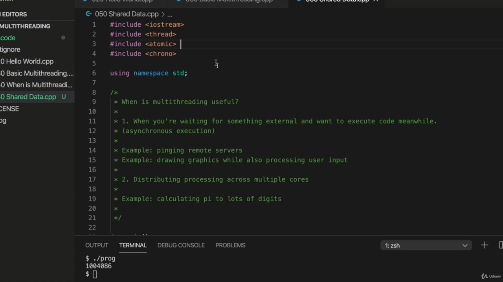

Hello, in this video, we're going to take a look at a problem that arises when threads share data, Hello, in this video, we're going to take a look at a problem that arises when threads share data, so. There are various things that we can pass to the constructor of thread, we can actually pass a lambda expression here and we could pass the callable object. In other words, an object that implements the operator that looks like this, it's got to run brackets, will take a look at those. And this video will take a look in particular at lambda expressions. Let's get rid of this work function. And I'm going to pass Solander expression to this thread t one entity to. So the Alamdar expression, hopefully you're familiar with them, but if you're not, don't worry. It's just an anonymous function, like a function. It doesn't have a name. So something you probably in this case you only want to call it once, although you can store like a reference to it. So let's have a couple of square brackets and then round brackets and curly brackets. And each of these serves a purpose in the lambda expression. The round brackets is for passing parameters are curly brackets is where your code goes and the square

> 您好，在本视频中，我们将研究线程共享数据时出现的问题。您好，在这段视频中，我将研究线程分享数据时产生的问题。我们可以向线程的构造函数传递各种信息，我们可以在这里传递 lambda 表达式，也可以传递可调用对象。换句话说，一个实现了这样的运算符的对象，它必须运行括号，它将查看这些。本视频将特别介绍 lambda 表达式。让我们去掉这个功函数。我将把 Solander 表达式传递给这个线程，而不是一个实体。所以 Alandar 表达式，希望你熟悉，但如果你不熟悉，不要担心。它只是一个匿名函数，就像一个函数。它没有名字。所以，在这种情况下，你可能只想调用它一次，尽管你可以像引用一样存储它。所以，让我们使用两个方括号，然后使用圆括号和大括号。这些函数中的每一个都在 lambda 表达式中发挥作用。圆括号用于传递参数。圆括号是代码所在的位置，方括号是

## img - 119430

The round brackets is for passing parameters are curly brackets is where your code goes and the square brackets are capture brackets that we use to say what essentially what variables from its environment the Landro expression can use. So I'm going to pass a lambda expression to 32 as well. And I'm going to have here a variable called count, which are set initially equal to zero, and I also want a variable that controls how many iterations the loops that I'm going to write are going to do.

> 圆括号是用于传递参数的。花括号是代码所在的位置，方括号是捕获括号，我们用它来表示 Landro 表达式可以使用的环境变量。所以我还要将 lambda 表达式传递给 32。这里有一个名为 count 的变量，它最初被设置为零，我还需要一个变量来控制我要写的循环要进行多少次迭代。

## img - 148950

want a variable that controls how many iterations the loops that I'm going to write are going to do. So let's have a constant iterations equals a thousand. So within this first lambda expression here, I'm going to have a loop for int i equals nought I less than iterations. I plus, plus.

> 需要一个变量来控制我要写的循环将要进行多少次迭代。所以让我们有一个常数迭代等于 1000。所以在这里的第一个 lambda 表达式中，我将有一个 int I 等于 0 的循环，I 小于迭代次数。我加，加。

## img - 217840

And I'm going to increment this count variable, so let's do plus plus count. To be able to use count within this lambda expression, I need to refer to it in these in these square capture brackets.

> 我要增加这个计数变量，让我们做正加计数。为了能够在这个 lambda 表达式中使用 count，我需要在这些方括号中引用它。

## img - 229280

capture brackets. So if I say. Like a reference symbol or kind of unperson count, then it can access count here.

> 捕获括号。所以如果我说。就像一个参考符号或一种未执行的计数，那么它可以在这里访问计数。

## img - 241770

Like a reference symbol or kind of unperson count, then it can access count here. So, I mean, all I'm doing here is, is incrementing count and if I go somewhere after join and do see out. Counts and Andell. We'll be able to see the value of it after it's incremented. Let's try this, so I'm going to compile it. And run it and it's a thousand if I were to output the value of it before waiting for the threads to

> 就像一个参考符号或一种未执行的计数，那么它可以在这里访问计数。所以，我的意思是，我在这里所做的就是增加计数，如果我在加入后去了某个地方，确实看到了。Counts 和 Andell。我们将能够在它递增后看到它的值。让我们试试这个，所以我要编译它。运行它，如果我在等待线程执行之前输出它的值，那么它就有一千个

## img - 310870

And run it and it's a thousand if I were to output the value of it before waiting for the threads to finish or at least before waiting for this thread to finish, its incrementing it, then it's likely going to be zero, although there's no guarantees. Depends what runs in what order here. I've got zero. So what's happening here is that this thread begins starting up, but then I output the value account before the threads even managed to start up and do one iteration. So we want to make sure that we wait for the thread to finish before we output count. Now, what happens if another thread increments count at the same time? Let's copy all this stuff here.

> 运行它，如果我在等待线程完成之前，或者至少在等待这个线程完成之前输出它的值，它会递增，那么它很可能是零，尽管没有保证。这取决于这里的运行顺序。我得到了零。所以这里发生的情况是，这个线程开始启动，但在线程启动并执行一次迭代之前，我输出了值帐户。因此，我们希望确保在输出计数之前等待线程完成。现在，如果另一个线程同时递增计数，会发生什么？让我们复制所有这些东西。

## img - 347560

Let's copy all this stuff here. And paste it here. So I've got two identical lambda expressions now going to compile that and then run the program.

> 让我们复制所有这些东西。然后粘贴到这里。所以我有两个相同的 lambda 表达式，现在要编译它，然后运行程序。

## img - 400360

So I've got two identical lambda expressions now going to compile that and then run the program. And now sometimes you're going to find count is going to be 2000 probably, which is what you kind of

> 所以我有两个相同的 lambda 表达式，现在要编译它，然后运行程序。现在有时候你会发现，计数可能会是 2000，这就是你所说的

## img - 407850

And now sometimes you're going to find count is going to be 2000 probably, which is what you kind of expect because both of these functions are iterating count a thousand times. So by the time both threads are finished, you would think, well, it should be 2000 and this case is less than 2000. Let's try again, 2000 this time. Now it's less than 2000. Let's try increasing this number of iterations. Now, what you can increase it to depends, of course, on the speed of your computer, but will probably

> 现在有时候你会发现 count 可能是 2000，这是你所期望的，因为这两个函数都在迭代 count 一千次。所以当两个线程都完成时，你会想，应该是 2000，而这个情况下小于 2000。让我们再试一次，这次是 2000 年。现在还不到 2000。让我们尝试增加迭代次数。现在，你可以增加到什么程度当然取决于你的电脑速度，但很可能

## img - 438090

Now, what you can increase it to depends, of course, on the speed of your computer, but will probably have no trouble getting a million iterations out. That's right, 196 one exponential six meaning a million.

> 现在，您可以将其增加到什么程度当然取决于计算机的速度，但很可能会有一百万次迭代。没错，196 个指数 6 意味着一百万。

## img - 445920

That's right, 196 one exponential six meaning a million. So now, by the time we finish, count should be two million, because in general, the kinds of problems that you get here in incrementing are variable from two separate threads will tend to show up more with more iterations because there's more chance for something to go wrong, basically. Let's try this. So I'm going to compile a program. And runit. And we find that.

> 没错，196 个指数 6 意味着一百万。所以现在，在我们完成时，计数应该是 200 万，因为通常情况下，您在递增过程中遇到的各种问题是来自两个独立线程的变量，随着迭代次数的增加，这些问题往往会更多地出现，因为基本上有更多的机会出错。让我们试试这个。所以我要编译一个程序。运行它。我们发现了这一点。

## img - 515410

And we find that. Rather than being two million, in fact, it's scarcely more than 100000 sorry, scarcely more than one million. So what's going wrong here? And you probably you should be able to you should be able to get this to happen on your system. You're going to find that not all the increments of count are going to work. I'm not sure if it's possible that there are some operating systems that will somehow handle this automatically. I don't think so. I can't be 100 percent sure. But I think the vast majority of people, if you make this big enough, you're going to find that count is not equal to twice this, even though we've incremented it that many times in two loops. By the time you've finished, it's a question of making this large enough usually. So what's happening here is that the threads are interfering with each other, with each other's incrementing count. And you'd perhaps think that incrementing an integer is an atomic operation, meaning it happens in one step. But that's not true. Now, it's a while since I did any assembly language programming. But I think what's happening here is that we so we get this integer count. We're reserving some memory for it in the stack. And to actually increment it, I believe it has to be copied to a register in the CPU. And then it's it's incremented and then it's copied back into the memory where it normally resides,

> 我们发现了这一点。事实上，它不超过 200 万，也不超过 10 万，不超过 100 万。那么这里出了什么问题？你可能应该能够在你的系统上实现这一点。你会发现，并不是所有的计数增量都有效。我不确定是否有可能有一些操作系统会自动处理这个问题。我不这么认为。我不能百分之百肯定。但我认为绝大多数人，如果你把它做得足够大，你会发现计数不等于它的两倍，即使我们在两个循环中增加了那么多次。当你完成时，这通常是一个足够大的问题。所以这里发生的是，线程之间相互干扰，相互增加计数。你可能会认为增加一个整数是一个原子操作，这意味着它发生在一个步骤中。但这不是真的。现在，我已经有一段时间没有做任何汇编语言编程了。但我认为这里发生的是，我们得到了这个整数计数。我们在堆栈中为它保留一些内存。我认为，要使其实际递增，必须将其复制到 CPU 的寄存器中。然后它被递增，然后被复制回它通常所在的内存，

## img - 649170

And then it's it's incremented and then it's copied back into the memory where it normally resides, which because it's a local variable, will be in the stack. So essentially the value of count has to be copied somewhere incremented and then copied back again to where it's supposed to be. So it's a multi-step operation to increment count, even using the prefix version of this plus plus operator. So now you can imagine how these threats interfere with each other. What's going to happen some of the time is that this thread will copy the value of count somewhere, preparing to increment it. So let's say the value of count is zero. So this thread copies that zero value to a register in the CPU. This does the same thing. They both increment count. So in both of these threads, count is now one and then one after the other. They store that value back in the original location in memory so that they end up storing the value one back in the original location in memory, even though both of them are supposed to have incremented it. Now, this is a this is a general problem with multi threading that if you've got multiple threads operating on the same data, they will usually mess up each other's efforts. And a lot of what we're going to be looking at in this course consists in ways of fixing that problem. So I'll show you one really simple thing we can do in this video to fix that, to fix this, which is not going to work generally in a general case where you want multiple threads to operate on the same data. But it will work for this simple case here where we're just incrementing an integer and that's instead of int we can use. Atomic. And.

> 然后它被递增，然后被复制回它通常所在的内存，因为它是一个局部变量，所以会在堆栈中。所以本质上，计数的值必须复制到某个递增的位置，然后再复制回它应该在的位置。因此，即使使用这个加号运算符的前缀版本，也需要多步操作来递增计数。现在你可以想象这些威胁是如何相互干扰的。有时会发生的情况是，这个线程会将 count 的值复制到某个地方，准备将其递增。所以假设 count 的值为零。因此，该线程将该零值复制到 CPU 中的寄存器中。这也是一样的。它们都是递增计数。所以在这两个线程中，计数现在都是一个，然后一个接着一个。它们将该值存储回内存中的原始位置，从而最终将该值一个存储回内存的原始位置中，即使它们都应该将其递增。现在，这是一个多线程的普遍问题，如果有多个线程对同一数据进行操作，它们通常会打乱彼此的工作。在本课程中，我们将要学习的很多内容都是解决这个问题的方法。因此，我将在本视频中向您展示一个非常简单的方法来解决这个问题，即解决这个问题。在一般情况下，如果您希望多个线程对同一数据进行操作，那么这个方法通常是行不通的。但这将适用于这个简单的情况，我们只是在增加一个整数，而不是我们可以使用的 int。原子的和

## img - 849200

Now, here on my system, atomic is included somehow in the thread include if you find it's not on your system, you might have to search just on Google or whatever and find out what had to you should include for Atomic. But I think most likely you'll be all right. I'm not sure if there is actually a nice try, is there? Actually, on my system here, an atomic header looks like there is. So you might have to use that.

> 现在，在我的系统中，atomic 以某种方式包含在线程 include 中。如果你发现它不在你的系统中的话，你可能需要在谷歌或其他任何地方搜索，找出应该包含在 atomic 中的内容。但我认为你很可能会没事的。我不确定是否真的有一个好的尝试，是吗？实际上，在我的系统中，原子头看起来是这样的。所以你可能必须使用它。

## img - 909000

So you might have to use that. So this atomic thing is something that makes operations behave as though they are atomic. Let's let's try it. So now. If I compiled a program and run it.

> 所以你可能不得不使用它。所以这个原子性的东西使操作表现得像原子一样。让我们试试看。如果我编译了一个程序并运行它。
