Hello, in this video, we're going to take a look at my taxes, so I'm going to change this atomic Hello, in this video, we're going to take a look at my taxes, so I'm going to change this atomic ent to just a normal ENT. And it's recompile the program. And verify that we get the same problem that we previously got. So let's try this DOTZLER sprog.

> 你好，在这段视频中，我们要看一看我的税收，所以我要改变这个原子你好，在这个视频中，我要看一下我的税收。所以我要把这个原子耳鼻喉科改成普通耳鼻喉。然后重新编译程序。并验证我们是否遇到了与之前相同的问题。所以，让我们试试这个 DOTZLER 存储日志。

## img - 24850

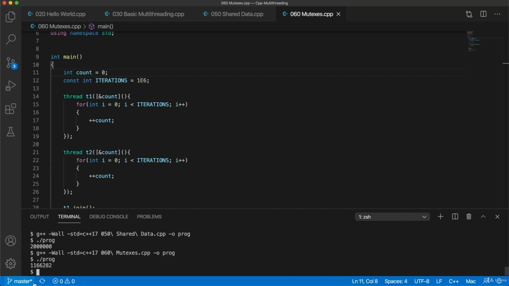

So let's try this DOTZLER sprog. Yeah, so now we get a value down here, if you can see that that's definitely less than two million.

> 所以，让我们试试这个 DOTZLER 存储日志。是的，所以现在我们得到了一个值，如果你能看到，那肯定不到 200 万。

## img - 31150

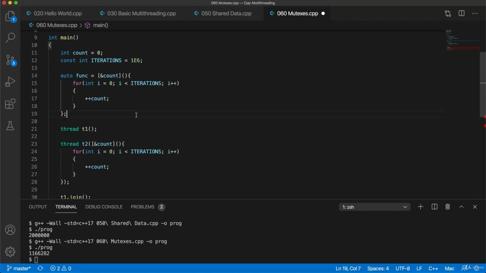

Yeah, so now we get a value down here, if you can see that that's definitely less than two million. So the first thing that I'm going to do is just get rid of this code. Duplication, let's say, or two. I'll just call it func equals. I'm going to set that equal to this lunder expression. So the Landro expression is anonymous, we can have a reference to it so that we can reuse it, then

> 是的，所以现在我们得到了一个值，如果你能看到，那肯定不到 200 万。所以我要做的第一件事就是去掉这个代码。比方说，复制了一两次。我称之为 func equals。我要将其设置为等于这个 lunder 表达式。所以 Landro 表达式是匿名的，我们可以引用它，这样我们就可以重用它，然后

## img - 51820

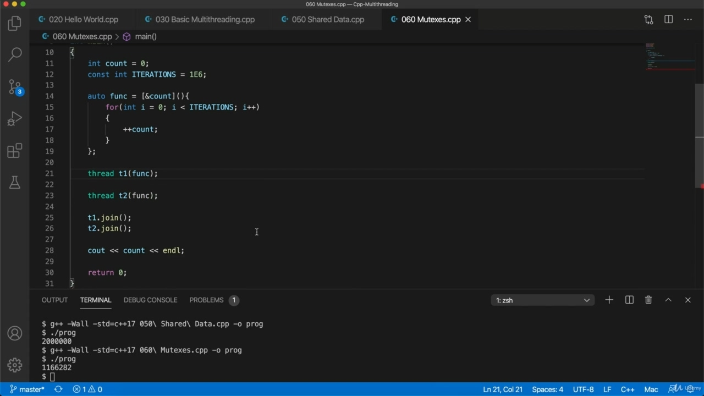

So the Landro expression is anonymous, we can have a reference to it so that we can reuse it, then I just need to pass func to the constructor of these threads.

> 所以 Landro 表达式是匿名的，我们可以引用它，这样我们就可以重用它，然后我只需要将 func 传递给这些线程的构造函数。

## img - 101990

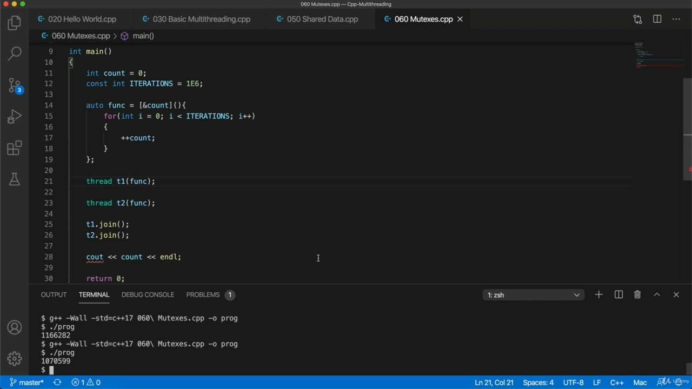

So that said, workers before, let's try it. And run it, yeah, and again, we get a value that's much less than two million.

> 也就是说，以前的工人，让我们尝试一下。然后运行它，是的，再一次，我们得到的值远远小于 200 万。

## img - 109340

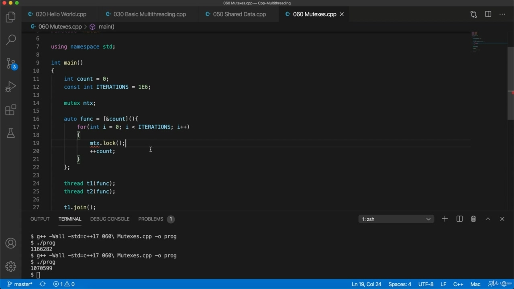

And run it, yeah, and again, we get a value that's much less than two million. So one way to fix this, which is a much more general way that will work, even if rather than incrementing a variable, you're, for example, adding to Vector's or deleting from vectors or whatever is to use locks and critical sections. Now, for this, you might need to include mutex mutex. Well, you might not I for me, it's already included in this thread header, so seems to work fine without that. So I'm going to create a thing called a mutex. So here, let's say Moutet mutex and I'll call it let's just call it amnesiacs or something. Now, I can use this in my lunder expression, so before I increment the variable, I'm going to say stop lock.

> 运行它，是的，再次，我们得到的值远远小于 200 万。因此，解决这个问题的一种方法是，这是一种更通用的方法，即使不是增加变量，例如，添加到矢量或从矢量中删除，或者使用锁和关键部分。现在，为此，您可能需要包含互斥体互斥体。嗯，你可能不是我的意思，它已经包含在这个线程头中了，所以没有它似乎可以正常工作。所以我要创建一个叫做互斥锁的东西。所以在这里，让我们假设 Moutet 互斥锁，我将其称为失忆症或其他什么。现在，我可以在 lunder 表达式中使用这个，所以在增加变量之前，我要说 stop lock。

## img - 217690

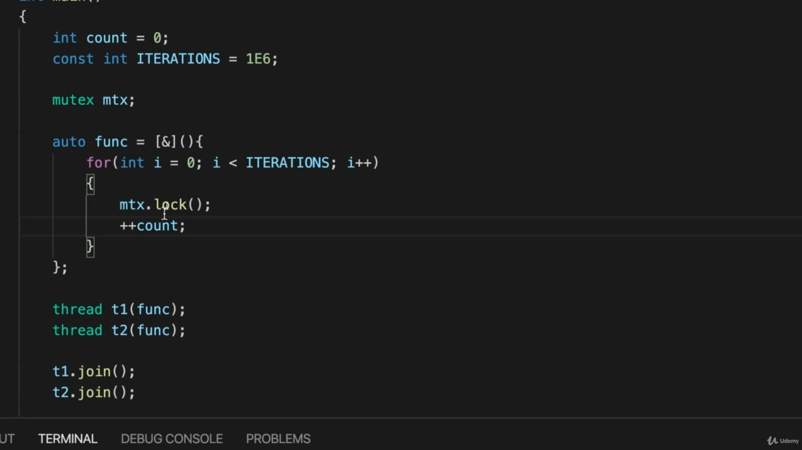

And I want to pass that in as well, so I'm actually I'm going to pass a reference to it, to the Landro expression, I'm just going to change this culture expression here. So it just says unperson to capture any local variables. So we lock before we mess with the count, before we do anything with it, and after that we do a..

> 我也想把它传递进去，所以我实际上要传递一个对它的引用，对 Landro 表达式，我只是要改变这里的文化表达。所以它只是说不需要捕捉任何局部变量。所以，我们在打乱计数之前锁定，在我们做任何事情之前锁定，然后我们做 a。。

## img - 234650

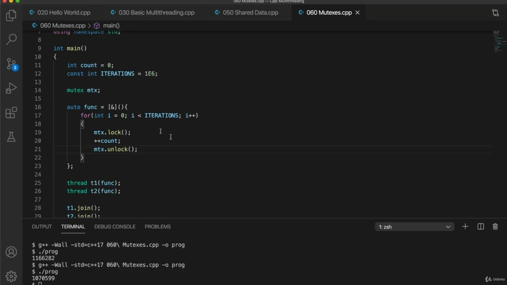

So we lock before we mess with the count, before we do anything with it, and after that we do a.. To unlock. Now, let's try this, so I compiled a program.

> 所以，我们在打乱计数之前锁定，在我们做任何事情之前锁定，然后我们做……解锁。现在，让我们试试这个，所以我编写了一个程序。

## img - 242560

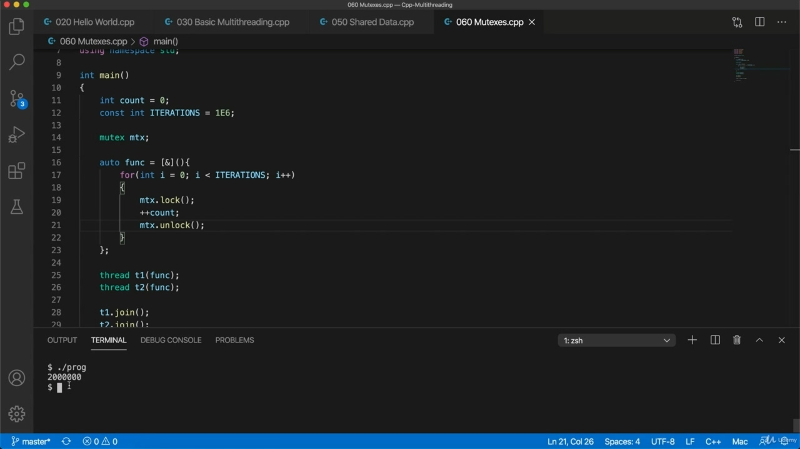

Now, let's try this, so I compiled a program. And runit. And now we should reliably find that the value is always two million or twice whatever we set that iterations

> 现在，让我们试试这个，所以我编写了一个程序。运行它。现在我们应该可靠地发现，无论我们设置什么迭代，值总是 200 万或两倍

## img - 254580

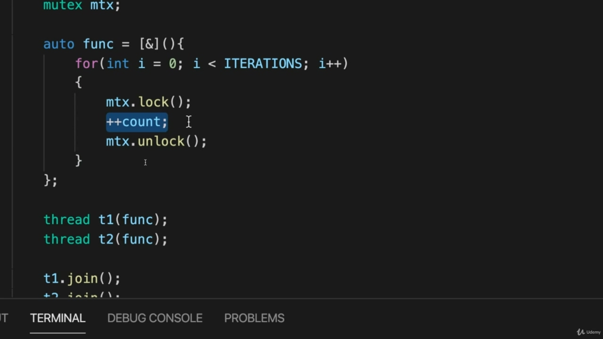

And now we should reliably find that the value is always two million or twice whatever we set that iterations constant to see what's going on here. Well. The the mutex here stops more than one thread at a time from accessing this variable between lock and unlock here, any code that's in here we call a critical section. The point about a critical section is that only one thread can access it at a time, so only one thread

> 现在，我们应该可靠地发现，无论我们将迭代次数设置为常数，值总是两百万或两倍，以了解这里发生的情况。好这里的互斥锁一次阻止多个线程在锁定和解锁之间访问这个变量，这里的任何代码都称为关键部分。关键部分的关键在于，一次只能有一个线程访问它，因此只有一个线程

## img - 325340

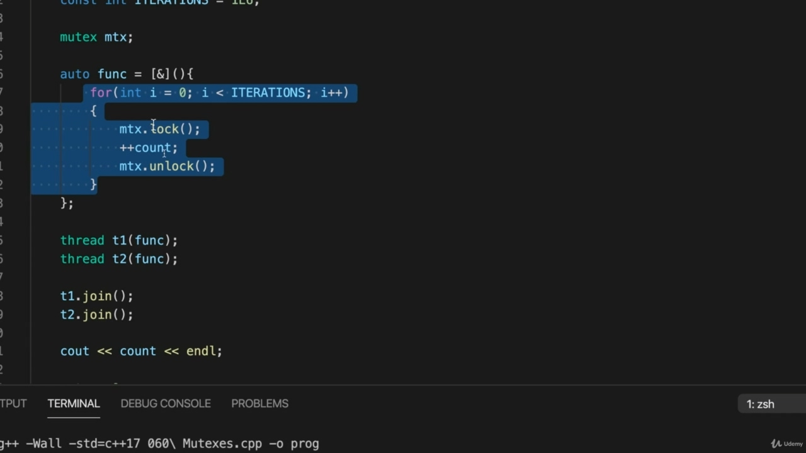

The point about a critical section is that only one thread can access it at a time, so only one thread can lock the mutex at a given time if another thread tries to lock the mutex when it's already locked. Second thread will just wait until the mutex is unlocked and then the second thread will be able to lock the mutex. As one of the important things about this is that you've got to unlock the mutex, you must do it. So if I were to comment this out. And then run my program, compile it and run it. The program is just going to hang. Because. One of my threats will lock the the mutex successfully and then the other threat will come along and that will try to lock it and that will just wait. And because it's not being unlocked, it will wait indefinitely. Let's put it back to how it was to start with. It's really important that the lock happens just before you do the you do the thing that is you alter the data that's shared between threads. So you wouldn't want, for example, to put the lock above this loop and the unlock after the loop, because what that would do would it would be it would mean that. So you're going to turn this whole thing into a critical section if you do that, you know, if you

> 关键部分的一点是，一次只有一个线程可以访问它，因此如果另一个线程试图在互斥锁已锁定时锁定互斥锁，则在给定时间只有一个螺纹可以锁定互斥锁。第二个线程将只等待互斥锁被解锁，然后第二个可以锁定互斥锁。因为这其中一个重要的事情是你必须解锁互斥锁，你必须这样做。然后运行我的程序，编译并运行它。程序即将挂起。因为我的一个威胁将成功锁定互斥锁，然后另一个威胁会出现，它将尝试锁定互斥锁。因为它没有被解锁，它将无限期地等待。让我们回到最初的样子。锁发生在执行操作之前非常重要。您要做的事情是更改线程之间共享的数据。因此，例如，您不希望将锁放在循环上方，而将解锁放在循环之后，因为这样做将意味着这一点。所以，如果你这样做，你会把整个事情变成一个关键部分，你知道，如果你

## img - 450380

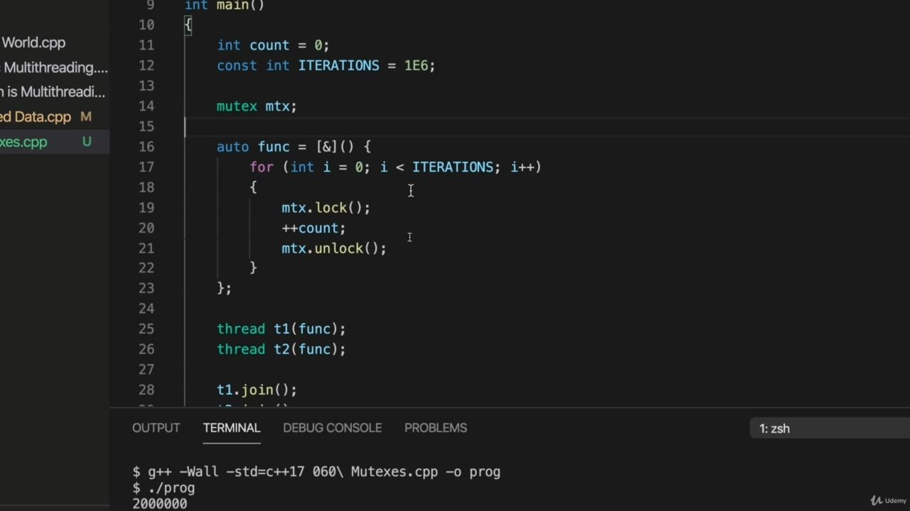

So you're going to turn this whole thing into a critical section if you do that, you know, if you put this here. And you put this down here. So one thread is going to get the lock, whichever comes along first, and then that's going to increment count in this case a million times, and only then will it unlock it. And that's not what you want. You want the threads to be able to essentially interleave to the safest extent. To the fullest extent, that's actually safe. And the world did hear. Just format this, there we go. So if you do it like this, so you just you do the lot just before you alter the data and you unlock it immediately afterwards, the threads can interleave. So one thread can do this and then because it's unlocked it. The other thread, which is waiting now on this lock, that other thread can now do the same thing and then it unlocks it. And then by then the first thread will be waiting again here and that will get the lock. It will finish waiting here, it will get the lock and it will then do the increment. So the regional code that you want to surround with lock and unlock, you want to make that as small as possible. You want it to only be the stuff that is shared between thread's. So this fixes our problem and we can use this for a whole range of different things, if both rates were adding to a vector, for example, then if you if you surround that bit of the code where you're actually adding to the vector with lock and unlock, then you've got a critical section, the vectors being pushed to or added to in in that critical section. And only one thread can do that at a time and that will fix whatever problems you have. So you'll stop the threads interfering with each other. I'm not going to give you exercises in this course, but I would strongly recommend unless you feel comfortable just watching the videos, I'd strongly recommend trying all this out for yourself and verifying

> 所以，如果你这样做，你知道，如果你把这个放在这里，你会把整个事情变成一个关键的部分。你把这个放在这里。因此，一个线程将获得锁，无论哪一个先出现，然后这将使计数增加一百万次，然后它才会解锁。这不是你想要的。您希望线程能够基本上以最安全的程度进行交织。在最大程度上，这实际上是安全的。全世界都听到了。只要格式化这个，就可以了。所以如果你这样做，那么你只需要在改变数据之前做很多，然后立即解锁，线程就可以交错。所以一个线程可以这样做，然后因为它解锁了它。另一个线程，现在正在等待这个锁，另一线程现在可以做同样的事情，然后它解锁它。然后第一个线程将再次在这里等待，这将获得锁。它将在这里完成等待，它将获得锁，然后执行增量。所以，你想用锁定和解锁包围的区域代码，你想让它尽可能小。您希望它仅是线程之间共享的内容。因此，这解决了我们的问题，我们可以将其用于一系列不同的事情，例如，如果两种速率都添加到一个向量上，那么如果你用锁定和解锁来包围代码中实际添加到向量上的那一位，那么你就得到了一个关键部分，向量被推送到或添加到该关键部分。一次只有一个线程可以这样做，这将解决您遇到的任何问题。因此，您将停止线程相互干扰。我不会在这门课上给你做练习，但我强烈建议你，除非你觉得观看视频很舒服，否则我强烈建议自己尝试所有这些，并验证

## img - 653410

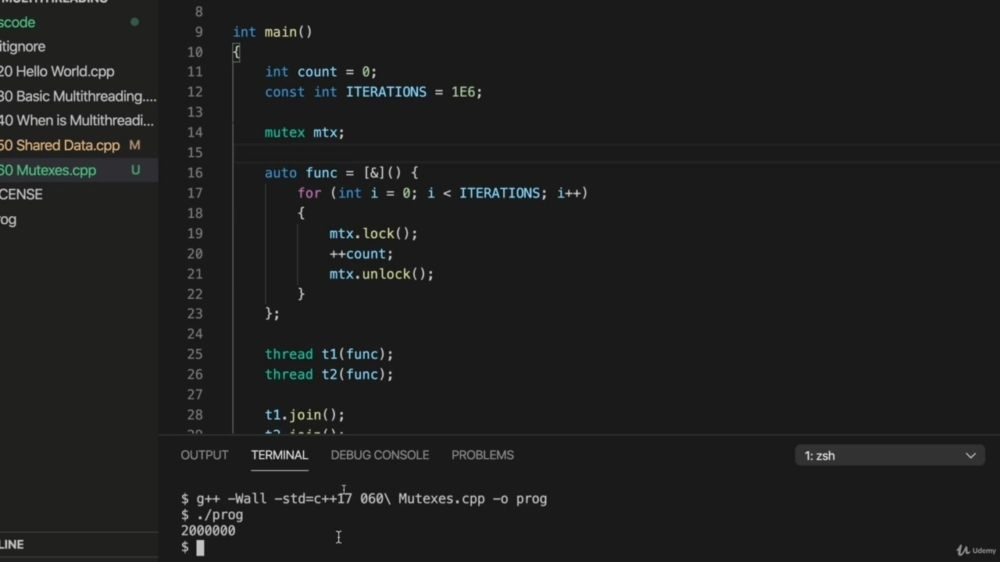

comfortable just watching the videos, I'd strongly recommend trying all this out for yourself and verifying that it does indeed work.

> 我强烈建议您自己尝试一下，并验证它确实有效。
