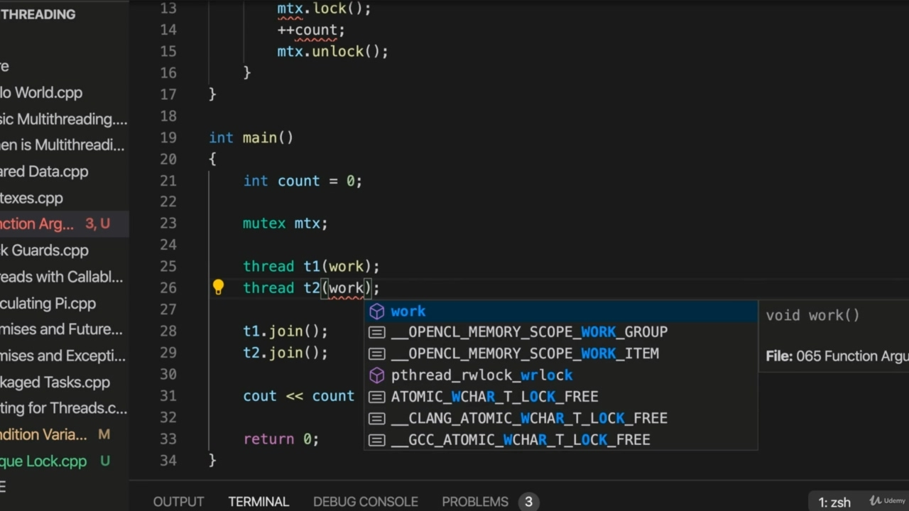
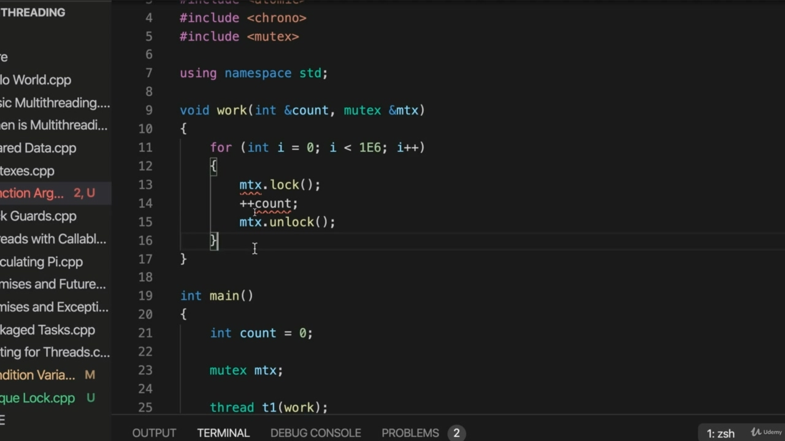
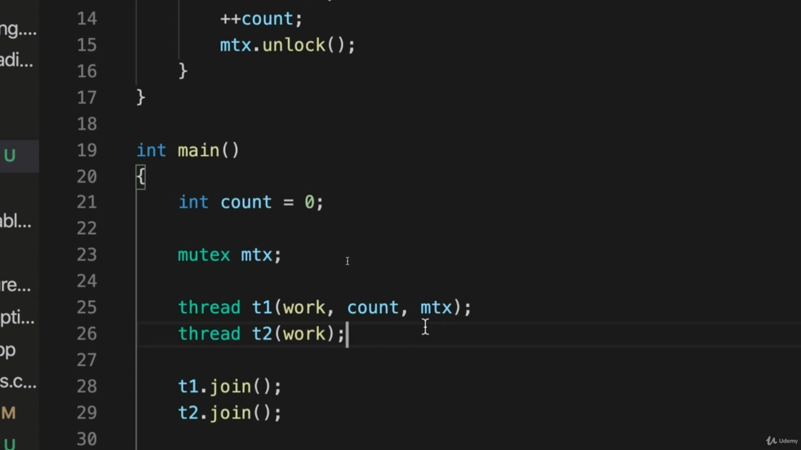
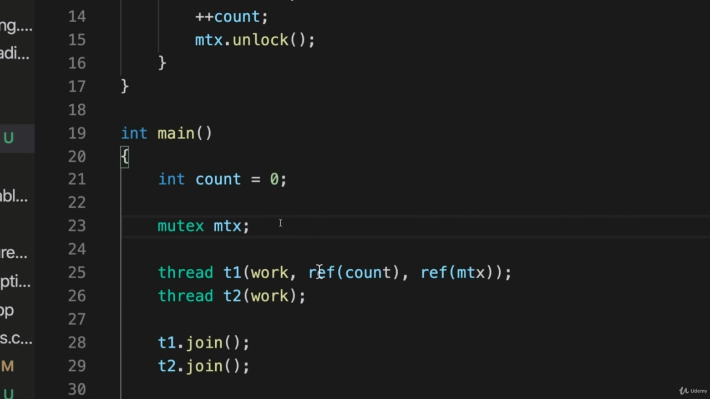
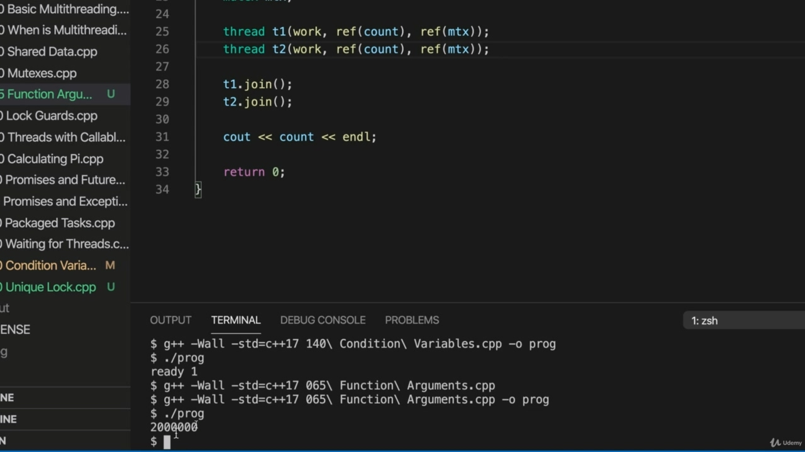
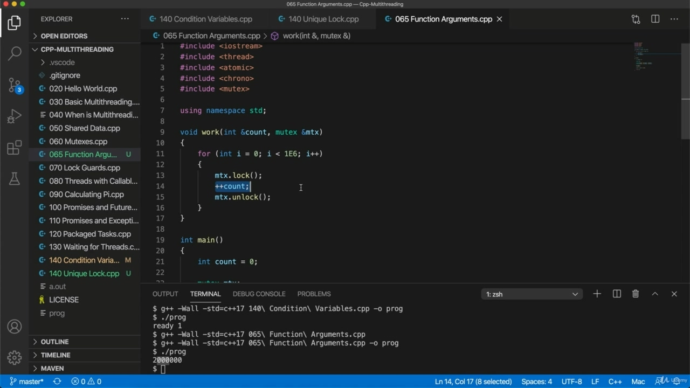
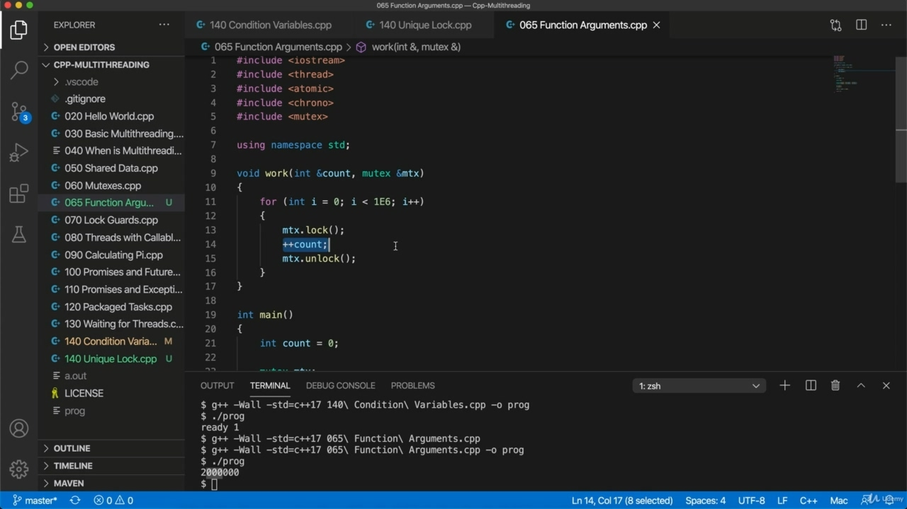

Hello, in this video, we're going to take this program that we wrote in a last video, and I'm just Hello, in this video, we're going to take this program that we wrote in a last video, and I'm just going to change it to use a function instead of a lambda expression. And after that, we're going to take a look at Loch Gods. So I think it's important to emphasize that nothing weird or special happens to the code that's between the lock and unlock of these new taxes. And it's simply that only one thread can lock in mutex at any given time. That's that's all there is to this. So it's really quite a simple idea. So I'm going to just change this to use I'm going to change this to use the function instead of a lambda expression. Let's create a function up here called I'll just call it work and I'm going to take this code and I'm just going to move it into work. So I cut that and paste it here and I'll delete the sort of lambda expression body and I just format that. So this iterations constant.

> 你好，在这段视频中，我们将拍摄我们在上一段视频中编写的程序，我只是你好，在这个视频中，我将拍摄我们上一段中编写的这个程序，我将把它改为使用函数而不是 lambda 表达式。在那之后，我们将看一看《洛赫众神》。所以我认为重要的是要强调，在这些新税收的锁定和解锁之间，代码没有发生任何奇怪或特殊的事情。在任何给定的时间，只有一个线程可以锁定互斥锁。这就是一切。所以这是一个非常简单的想法。所以我要把这个改成使用，我要把它改成使用函数，而不是 lambda 表达式。让我们在这里创建一个函数，我称它为 work，我将使用这段代码，并将其转化为 work。所以我将其剪切并粘贴到这里，然后删除 lambda 表达式体的类型，然后对其进行格式化。所以这个迭代是恒定的。

## img - 107640

So this iterations constant. We don't really need it. So I'm going to change this to one E six. And we'll get rid of it here. And our past work to these threats. Pusser pointed to the function, to the threats.

> 所以这个迭代是恒定的。我们真的不需要它。所以我要把它改成一个 E6。我们会在这里解决它。以及我们过去应对这些威胁的工作。Pusser 指出了功能和威胁。

## img - 124900

Pusser pointed to the function, to the threats. So we need to pass in mutex and count here so I can pass references into them, so let's say in reference counts and mutex reference MDX.

> Pusser 指出了功能和威胁。所以我们需要在这里传递互斥体和计数，这样我就可以将引用传递给它们，所以让我们说在引用计数和互斥体引用 MDX 中。

## img - 150750

They should do the trick and now the question is, how do I actually pass those arguments to work when it's invoked by by the by the threats? So if you just want to pass something by value, let's imagine we want to pass these by value. We could just do this. So we've got to pass count and mutex. And if they were by value, we would just do count and then MICEX. So it's really simple and then thread passes those on to the function that it's calling.

> 他们应该做到这一点，现在的问题是，当被威胁调用时，我如何真正传递这些论点？所以，如果你只是想通过值传递一些东西，让我们想象一下，我们想通过值来传递这些东西。我们可以这样做。所以我们必须传递 count 和 mutex。如果它们是按价值计算的，我们只需要进行计数，然后进行 MICEX。所以它非常简单，然后线程将这些传递给它调用的函数。

## img - 221950

But since we need to pass a reference, what we need to do is use standard ref. So because I'm using namespace standard, I just can do this ref. I don't have to take a standard call on Kolon. And what this actually does is ref returns a thing called a reference wrapper and there's the lots of

> 但由于我们需要传递一个引用，所以我们需要做的是使用标准引用。因为我使用的是命名空间标准，所以我只需要执行这个引用。我不需要对 Kolon 进行标准调用。这实际上是 ref 返回一个叫做引用包装器的东西

## img - 240430

And what this actually does is ref returns a thing called a reference wrapper and there's the lots of classes in the standard library can work with reference wrapper. Maybe you've already seen it, but thread can work with it and it behaves kind of like a reference. So this actually does the trick and it is pretty simple. You just have to remember to type ref if you want to pass by reference. Basically, that's just copy that and. Saw a copy and rename that treaty to get rid of the old T2. OK, so now we've just all we've done is turn this into a kind of function form instead of a lambda expression form. That's just check that that compiles and then actually prepared a command line beforehand. Sometimes I forget. All right. So it's standard equals C++ 17 and this is video 65. So that should compile and it should do exactly what it did before. Let's output it to prog and run prog. There we go, so we get a nice count of.

> 这实际上是 ref 返回一个称为引用包装器的东西，标准库中有很多类可以使用引用包装器。也许您已经看到了它，但线程可以使用它，它的行为有点像引用。所以，这实际上起到了作用，而且非常简单。如果要通过引用传递，只需记住键入 ref。基本上，这只是复制和。看到了一份副本，并将该条约重新命名，以删除旧的 T2。好的，现在我们所做的就是将它转换成一种函数形式，而不是 lambda 表达式形式。这只是检查它是否编译，然后预先准备好命令行。有时我会忘记。好吧所以它的标准是 C++17，这是视频 65。因此，它应该编译，并且应该完全像以前那样做。让我们将其输出到 prog 并运行 prog。我们开始了，所以我们得到了一个很好的计数。

## img - 343030

There we go, so we get a nice count of. Two million here. OK, now it's not actually all that common to use, mutex is because what happens if the code in the critical section, the bit between lock and unlike what happens if that throws an exception, then your mutex will never get unlocked. So for that reason, it's more common to use unique lock or lock guards.

> 我们开始了，所以我们得到了一个很好的计数。这里有两百万。好吧，现在它实际上并不是很常用，互斥锁是因为如果关键部分的代码，锁之间的位，以及如果抛出异常会发生什么，那么互斥锁将永远不会被解锁。因此，更常见的是使用独特的锁或锁防护装置。

## img - 410940

