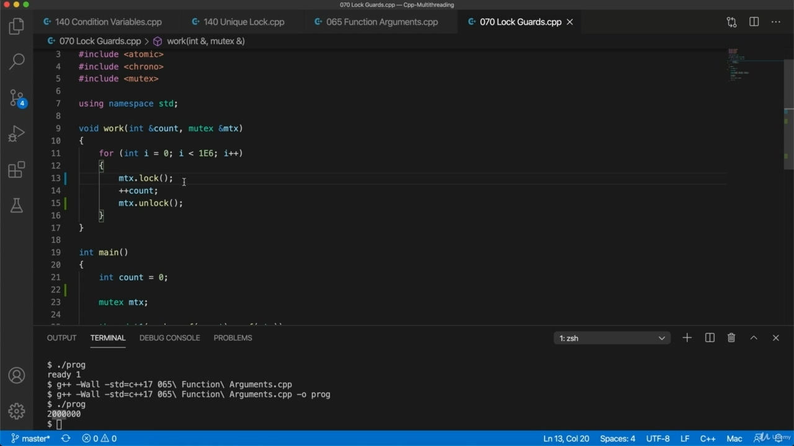
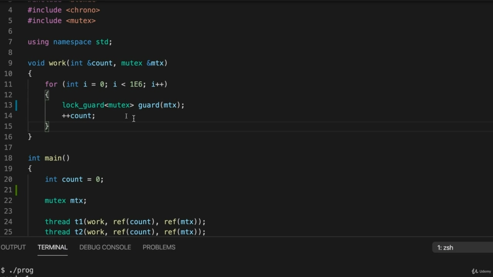
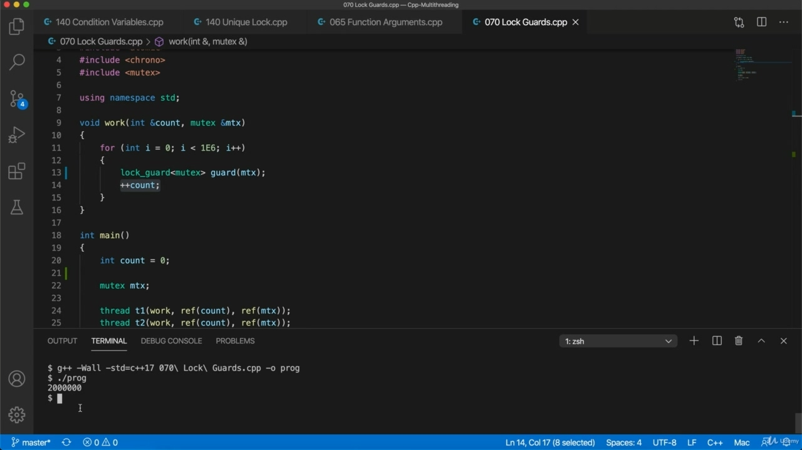
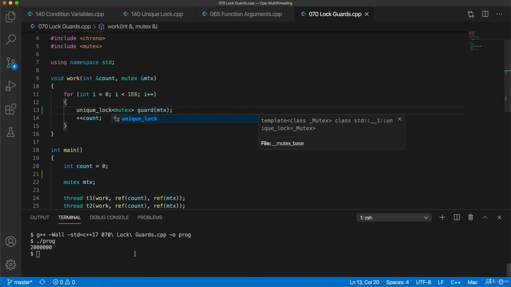
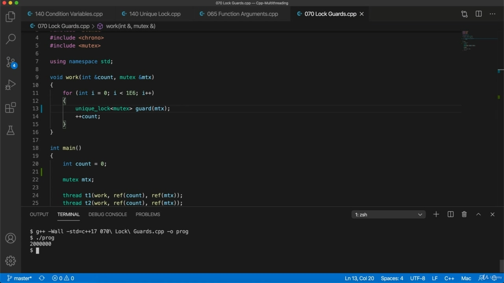
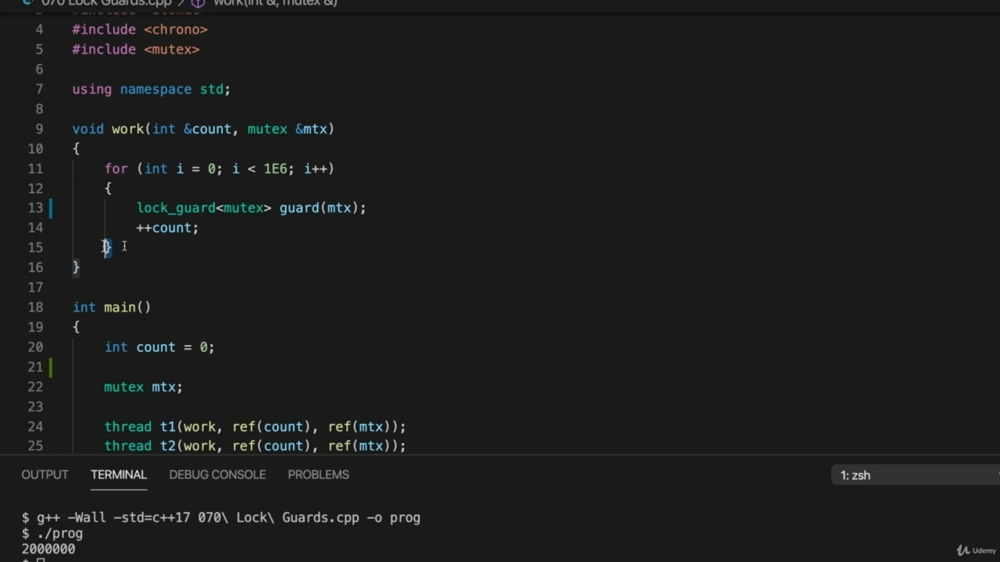

Hello, in this video, we're going to take a look at Loch Gods, so as I mentioned in the last video, Hello, in this video, we're going to take a look at Loch Gods, so as I mentioned in the last video, using mutex this directly is not ideal because you could get an exception thrown in the critical section and then it will never unlock. So for that reason, we prefer to use our AAA resource acquisition is initialization. And you may well know what that is already, but just in case you don't and the Wikipedia page on it

> 你好，在这段视频中，我们将看一看 Loch Gods，正如我在上一段视频中提到的，你好，在这个视频中，我将看一眼 Loch God，正如我上一段中提到的那样，直接使用互斥锁是不理想的，因为你可能会在关键部分抛出异常，然后它永远不会解锁。因此，出于这个原因，我们更倾向于使用 AAA 资源获取是初始化。你可能已经知道这是什么了，但万一你不知道，维基百科上的页面

## img - 32770

And you may well know what that is already, but just in case you don't and the Wikipedia page on it at the moment is actually uses lot God as an example here. And the idea is that if you want to acquire some resource, so in this case, we want to acquire a lock, you do it by initializing some variable. And then if that variable should go out of scope for any reason, even if an exception is thrown, then it will release the resource or it can be made to do that.

> 你可能已经知道这是什么了，但万一你不知道，现在维基百科上的页面实际上使用了很多上帝作为例子。这个想法是，如果你想要获取一些资源，那么在这个例子中，我们想要获取一个锁，你可以通过初始化一些变量来实现。然后，如果该变量因任何原因超出范围，即使抛出异常，它也会释放资源，或者可以这样做。

## img - 57370

it will release the resource or it can be made to do that. So here we're going to use Lockard instead of mutex. And to do that, we just declare here lock on the scorecard. And this is this is actually a template type and you have to see what kind of mutex you're expected to wrap or to work with. And because there are different kinds of mutex, for example, there is time to mutex, which allows you to try to get a lock and give up after a certain amount of time if you haven't got it. So you have to see what kind of music is going to use here. And this is just plain mutex. And let's call this maybe just God. And we passed the mutex that were actually using to it. So now we can get rid of this. Well, if I can remember, a shortcut key for delete, a line can shift, OK, probably control shift code on windows. There we go. So when you declare a lot God and you you pass a mutex to it, it will actually acquire the lock if

> 它将释放资源，或者可以让它这样做。所以这里我们将使用 Lockard 而不是互斥锁。为了做到这一点，我们只需在这里声明对记分卡的锁定。这实际上是一个模板类型，你必须看到你希望包装或使用什么样的互斥锁。因为有不同类型的互斥锁，例如，有时间互斥锁，它允许你尝试获得一个锁，如果你没有获得，在一定时间后放弃。所以你必须看看这里将使用什么样的音乐。这只是一个普通的互斥锁。让我们称之为上帝。我们将实际使用的互斥体传递给了它。所以现在我们可以消除这个问题了。好吧，如果我记得的话，一个快捷键可以删除，一行可以移动，好吧，也许可以控制窗口上的移动代码。好了。因此，当你声明很多上帝，并将互斥锁传递给它时，如果

## img - 206390

So when you declare a lot God and you you pass a mutex to it, it will actually acquire the lock if it can. Otherwise, you know, it's going to wait until it can acquire the lock. So basically it's the same as doing calling lock on a mutex. But when it goes out of scope, this is a different thing. It will release the lock. So of course here it's going to go out of scope when it hits this bracket here. So every time we go around the loop, we're going to be acquiring the lock and then releasing the lock. The critical section is it exists between here and wherever the next sort of closing bracket is of the section that were actually in here. So, again, because because now this code can't run until the lock is acquired on the mutex. That means only one thread can actually do this, any one given time. And that's the important thing here. Let's just check it and verify that it works. So what I want I need G plus plus this thing we're up to video called this 70 year. And I have to keep remembering I like to turn and warnings on and standard equals C++ 11 a sorry 17. I found that some of the things that I I've that I am writing in this course, they don't compile with C++ 11 and they generally minor differences. But you're well advised to use C++ 17, actually, and that's just output that something called prog and run prog. And we can see that we get a total of two million. Now, there is a closely related class called Unique Lock.

> 所以，当你声明很多上帝，你向它传递一个互斥锁时，如果可以的话，它实际上会获得锁。否则，你知道，它将等待，直到它可以获得锁。所以基本上，这与调用互斥锁是一样的。但当它超出范围时，这是另一回事。它会松开锁。当然，在这里，当它碰到这个括号时，它会超出范围。所以每次我们绕着循环，我们都会获得锁，然后释放锁。关键的部分是，它存在于这里和任何地方之间，下一种结束括号是实际上在这里的部分。同样，因为现在只有在互斥锁上获得锁后，代码才能运行。这意味着在任何给定的时间内，只有一个线程可以执行此操作。这是这里最重要的事情。让我们检查一下并验证它是否有效。所以我想要的是，我需要 G 加上这个东西，我们正在制作一个叫做 70 年的视频。我必须记住，我喜欢打开警告，标准等于 C++11，抱歉 17。我发现我在这门课上写的一些东西不是用 C++11 编译的，它们之间的差异很小。但实际上，建议您使用 C++17，这只是一个输出，叫做 prog 并运行 prog。我们可以看到总共有 200 万。现在，有一个密切相关的类叫做 Unique Lock。

## img - 346020

Now, there is a closely related class called Unique Lock. Let's try that and see what that does.

> 现在，有一个密切相关的类叫做 Unique Lock。让我们试一下，看看有什么用。

## img - 348660

Let's try that and see what that does. So I'm going to compile it again and run it. Same thing, what's the difference?

> 让我们试一下，看看有什么用。所以我将再次编译并运行它。同样的，有什么区别？

## img - 358200

Same thing, what's the difference? Well, let's change this back to what God. You need, like just has a bunch of methods that, like God doesn't. Let's look at are so unique, like C++ in particular, it allows you to unlock the lock. So it's got explicit lock and unlock methods. It's also got some try lock methods that allow you to try to get the lock and return if you don't immediately succeed. But for a simple situation like this, we would normally prefer lock God. And so we won't normally use a mutex by itself, because as this vulnerability to failing to unlock, if an exception is thrown in, the unlocked line is not executed, it is safer to use lock guard or unique lock. And for a simple situation, best use lock guard because here we don't need to call on lock. It will unlock when it goes out of scope.

> 同样的事情，有什么区别？好吧，让我们把这个改回上帝。你需要，就像有一堆方法，就像上帝不需要。让我们看看它们是如此独特，特别是 C++，它允许您解锁锁。所以它有显式的锁定和解锁方法。它还提供了一些 try-lock 方法，允许您尝试获取锁并在没有立即成功的情况下返回。但对于这种简单的情况，我们通常更喜欢锁上帝。因此，我们通常不会单独使用互斥锁，因为由于存在无法解锁的漏洞，如果抛出异常，则不会执行未锁定的行，因此使用锁保护或唯一锁更安全。对于一个简单的情况，最好使用锁保护，因为这里我们不需要调用锁。它将在超出范围时解锁。
