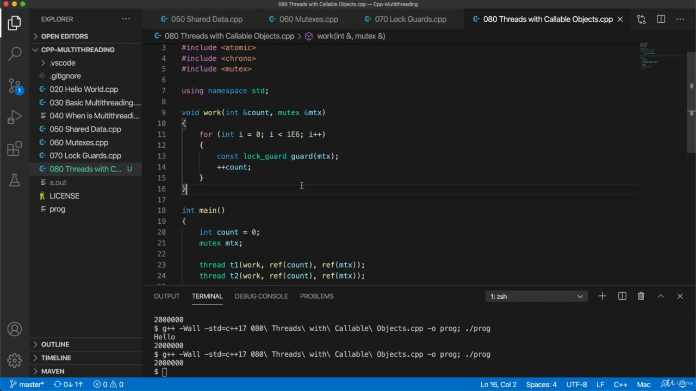
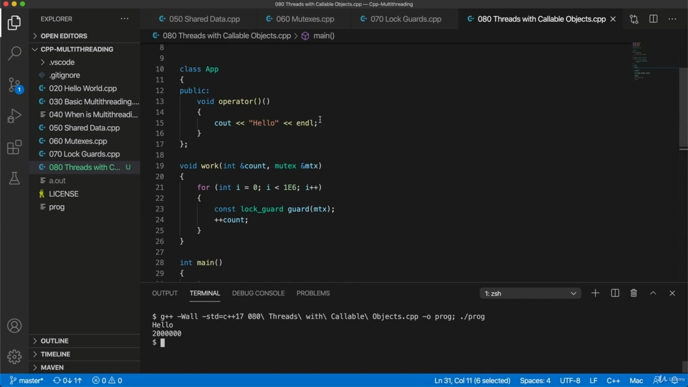

Hello, in this video, I'm going to show you how to correct great threads using callable objects. So this is just an application really mostly of just standard C++.

> 您好，在本视频中，我将向您展示如何使用可调用对象纠正优秀线程。所以这只是一个应用程序，实际上大部分都是标准 C++。

## img - 11660

So this is just an application really mostly of just standard C++. But for the sake of completeness, I want to show you how we can use a callable object in the context

> 所以这只是一个应用程序，实际上大部分都是标准 C++。但为了完整起见，我想向您展示如何在上下文中使用可调用对象

## img - 17840

But for the sake of completeness, I want to show you how we can use a callable object in the context of multi threading. And after all, this is C++. So really we should be doing object oriented stuff here. So I'm going to take the the program that we have from the last video, and I'm going to change it so that instead of using this work function, it uses a an object or a class.

> 但为了完整起见，我想向您展示如何在多线程环境中使用可调用对象。毕竟，这是 C++。所以我们真的应该在这里做面向对象的东西。所以我将使用上一个视频中的程序，我将对其进行修改，使其使用一个对象或类，而不是使用这个工作函数。

## img - 39200

that instead of using this work function, it uses a an object or a class. So a callable object is an object of a class that overloads the call operator. So let's take a look at that and I'll declare a class just up here in the same file just to keep everything altogether here, since we're just kind of making demo programs in this course and a semicolon, then I tend to forget that. And so if we were to give this a function called work, let's make it public, we would do this. If instead of that we want to overload the call operator, then we just get rid of this work here and put operator round brackets instead. And just to demonstrate this actually working, let's put out. Hello. And if you're fairly well up with reasonably modern C++, then probably you know this already. So in our main function here, let's create an instance of up. And now, because it's because it's a callable class, we can write up to actually invoke this method. So we can do this is almost as though it was actually a function.

> 它不是使用这个工作函数，而是使用一个对象或一个类。因此，可调用对象是重载调用运算符的类的对象。让我们来看一下，我将在同一个文件中声明一个类，以便将所有内容都保留在这里，因为我们只是在本课程中制作演示程序，并使用分号，所以我倾向于忘记这一点。所以如果我们给它一个叫做 work 的函数，让它公开，我们会这样做。如果不是这样，我们想让呼叫操作员过载，那么我们只需在这里去掉这项工作，将操作员放在圆括号内。为了证明这是有效的，让我们把它放出来。你好如果你相当熟悉现代的 C++，那么你可能已经知道了这一点。所以在这里的主函数中，让我们创建 up 的一个实例。现在，因为它是一个可调用类，所以我们可以编写代码来实际调用这个方法。所以我们可以这样做，就好像它实际上是一个函数。

## img - 159050

So we can do this is almost as though it was actually a function. Let's run this and we see that we get hello coming out down there, so it's actually running the method.

> 所以我们可以这样做，就好像它实际上是一个函数。让我们运行这个，我们看到下面有 hello，所以它实际上在运行这个方法。

## img - 207760

Let's run this and we see that we get hello coming out down there, so it's actually running the method. OK, so now let's take the code that we've got and move it into there.

> 让我们运行这个，我们看到下面有 hello，所以它实际上在运行这个方法。好的，现在让我们把我们得到的代码移到那里。

## img - 210900

OK, so now let's take the code that we've got and move it into there. So I'm going to take this loop and put it into this. Overloaded. Operator right there.

> 好的，现在让我们把我们得到的代码移到那里。所以我要把这个循环放进去。过载。操作员就在那里。

## img - 223380

Operator right there. Now, the mutex and the count, they could now be member variables, so let's add a private section here. And I'm going to take the count and a mutex I'm going to cut them out of the main function here and I'm going to add them into this private section.

> 操作员就在那里。现在，互斥体和计数，它们现在可以是成员变量，所以让我们在这里添加一个私有部分。我将把计数和互斥量从这里的主函数中删除，并将它们添加到这个私有部分。

## img - 245150

I'm going to add them into this private section. OK, so that all looks all right. Now we can get rid of this work function. And to actually run a run my threads, now I can get rid of all this. And I can simply pass this instance of app. Now, if I compile this and try to run it, that's going to give us an error and you might spot why,

> 我将把它们添加到这个私人部分。好的，这样看起来一切都很好。现在我们可以去掉这个功函数了。为了真正运行我的线程，现在我可以摆脱这一切。我可以简单地传递这个应用程序实例。现在，如果我编译并尝试运行它，这将给我们一个错误，你可能会发现原因，

## img - 315130

Now, if I compile this and try to run it, that's going to give us an error and you might spot why, let's just run it. We get an error that as is as is often the case with C++, it's quite long, but basically it's telling

> 现在，如果我编译这个并尝试运行它，这将给我们一个错误，你可能会发现原因，让我们运行它。我们得到一个错误：就像 C++经常出现的情况一样，它很长，但基本上它告诉我们

## img - 324400

We get an error that as is as is often the case with C++, it's quite long, but basically it's telling me that I'm trying to call and implicitly deleted copy constructor, which is because. So mutex doesn't have a copy constructor, you can't copy it, and therefore the implicit copy constructor app just doesn't work, it doesn't exist. You might get a different error message on your system, but you probably will get an error message or we need to do here is we just need to make sure that we're passing a reference to app to our thread. And to do that, we can simply surround it with Raef like this. And then we'll pass one of these reference Rappa objects instead. Which thread can work with.

> 我们得到一个错误，就像 C++的情况一样，它很长，但基本上它告诉我，我试图调用并隐式删除复制构造函数，这是因为。所以互斥锁没有复制构造函数，你不能复制它，因此隐式复制构造函数应用程序不起作用，它不存在。您可能会在系统上收到一条不同的错误消息，但您可能会收到一条错误消息，或者我们需要在这里做的是，我们只需要确保将对应用程序的引用传递给我们的线程。为了做到这一点，我们可以像这样简单地用 Raef 包围它。然后我们将传递这些引用 Rappa 对象之一。哪个线程可以使用。

## img - 414980

So let's clear the console and run this. And it does well, we got an error here. What did I do wrong? Let me check. Did I type something wrong? It looks a bit like I did. Is complaining about Lecia, I need to do something about count, I need to get that out the object.

> 因此，让我们清除控制台并运行此操作。它做得很好，我们这里有一个错误。我做错了什么？让我检查一下。我打错了吗？看起来有点像我。我在抱怨莱西亚，我需要做一些关于计数的事情，我需要把这件事弄清楚。

## img - 434370

Is complaining about Lecia, I need to do something about count, I need to get that out the object. So let's do that. Let's give it a method and get count. And just return. Counts here.

> 我在抱怨莱西亚，我需要做一些关于计数的事情，我需要把这件事弄清楚。所以让我们这样做吧。让我们给它一个方法并得到计数。然后回来。这里算数。

## img - 449590

And then so instead of doing Siao Count, I can do doget count.

> 然后，我可以做狗计数，而不是做暹罗计数。

## img - 452370

That should work. And we see it does work. Got three million coming out here.

> 这应该奏效。我们看到它确实有效。这里有 300 万人。

## img - 500560

Got three million coming out here. Let's run that again, is that right? How many times I'm actually incrementing it? Yeah, well, I'm actually calling it here as well. So if I get rid of this because we don't need this. And then I run it, we should find the account variable is at two million or it's just going to be twice

> 这里有 300 万人。我们再来一遍，对吗？我实际增加了多少次？是的，嗯，我也在这里。所以如果我摆脱这个，因为我们不需要这个。然后我运行它，我们会发现账户变量是 200 万，或者是两倍

## img - 521440

And then I run it, we should find the account variable is at two million or it's just going to be twice whatever you've set this to because we're running to threats. You can run more threats if you want. So, as I mentioned, I think I'm I'm not really intending to give you much in the way of exercises in this course. But if you want exercise is what I'd suggest at this stage is just that you practice all three ways of running a thread, while we've only really seen one way of running a thread, but we can pass to this, to the constructor of this thread of these thread objects. We can pass function pointers, lambda expressions or callable objects, all three. So I would I would suggest just practicing, make sure you can do all three if possible, ultimately from memory, maybe after a bit of practice and see if you can replicate this program or something similar, something that has a critical section in it that you can then modify from multiple threads. Now, I actually just noticed after finishing this video that I forgot the template type for Lot God, but my compiler didn't warn me. It didn't it didn't issue any warning or anything.

> 然后我运行它，我们应该发现账户变量是 200 万，或者它将是你设置的两倍，因为我们面临威胁。如果你愿意，你可以运行更多的威胁。所以，正如我所提到的，我想我并不是真的打算在这门课上给你做很多练习。但如果你想练习，我建议你在这个阶段练习所有三种运行线程的方法，而我们只见过一种运行线程，但我们可以传递给这些线程对象的这个线程的构造函数。我们可以传递函数指针、lambda 表达式或可调用对象，这三种都可以。所以我建议你只是练习，如果可能的话，确保你能做到这三点，最终从内存中完成，也许在一点练习之后，看看你能不能复制这个程序或类似的东西，其中有一个关键部分，然后你可以从多个线程修改。现在，我实际上刚刚注意到，在完成这段视频后，我忘记了 Lot God 的模板类型，但我的编译器没有警告我。它没有发出任何警告或任何东西。

## img - 638810

It didn't it didn't issue any warning or anything. So I really should put mutex in there.

> 它没有发出任何警告或任何东西。所以我真的应该把互斥锁放在那里。
