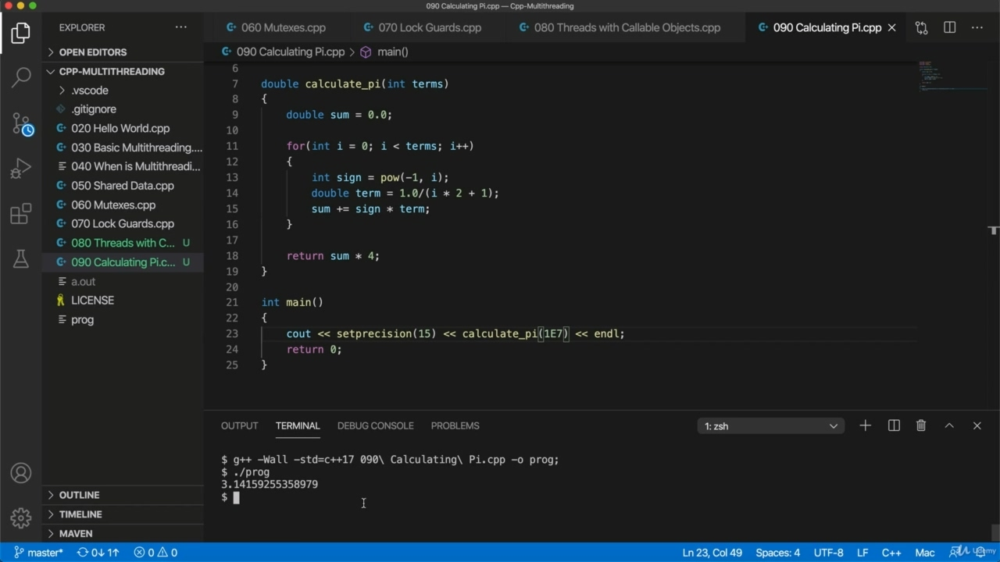

Hello, in this video, I'm going to write a function that calculates PI, and the reason I'm going Hello, in this video, I'm going to write a function that calculates PI, and the reason I'm going to do this is just that I want something that kind of does some work and then produces a result and later on will be able to look at how we can distribute this work across multiple cores in our computer. But for now, I'm just going to write a simple function. So I'm going to use this Leibnitz formula for PI, which you can easily find if you do a search. And this is a formula for calculating the mathematical constant PI, which converges very slowly. So it's not normally used much, but here I want something kind of inefficient. So this will kind of serve my purposes, I think. So the first thing we need is to calculate one three five seven nine and so on. We need to produce those those numbers.

> 你好，在这段视频中，我要写一个计算 PI 的函数，我要做的原因你好，在这个视频中，我们要写一种计算 PI 的功能，我要这样做的原因是，我想让某种东西做一些工作，然后产生一个结果，稍后我们将能够看到如何在我们的计算机中的多个核心上分配这些工作。但现在，我只想写一个简单的函数。所以我要用这个莱布尼茨公式来计算 PI，如果你进行搜索，你可以很容易地找到这个公式。这是一个计算数学常数 PI 的公式，收敛很慢。所以它通常不太常用，但这里我想要一些低效的。所以我认为这有点符合我的目的。所以我们需要做的第一件事就是计算 1，3，5，7，9 等等。

## img - 54990

We need to produce those those numbers. Let's write a function here at the top, I'll call it. It's going to return a double, let's call it calculate pi. And let's specify how many how many terms in the equation we're going to use. So in terms we'll have a loop, so for I equals n I less than terms A plus plus. And I'm going to deliberately write this in a quite inefficient way, so we're going to use an efficient approximation written badly. So let's calculate the term we want directly. We can do this like this. So I'll call it double time equals. I times two plus one. So if we output this. S put it. They should give us one three five seven nine and so on, let's call the function and calculate sort

> 我们需要产生这些数字。让我们在顶部写一个函数，我会调用它。它将返回一个 double，我们称它为 calculate pi。让我们指定方程中要用到多少项。所以在术语中，我们会有一个循环，因为 I 等于 n，I 小于术语 a 加上。我会故意用一种非常低效的方式来写这个，所以我们会使用一个写得很糟糕的高效近似。让我们直接计算我们想要的项。我们可以这样做。所以我称之为双倍时间相等。我乘以二加一。所以如果我们输出这个。他们应该给我们 1，3，5，7，9 等等，让我们调用函数并计算排序

## img - 208390

They should give us one three five seven nine and so on, let's call the function and calculate sort of five terms of this. So I'm going to compile it and run it, missed off a bracket somewhere or something. I think what I do control reaches I've got actually return value. I'll just return zero point zero for the moment.

> 他们应该给我们 1，3，5，7，9 等等，让我们调用这个函数，计算这其中的 5 项。所以我要编译并运行它，在某个地方漏掉了括号或其他东西。我认为我所做的控制达到了实际的返回值。我现在只返回零点。

## img - 230400

OK, so we've got this. So I compile and run it and we get one three five seven nine.

> 好的，我们得到了这个。所以我编译并运行它，我们得到了 1、3、5、7、9。

## img - 239280

So I compile and run it and we get one three five seven nine. So if we look at the approximation here, we want to take the fractions that we create by dividing one by each of those numbers. So let's change this to one point nought divided by each of these and we've got to add those up.

> 所以我编译并运行它，我们得到了 1、3、5、7、9。所以，如果我们看一下这里的近似值，我们想得到分数，我们用这些数字中的每一个除以一。所以让我们把它改成一个零除以这些，我们必须把它们相加。

## img - 301090

So let's change this to one point nought divided by each of these and we've got to add those up. But we also need an alternating plus or minus. And I can get that quite inefficiently using the C math library. So let's include. CMF. This might possibly be S.M. H with M. H on your system, but you should be able to find it pretty easily. We just want the power to function. So I can say here, maybe it's made a cent sine equals power and we'll take minus one to the power of. I think you should do it.

> 所以让我们把它改成一个零除以这些，我们必须把它们相加。但我们也需要一个交替的正负号。使用 C 数学库，我可以非常低效地得到这一点。所以让我们包括在内。厘米英尺。这可能是 S.M.H 和 M.H 在您的系统中，但您应该能够很容易地找到它。我们只是想让权力发挥作用。所以我可以在这里说，也许它是一分正弦等于幂，我们取负一的幂。我认为你应该这样做。

## img - 343060

So. So this is Tom. Let's check this, actually. Probably want to may I go from yeah, that's right, actually, that's OK. So the first term here would be minus one to the power of zero, which would be one. So that would be positive. That's that. The second term would be minus one. The power of one. Which would be minus one. The following term would be minus one is the power of two, which is one and so on, so it's alternating in sine. So that's what we want. So now we just want to add those up. That's to double some equals nought point nought. And then we're going to add something to do. Some plus equals sine times term. And at the end, we're going to return some sense they should give us a very inefficient way of calculating pay less output, the result? Yeah, and strong terminal. Hang on. OK, so compile it and run it.

> 这就是汤姆。事实上，让我们检查一下。可能想让我从，是的，事实上，这没问题。所以这里的第一项是负一到零的幂，也就是一。所以这将是积极的。就是这样。第二项是负一。一个人的力量。这将是负一。下面的项是负一，是二的幂，是一，依此类推，所以它是正弦交替的。这就是我们想要的。现在我们只想把这些加起来。那就是把一些等于零的东西加倍。然后我们要做一些事情，一些加等于正弦乘以项。最后，我们将返回一些感觉，他们应该给我们一种非常低效的方法来计算无薪产出，结果是什么？是的，还有强大的终端。等等。好的，编译并运行它。

## img - 507750

Yeah, we've also got to multiply it by four because this actually gives us a quarter of pie. So let's return some times for.

> 是的，我们还要把它乘以 4，因为这实际上给了我们四分之一的馅饼。所以让我们再来几次。

## img - 516550

And compile time and run it. And we get it doesn't look much like pie, but you can see it's not a million miles off either.

> 编译并运行它。我们得到它看起来不太像馅饼，但你可以看到它也不远。

## img - 524320

And we get it doesn't look much like pie, but you can see it's not a million miles off either. So let's add a lot more terms like 500 and try that. Three point one, still pretty bad, I'm going to try 100000 to see if it can do that. Three point one, four one that's looking a lot better now.

> 我们知道它看起来不太像馅饼，但你可以看到它离我们也不远。所以，让我们添加更多类似 500 的术语，并尝试一下。三分之一，还是很糟糕，我打算试试 10 万，看看它能不能做到这一点。三分一，四分一，现在看起来好多了。

## img - 553550

Three point one, four one that's looking a lot better now. Let's let's include here at the top include. I manip because then we can use precision to output more decimal places here, so we might see how I can use set precision 15. Probably no point doing more than that for the double type, and I compile it and run it three point

> 三分一，四分一，现在看起来好多了。让我们在顶部包含。我操作是因为我们可以使用精度来输出更多的小数位数，所以我们可以看到如何使用设置精度 15。对于 double 类型，可能没有什么意义，我编译了它并运行了三次

## img - 628890

Probably no point doing more than that for the double type, and I compile it and run it three point one, four one, and then it starts to lose the way a bit.

> 对于 double 类型，可能没有必要做更多的事情，我编译它并运行它三点一，四点一，然后它开始有点迷失方向。

## img - 631640

one, four one, and then it starts to lose the way a bit. So you get the idea. Anyway, we could add more terms in here. Sorcerous 10000, let's try Wonnie. Six, I'm not sure if my computer will cope with that, actually, let's try it. Copes fine, three point one four one five nine, and then it's starting to lose the way a bit. So now we've got something that does a lengthy sort of calculation you can try. Increasing this, if you've got the computing power, I'm not really sure at all how many terms my computer will actually cope with.

> 一，四，一，然后它开始迷失方向。所以你明白了。无论如何，我们可以在这里添加更多术语。1 万，让我们试试 Wonnie。六，我不确定我的电脑是否能应付这种情况，事实上，让我们试试吧。处理得很好，三分之一四分之一五分九，然后它开始有点迷失方向。所以现在我们有了一个可以进行长时间计算的东西，你可以尝试一下。增加这一点，如果你有计算能力，我根本不确定我的电脑能应付多少项。

## img - 717820

Quite a lot, it seems. If your computer's sort of groaning and overheating, then, you know, you don't need an accurate approximation of PI here, it's just something that I'm going to use to you straight, multi threading that we on is a noticeable pause here. And we've got three point one four one five nine two after that. I don't have pi memorized, but, you know, it's looking pretty good up to a certain number of digits. You can see there's a noticeable pause now while I calculate it, so I could increase this more. And we're going to get a bigger pause. We've got something now that genuinely does some work, is the point. Yeah, that takes quite a while, I should think.

> 似乎很多。如果你的计算机有点呻吟和过热，那么，你知道，这里不需要 PI 的精确近似值，这只是我将要给你使用的东西，我们正在进行的多线程是一个明显的停顿。之后我们得到了 3 分 1 分 4 分 1 分 5 分 9 秒 2。我没有记住圆周率，但是，你知道，它看起来相当不错，达到一定数量的数字。你可以看到在我计算的时候有一个明显的停顿，所以我可以增加这个。我们会有更大的停顿。关键是，我们现在已经有了真正起作用的东西。是的，我想这需要很长时间。
