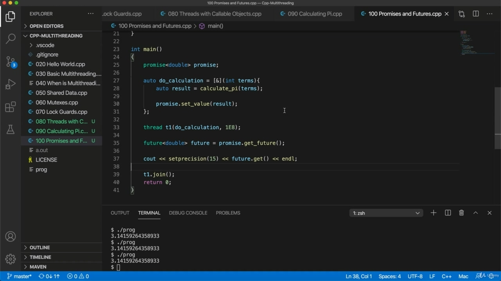

Hello, in this video, we're going to look at promises and futures, so we've got this labor intensive function that returns the result and let's say we want to run it in its own thread somehow. How can we do that? Well, let's create a thread. So to run it in its own thread without regard for the results, we create a thread that's actually to make sure that I've included at the top. Thread. And I call it Twan and will pass, calculate pi to it, will pass the function, pointed to it and want

> 您好，在本视频中，我们将讨论承诺和未来，因此我们有一个返回结果的劳动密集型函数，假设我们希望以某种方式在自己的线程中运行它。我们怎么能做到这一点？好吧，让我们创建一个线程。因此，为了在自己的线程中运行它而不考虑结果，我们创建了一个线程，这实际上是为了确保我在顶部包含了它。线我称它为 Twan，将传递给它，计算 pi，将传递函数，指向它并想要

## img - 44680

And I call it Twan and will pass, calculate pi to it, will pass the function, pointed to it and want to join.

> 我称它为 Twan，将传递给它，计算 pi，将传递函数，指向它，并希望加入。

## img - 52480

So obviously, this will run, but we have no way of getting a result. Let's compile this. And what what we're going to do is we're going to use promises and futures, which are a mechanism for getting a result, and it's passed they're also passed by value a number of times. I want it to include in the approximation, let's do 196 or whatever works.

> 很明显，这会发生，但我们没有办法得到结果。让我们编译一下。我们将要做的是，我们将使用承诺和期货，这是一种获得结果的机制，一旦通过，它们也会多次按值传递。我希望它包含在近似值中，让我们做 196 或其他任何工作。

## img - 115840

I want it to include in the approximation, let's do 196 or whatever works. Okay, on your machine, then I can run this and yeah, we don't get any output. OK, so. I can use a promise to to kind of set a result here, and I think what I'll do is I'll show you the code, I'll show you how this works, and then after that, I'll give you a bit more of a justification and explanation of it. So to get a result out of this function, which we declare of promise. So let's create a promise. And this is going to kind of encapsulate the tight double.

> 我希望它包含在近似值中，让我们做 196 或其他任何工作。好的，在你的机器上，然后我可以运行这个，是的，我们没有任何输出。好吧。我可以用 promise 在这里设置一个结果，我想我要做的是向你展示代码，我会向你展示它是如何工作的，然后，我会给你更多的理由和解释。所以，为了从这个函数中得到结果，我们声明 promise。所以，让我们创造一个承诺。这将是一种紧密的双重。

## img - 204070

We're going to use it to set and get a double type, which is the return value of our function. So let's say promise double. I'll just call it promise. And we also need to include here at the top. Include future, I don't think.

> 我们将使用它来设置和获取一个 double 类型，这是我们函数的返回值。所以，让我们假设承诺加倍。我称之为承诺。我们还需要在顶部加入。我不认为包括未来。

## img - 221700

You're going to need to, I don't think is normally a promise.

> 你需要，我认为这通常不是一个承诺。

## img - 226570

Apparently there is, but no, there isn't. Yeah, so you need to include future and promise is included in that, at least on my system. It's just possible that it's different on yours. But you should be able to figure that out. So I'm going to include future here and now when the thread runs, it can use the promise to set the return result, the result that it's that that it's going to return to the main threat in this case. So to do this, I'm going to get rid of. Let's get rid of calculate Pi here and replace it maybe with a lambda expression. In fact, for clarity or create the Landro expression up here, let's say, or to do calculation. Equals some lambda expression. So we have to capture Brackett's parameter brackets and the code block brackets and we want to pass the number of terms to include in our approximation. In this case, I'm going to be passing that here int. Terms. And we won't do calculation to be able to use this promise, so I'm going to put a sign there to say that we want to capture all local variables by reference. We want to potentially use local variables here and in there. So I'm going to just call my function. So let's say let's say auto results equals calculate pi terms. And then I can run this lambda expression here, do calculation, and I passin in a number of times

> 显然有，但不，没有。是的，所以你需要包含未来和承诺，至少在我的系统中。只是有可能你的不同。但你应该能够弄清楚这一点。所以我将在这里包括 future，现在当线程运行时，它可以使用 promise 来设置返回结果，结果是，在这种情况下，它将返回到主要威胁。所以要做到这一点，我要摆脱。让我们在这里去掉计算 Pi，然后用 lambda 表达式替换它。事实上，为了清楚起见，或者在这里创建 Landro 表达式，或者进行计算。等于某个 lambda 表达式。因此，我们必须捕获 Brackett 的参数括号和代码块括号，我们希望传递包含在近似值中的项的数量。在这种情况下，我将在这里传递 int.Terms。我们不会进行计算来使用这个承诺，所以我要在这里放一个符号，表示我们希望通过引用来获取所有的局部变量。我们希望在这里和那里潜在地使用局部变量。所以我要调用我的函数。假设自动结果等于计算 pi 项。然后，我可以在这里运行这个 lambda 表达式，进行计算，并多次传递

## img - 421720

And then I can run this lambda expression here, do calculation, and I passin in a number of times that I wanted to calculate, so far so good. But now how do we get this result out of it? Well, we use this promis so I can say Promis dot set value.

> 然后，我可以在这里运行这个 lambda 表达式，进行计算，我通过了很多次我想计算的，到目前为止都很好。但是现在我们如何从中得到这个结果呢？我们使用这个 promis，所以我可以说 promis 点集值。

## img - 432310

Well, we use this promis so I can say Promis dot set value. And results set the results into the promise now in our main thread, we're able to obtain that value

> 我们使用这个 promis，所以我可以说 promis 点集值。结果将结果设置到我们的主线程中的 promise 中，我们能够获得该值

## img - 444320

And results set the results into the promise now in our main thread, we're able to obtain that value and the way we do it is via a thing called a future. So we could do this before or after join here. It's not going to make any difference. I'll leave join in just to make sure that the main thread sticks around long enough for this for this thread that we're creating here to finish. And let's do this. I'm going to spell this out in more detail than I normally would for clarity. So we've got a thing called a future set, a promise and future. They work together to have a future here, and that's going to be dealing with a double result type and the future we get from the promise. Let's call it future. So I'm going to say future equals promise doget future. And then we can get the result from this future site and say. Let's say future together, so I'm just going to do a serious Siao that's to set precision 15 and future to get. And Al and this will get the result that we set into the promise we value.

> 结果将结果设置为我们的主线程中的承诺，我们能够获得该值，并且我们的实现方式是通过一个叫做未来的东西。所以我们可以在加入之前或之后这样做。这不会有任何区别。我将留下 join，只是为了确保主线程足够长的时间，以完成我们在这里创建的线程。让我们这样做。为了清楚起见，我将比平时更详细地阐述这一点。所以我们有一个东西叫做未来集，一个承诺和未来。他们共同努力，在这里有一个未来，这将是一个双重结果类型，以及我们从承诺中获得的未来。让我们称之为未来。所以我要说，未来等于承诺和未来。然后我们可以从这个未来的网站上得到结果并说。让我们一起说未来，所以我要做一个严肃的 Siao，将精度设置为 15，并实现未来。Al 和这将得到我们所珍视的承诺的结果。

## img - 606180

And Al and this will get the result that we set into the promise we value. That's compile this if it works and run it. Yeah, so, I mean, I could increase this a bit to make it more obvious that, you know, this is really doing a calculation that takes some time. You could you could probably just about see a pause there. Let's increase it until I get a visible pause, probably, to be honest, would just be easier to put a delay in there, but this works, too. There we go. You can see that working. There's a pause while it does a calculation and eventually we get pie. So how does this all work?

> Al 和这将得到我们所珍视的承诺的结果。这就是编译这个，如果它能运行的话。是的，所以，我的意思是，我可以增加一点，让它更明显，你知道，这真的是一个需要一些时间的计算。你可能会看到那里的停顿。让我们增加它，直到我得到一个可见的暂停，也许，老实说，在那里设置延迟会更容易，但这也有效。好了。你可以看到它在起作用。当它进行计算时有一个停顿，最终我们得到了馅饼。那么这一切是如何运作的呢？

## img - 653390

So how does this all work? Well, it's kind of obvious in a way, so we've got the promise and this is something that the producer, so to speak, the thing that's producing the result uses to carry the result that it creates. And then on the consumer side, the side that gets the result does something with it. We've got a future which we get from the promise and then we we call get on the future to get the result and get is a blocking function. So it gets won't return until you do set value and promise in your thread says this will just pause at this point out. And eventually when this thread does promise value, then future doget will return and we'll output the value. And that's why it doesn't matter even if I join down here, because this is going to wait until this happens anyway. You might wonder why. Why don't we just do promise doGet?

> 那么这一切是如何运作的呢？嗯，这在某种程度上是显而易见的，所以我们得到了承诺，可以说，这是生产者用来产生结果的东西，用来承载它所创造的结果。然后在消费者方面，得到结果的那一方做了一些事情。我们从承诺中得到了未来，然后我们调用 get on the future 来得到结果，得到的是一个阻塞函数。所以它不会返回，直到你设置了值，并且线程中的 promise 表示这将在此时暂停。最后，当这个线程确实承诺值时，未来的 doget 将返回，我们将输出该值。这就是为什么即使我加入这里也不重要的原因，因为无论如何，这都要等到事情发生。你可能想知道为什么。我们为什么不答应呢？

## img - 803620

Why don't we just do promise doGet? Why isn't there a promise, doGet? And it seems the idea is just to kind of separate the consumer from the produce kind of role. If we just had a single object promise, then this could also do promise, not value, which wouldn't be any good. So this having a separate future object kind of separates out the two roles of these things a bit. You know, the future is that is the thing that you used to get the result. The promise is the thing that you used to set the result. That's the kind of justification that I've seen on Stack Overflow. I, I don't I must I mean, I don't really see why why we why this has been separated out into promise and future. But this this is just how it works. And, you know, it works pretty well. This is similar sort of thing has been added to other programming languages. For example, in JavaScript, we've also got promises and futures now that work somewhat similarly. So I don't know where the idea started, probably in C++. I don't know for sure, but it's kind of spreading out. You can kind of think of this as like if you think about analogous situations in everyday life, then this kind of makes sense in that context. So let's say, for example, you say you go to a doctor and you want to get a test for some kind of illness. The doctor is so they're going to obviously do the tests. That's like performing a calculation and they're going to give you probably some kind of receipt, which is which is the future. That's that looks like the future is something you get immediately. You get it right away. After the test has been performed, you get this receipt future and you go away and then you wait until you're notified that you're now able to get the result. And then you go back with your receipt to the doctor and you hand it over and you use that to to actually get the results of the test at the right time. So that's not a perfect analogy, because a more perfect analogy would be if you go to the doctor, you get a test, they give you some kind of receipt for the test, and then you just hand them back the receipt and you just stand there waiting until finally they give you the results. Maybe that's a better analogy, but you kind of see the general idea. So this future is a thing you can get immediately. You get this straight away, but it's not until the result is actually ready that that you actually get the result, the final result from the future. Okay, so this isn't too complicated. I think if you type it out and just said it yourself, you're quickly see how this works.

> 我们为什么不答应呢？为什么没有承诺，doGet？似乎这个想法只是为了把消费者和生产者的角色分开。如果我们只有一个对象承诺，那么这也可以实现承诺，而不是价值，这不会有任何好处。因此，这有一个单独的未来对象，将这些东西的两个角色稍微分开。你知道，未来就是你用来获得结果的东西。承诺是你用来设定结果的东西。这就是我在 Stack Overflow 上看到的理由。一、 我不一定要我的意思是，我真的不明白为什么我们把这分为承诺和未来。但这就是它的工作原理。而且，你知道，它工作得很好。这是类似的东西被添加到其他编程语言中。例如，在 JavaScript 中，我们现在也有一些类似的承诺和未来。所以我不知道这个想法是从哪里开始的，可能是在 C++中。我不确定，但它有点扩散。你可以这样想，如果你在日常生活中思考类似的情况，那么在这种情况下，这种想法是有意义的。比如，你说你去看医生，你想做某种疾病的检查。医生是这样的，他们显然要做检查。这就像在做一个计算，他们可能会给你一些收据，这就是未来。这看起来就是你马上就能得到的未来。你马上就明白了。测试完成后，您将收到此收据，然后离开，然后等待通知您现在可以获得结果。然后你把收据交给医生，然后用它在正确的时间得到测试结果。所以这不是一个完美的类比，因为一个更完美的类比是，如果你去看医生，你得到一个测试，他们给你一些测试的收据，然后你把收据还给他们，你就站在那里等待，直到最后他们给你结果。也许这是一个更好的类比，但你有点了解总体想法。所以这个未来是你可以马上得到的。你马上就能得到这个结果，但直到结果真正准备好，你才能真正得到结果，未来的最终结果。好吧，这并不太复杂。我想，如果你把它打出来，然后自己说出来，你很快就会明白这是怎么回事。
