Hello, and this video, we're going to look at how exceptions work with promises, so of course, it's Hello, and this video, we're going to look at how exceptions work with promises, so of course, it's possible that you may be calculating something in your threat. Something may go wrong. It may throw an exception. And in that case, the question arises how to kind of signal when you actually get the result from your future that there isn't a result and instead there's only an exception. So let's let's put some kind of exception into our calculate pi here. So I'm going to stay here. Let's include exception at the top, because we may need to include exception. So we could say here, for example, that if terms is less than one.

> 大家好，这段视频，我们将看看例外是如何与承诺一起工作的，所以，当然，这是大家好，而这段视频中，我们将看例外是如何和承诺一起工作，因此，当然，你可能在计算你的威胁。可能出了问题。它可能引发异常。在这种情况下，问题来了，当你真正从你的未来得到结果时，如何发出信号，没有结果，只有例外。所以，让我们在这里的计算 pi 中加入一些异常。所以我要留在这里。让我们在顶部包含异常，因为我们可能需要包含异常。所以我们可以在这里说，例如，如果条件小于 1。

## img - 59330

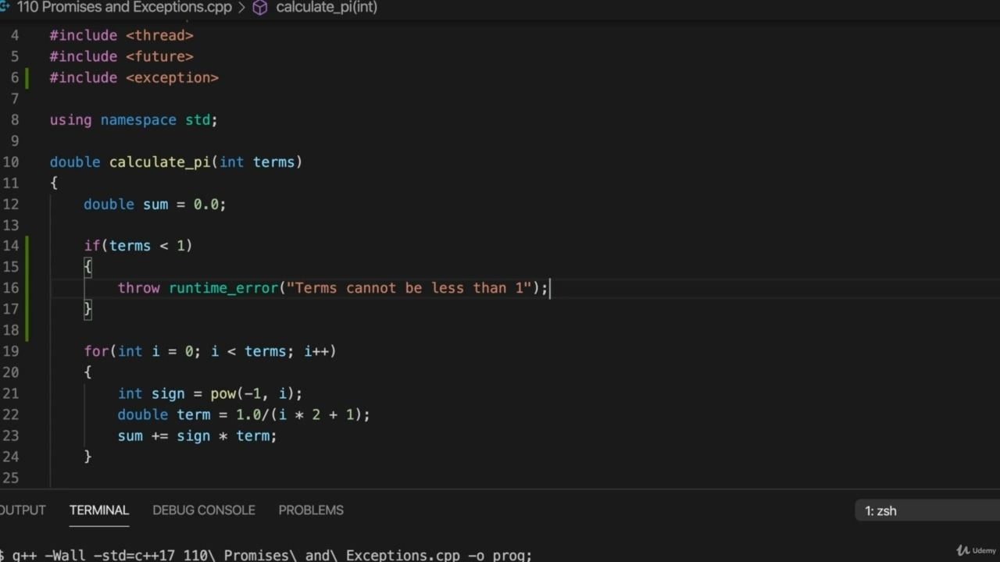

So we could say here, for example, that if terms is less than one. Then we throw a runtime error, which is a kind of exception. And that lets us specify a message for the exception, let's say terms cannot be less than one.

> 所以我们可以在这里说，例如，如果条件小于 1。然后我们抛出一个运行时错误，这是一种异常。这让我们可以为异常指定一条消息，假设条件不能小于 1。

## img - 127870

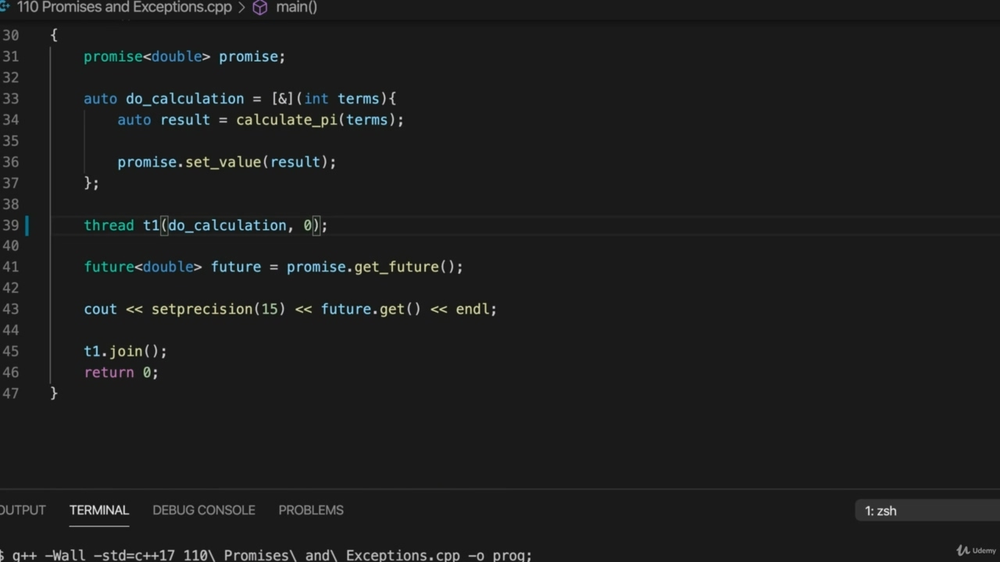

So now if we let's this is try making it through that error, so I'm going to change this to zero.

> 所以现在，如果我们让我们尝试通过这个错误，那么我将把它改为零。

## img - 131860

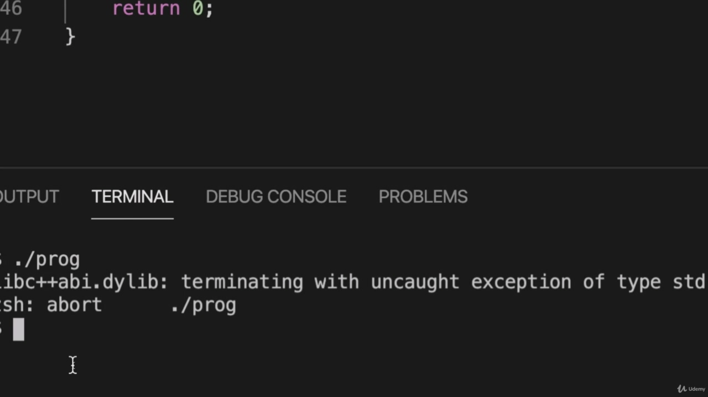

And compile it and run it. OK, so we get just a uncaught exception, problem terms cannot be less than one kind of message.

> 然后编译并运行它。好的，所以我们得到了一个未捕获的异常，问题术语不能少于一种消息。

## img - 148020

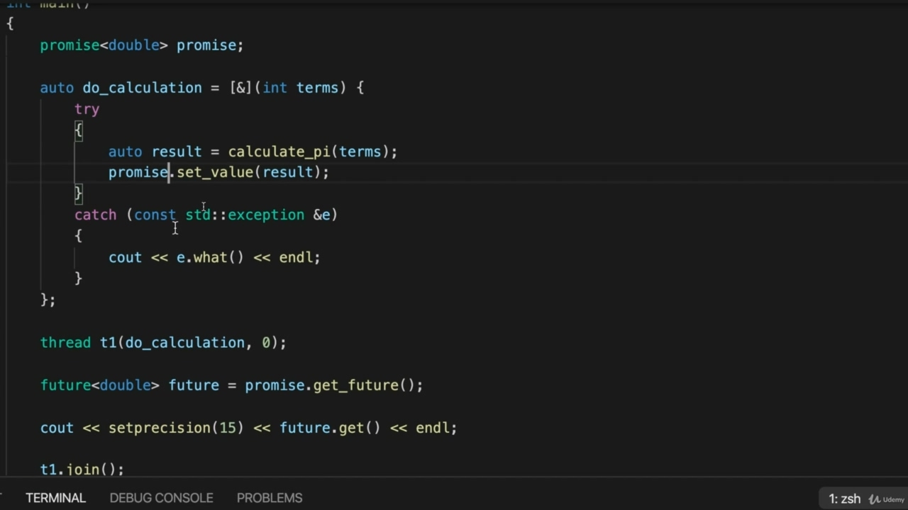

OK, so we get just a uncaught exception, problem terms cannot be less than one kind of message. So what we can do, though, is we can use a method of promise called set exception. So if we look at where we're actually doing a calculation that's here, let's surround that with a try catch to catch the exception there. So try and I'm going to get rid of this. This is just auto generated quickly by Visual Studio Code. So I'm going to do to calculate PI here in the try and then we should be able to catch that exception that sticks out either what? And we do promise to set value if we can actually get a value, so we move that into the trade as well. So now it looks like this. If you calculate PI throws an exception, which is going to output EOT, and that's that's the end of

> 好的，所以我们得到了一个意外的例外，问题术语不能少于一种信息。所以，我们可以做的是，我们可以使用一种叫做 set exception 的 promise 方法。所以，如果我们看看我们实际在这里进行计算的地方，让我们用一个 try-catch 来捕捉异常。所以尝试一下，我会摆脱这个。这只是由 Visual Studio 代码快速自动生成的。所以我将在这里尝试计算 PI，然后我们应该能够捕捉到那个突出的异常，或者什么？我们确实承诺，如果我们真的能得到一个值，我们会设定值，所以我们也会将其应用到交易中。现在看起来像这样。如果你计算 PI 抛出一个异常，它将输出 EOT，这就是

## img - 243390

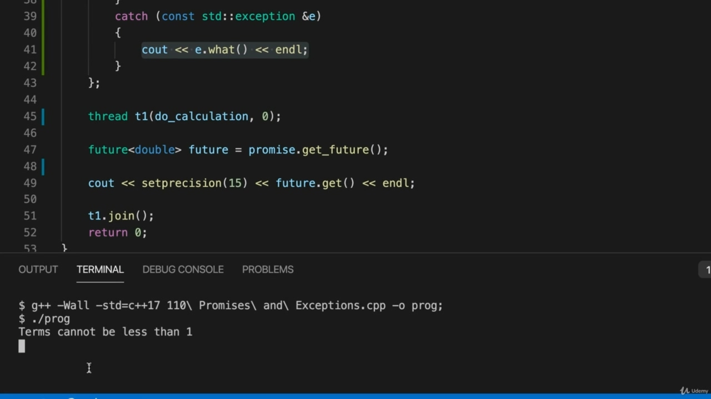

If you calculate PI throws an exception, which is going to output EOT, and that's that's the end of it. See what happens now. This isn't the final, complete code, but I'm just curious as to run the program so we get the exception,

> 如果你计算 PI 抛出一个异常，它将输出 EOT，这就是它的结束。看看现在会发生什么。这不是最终的完整代码，但我只是好奇如何运行程序，以便我们得到异常，

## img - 253960

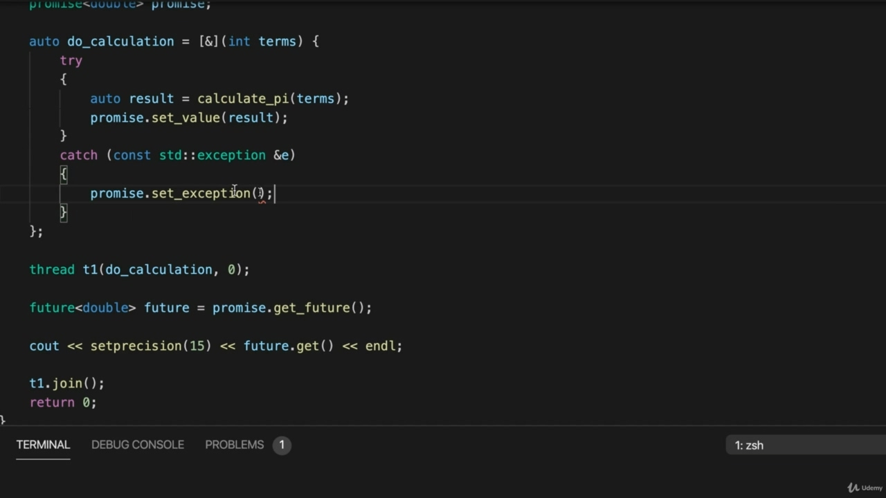

This isn't the final, complete code, but I'm just curious as to run the program so we get the exception, it's just coming out here on our program. If you look at it, it's actually hanging, which isn't good because this gets here on the future is not going to return until you either do set value or something else that resolves the promise, you know, so that well, is this idea of the promise must be resolved somehow, you know, in order forget to return. It's just to control and kill my program. So. We don't have to kind of resolve this by doing set value, we can also do that exception. So in the event where the calculation throws an exception, I'm going to do promise dot, dot set exception. And now this actually expects a standard type called exception on the score pointer from the standard

> 这不是最后一个完整的代码，但我只是好奇如何运行程序，以便我们得到例外，它只是在我们的程序中出现。如果你看它，它实际上是悬着的，这是不好的，因为这是在未来不会回来的，除非你做了设定值或其他解决承诺的事情，你知道，所以，这个承诺的想法必须以某种方式解决，你知道的，为了忘记返回。这只是为了控制和杀死我的程序。所以，我们不需要通过设置值来解决这个问题，我们也可以执行那个异常。所以在计算抛出异常的情况下，我将执行 promise dot，dot set 异常。现在，这实际上需要一个标准类型，称为标准的分数指针上的异常

## img - 345530

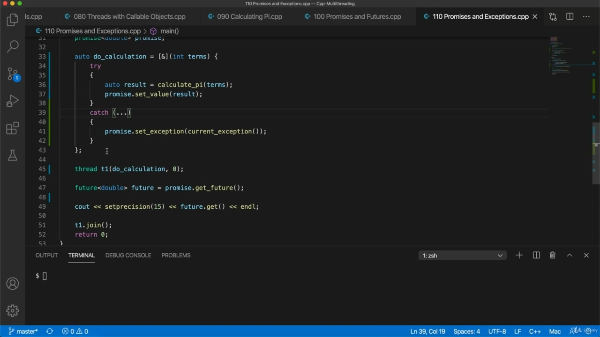

And now this actually expects a standard type called exception on the score pointer from the standard library. So we can't just pass in this exception, but what we can do is we can use current exception. And that gives us exactly this exception pointer type. So we're calling set exception and we're giving it a exception pointer. To the current exception, essentially, this actually could just be since we're not using this parameter. This could just be dot, dot, dot to say that we're just going to catch any exception here.

> 现在，这实际上需要标准库中的分数指针上有一个称为异常的标准类型。所以我们不能只传递这个异常，但我们可以做的是使用当前的异常。这正好给了我们这个异常指针类型。所以我们调用 set 异常，并给它一个异常指针。对于当前的异常，本质上，这可能只是因为我们没有使用这个参数。这可以是点，点，点来表示我们只会捕捉到任何例外。

## img - 431830

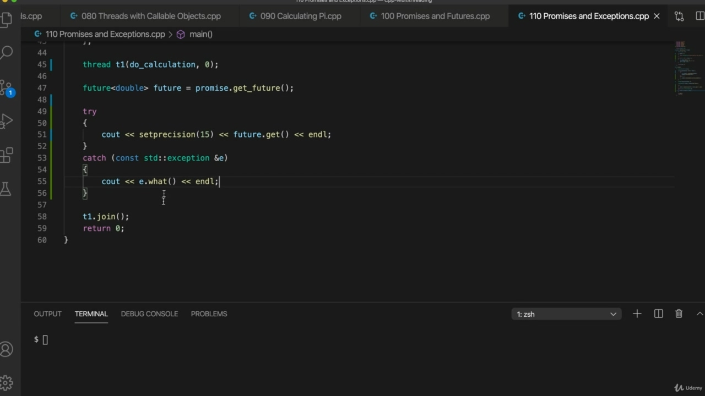

Now, when we call get on the future now we can catch this this exception so I can wrap this in a try catch. Let's move this up. This is option or out and or Parakey is a shortcut I'm using here to get rid of this comment that these are studio put into this generated try catch. And if we catch an exception, I'm just going to I'm happy with this code that, well, just I just type it myself, actually. That's just to see out it. What are you see out rather than Sierre and Andell. So if we do future doget and this calculate pi throws an exception, we'll catch that exception.

> 现在，当我们调用 get on the future 时，我们可以捕捉到这个异常，所以我可以用 try-catch 来包装这个异常。让我们把这个提高。这是 option 或 out，或者 Parakey 是我在这里使用的一个快捷方式，以消除这个注释，这些注释是工作室放入这个生成的 try-catch 中的。如果我们发现一个异常，我会很高兴看到这段代码，实际上，我只是自己键入。这只是为了看看。你看到的是什么，而不是 Sierre 和 Andell。所以，如果我们执行未来的 doget，并且这个计算 pi 抛出一个异常，我们将捕获该异常。

## img - 517080

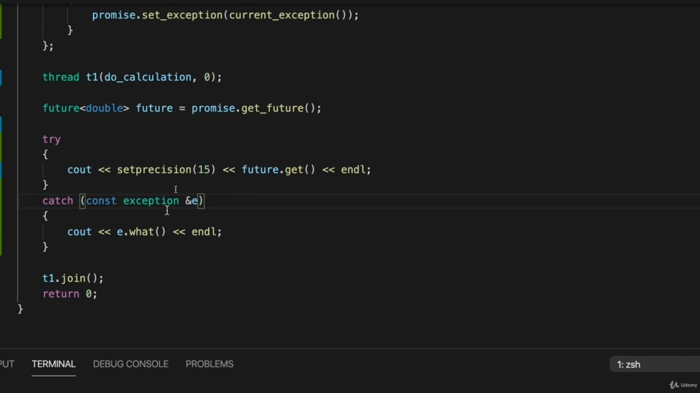

So if we do future doget and this calculate pi throws an exception, we'll catch that exception. And then instead of doing promise, not set value. So we jump out of here, we end up in a catch and we do promise, not set exception. And we use current current on the score exception. This is all from the standard Library Stiegel on Kolon to get an exception point or object that refers to the exception that's actually been thrown and we set that into the promise and set exception will cause future dot get to return just in the same way that set value causes which return. But the difference is that, well, strictly speaking, it doesn't return. When we do set exception, it will throw the actual exception. So then we can actually catch an actual exception. I don't need a standard sundering using namespace standard and will use the what method of the exception

> 所以，如果我们执行未来的 doget，并且这个计算 pi 抛出一个异常，我们将捕获该异常。然后不做承诺，不设定价值。所以我们跳出这里，我们最终陷入困境，我们承诺，而不是例外。我们在分数异常上使用当前电流。这都是从 Kolon 上的标准库 Stiegel 中获取的，以获取一个异常点或对象，该异常点或异常对象引用了实际抛出的异常，我们将其设置到 promise 中，并设置异常将导致未来的 dot-get 返回，与设置值导致返回的方式相同。但不同的是，严格来说，它不会回来。当我们设置异常时，它将抛出实际的异常。因此，我们实际上可以捕捉到一个实际的异常。我不需要使用命名空间标准的标准拆分，将使用异常的 what 方法

## img - 610310

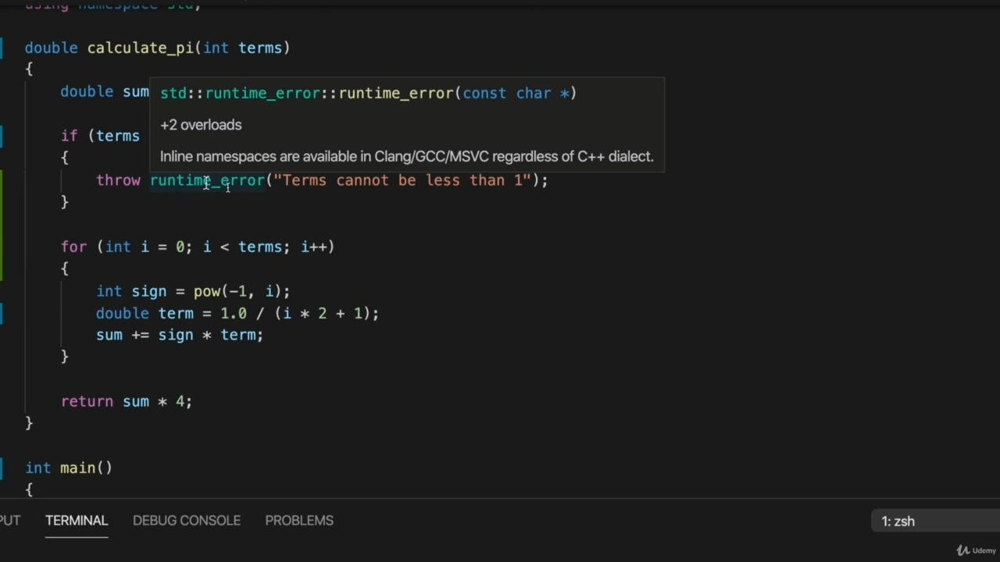

I don't need a standard sundering using namespace standard and will use the what method of the exception class to actually get the message from it. And the exception that we threw is it's runtime error, which is a kind of exception.

> 我不需要使用命名空间标准的标准拆分，而是使用异常类的 what 方法从中实际获取消息。我们抛出的异常是运行时错误，这是一种异常。

## img - 620830

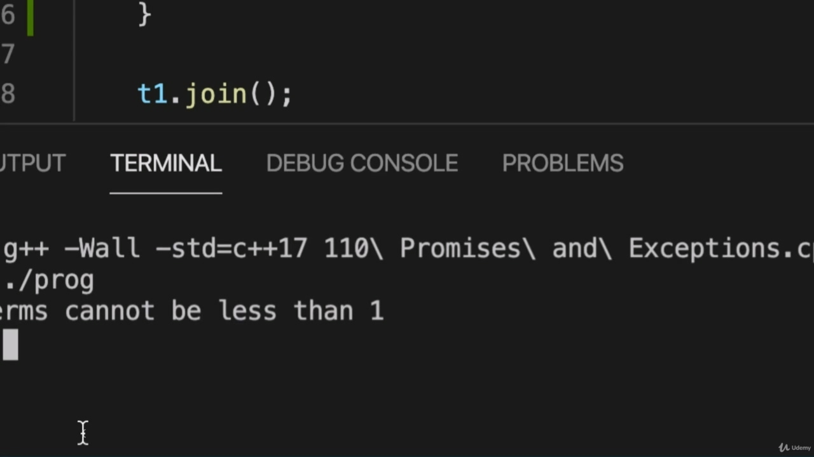

And the exception that we threw is it's runtime error, which is a kind of exception. OK, so let's just run this now. So at the moment, what am I doing, I'm saying that a number of times is zero, so we should get that exception. So I compile a program and run it. And it says terms cannot be less than one, so it works.

> 我们抛出的异常是运行时错误，这是一种异常。好的，现在让我们运行这个。所以现在，我在做什么，我是说次数是零，所以我们应该得到例外。所以我编译了一个程序并运行它。它说术语不能少于一个，所以它有效。

## img - 642780

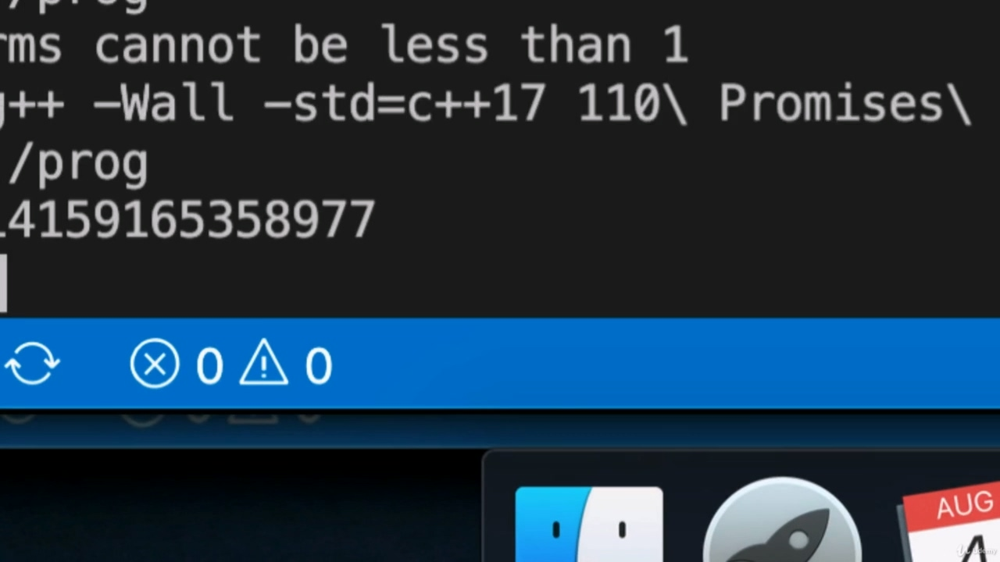

And it says terms cannot be less than one, so it works. That's coming up from here. And if I pass in some reasonable number of terms, let's say 186. As compiled that and run it, then we get pie as before or an approximation for pie.

> 它说条款不能少于一个，所以它是有效的。这是从这里传来的。如果我通过了一些合理的条款，我们假设 186。当编译并运行它时，我们会像以前一样得到馅饼或馅饼的近似值。

## img - 701060

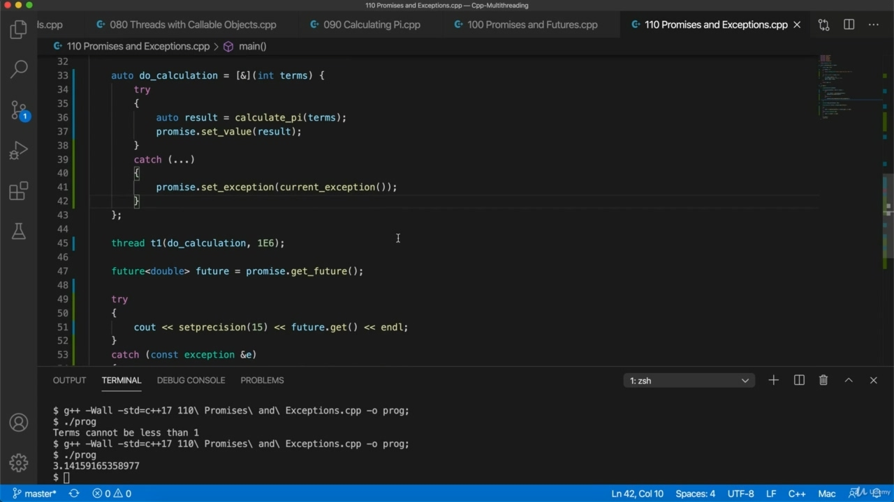

As compiled that and run it, then we get pie as before or an approximation for pie. OK, so that's again, I think it's relatively straightforward if you haven't been following developments

> 当编译并运行它时，我们会像以前一样得到馅饼或馅饼的近似值。好的，那又是一次，我认为如果你没有关注事态发展，这是相对简单的

## img - 711570

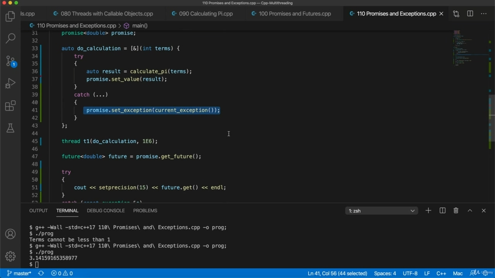

OK, so that's again, I think it's relatively straightforward if you haven't been following developments in C++ too closely, there may be new things for you here, like current exception or I don't know. Some other things here may be new to you. But again, if you take them out, I think you'll get used to them that the real Take-Home message here is that this get is, is he's got to either return or throw an exception. And there are various ways you can make it do that. You don't want it to just hang. But until you call that exceptional set value or something else that makes it return, then it's just going to hang. So you want to make sure that you do at least one of these.

> 好的，那又是一次，我认为这是相对简单的，如果你没有太密切地关注 C++的发展，这里可能会有新的东西，比如当前的异常或者我不知道。这里的一些其他东西对你来说可能是新的。但是，如果你把他们带出去，我想你会习惯他们，这里真正的“带回家”信息是，他必须返回或抛出异常。有多种方法可以让它做到这一点。你不想让它挂着。但是，除非你调用这个异常的设置值或其他使其返回的值，否则它将被挂起。所以你要确保你至少做了其中一项。
