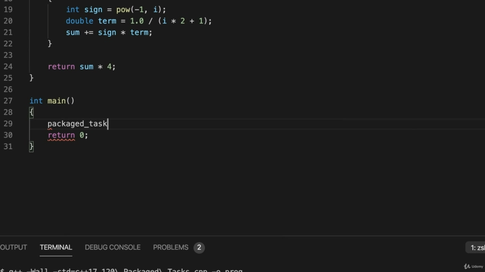
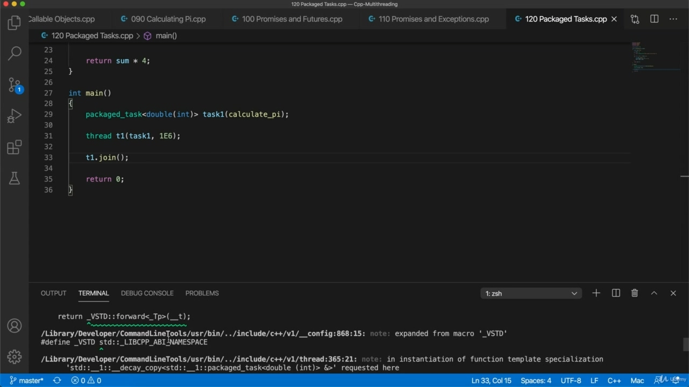
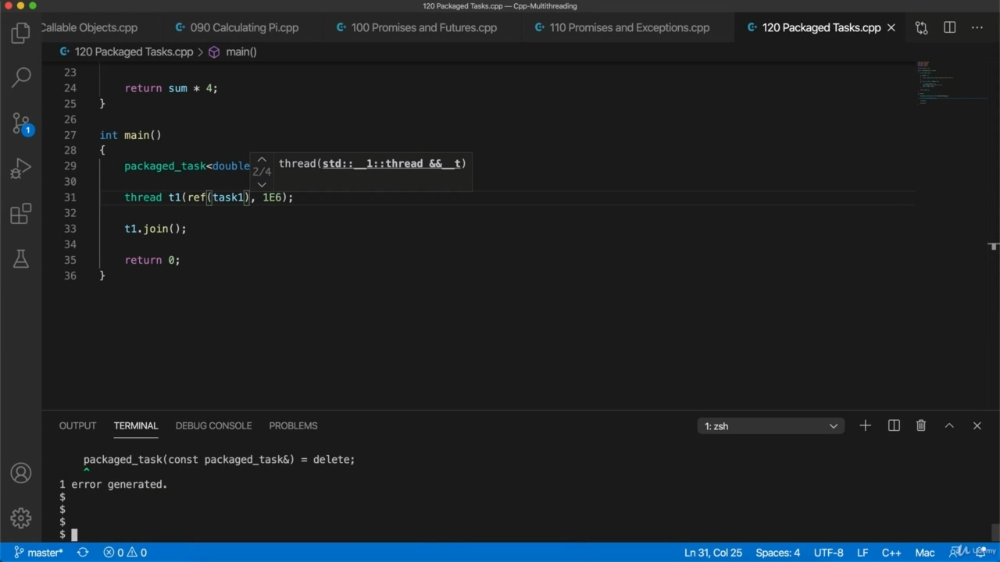
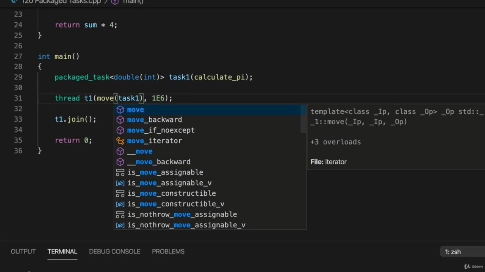
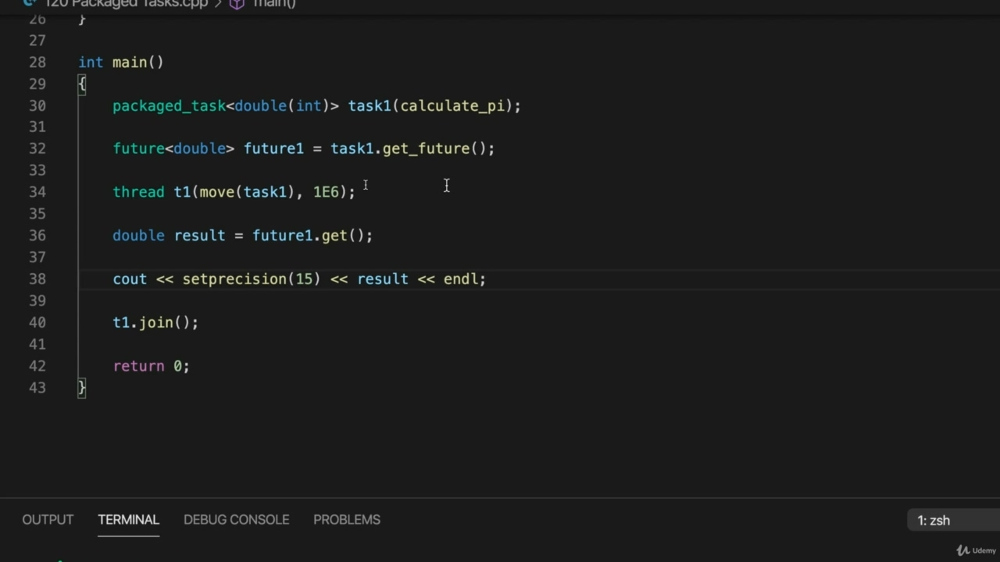
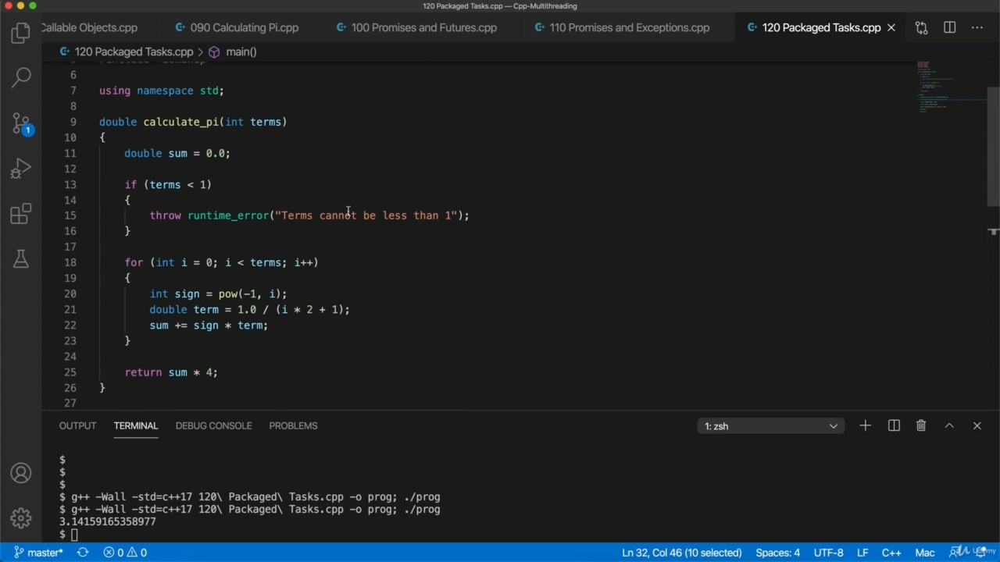
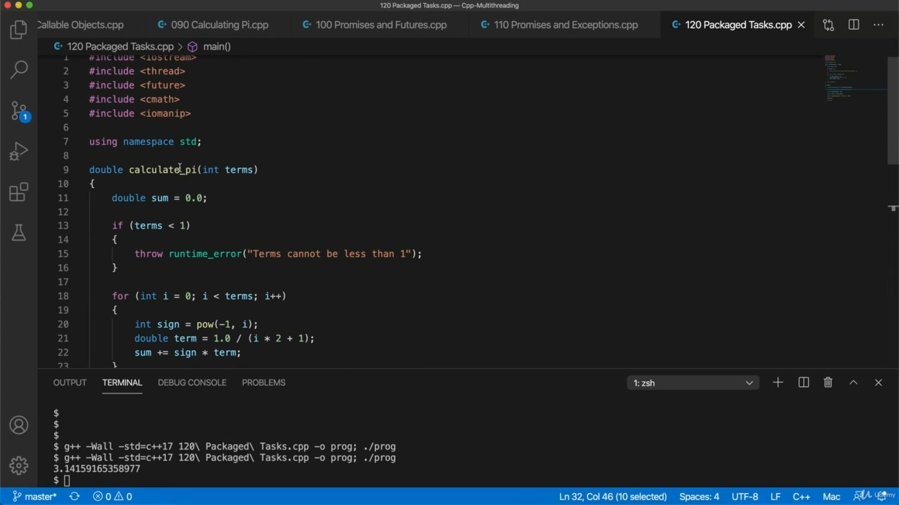
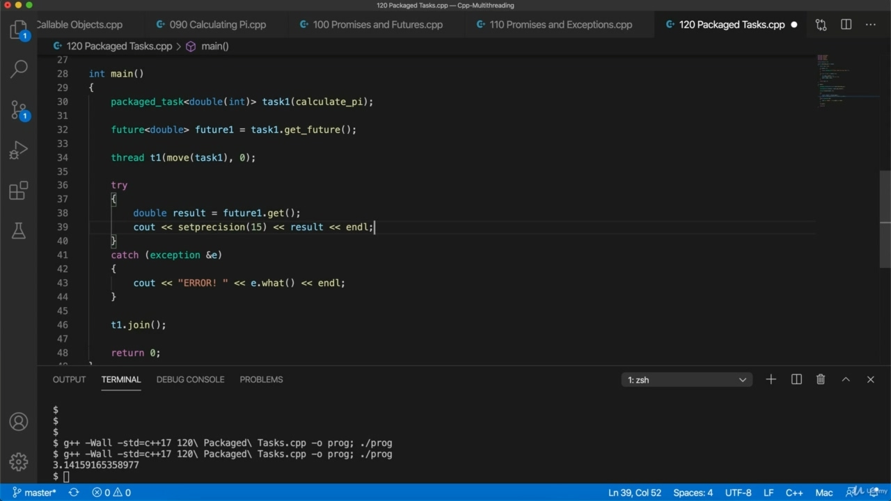
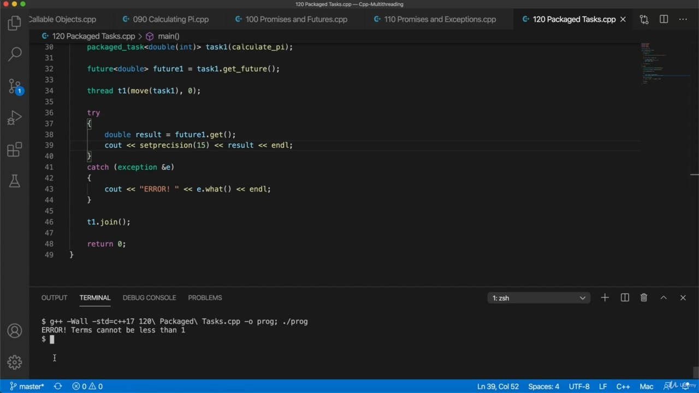
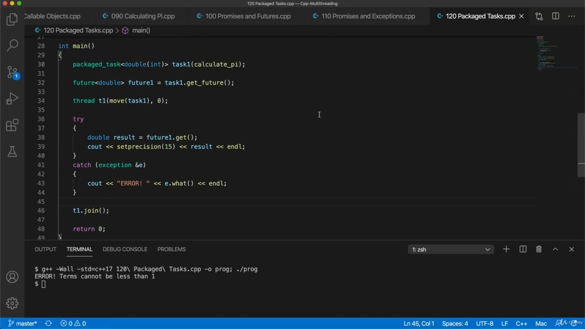

Hello, in this video, we're going to take a look at packaged tusks and these basically allow us to Hello, in this video, we're going to take a look at packaged tusks and these basically allow us to work with promises and futures, but in a way that's nicer than if we work with them directly. So we've seen now how to use promises and futures, this basic underlying mechanism to get return values from threads. But there's quite a lot of code here that we need to add in and we can make this a lot cleaner if we use a package task. So let's take a look. Here's a basic hello world program, and I'm going to copy my Calculate Pi from the last video into this new. Program. And we're also going to add some headers, so that's let's see what we need, we need threat.

> 你好，在这段视频中，我们将看一看包装好的象牙，这些基本上让我们可以。所以我们现在已经了解了如何使用 promise 和 future，这是从线程获取返回值的基本基础机制。但是这里有很多代码需要我们添加，如果我们使用包任务，我们可以让它更干净。让我们来看一下。这是一个基本的 hello world 程序，我将把上一个视频中的 Calculate Pi 复制到这个新程序中。程序我们还将添加一些标题，让我们看看我们需要什么，我们需要威胁。

## img - 50630

And we're also going to add some headers, so that's let's see what we need, we need threat. And I need. Future and I'm also using here see math in my calculate pi function. Now, let's take a look at how we could run this code in its own thread using a packaged TASC. So first, I need a package tusk that's right here, package Tusk, so this is again from the standard

> 我们还将添加一些标题，让我们看看我们需要什么，我们需要威胁。我需要。Future，我也在这里使用数学来计算 pi 函数。现在，让我们来看看如何使用打包的 TASC 在它自己的线程中运行这段代码。所以，首先，我需要一个包装象牙，就在这里，包装象牙，所以这也是标准的

## img - 119400

So first, I need a package tusk that's right here, package Tusk, so this is again from the standard library, of course, but I'm using namespace standards, so I don't need to stand a column column. This is a template site and you need to specify the type of the function here that you plan to run in it. So in here, our function returns a double and it accepts an ENT. So you can specify that using this very clean and simple syntax. So it's a function that returns and returns a double. Sorry. And it has one argument, which is an end is pretty simple. That's right, Tascon, and then we can supply our function to it, calculate why we don't supply arguments yet at this stage, then tyrannis, we create a thread. So let's create a thread, which I'll call T1, and now we can pass the package test to this. So let's write task one and we can pass the arguments that we need to to it. So let's say we want to pass one six. Let's do that one E six, because that's what our function actually accepts here. I mean, it needs the number of terms so we can pass in, like, for example, a million it accepts anent and let's wait for Taiwan to finish. Now, this isn't even quite right so far, that's compile it and see what happens. So we get an error and it's complaining about TASC, basically, it's saying we're calling a deleted

> 首先，我需要一个包 tusk，它就在这里，包 tusk。当然，这也是来自标准库，但我使用的是命名空间标准，所以我不需要使用列列。这是一个模板站点，您需要在这里指定您计划在其中运行的函数的类型。所以在这里，我们的函数返回一个 double，并接受一个 ENT。因此，您可以使用这种非常干净和简单的语法来指定它。所以它是一个返回并返回一个双精度的函数。很抱歉它有一个论点，这是一个非常简单的结局。是的，Tascon，然后我们可以向它提供函数，计算为什么我们在这个阶段还没有提供参数，然后暴虐，我们创建一个线程。所以让我们创建一个线程，我将其称为 T1，现在我们可以将包测试传递给它。所以让我们写任务 1，我们可以把需要的参数传递给它。让我们做一个 E6，因为这是我们的函数在这里实际接受的。我的意思是，它需要一定数量的条款，这样我们就可以通过，比如，它接受一百万，让我们等待台湾完成。现在，到目前为止，这还不太正确，那就编译它，看看会发生什么。所以我们收到了一个错误，它在抱怨 TASC，基本上，它说我们正在调用一个已删除的

## img - 259790

So we get an error and it's complaining about TASC, basically, it's saying we're calling a deleted constructor, you can't copy tasks. So if we pass something by value, of course, then by default it's going to be copied and we can't do that. So we could use probably rafea. And we should be able to compile it like that. Let's try it, but because we don't need to refer to this task again, we could actually use move.

> 所以我们得到了一个错误，它在抱怨 TASC，基本上，它说我们正在调用一个已删除的构造函数，你不能复制任务。所以，如果我们通过值传递某个东西，当然，默认情况下它会被复制，我们不能这样做。所以我们可以用拉菲亚。我们应该能够这样编译它。让我们尝试一下，但因为我们不需要再次引用此任务，所以我们实际上可以使用 move。

## img - 327450

Let's try it, but because we don't need to refer to this task again, we could actually use move.

> 让我们尝试一下，但因为我们不需要再次引用此任务，所以我们实际上可以使用 move。

## img - 336900

So move is just saying, look, create a sort of shallow copy of this and then copy into it any resources that it's using pointers to memory, whatever, just in fact, just move. So the old one is not necessarily left in a state that's any use. Now, we can get a future from this. So I can say future. And this is a future that's going to return a double. Let's call it future one maybe. Equals Tusk, one dockett future. So we get the future immediately, and from that we can ultimately get a return value, so after we've run the thread, we'll be able to get a return value from the future. So either before or after we do at one point here, let's call future future one. Don't get. And that should be a double value. And we can output that at the top here. I'm going to also include. Iyo manip. And that's output the result somewhere. Maybe here, so sickouts set, precision 15 and result. OK, let's try this and see if it works, so I'm going to compile it and run it, and then we've got

> 所以 move 就是说，看，创建一个浅层的副本，然后将它使用内存指针的任何资源复制到其中，不管怎样，事实上，只是 move。因此，旧的不一定会处于一种有任何用处的状态。现在，我们可以从中获得未来。所以我可以说未来。这是一个将带来双倍回报的未来。让我们把它称为未来。等于图斯克，一个码头的未来。所以我们立即得到未来，从中我们最终可以得到一个返回值，所以在我们运行线程之后，我们将能够得到未来的返回值。所以无论是在我们做之前还是之后，让我们称未来为未来。别误会。这应该是一个双重值。我们可以在顶部输出。我还将包括。Iyo 操纵杆。这就是输出结果的地方。也许在这里，所以设置了病假，精度 15 和结果。好吧，让我们试试这个，看看它是否有效，所以我要编译它并运行它，然后我们就得到了

## img - 502180

OK, let's try this and see if it works, so I'm going to compile it and run it, and then we've got our value for PI, if you can see that down there. So this this is a cleaner and simpler mechanism for sure. It works because our function that's actually doing the work here, it returns a value. So the function that you pass to the task constructor, you want that to return a value and that gets stored in a promise which we can get via we can get the value of that via a future. So this basically achieves what we did in the last video.

> 好的，让我们试试这个，看看它是否有效，所以我要编译它并运行它，然后我们得到 PI 的值，如果你能看到的话。这是一个更干净、更简单的机制。它之所以有效，是因为我们的函数在这里实际执行工作，它返回一个值。所以你传递给任务构造器的函数，你希望它返回一个值，并存储在一个 promise 中，我们可以通过这个 promise 获得它的值。所以这基本上实现了我们在上一个视频中所做的。

## img - 535980

So this basically achieves what we did in the last video. But a lot more simply, exceptions work as well. So let's try throwing an exception so we see that this dysfunction, we've written it so that if we

> 所以这基本上实现了我们在上一个视频中所做的。但更简单的是，例外也同样有效。所以，让我们尝试抛出一个异常，这样我们就可以看到这种功能障碍，我们已经编写了它，如果我们

## img - 548440

So let's try throwing an exception so we see that this dysfunction, we've written it so that if we supply value less than one four terms, it will throw an exception. Let's try passing in zero. We should trickily exception and then it's actually get that throws this exception. So I'm going to try catchin here. Let's move this up a bit. And catchin. A strike cutting exception reference to. And I'm going to do see out this error in there just so that we can see that we what's happening, that we really are catching the exception and eat a what? To get whatever kind of message was set in the exception. And I'm going to move this results up into the try and just format this that we go.

> 所以，让我们尝试抛出一个异常，这样我们就可以看到这个功能障碍，我们已经编写了它，如果我们提供的值小于四个项，它将抛出一个例外。让我们尝试过零。我们应该巧妙地进行异常处理，然后实际上是 get 抛出了这个异常。所以我要在这里尝试捕捉。让我们把这个提高一点。还有流行语。一个删除异常的引用。我将在那里看到这个错误，这样我们就可以看到正在发生的事情，我们真的抓住了异常，吃了什么？获取异常中设置的任何类型的消息。我将把这个结果转移到尝试中，并将其格式化。

## img - 643890

And I'm going to move this results up into the try and just format this that we go. Let's try it. So compile it, compile and run it in one line here. There we go. And he says error terms cannot be less than one.

> 我将把这个结果转移到尝试中，并将其格式化。让我们来尝试一下。所以在这里编译它，编译并运行它。好了。他说，误差项不能小于 1。

## img - 656010

And he says error terms cannot be less than one. So we've got this really nice mechanism here both for getting a result and catching exceptions from the function that calculates your results. You just return the result and in there you just throw in. If you throw an error, then you can catch it later on. So we've not mixed any multi threading code with calculate pi. It just calculates the result throws an exception. If something goes wrong, we pass that to a package task and from the task we can immediately get a future. We move the task to a thread then and we run it in a try catch and the catch will catch any exception that's thrown ultimately in this case from Calculate Pi. So really exactly the same thing is achieved that we did in this last video, but a lot more elegantly.

> 他说，误差项不能小于 1。所以我们这里有一个非常好的机制，既可以获得结果，也可以从计算结果的函数中捕获异常。您只需返回结果，然后在其中输入。如果您输入错误，则可以稍后捕获。因此，我们没有将任何多线程代码与计算 pi 混合。它只是计算结果引发异常。如果出现问题，我们会将其传递给一个包任务，然后从该任务中我们可以立即获得未来。然后，我们将任务移动到一个线程，并在 try-catch 中运行它，在这种情况下，catch 将捕获 Calculate Pi 最终抛出的任何异常。因此，我们在最后一段视频中所做的事情确实完全相同，但要优雅得多。
