Hello, in this video, we're going to look at a situation where one threat has to wait for another Hello, in this video, we're going to look at a situation where one threat has to wait for another threat before it can proceed, and this is going to motivate an examination of conditions, condition,

> 你好，在这段视频中，我们将看到一个威胁必须等待另一个威胁的情况你好，在这个视频中，我将看到一种威胁必须等待下一个威胁才能继续的情况，这将激发对条件、条件、，

## img - 14100

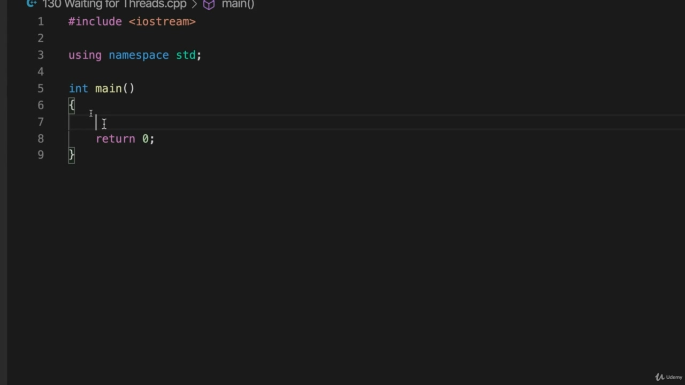

threat before it can proceed, and this is going to motivate an examination of conditions, condition, variables. So in this video, we're going to take a look at what we'd do without using condition variables or what we could do. And we'll look at some of the subtleties of how threats work a little bit. So supposing here I've got kind of a Hello World program without the hello.

> 这将激发对条件、条件和变量的检查。因此，在本视频中，我们将了解在不使用条件变量的情况下我们可以做什么，或者我们可以做些什么。我们将稍微了解一下威胁如何工作的一些微妙之处。假设这里有一个没有 Hello 的 Hello World 程序。

## img - 30710

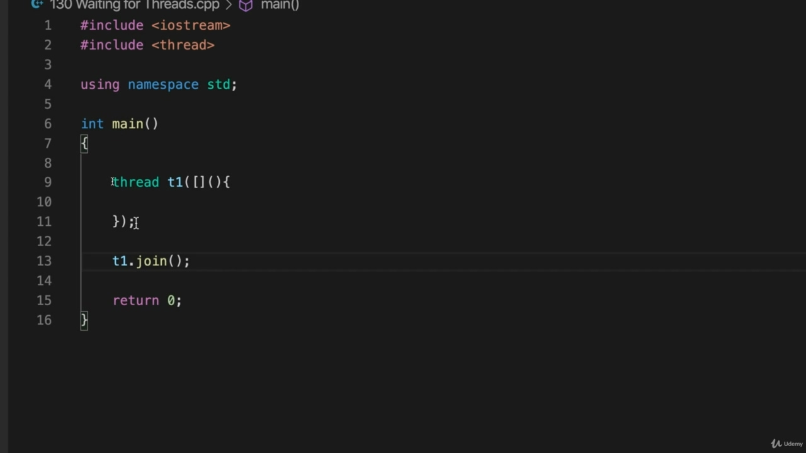

So supposing here I've got kind of a Hello World program without the hello. So supposing and here we have a threat, let's call it Taiwan. And I'm going to use a lambda expression here. So we have to cut your brackets, round brackets and the brackets. And I need to include up here include thread. And I've got using namespace standard as before, so I'm going to I'm going to create a situation where the main thread has to wait for this thread to do something. So we have actually we've already got two threads in this program. We've got this thread that was starting. And we've also got the main thread that any other code we write outside of that will run in. Let's put T1 those dots join here.

> 假设这里有一个没有 Hello 的 Hello World 程序。因此，假设我们这里有一个威胁，让我们称之为台湾。我将在这里使用 lambda 表达式。所以我们必须切下你的括号，圆括号和括号。我需要在这里包括线程。我已经像以前一样使用了名称空间标准，所以我要创建一个情况，其中主线程必须等待这个线程执行某些操作。所以我们实际上已经在这个程序中有了两个线程。我们有一个正在启动的线程。我们还得到了主线程，我们在它之外编写的任何其他代码都将在其中运行。

## img - 130220

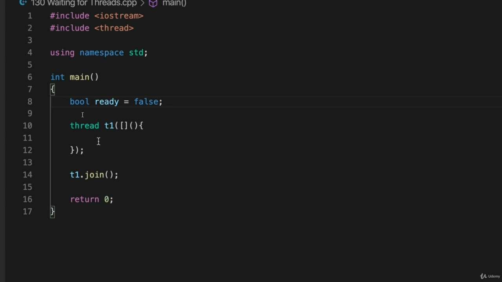

And let's let's have some really simple example of something which the main thread can wait for, so this thread got to do something which the main threat is then waiting for. Let's just have a boolean variable, which are already and it's set initially to false.

> 让我们来举一个非常简单的例子，说明主线程可以等待的事情，所以这个线程必须做一些主要威胁正在等待的事情。我们只需要一个布尔变量，它已经是，并且最初设置为 false。

## img - 147630

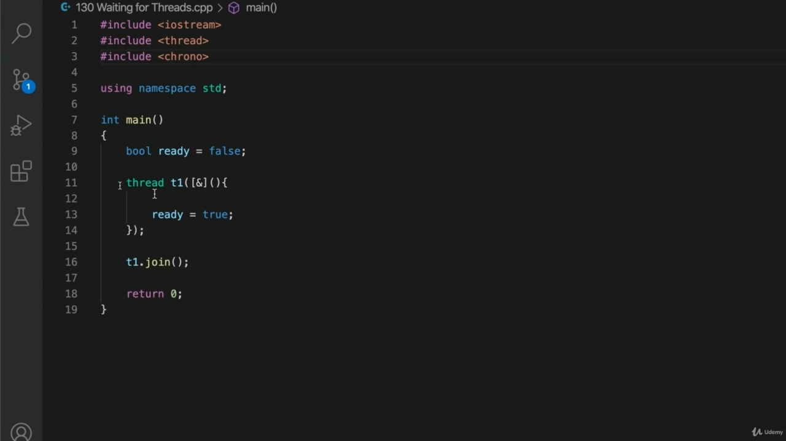

So we want our thread here are the thread to set ready to true. And let's let's put a delay in so that it takes a while to do that, I'm going to also catch a local variables by reference here so I can use it in my Landro expression. So if I include Crono here as to include Crono. Then I can put a delay into this thread, I can say this thread.

> 所以我们希望这里的线程是准备就绪的线程。让我们放一个延迟，这样做需要一段时间，我还要在这里通过引用获取一个局部变量，这样我就可以在 Landro 表达式中使用它。所以，如果我在这里包括克罗诺，那么就包括克罗诺。然后我可以给这个线程加一个延迟，我可以说这个线程。

## img - 215020

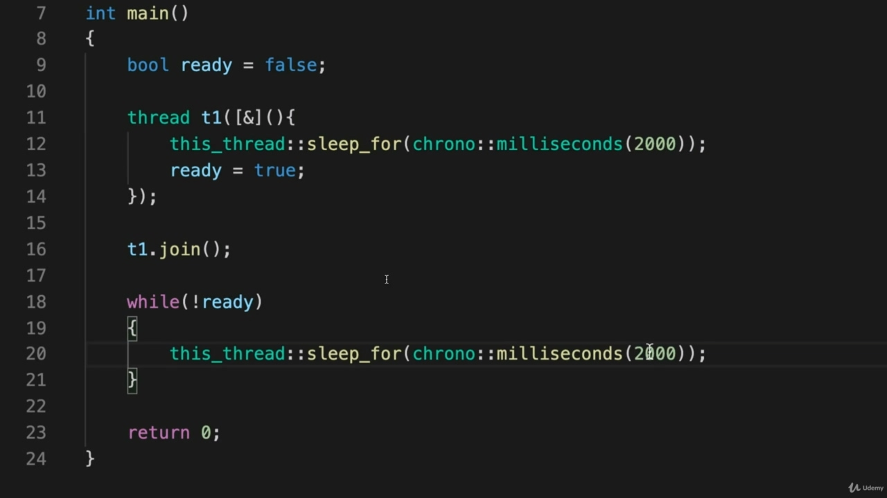

Then I can put a delay into this thread, I can say this thread. Sleep for. And it's going to sleep for Crono Milliseconds, uh, let's say 2000. So I want my main thread to I wanted to know when this becomes true, which happens after two seconds, but you can imagine that this thread might be doing something more complicated. We don't know when. This the red this red variable is going to become true, you know, and maybe it's writing to some factor or something. So we have to wait for whatever this does. How can we figure out when it's time for the main thread or which or the thread we got that's waiting for this to become true, for that to proceed? Well, one way that we could do it naively is like this. We could say while not ready. The right kind of Brackett's, the. Why am I doing here? OK, so while not ready. I've done it again. Trouble is, the microphones kind of slightly in my face too much, can't quite see what's going on. OK, here we go. So let's have a just sleep in here.

> 然后我可以给这个线程加一个延迟，我可以说这个线程。睡个懒觉。它会睡到克罗诺·毫秒，比如 2000 年。所以我想要我的主线程，我想知道这是什么时候实现的，两秒后就会发生，但是你可以想象这个线程可能正在做更复杂的事情。我们不知道什么时候。这个红色这个红色变量将变为真，你知道，也许它是在写某个因子或什么。所以我们必须等待这一切发生。我们如何确定何时是主线程的时间，或者我们得到的哪个线程正在等待它变为真，等待它继续？嗯，我们可以天真地这样做。我们可以在没有准备好的时候说。布雷克特的那种。我为什么在这里？好的，虽然还没准备好。我又做了一次。问题是，麦克风有点太对着我的脸了，看不清发生了什么。好了，我们开始。所以我们在这里睡一觉吧。

## img - 344340

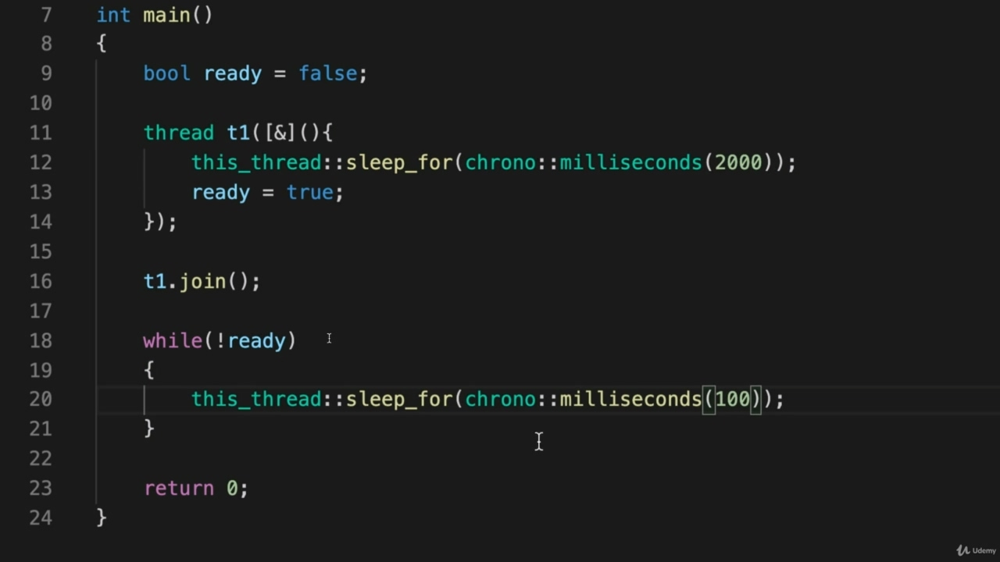

So I'm going to make this check every hundred milliseconds if ready is true yet, and when we finish

> 所以我将每 100 毫秒进行一次检查，如果就绪是真的，那么当我们完成时

## img - 344340

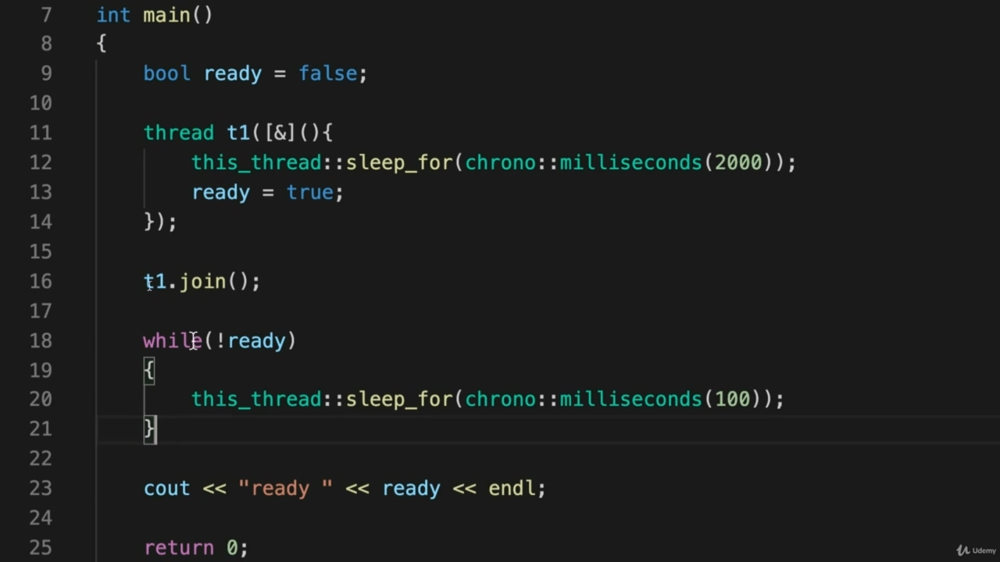

So I'm going to make this check every hundred milliseconds if ready is true yet, and when we finish waiting for this, I'm going to do sit out and that's output the value of ready just to be 100 percent certain. So this is going to say, OK, so already is false, it's going to sleep four hundred milliseconds,

> 所以我将每 100 毫秒进行一次检查，如果 ready 是真的，当我们完成等待时，我将坐下来，输出 ready 的值，以便 100%确定。这就是说，好的，这已经是错误的，它将休眠 400 毫秒，

## img - 359400

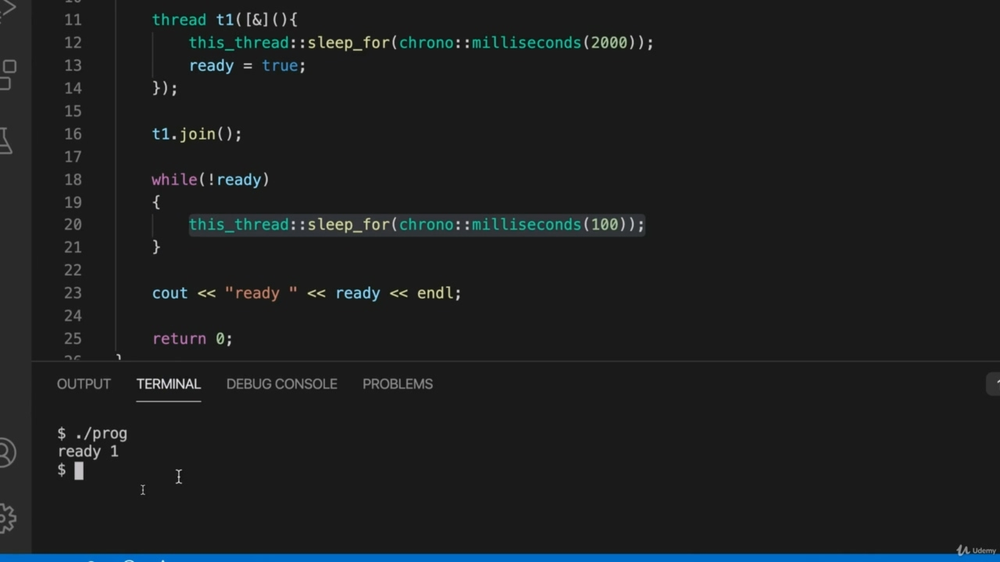

So this is going to say, OK, so already is false, it's going to sleep four hundred milliseconds, then it's going to check again is ready true now if not is going to sleep again and so on. So this is one kind of inefficient way you could do this. Let's open a terminal and run this so idealogue plus plus Hifa and I'll turn warnings on and standard equals C++ 17. And this is called three waiting for threats, I follow prog, so I run that and run my program and it waits. And now what actually happens when you run this? There's probably a bit dependent on your operating system, because the behaviour of this program is

> 这就是说，好的，已经是错误的，它将休眠 400 毫秒，然后它将再次检查是否准备就绪，如果不准备再次休眠，等等。所以这是一种低效的方法。让我们打开一个终端，运行这个 so idealogue plus plus Hifa，我将打开警告，标准等于 C++17。这叫做三个等待威胁，我遵循程序，所以我运行它，运行我的程序，它等待。现在，当你运行这个时会发生什么？可能有点依赖于你的操作系统，因为这个程序的行为是

## img - 445440

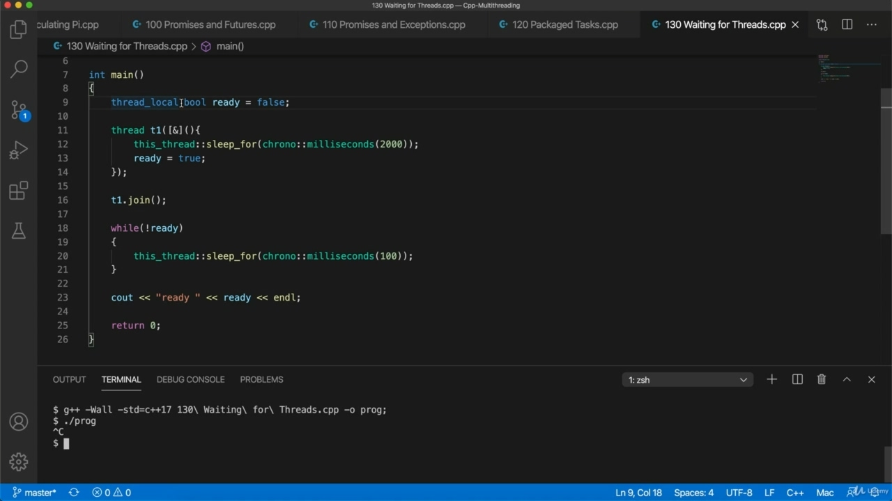

There's probably a bit dependent on your operating system, because the behaviour of this program is not really well defined, I don't think because it's possible the compiler might compile this in such a way that each thread has its own separate copy of Ready? I think I think that's a theoretical possibility on my system here. Certainly it does work, appears to work fine, but I wouldn't feel sure about this until the straight. What I mean, supposing we declare this spool thread on the school local. And what this does is it means that each thread will definitely get its own copy of that variable. So if I compile this now, I run it. It just hangs, that's never going to finish, I'll stop it with control, see? But what we could do is the opposite to that.

> 这可能有点依赖于你的操作系统，因为这个程序的行为并没有很好地定义，我不认为因为编译器可能会以这样的方式编译它，即每个线程都有自己的 Ready？我认为这是我的系统理论上的可能性。当然，它确实起作用，看起来很好，但我直到最后才确定这一点。我的意思是，假设我们在学校本地声明这个线轴线程。这意味着每个线程都会得到自己的变量副本。所以如果我现在编译这个，我就运行它。它只是挂起，永远不会完成，我会用控制来停止它，明白吗？但我们能做的恰恰相反。

## img - 534950

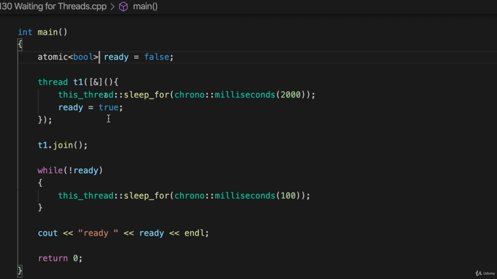

But what we could do is the opposite to that. We could use atomic because if we use an atomic variable like this, then we're guaranteed well defined

> 但我们能做的恰恰相反。我们可以使用原子变量，因为如果我们使用像这样的原子变量，那么我们就可以得到很好的定义

## img - 542660

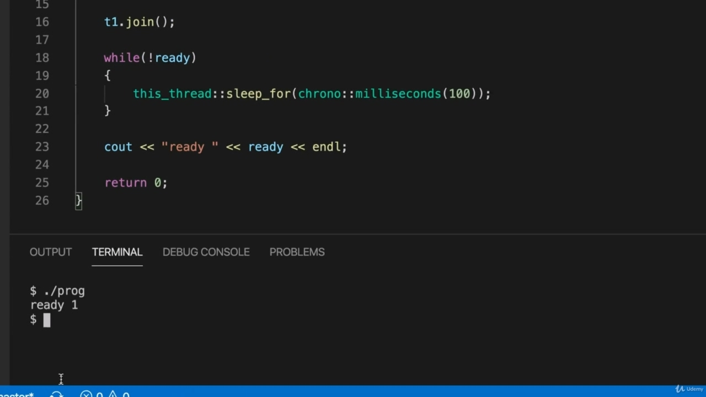

We could use atomic because if we use an atomic variable like this, then we're guaranteed well defined behavior across different threats. And now we can be sure this this program should work for you, whatever kind of system or compiler you're using. And eventually it will say ready is one.

> 我们可以使用原子变量，因为如果我们使用这样的原子变量，那么我们就可以保证在不同的威胁中定义良好的行为。现在我们可以确定这个程序应该适用于您，无论您使用的是什么类型的系统或编译器。最终，它会说准备就绪。

## img - 555530

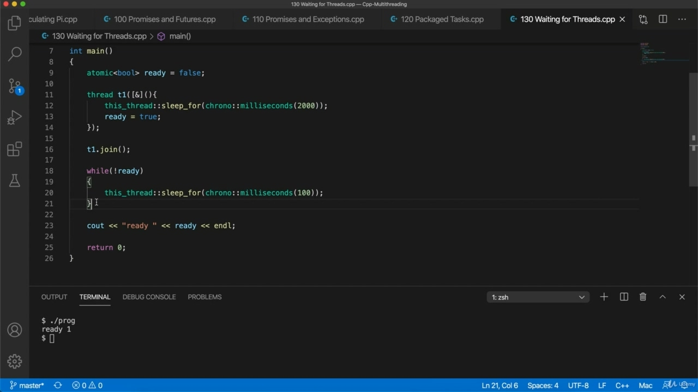

And eventually it will say ready is one. But this is hardly optimal because we have to check ready every hundred milliseconds. Wouldn't it be nice if there's a way that if there was a way that this thread could signal to the main thread or to whatever other threads are waiting for this to become true, that it was actually true,

> 最终，它会说准备就绪。但这并不是最理想的，因为我们必须每 100 毫秒检查一次。如果有一种方法，如果这个线程可以向主线程或任何其他线程发出信号，等待它变为真，这不是很好吗，

## img - 614010

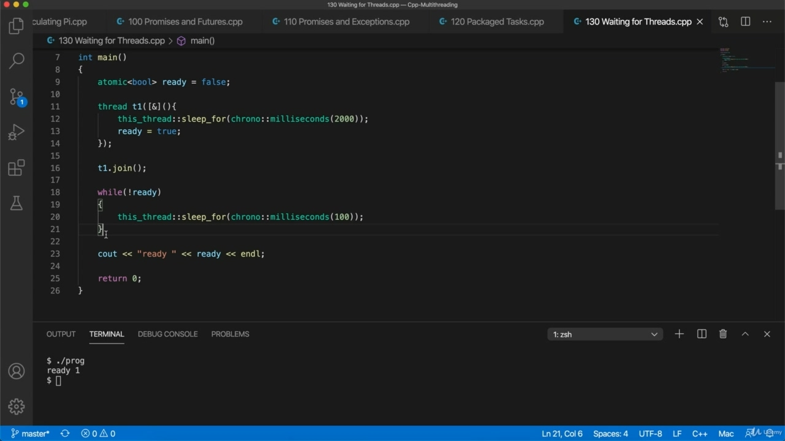

thread or to whatever other threads are waiting for this to become true, that it was actually true, and then we could just have the other threats that are waiting for it.

> 线程或任何其他线程正在等待它变为真，它实际上是真的，然后我们就可以有其他威胁在等待它。
