Hello, in this video, I'm going to modify this code to use a condition variable so condition variables are found in the header condition on the score variable. So it's condition on the score variable.

> 您好，在本视频中，我将修改此代码以使用条件变量，以便在得分变量的标题条件中找到条件变量。这是分数变量的条件。

## img - 23250

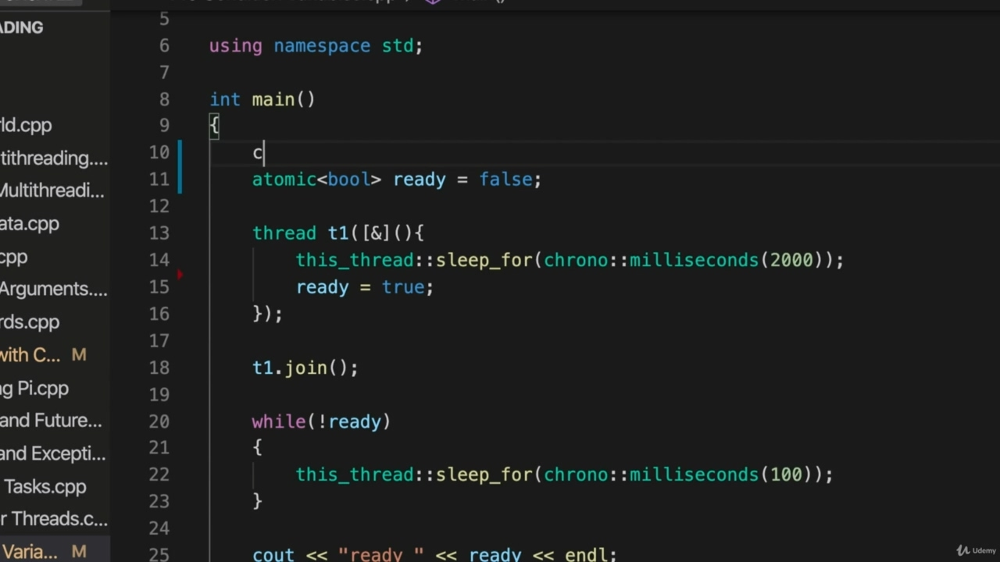

And I'm going to declare one here above where I've got this atomic ball at the moment, so conditioned

> 我要在上面声明一个，我现在有一个原子球，条件是这样的

## img - 23250

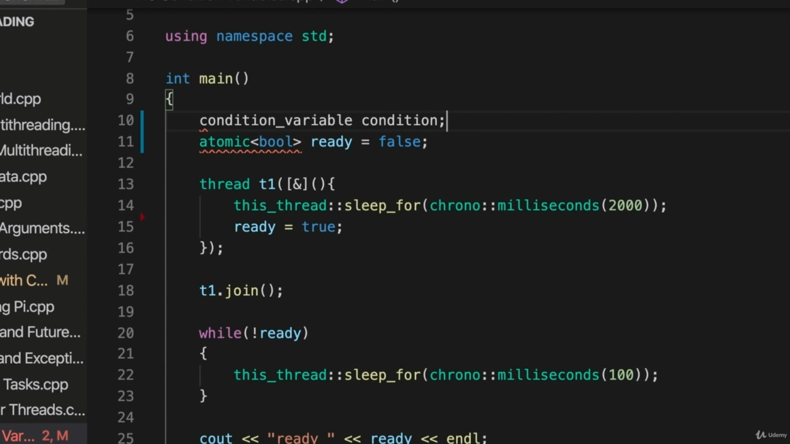

And I'm going to declare one here above where I've got this atomic ball at the moment, so conditioned variable, let's just call it condition.

> 我要在上面声明一个，在这里我得到了这个原子球，所以条件变量，我们称之为条件。

## img - 33600

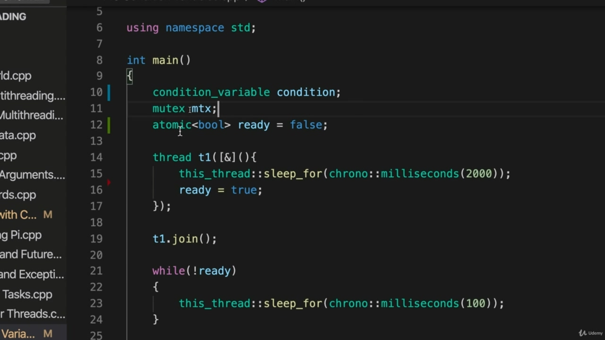

We also need a mutex because a condition where variable works together with a mutex of some some sort. So let's have a mutex, which I'll call them TAIEX and this atomic ball, I'm going to change it to

> 我们还需要一个互斥锁，因为变量与某种互斥锁一起工作的条件

## img - 40520

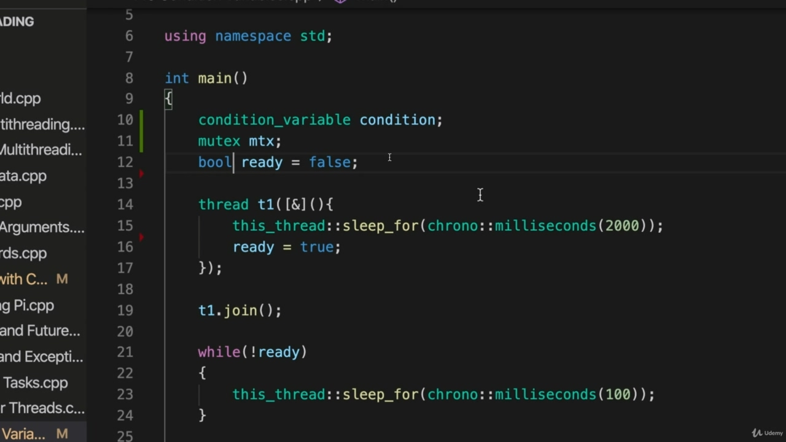

So let's have a mutex, which I'll call them TAIEX and this atomic ball, I'm going to change it to a normal ball because we're going to be implementing proper thread synchronization now with critical

> 所以让我们有一个互斥体，我将其称为 TAIEX，这个原子球，我将把它改为普通球，因为我们现在要实现正确的线程同步

## img - 47240

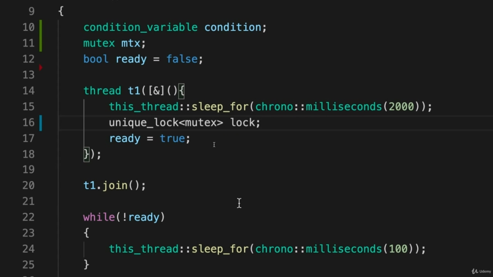

a normal ball because we're going to be implementing proper thread synchronization now with critical sections. And they guarantee that all variables, the state of them will be visible to all threads. So we don't need to bother with Tommy. So I'm going to, first of all, in this thread here where we set ready to true. I'm going to put that in a critical section. In other words, I'm going to get a lock before I do that and release it afterwards. So to do this, rather than use lock God, I'm going to use unique. Unique lock. And that's going to work with a mutex of the type mutex let's just call it like. So the reason I'm using unique lock and not lock God is that I need the unlock method.

> 这是一个正常的球，因为我们现在将在关键部分实现正确的线程同步。它们保证所有的变量，它们的状态对所有的线程都是可见的。所以我们不需要麻烦汤米。因此，我将首先在这个线程中，我们准备好实现。我将把它放在关键部分。换言之，我会在那之前拿到一把锁，然后再松开。所以为了做到这一点，我将使用 unique，而不是 lock God。唯一的锁。这将适用于互斥类型的互斥对象，我们可以这样称呼它。所以我使用独特的锁而不是锁上帝的原因是我需要解锁方法。

## img - 135060

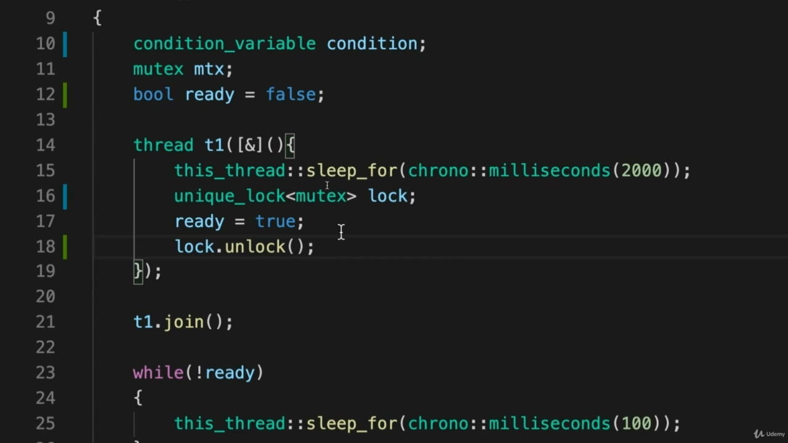

So the reason I'm using unique lock and not lock God is that I need the unlock method. So after I've set ready to true, I'm going to call lock to unlock. So I'm going to call the unlock method of unique lock lock.

> 所以我使用独特的锁而不是锁上帝的原因是我需要解锁方法。所以，当我准备好实现后，我将调用 lock 来解锁。所以我将调用唯一锁的解锁方法。

## img - 144580

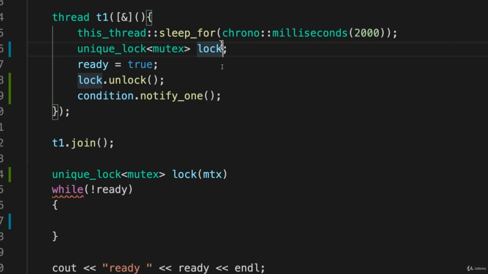

So I'm going to call the unlock method of unique lock lock. God doesn't have an unlock method, at least in the current version of C++. Now what I can do is I'm going to call condition dot, notify one. So it has a bunch of these notify methods were actually two of them. Just notify all and notify one. And the idea is that you have threads that are waiting for something to happen in the present thread and you can notify all of the threads if there's a whole bunch of them or just one of them, that they should wake up and try to do whatever it is that they were waiting to be able to do. In this case, we've only got one thread waiting and I'm going to use notify one. And often that's the one that you want anyway. Often you just want to wake up one note thread at one, noting one waiting thread. So call notify one. Now we can go to the other thread, the one that's supposed to do the waiting and what we're going to do in here is while I'm going to change this a little bit, let's get rid of this thread to sleep for. And instead of that, I'm going to write. Well, first of all, actually, we we need to get a lock here. So I'm going to here use unique lock. In fact, I'm going to do it above the while. I'm going to say unique. Loch. And again, that's the template site and we're going to use this unordinary mutex with it and again, I'll call it Lokke and we're going to lock on our mutex here. And that's an important point, I need to lock both of these.

> 所以我将调用唯一锁的解锁方法。上帝没有解锁方法，至少在当前版本的 C++中是这样。现在我能做的是，我将调用条件点，通知一个。所以它有很多这样的通知方法，实际上是其中的两种。只需通知所有人并通知其中一人。这个想法是，你有线程在等待当前线程中发生的事情，如果有一大堆线程或者只有一个线程，你可以通知所有线程，他们应该醒来，尝试做他们等待能够做的事情。在这种情况下，我们只有一个线程在等待，我将使用 notify。通常这就是你想要的。通常，您只需要一次唤醒一个注释线程，同时注意一个等待线程。所以打电话通知一个人。现在我们可以转到另一个线程，该线程应该执行等待，我们在这里要做的是，我要稍微改变一下，让我们去掉这个线程来睡觉。而不是那样，我要写。首先，事实上，我们需要在这里弄一把锁。所以我要在这里使用唯一的锁。事实上，我会在这段时间内做这件事。我要说独一无二。地点。再说一遍，这是模板站点，我们将使用这个非常规互斥体，我将其称为 Lokke，我们将在这里锁定互斥体。这是很重要的一点，我需要锁定这两个。

## img - 332370

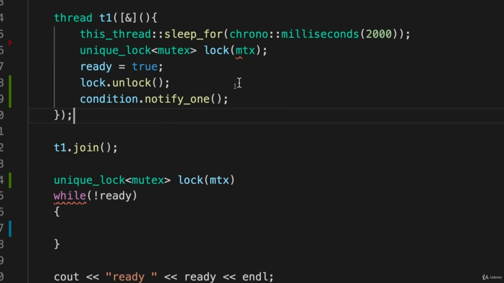

And that's an important point, I need to lock both of these. Both of these unique locks need to get the lock associated with the same mutex, so to the constructor

> 这是很重要的一点，我需要锁定这两个。这两个唯一的锁都需要获得与同一互斥锁相关联的锁，因此构造函数

## img - 342290

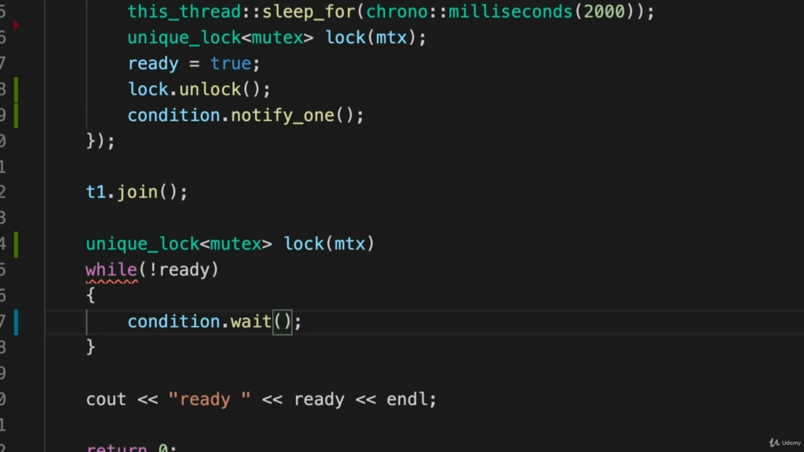

Both of these unique locks need to get the lock associated with the same mutex, so to the constructor of these unique lock objects, I need to supply the mutex that we're going to lock on. And it should be the same one in both cases here. That's what connects these two things, really. So now I'm going to say while not ready and I'm going to do condition. Wait. And we're going to wait on.

> 这两个唯一锁都需要获得与同一个互斥锁关联的锁，所以对于这些唯一锁对象的构造函数，我需要提供我们要锁定的互斥锁。在这里，这两种情况下都应该是相同的。这就是将这两件事联系起来的原因。所以现在我要说，虽然还没准备好，但我要做条件测试。等待我们将继续等待。

## img - 403320

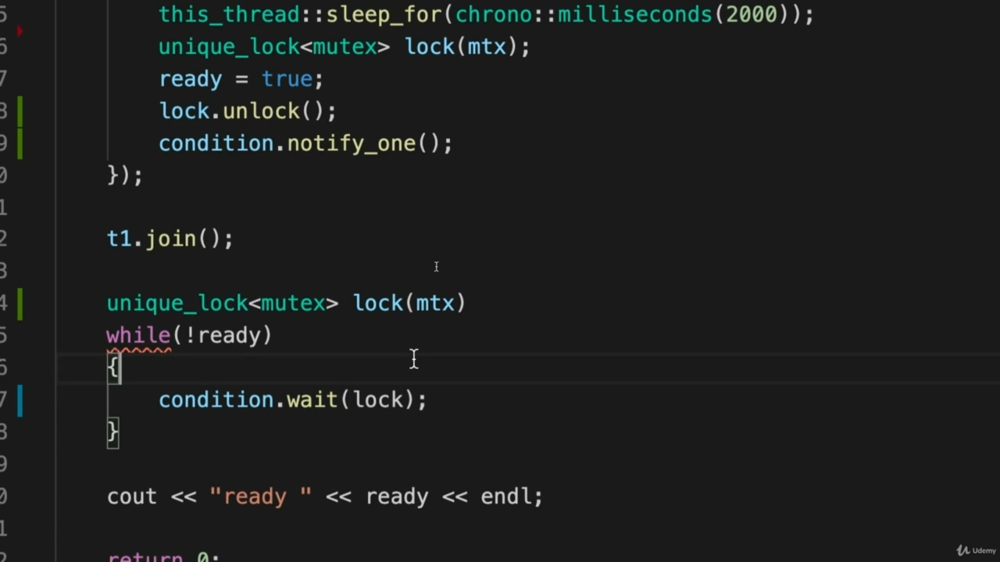

And we're going to wait on. Ah, lock, so I'm going to pass lock to it.

> 我们将继续等待。啊，锁，所以我将把锁传递给它。

## img - 414700

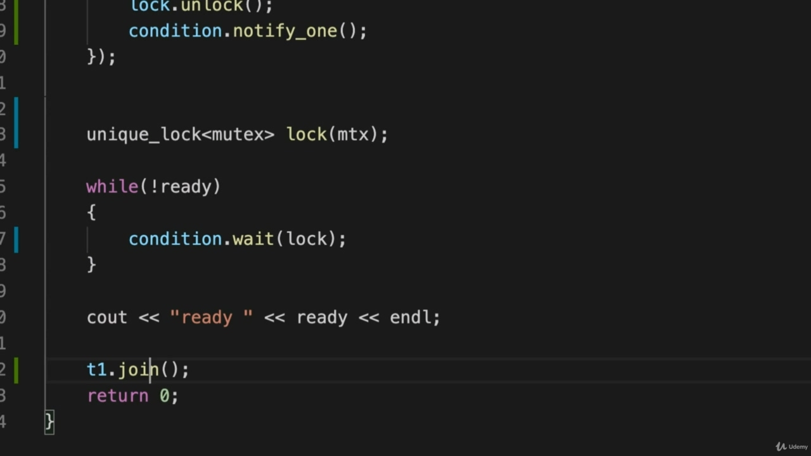

And I need to I need a semicolon there. OK, let's take this joint and move it to the end here so that that doesn't kind of confuse what we're

> 我需要一个分号。好吧，让我们把这个关节移到这里的末端，这样就不会混淆我们是什么了

## img - 423000

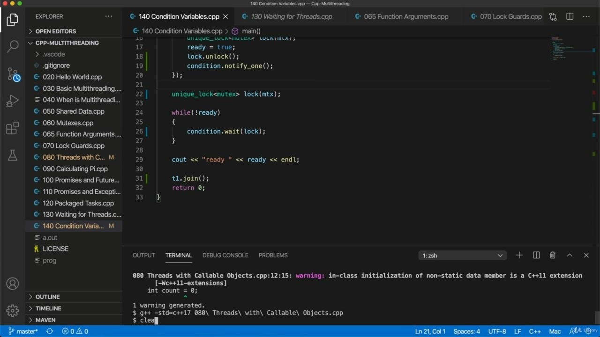

OK, let's take this joint and move it to the end here so that that doesn't kind of confuse what we're doing now. Hopefully I've got this right. I'm going to try compiling it and we'll see what it does.

> 好的，让我们把这个关节移到这里的末端，这样就不会混淆我们现在正在做的事情。希望我做得对。我将尝试编译它，我们将看看它做什么。

## img - 429220

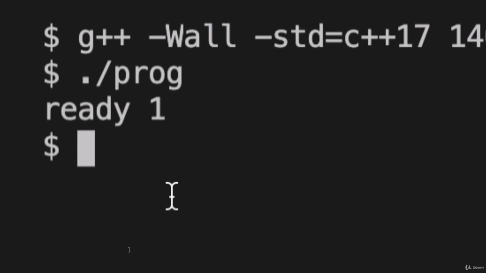

I'm going to try compiling it and we'll see what it does. So. C++ and stern warnings on standard equals C++ 17 and let's run this and compile it to. Prog and then run prog, and we see that it waits and after two seconds or however much time I've made

> 我将尝试编译它，我们将看看它做什么。因此，标准上的.C++和严厉警告等于 C++17，让我们运行它并将其编译为.Prog，然后运行 Prog，我们看到它在等待两秒后，或者无论我花了多少时间

## img - 451450

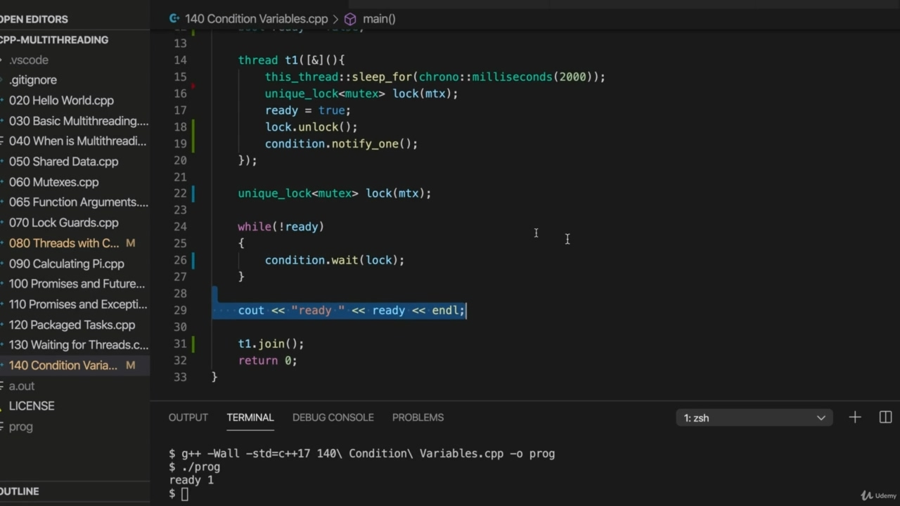

Prog and then run prog, and we see that it waits and after two seconds or however much time I've made the thread, wait for it, says Ready one. So how does this work? Well. So we've got this thread here and this this is sleeping for two seconds, after two seconds, it's going to try to get a lock. So if it can't get a lock at that point, it's just going to wait until it can get the lock. When it does get the lock, it says ready equals true and then it unlocks the lock. And after unlocking the lock, it notifies using the condition waiting threads or that it can that they can wake up. And in this case, we've got one waiting thread. So we use notify one, we use notify one whenever we intend to wake up one waiting thread. And the important point here is that we've unlocked the lock. So when we call condition notify one, we're saying, look, I've released the lock now so you can get it and do whatever you were going to do. We were saying that to the waiting thread. And it's also important that we modify this variable, the one that we're interested in here, or the shared resource or whatever. We modify it within a critical section. Otherwise, you can't be sure that it's going to have a kind of state that appears to other threads and in the thread that we want to wait. So we get a log and here's the kind of really interesting bit. So we check to see if ready is true and if it's not true yet or if the resource is not ready. You know, if the vector that we're checking doesn't have a size that we want or whatever it is that we're waiting for, then we do conditioning. Wait, and that actually releases the lock is going to release this lock associated with this mutex so condition. But wait releases the lock, meaning this thread up here can then get the lock and it can proceed and do its stuff, which is just as well, because in this particular program we're getting this lock first because of this time delay here. So this will actually release the lock and it will wait at that point and wait won't return until some other threat calls, condition dot notify either notify one or notify all at that point wait returns. And at that point we should always check to see if the resource that we are waiting for is now in the state that we want it to be. So when condition returns, this thread, the main thread in this case actually gets the lock back again. So here it it acquired the lock, the main thread acquired the lock. Here it relinquishes the lock and ways when notify one is called it wait returns and this requires the lock. Then it checks to see if things are now as we want them to be. We should always put that check in if they're if they aren't on. So if in this case if redis false, we'll just wait again. But if things are okay, so if readiest true it will then proceed and we output the value of ready. So we'll do a bit more stuff with this.

> “Prog，然后运行 Prog，我们看到它在等待，两秒钟后，无论我做了多少时间，都要等待它，”Readyone 说道。那么这是如何工作的呢？好所以我们这里有一个线程，这个线程休眠两秒，两秒后，它将尝试获得一个锁。所以，如果它在那一点上不能得到锁，它只需要等到它可以得到锁。当它得到锁时，它会说 ready 等于 true，然后解锁锁。在解锁锁后，它会使用条件等待线程通知它们可以唤醒。在这种情况下，我们有一个等待线程。所以我们使用 notify one，每当我们想要唤醒一个等待线程时，我们都使用 notify。这里重要的一点是我们已经打开了锁。所以当我们调用条件通知时，我们会说，听着，我现在已经释放了锁，这样你就可以得到它，做你想做的任何事情。同样重要的是，我们修改这个变量，我们在这里感兴趣的变量，或者共享资源或其他任何变量。我们在关键部分对其进行修改。否则，您无法确定它是否会有一种状态出现在其他线程和我们希望等待的线程中。所以我们得到了一个日志，这是非常有趣的一点。因此，我们检查 ready 是否为真，是否还不为真，或者资源是否未就绪。你知道，如果我们正在检查的向量没有我们想要的大小或我们正在等待的任何大小，那么我们就进行条件调节。等待，这实际上释放了锁，将释放与此互斥锁相关联的锁。但是 wait 会释放锁，这意味着这里的线程可以获得锁，它可以继续并完成它的工作，这也是一样的，因为在这个特定的程序中，我们首先获得这个锁，因为这里的时间延迟。因此，这实际上会释放锁，它将在该点等待，直到其他威胁调用返回，条件点通知在该点通知一个或通知所有等待返回。在这一点上，我们应该始终检查我们正在等待的资源是否处于我们希望的状态。因此，当条件返回时，这个线程，在这种情况下，主线程实际上会再次获得锁。所以在这里它获得了锁，主线程获得了锁。在这里，它放弃了锁，当通知被调用时，等待返回，这需要锁。然后它会检查事情现在是否如我们所希望的那样。如果它们没有打开，我们应该始终进行检查。所以如果在这种情况下 redis 为 false，我们将再次等待。但如果一切正常，那么如果 readest 为真，那么它将继续，我们输出 ready 的值。所以我们会做更多的事情。

## img - 814380

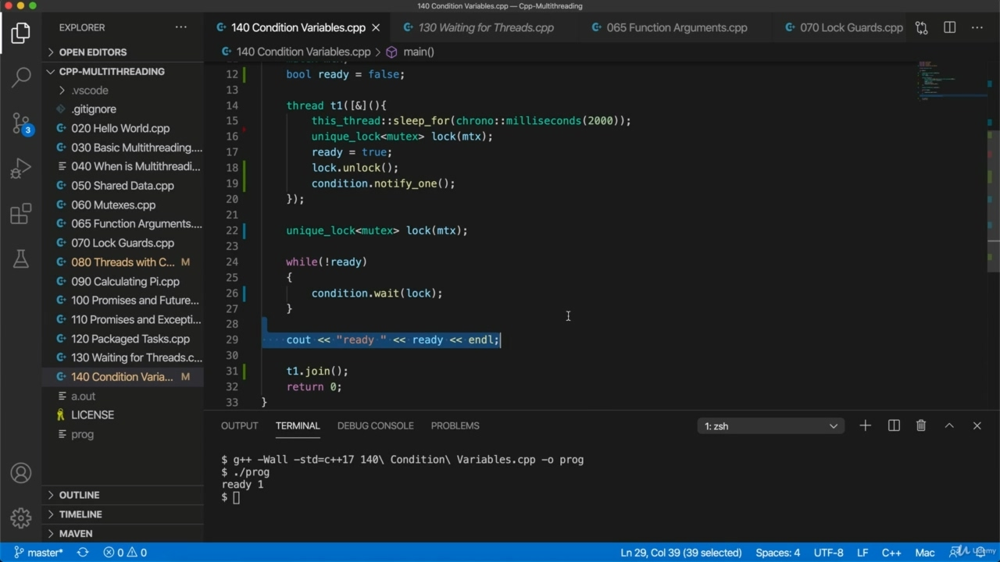

So we'll do a bit more stuff with this. But I would probably recommend trying out this program, type it out and try to make sure that you understand how it works.

> 所以我们会做更多的事情。但我可能会建议您试用这个程序，键入它，并确保您了解它的工作原理。

## img - 831300

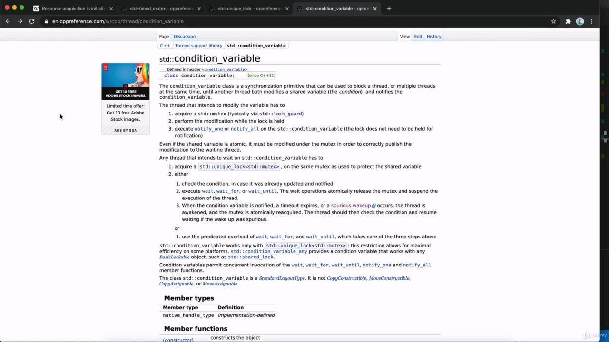

You can experiment with it, put more sort of scouts in or whatever you like. I will look at it just a little bit more in the next video, actually. And I'm also going to show you how to implement a producer consumer pattern using conditions. But conditions are basically a mechanism for signaling between threats and also the there's a reference page, for example, CP reference dot com on condition variable.

> 你可以用它做实验，加入更多类型的侦察兵，或者你喜欢的任何东西。实际上，我会在下一个视频中再看一点。我还将向您展示如何使用条件实现生产者-消费者模式。但条件基本上是一种在威胁之间发出信号的机制，而且还有一个参考页面，例如，条件变量上的 CP 参考点 com。

## img - 854820

page, for example, CP reference dot com on condition variable. And that lists what what these kind of two sides of condition variable. Do you know, we've got a weighting side and we've got the signalling side. And although you can combine the two of us, we will see. But it's important to understand all this stuff about weight, releasing the lock, for example, you know, in the fact that you've got to unlock before you call notifies. That was also an important point.

> 页面，例如，条件变量上的 CP 参考点 com。这列出了条件变量的两个方面。你知道吗，我们有加权的一面，我们有信号的一面。尽管你可以把我们两个结合起来，我们拭目以待。但重要的是要了解所有这些关于重量的东西，例如，你知道，在你打电话通知之前，你必须解锁。这也是一个重要的问题。

## img - 924370

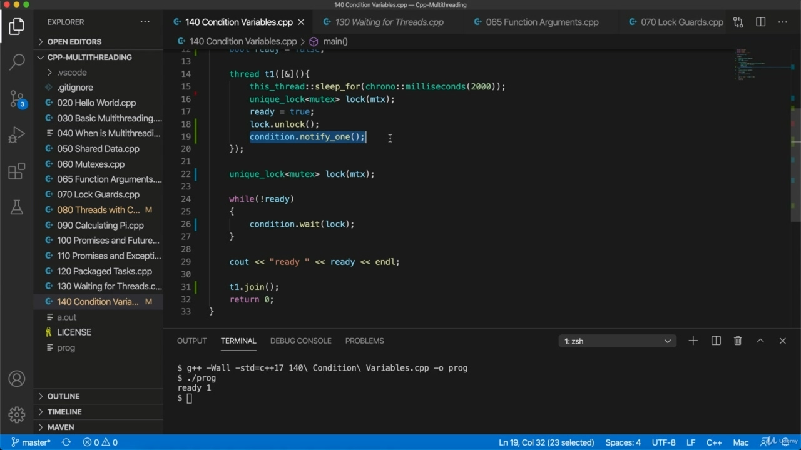
