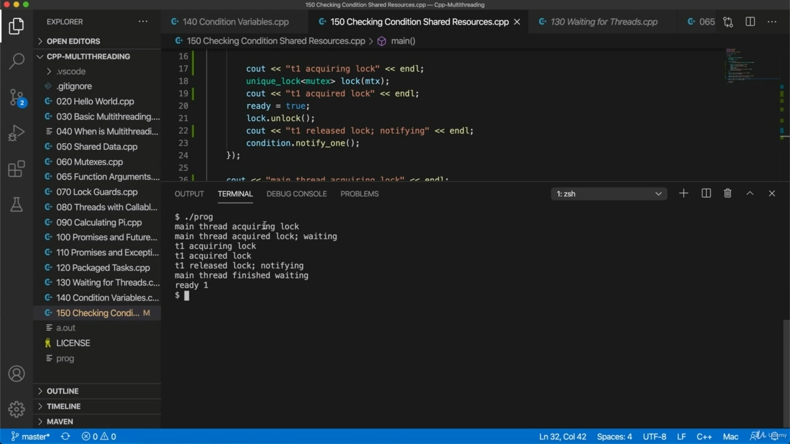

Hello, in this video, I'm going to show you just a nice little thing we can do with condition variables. And also I'm going to just go through this just a little bit more as well. So here we've got this loop where we need to keep checking to see if the resource that we are waiting

> 你好，在这个视频中，我将向你展示一个我们可以用条件变量做的小事情。我还要再多讲一遍。所以这里我们有一个循环，我们需要不断检查，看看我们正在等待的资源

## img - 19840

So here we've got this loop where we need to keep checking to see if the resource that we are waiting for is in the state that we are waiting for or not. We do need to check that, especially since we've got these things called a spurious wake up. I think the reference page here calls it. Does it call it like a wake up? Spurious. Yes, spurious wake up can occur for various reasons.

> 所以这里我们有一个循环，我们需要不断检查，看看我们等待的资源是否处于我们等待的状态。我们确实需要检查这一点，特别是因为我们有这些被称为虚假唤醒的东西。我想这里的参考页面称之为“唤醒”？虚假的是的，由于各种原因可能会出现虚假唤醒。

## img - 44150

Yes, spurious wake up can occur for various reasons. So in other words, when a threat calls some and notify and thereby wakes up another thread that's waiting, causing weight to return and the other threat to reacquire the lock, then you don't want to just assume that the resource you're waiting for is now in the state that. That you're waiting for it to be in, you should kind of take it as your cue to check that resource again. And as soon as you are going to wait, of course, if we if we have to go into wait again, that's fine. It would just relinquish the lock again temporarily until it returns. So you should always check in because you shouldn't assume that just because a waiting thread is woken up that that it's woken up for definitely the right reasons. You know, you shouldn't rely on this other thread to tell you the truth. And in fact, so it will be nice if we had some quick way of implementing this loop. And in fact, we do. This is a really nice thing that's that's found in C++.

> 是的，由于各种原因可能会出现虚假唤醒。换言之，当一个威胁调用一些并通知，从而唤醒另一个正在等待的线程，导致权重返回，而另一个威胁重新获取锁时，您不希望仅仅假设您正在等待的资源现在处于该状态。如果你在等待它的出现，你应该把它当作你再次检查资源的提示。当然，一旦你要等待，如果我们不得不再次等待，那就好了。它只是暂时再次释放锁，直到它返回。因此，您应该始终签入，因为您不应该仅仅因为一个等待线程被唤醒就认为它被唤醒的原因肯定是正确的。你知道，你不应该依靠这条线索告诉你真相。事实上，如果我们有一些快速的方法来实现这个循环，那将是很好的。事实上，我们做到了。这是一个在 C++中发现的非常好的东西。

## img - 155420

This is a really nice thing that's that's found in C++. Let's get rid of this loop. And instead of having that loop, what we can do is this the second argument that we can supply to wait, we could use this is a predicate we could use a lunder expression for this, for example. So let's put in cutch parameter code block brackets and so this can return, true or false.

> 这是一个非常好的东西，可以在 C++中找到。让我们摆脱这个循环。我们可以做的是，这是我们可以提供给等待的第二个参数，我们可以使用这是一个谓词，我们可以为此使用 lunder 表达式。所以，让我们放入 cutch 参数代码块括号，这样可以返回 true 或 false。

## img - 219330

So let's put in cutch parameter code block brackets and so this can return, true or false. So it can return true if the shared resources that the the locks are protecting, if they're now in the state, well, that means that we want to proceed rather than to go back to waiting again. So in this case, we just got a boolean variable. And the thing is, we just want that to be true. If that's true, then we really can't finish waiting and we can carry on. So here I can just say return ready.

> 所以，让我们放入 cutch 参数代码块括号，这样可以返回 true 或 false。所以，如果锁正在保护的共享资源，如果它们现在处于状态，那么，这意味着我们希望继续，而不是再次返回等待。所以在这个例子中，我们得到了一个布尔变量。问题是，我们只希望这是真的。如果这是真的，那么我们真的无法完成等待，我们可以继续。所以在这里我只能说准备好了。

## img - 256660

And I should cut ready? So this this is just got to return, true or false, in other words, and if you return true, you're saying yes, OK, we really can't finish waiting. If you if you return false, you're saying, no, we need to go back into the weight again. So this is the same as having that loop that we had before. It's just a bit kind of a bit like more elegant, basically. Let's just compile this and run it. And one thing that I wanted to do was just to go through this a little bit more, although I think maybe you already feel comfortable with it. And if not, then you probably won't want to type out yourself and experiment a little bit. But we could put some stuff in here to make you a bit clearer. Like we could say, like see out here, let's call this thread one.

> 我应该切好了吗？所以这只是要返回，真或假，换句话说，如果你返回真，你会说是的，好的，我们真的无法完成等待。如果你返回错误，你是说，不，我们需要重新计算重量。所以这和我们之前的循环是一样的。基本上，这有点像更优雅。让我们编译这个并运行它。我想做的一件事就是多读一点，尽管我想也许你已经对它感到很舒服了。如果没有，那么你可能不想自己打字并做一点实验。但我们可以在这里放些东西让你更清楚一点。就像我们可以说的，看这里，让我们把这个线程称为一。

## img - 352090

Like we could say, like see out here, let's call this thread one. Thread. Well, let's call it Taiwan, actually, Taiwan acquiring LOKKE. And let's have a few more of these. So after it's acquired the lock, let's say acquired lock and after it's unlocked T1. Released.

> 就像我们可以说的，看这里，让我们把这个线程称为一。线好吧，我们称之为台湾，实际上，台湾收购了 LOKKE。让我们再来几个。所以，在它获得锁之后，让我们假设获得了锁，在它解锁 T1 之后。发布。

## img - 420990

Release Locke notifying. And then here we could say main thread. Main thread. Acquired like. Let's maybe have something up here that says main threat. Acquiring lock, so it's going to try to do it if it gets to here, it's actually acquired it.

> 释放 Locke 通知。然后在这里我们可以说主线。主螺纹。获得喜欢。也许我们可以在上面写一些主要威胁的东西。获取锁，所以当它到达这里时，它会尝试这样做，实际上它已经获取了锁。

## img - 446910

Acquiring lock, so it's going to try to do it if it gets to here, it's actually acquired it. And I would say waiting. And here we say main thread. Finished waiting, so I would recommend, you know, consider doing this kind of thing yourself if you're,

> 获取锁，所以如果它到达这里，它会尝试这样做，它实际上已经获取了锁。我会说等待。这里我们说主线。等完了，所以我建议，你知道，如果你，

## img - 503190

Finished waiting, so I would recommend, you know, consider doing this kind of thing yourself if you're, you know, unless you have previous experience at this kind of thing, I think it's worth doing just so you can kind of get more insight into what happens.

> 完成等待，所以我建议，你知道，如果你是，你知道的，考虑自己做这种事情，除非你以前有这种事情的经验，我认为这是值得做的，这样你就可以更深入地了解发生的事情。
