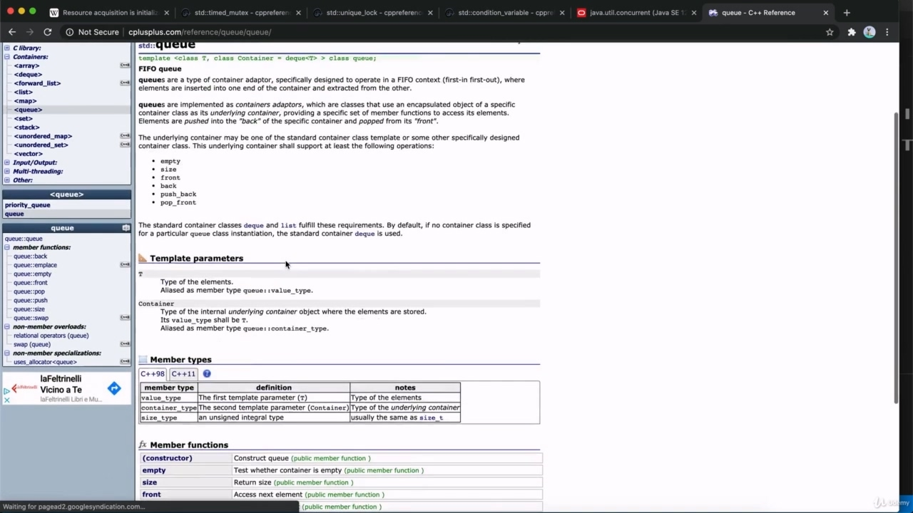
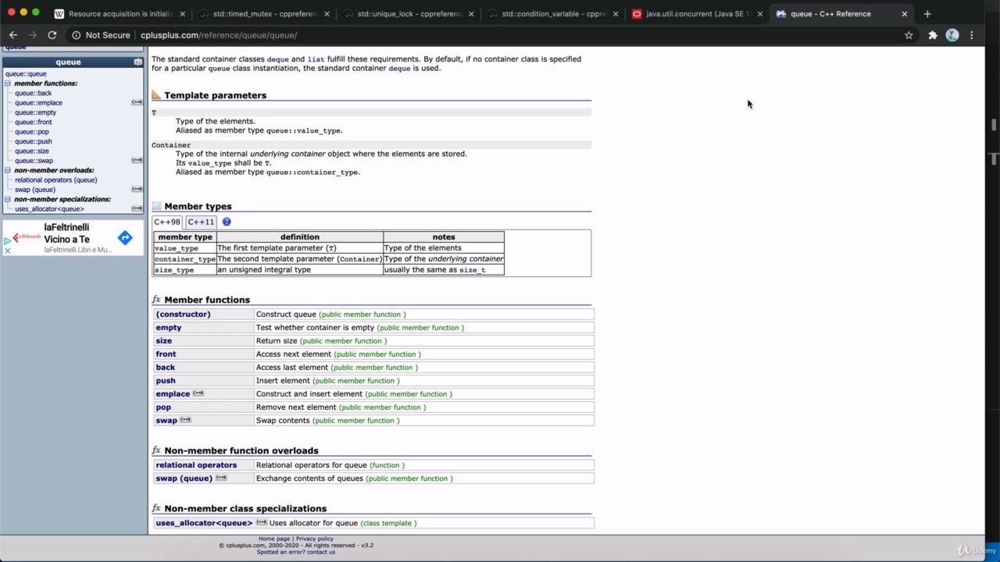
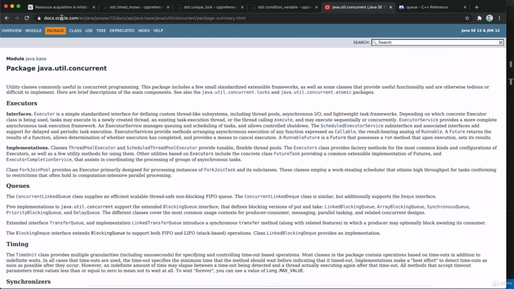
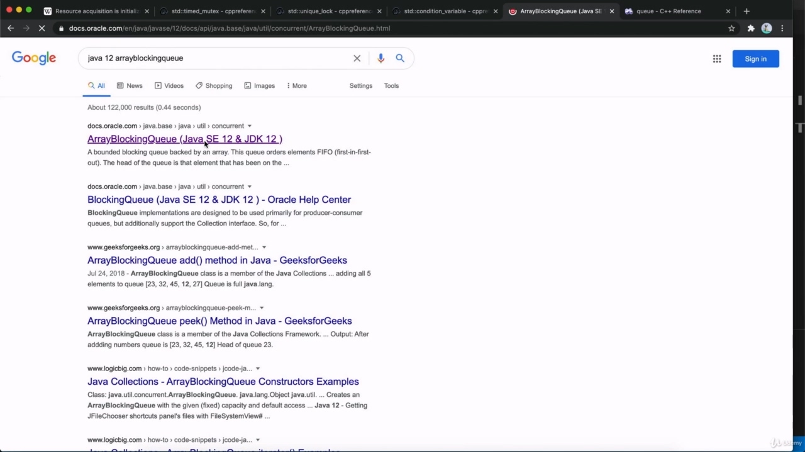
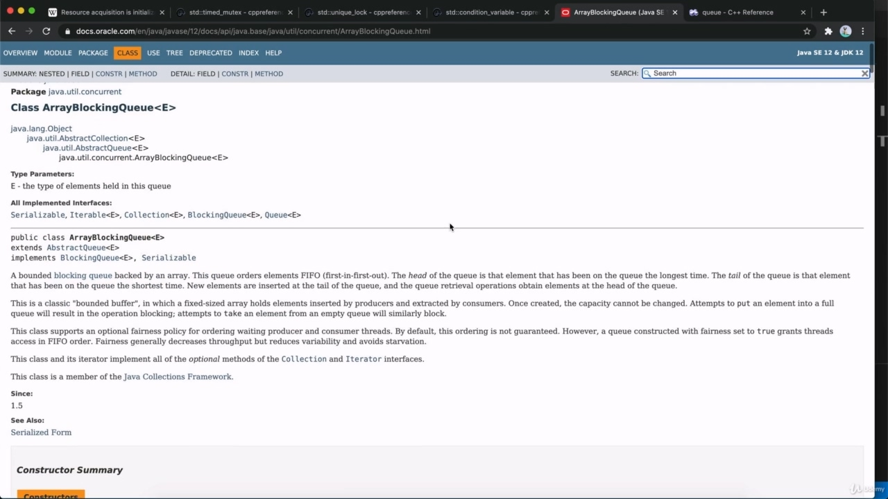
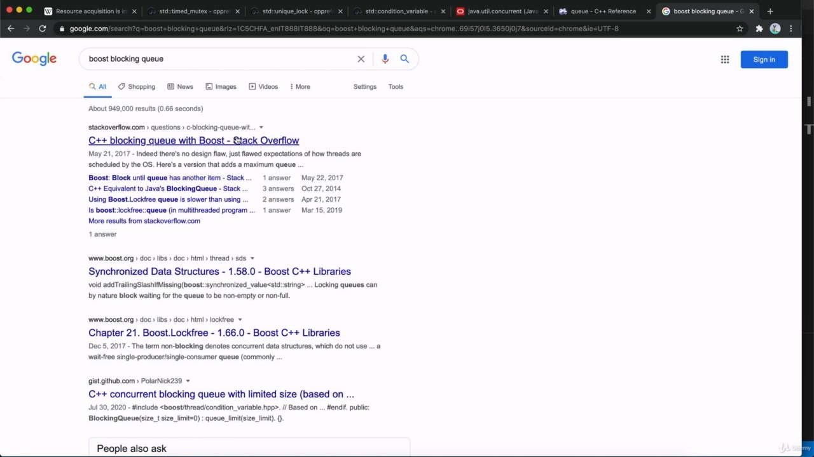
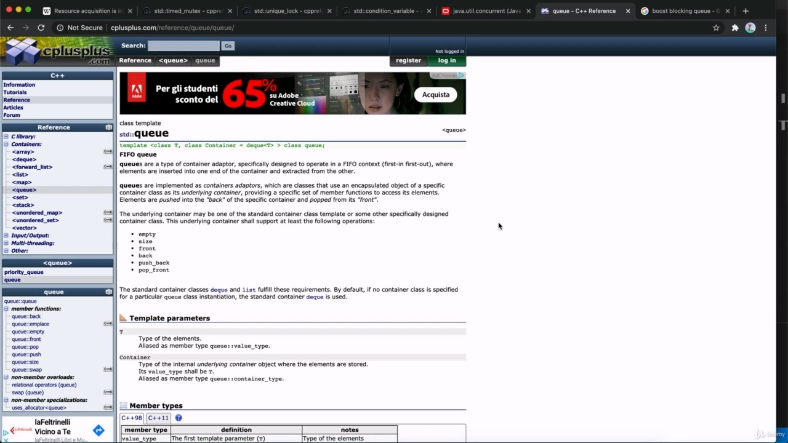
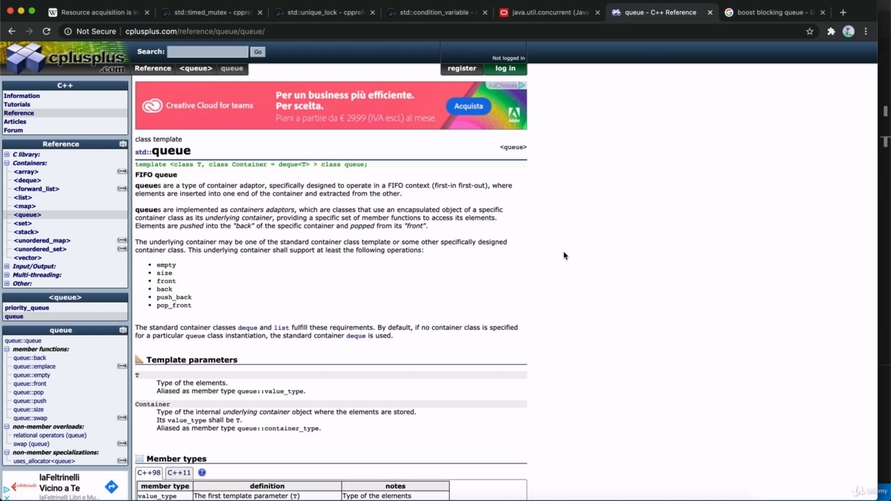

Hello, in this video, we're just going to talk a bit about cues and blocking cues, so if you know Hello, in this video, we're just going to talk a bit about cues and blocking cues, so if you know what a blocking cue is, then you don't need this video. You can skip it, go to the next one. So what is a cue for a start?

> 你好，在这段视频中，我们将谈论一些线索和阻止线索，所以如果你知道你好，在这个视频中，我将谈论一些关于线索和阻止的线索，所以，如果你知道什么是阻止线索，那么你不需要这段视频。你可以跳过它，转到下一个。那么，什么是开始的线索？

## img - 14700

So what is a cue for a start? Well, a cue is a first in, first out data structure. It's one of the fundamental structures of computer programming like linked list or something stuck. Q So. The idea of a queue is you can add items to it and you can remove items from it, and the when you remove an item, you always remove the item that's been in the queue for the longest. So this is exactly how a queue of people works. If you've got a queue of people, you can join the end of the queue, add people to the end and people can remove themselves from the front of the queue. So you can remove people from the front. And who gets to leave the queue while it's the person who's at the front of the queue? In other words, the person who's been in the queue for the longest. When you come down to it, that's the long and short of it. So you think of a queue as like a row of people, but it doesn't have to be. It could be just a crowd of people. But the point is, it's first in, first out. The person who's been there the longest is the one who gets to leave the first. That's the idea of a queue now in C++. And the standard library there is a Q class. And so as it has a method push that lets you insert elements, in other words, add elements to the

> 那么，什么是开始的线索？嗯，提示是一种先进先出的数据结构。它是计算机编程的基本结构之一，如链表或卡住的东西。问：所以。队列的想法是，你可以向其中添加项目，也可以从中删除项目。当你删除项目时，你总是会删除队列中最长的项目。所以这正是排队的人的工作方式。如果你有一个排队的人，你可以加入队列的末尾，将人添加到末尾，人们可以将自己从队列的前面移除。所以你可以把人从前面移走。当排在队伍前面的人是谁时，谁可以离开队伍？换句话说，排队时间最长的人。当你归结到这一点时，这是长短不一的。所以你认为排队就像一排人，但不一定是。它可能只是一群人。但重点是，它是先进先出的。在那里呆得最久的人是第一个离开的人。这就是 C++中队列的概念。标准库有一个 Q 类。因此，它有一个方法 push，允许您插入元素，换句话说，将元素添加到

## img - 140000

And so as it has a method push that lets you insert elements, in other words, add elements to the end of the queue as a mythical front, which lets you access the element at the front of the queue, the one that you would remove if you going to remove one and separate different is a method called pop, which removes the element at the front of the queue. So in some languages you're able to find front and pop combined or in, you know, APIs that you're using in C++. Other than other than this one, you might find those two combined. So in other words, typically, quite often you'd have a method for pushing or adding to the end of the queue and you'd have a method for popping or removing and simultaneously returning the item at the front of the queue. And actually, Java has a has a really well implemented collection of kind of data structures like this

> 因此，它有一个方法 push，允许您插入元素，换句话说，将元素添加到队列的末尾，作为一个虚构的前端，允许您访问队列前端的元素，如果您要删除一个元素并分离不同的元素，则会删除一个名为 pop 的方法，它会删除队列前端的该元素。因此，在某些语言中，您可以找到前端和弹出组合，或者在 C++中使用的 API 中。除了这一个，你可能会发现这两个结合在一起。换言之，通常情况下，您会有一种方法将项目推送到或添加到队列的末尾，而您会有方法弹出或删除并同时返回队列前端的项目。实际上，Java 有一个非常好实现的数据结构集合，如

## img - 239110

And actually, Java has a has a really well implemented collection of kind of data structures like this and including a set that are used for multi threading because, well, we are going to be implementing is a blocking queue and what is a blocking queue. And in fact, Java has a blocking queue. If you look at if you look at something like Java, whatever the latest version is, it's 12 at the

> 实际上，Java 有一个非常好实现的数据结构集合，包括一个用于多线程的集合，因为我们要实现的是一个阻塞队列，什么是阻塞队列。事实上，Java 有一个阻塞队列。如果你看看像 Java 这样的东西，无论最新版本是什么

## img - 257800

If you look at if you look at something like Java, whatever the latest version is, it's 12 at the moment, an array blocking queue. Then you can read about it there.

> 如果你看一下像 Java 这样的东西，不管最新版本是什么，目前是 12 个，一个数组阻塞队列。然后你可以在那里读到它。

## img - 305950

Then you can read about it there. We're going to be implementing something like this now.

> 然后你可以在那里读到它。我们现在将实施类似的操作。

## img - 308680

We're going to be implementing something like this now. I am aware that some C++ programmers absolutely hate Java for whatever reason and vice versa. Some Java programmers hate C++. But bear with me here, because my point is not to get you into Java. It is simply to say that Java has a really well implemented collection of high level, multi threading classes. So if you look at baret blocking queue, that's not a bad read, really. And if you like this sort of thing and if you go to the Java util concurrent package here, you've got a bunch of high level classes written in Java, which makes them a bit simpler than they would be in C++. And these are this sort of thing that you might consider implementing yourself in C++ to tackle particular level programming tasks. Of course, there is the Boost Library for C++. So if a search for boost blocking Q.

> 我们现在将实施类似的操作。我知道有些 C++程序员出于任何原因都讨厌 Java，反之亦然。一些 Java 程序员讨厌 C++。但在这里请耐心等待，因为我的目的不是让你进入 Java。简单地说，Java 拥有一个真正实现良好的高级多线程类集合。所以，如果你看一下 baret 阻塞队列，这真的不是一个坏消息。如果你喜欢这种类型的东西，如果你在这里使用 Javautilconcurrent 包，你会得到一堆用 Java 编写的高级类，这使得它们比用 C++编写的要简单一些。这些都是您可以考虑用 C++实现自己以处理特定级别的编程任务的东西。当然，还有 C++的 Boost 库。所以如果搜索 boost blocking Q。

## img - 407490

Is there such a thing? I don't know. I don't really know boost maybe there is. I don't really like Boose that much because it blotz the size of your programs. So much so I've somehow never really managed to get into it. But it might be worth looking at what booster's for multi threading if you don't want to implement stuff yourself. But in any case, we are going to work with the standard library here and we're going to implement stuff ourselves. So the idea of a blocking queue is that you have a queue which multiple threads are going to access so you can have at least one thread, which is a producer thread. In other words, it's going to produce items which is going to add to the queue. And you have at least one thread, which is like a consumer thread. In other words, it's taking items off the queue, consuming them. And in that kind of a situation, so it's a multithreaded situation, you've got some threads adding to the queue. You've got other threads removing from the queue. What do you want to do if the queue is empty and you and thread's try to remove items from it? Well, what we do with a blocking queue is that we block, so we make that method.

> 有这样的事吗？我不知道。我真的不知道 Boose 是否存在。我不太喜欢 Boose，因为它会影响你的程序大小。如此之多，以至于我从未真正尝试过。但如果你不想自己实现这些东西，那么不妨看看多线程的助推器是什么。但无论如何，我们将在这里使用标准库，我们将自己实现这些东西。因此，阻塞队列的概念是，您有一个多个线程将要访问的队列，因此您至少可以有一个线程，这是一个生产线程。换句话说，它将产生要添加到队列中的项目。你至少有一个线程，这就像一个消费线程。换言之，它将项目从队列中移除，消耗它们。在这种情况下，这是一个多线程的情况，您已经有一些线程添加到队列中。您已经从队列中删除了其他线程。如果队列是空的，并且您和线程试图从中删除项目，您想做什么？好吧，我们对阻塞队列所做的是我们阻塞，所以我们制作了这个方法。

## img - 526830

Well, what we do with a blocking queue is that we block, so we make that method. Whatever method removes items from the queue, we make it wait before it can get items and it's got to wait for items to be added to the queue before it can remove items if the queue is empty at the start. Similarly, the queue usually has a maximum size with a blocking queue. And so the producer threads the threads that are adding items to the queue.

> 好吧，我们对阻塞队列所做的是我们阻塞，所以我们制作了这个方法。无论哪种方法从队列中移除项目，我们都会让它等待，然后才能获取项目，如果队列开始时为空，则必须等待将项目添加到队列中，然后才能移除项目。类似地，队列通常具有阻塞队列的最大大小。因此，生产者线程将项目添加到队列的线程。
