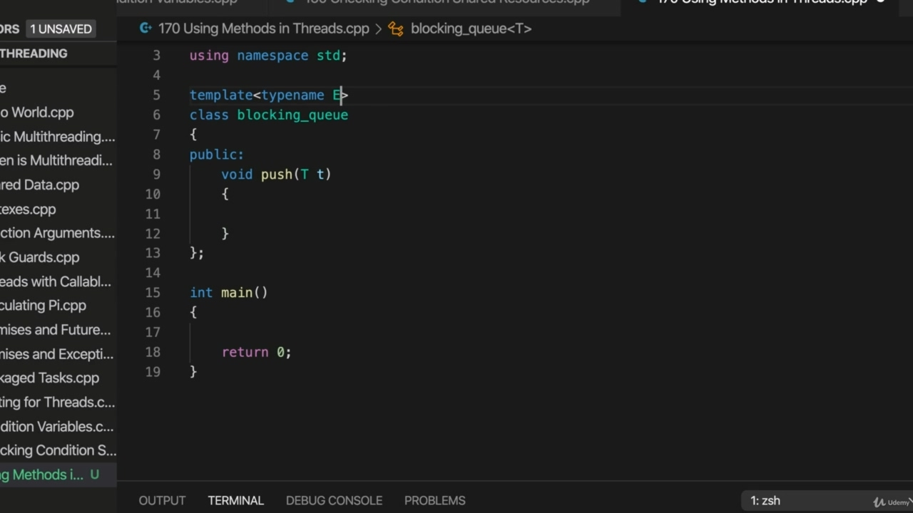
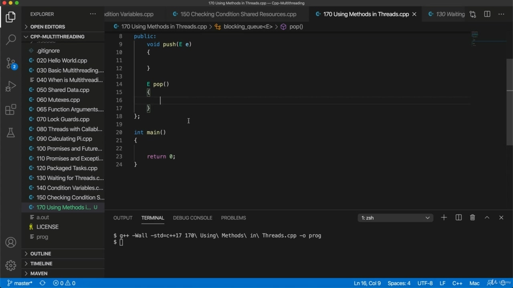
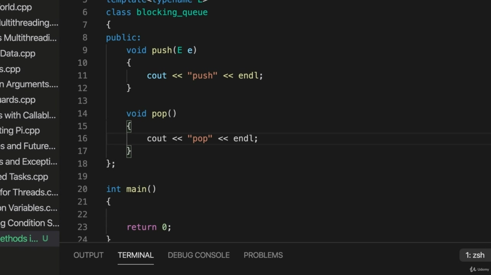
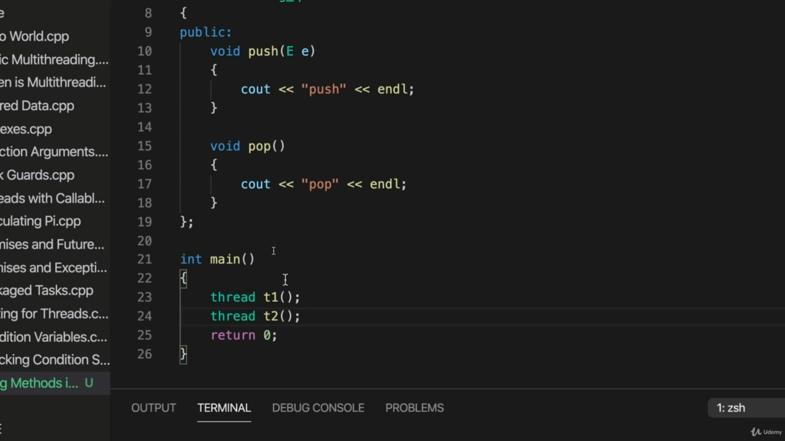
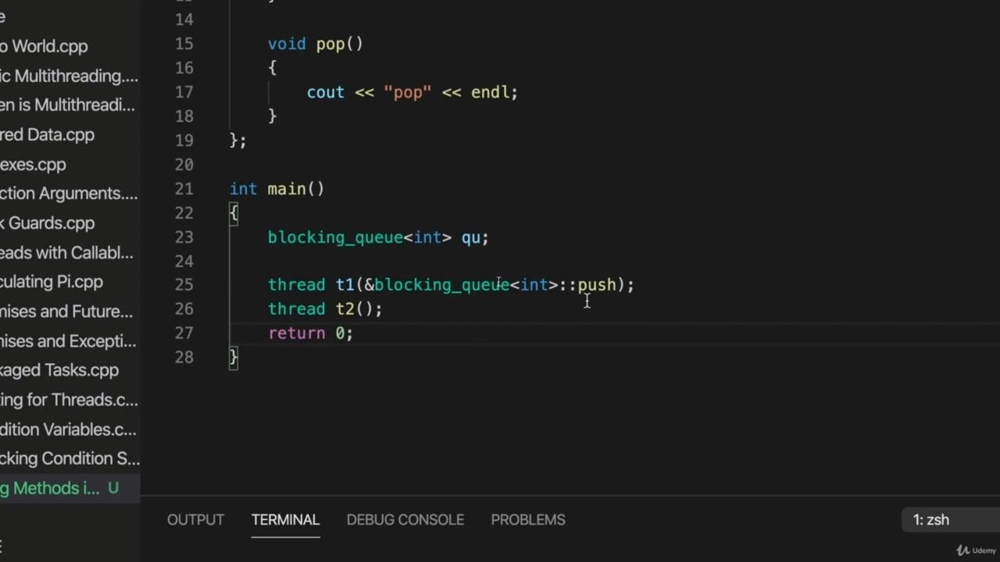
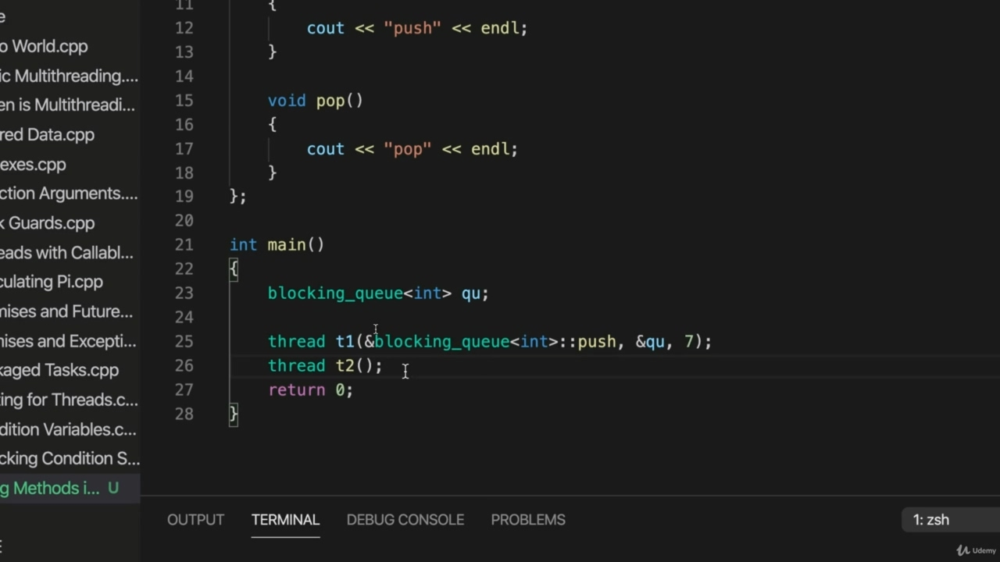
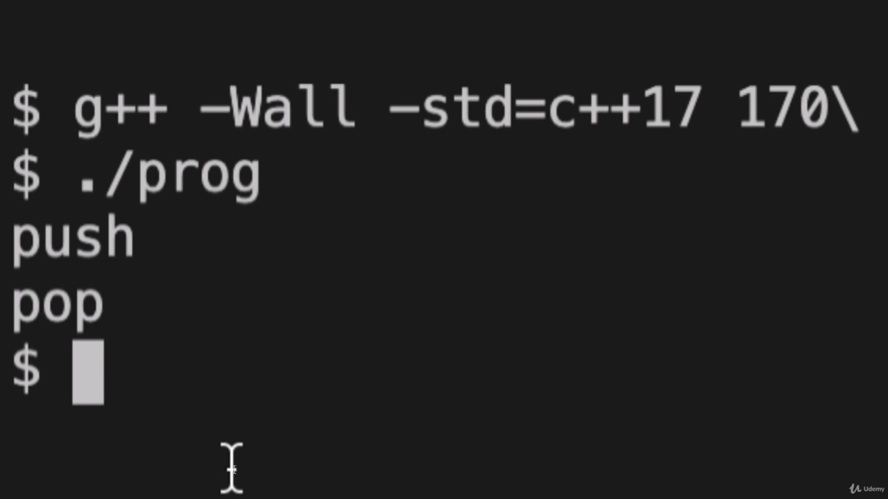
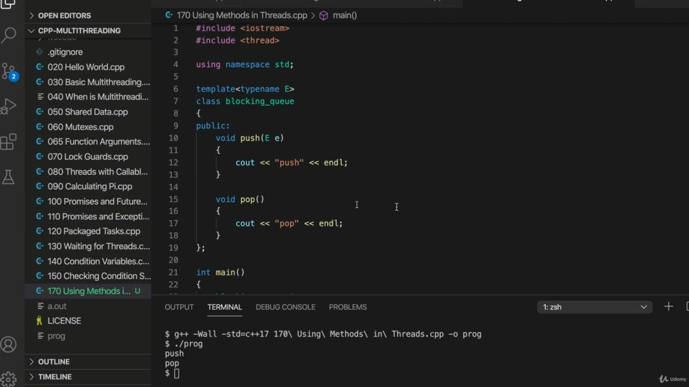
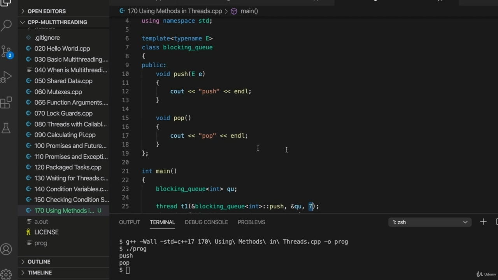

Hello, so in this video, we're going to get started on implementing a blocking queue, which is a good starting point for many multi threading sort of projects. And specifically, we're going to look at how we call methods from thread's, which is something you can work out already if you're familiar with the standard library. But we'll see how it's typically done using threads. So let's create a class here called Blocking Queue. Now, I could make this extend, I could make it a subclass of the standard library cube, but I don't want to because then I'd have to think what what I'm going to do with all the different methods of the standard library cue. And I don't want to. So I'm just going to make it use the standard library cuz I'm going to build it by, you know, I'm going to compose it using the standard library cue rather than inheriting from it.

> 大家好，在本视频中，我们将开始实现阻塞队列，这是许多多线程项目的良好起点。具体来说，我们将研究如何从线程调用方法，如果您熟悉标准库，这是您已经可以解决的问题。但我们将看到它通常是如何使用线程完成的。因此，让我们在这里创建一个名为 Blocking Queue 的类。现在，我可以进行扩展，我可以将其作为标准库立方体的子类，但我不想这样做，因为这样我就必须考虑如何使用标准库 cue 的所有不同方法。我不想这样做。所以我只想让它使用标准库，因为我要构建它，你知道，我要使用标准库提示来编写它，而不是从它继承。

## img - 108440

Okay, so we've got a class blocking cue and it's going to be a template class. So the template parameter is the type of thing that it works with, you know. So what kind of thing are we stopping in the queue, in strings, whatever it is? So I'm going to say template type name T. And let's give it a couple of public methods here. I'm going to give it a void. Push and push is going to push items of tity, whatever that is. Maybe I should call this E, actually, for Elliman, that might make more sense, let's call it a.

> 好的，我们有一个类阻塞提示，它将是一个模板类。所以模板参数就是它所使用的类型。那么，我们在队列中停留的是什么样的东西，字符串，无论是什么？所以我要说模板类型名 T。这里我们给它一些公共方法。我要给它一个空位。推一推就是推一推，不管是什么。也许我应该把这个叫做 E，实际上，对埃里曼来说，这可能更有意义，我们把它叫做 a。

## img - 143150

Maybe I should call this E, actually, for Elliman, that might make more sense, let's call it a. Okay, so push adds items to the queue, basically of Tity, and we're also going to have a A method that returns items and simultaneously removes them from the queue. So that's going to be called pop going to pop off the queue, pop items off the queue. OK. For the moment, let's leave it like that. Actually, that's OK. I'm just thinking. I probably should return something really, uh, but. Well, I think that's OK. I think they'll compile. OK, let's take a look at it. So if I try to compile this, actually. Let's see. It will compile. There we go. All right, so we've got the beginnings of a blocking cue, and what I want to do is call these two

> 也许我应该把这个叫做 E，实际上，对于 Elliman，这可能更有意义，让我们把它叫做 a。好吧，所以 push 将项目添加到队列中，基本上是 Tity 的，我们还将有一个 a 方法，它返回项目并同时从队列中删除它们。所以这将被称为弹出队列，弹出队列中的项目。好的。现在，我们就这样吧。事实上，没关系。我只是在想。我可能真的应该归还一些东西，但是。好吧，我想没关系。我想他们会编译的。好的，让我们来看看。所以如果我试图编译这个，实际上。让我们看看。它将编译。好了。好了，我们已经开始了一个拦网提示，我想做的是把这两个叫做

## img - 251810

All right, so we've got the beginnings of a blocking cue, and what I want to do is call these two methods somehow this is bothering me. It's bothering me having a return type and no return. I'm just going to I've been doing Java too long. Maybe I was going to change that to avoid temporarily. OK, and now in here, let's have a out and it's going to output some text just so that we can see that it's being called for the moment. And in here, I'm going to do see out pop. So that we can see that's been called I want to call, push and pop in separate threads, I just want

> 好了，我们已经开始了一个阻塞提示，我想做的是调用这两个方法，这让我感到困扰。我只是想，我做 Java 太久了。也许我打算改变这一点以暂时避免。好的，现在在这里，让我们有一个输出，它将输出一些文本，这样我们就可以看到它现在被调用了。在这里，我要看看流行音乐。这样我们就可以看到它被调用了，我想在单独的线程中调用、推送和弹出，我只想

## img - 325280

So that we can see that's been called I want to call, push and pop in separate threads, I just want to show you how you would do that if you want to call methods from a thread. So let's make sure that we include thread at the top here, because we are going to need it ultimately include thread. And in Maine, let's have a couple of threads of thread T1. And thread to so supposing we want to call this push method, well, we'll need an object to call it

> 因此，我们可以看到，我想在单独的线程中调用、推送和弹出，我只是想告诉你，如果你想从一个线程调用方法，你会怎么做。所以，让我们确保在这里的顶部包含线程，因为我们最终需要它包含线程。在缅因州，我们有几个线程 T1。如果我们想调用这个 push 方法，那么我们需要一个对象来调用它

## img - 354660

And thread to so supposing we want to call this push method, well, we'll need an object to call it on, so let's create a blocking cue. Now, it's not a blocking cue yet, though. We've got to still implement it. Let's make it work with, for example, integers. And I'm just going to call this I'll just call it QQQ. That'll do. So to call Poche, we type blocking. Q call on Kolon push. Actually, it's a template type, of course, so we need to put it in there. And we need I think we're going to need probably a ampersand to make sure that we get kind of pointed

> 如果我们想调用这个 push 方法，那么我们需要一个对象来调用它，所以让我们创建一个阻塞提示。但现在，这还不是一个拦网提示。我们仍然需要实现它。让我们让它与例如整数一起工作。我就把它叫做 QQQ。那就行了。所以要叫波切，我们需要输入阻塞。问：Kolon 推送。实际上，它是一个模板类型，当然，所以我们需要把它放在那里。我们需要我想我们可能需要一个安培数，以确保我们有点指向

## img - 435350

And we need I think we're going to need probably a ampersand to make sure that we get kind of pointed to that function and we need to supply also the from the address of the object that we intend to associate this with it. So we need to supply that as well. So we've got the object and the method that we want to call on that object. And since this takes push, takes an argument of type E, which in this case is and then are supplied that as well. Just here, it's seven in there just to keep it happy.

> 我们需要，我想我们可能需要一个“与”符号，以确保我们指向那个函数，我们还需要从对象的地址提供我们想要将它与之关联起来的。所以我们也需要提供这个。因此，我们得到了要调用该对象的对象和方法。因为这需要 push，所以需要一个 E 类型的参数，在这种情况下，它也是，然后也会被提供。就在这里，这里有七个，只是为了让它开心。

## img - 507390

Just here, it's seven in there just to keep it happy. And we can do the same thing with 32 except here. I once called Pop, that's called blocking Q template type and pop. And we want to call it on this method. On this object. Q. So if we compile that and run it actually, let's also wait for these threads to join, otherwise I'll get unpleasant error messages, so I'll wait for them to rejoin the main threat by terminating if they ever do. So, let's run this or compile it and run it. And you can see that we've called push and pop.

> 就在这里，这里有七个，只是为了让它开心。除了这里，我们可以用 32 做同样的事情。我曾经叫过 Pop，这叫做阻塞 Q 模板类型和 Pop。我们想在这个方法上调用它。在此对象上。Q、 所以，如果我们编译并实际运行它，让我们也等待这些线程加入，否则我会收到令人不快的错误消息，所以我会等待它们通过终止来重新加入主要威胁。所以，让我们运行这个或编译并运行它。你可以看到，我们调用了 push 和 pop。

## img - 545680

And you can see that we've called push and pop. I said it's nothing spectacular here. Another way that you could have done this is by using Binde Binde from the standard library. We could have supplied exactly these arguments to bind, just finding the kind of function pointers to these methods to objects. But instead thread allows us to pass the pointers and their associated object, the addresses, associated object and any objects as well that we need to just directly like this.

> 你可以看到，我们称之为推和弹出。我说这里没什么了不起的。另一种方法是使用标准库中的 BindeBinde。我们本来可以提供这些参数来绑定，只需要找到指向对象的这些方法的函数指针。但相反，线程允许我们传递指针及其关联对象、地址、关联对象以及我们直接需要的任何对象。

## img - 633420

