Hello, in this video, we're going to talk a bit about threat safety and we're going to take some steps towards implementing our blocking cue by creating sort of naive version of it. So there's a question here about threats, safety. If we say that a class is threat safe, we usually mean or a function could be.

> 大家好，在这段视频中，我们将讨论一点威胁安全，我们将采取一些步骤，通过创建一种天真的版本来实现我们的阻止提示。所以这里有一个关于威胁和安全的问题。如果我们说一个类是威胁安全的，我们通常是指或一个函数可能是。

## img - 21390

If we say that a class is threat safe, we usually mean or a function could be. Threats say we usually mean that those things can be used by multiple threats and you don't have to worry about synchronization. So the question here is, is still Kuis itself threats say for all the containers in the standard template library, a thread safe.

> 如果我们说一个类是威胁安全的，我们通常指的是或者一个函数可以是。威胁说我们通常指这些东西可以被多个威胁使用，你不必担心同步。所以这里的问题是，对于标准模板库中的所有容器来说，Kuis 本身的威胁仍然是线程安全的。

## img - 46440

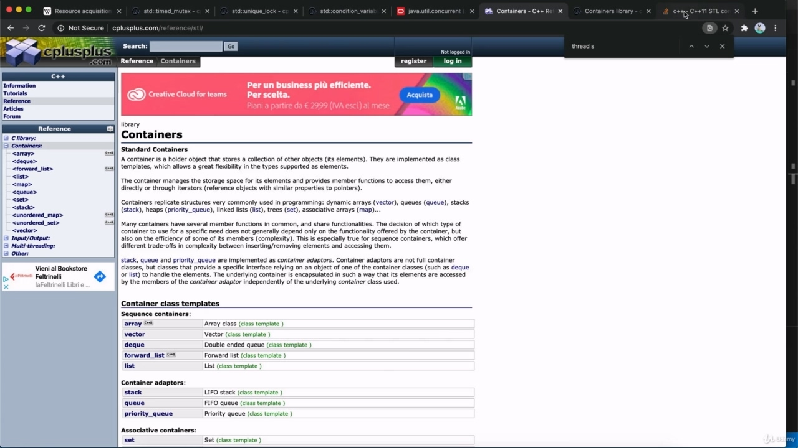

## img - 46440

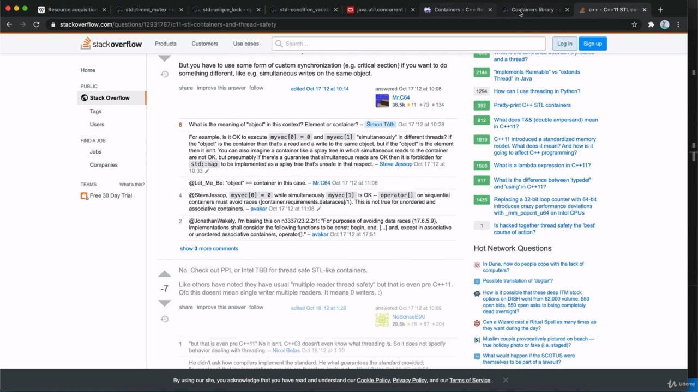

And the answer is, well, it depends what you mean by threat, safe as far as I can see.

> 答案是，嗯，这取决于你所说的威胁，在我看来是安全的。

## img - 46440

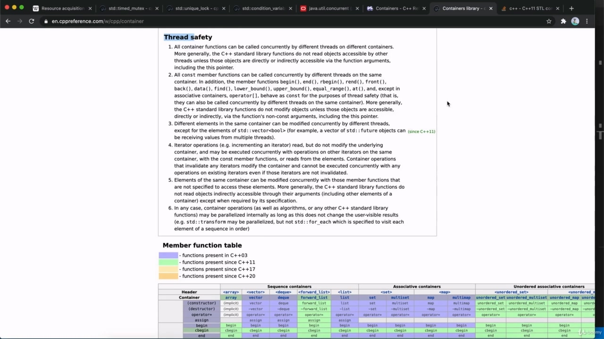

And the answer is, well, it depends what you mean by threat, safe as far as I can see.

> 答案是，嗯，这取决于你所说的威胁，在我看来是安全的。

## img - 53490

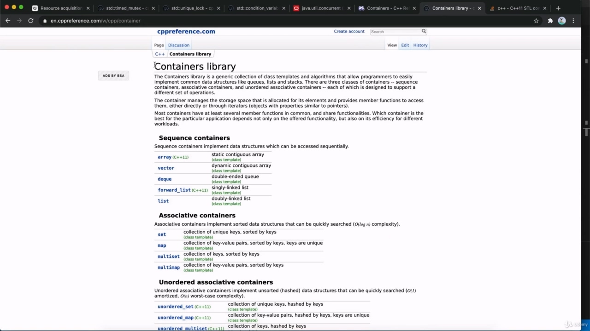

So if you look at this page on CP reference, for example, on the Containers Library, it's got some

> 因此，如果您查看 CP 参考上的这个页面，例如，在 Containers Library 上，它有一些

## img - 53490

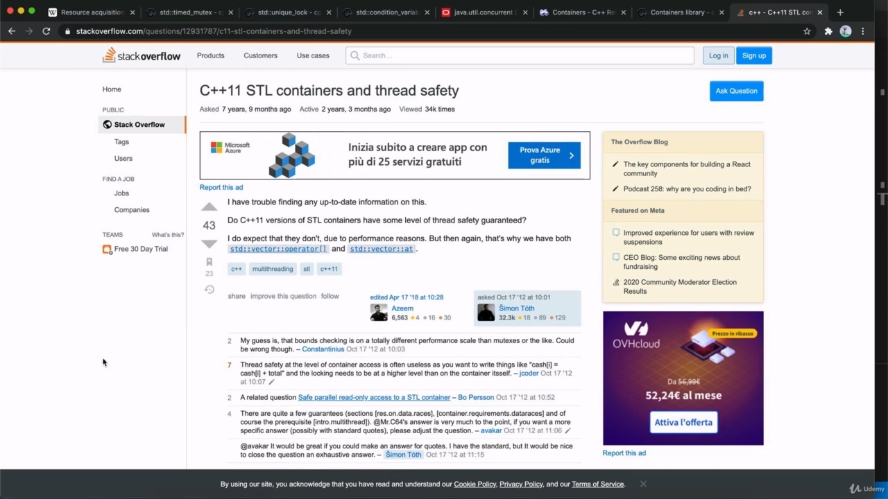

So if you look at this page on CP reference, for example, on the Containers Library, it's got some information about threats, safety, and we see that the standard containers are threats, safe to a point, but then looking at stack overflow, searching for a steel containers and threats, safety or

> 因此，如果您查看 CP 参考的这一页，例如，在 Containers Library 上，它提供了一些关于威胁、安全的信息，我们看到标准容器是威胁，在某种程度上是安全的，但然后查看堆栈溢出，搜索钢容器和威胁、安全或

## img - 107290

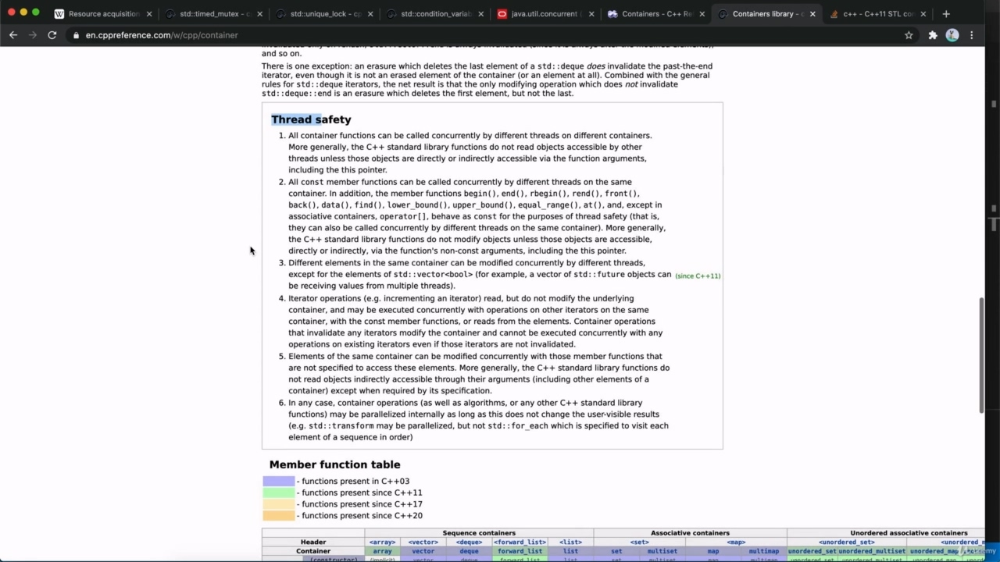

point, but then looking at stack overflow, searching for a steel containers and threats, safety or something like that, I find that well, it doesn't seem as though they can really be called threats safe in a completely unqualified way. If we have multiple threats trying to do something with the same object, then maybe it won't work, you know? So I think what we should do here anyway is I would say, well, it's probably best to do in general if you are accessing containers from multiple threads is putting some synchronization yourself. Others may disagree with that, but I would say either air on the side of caution or else read this documentation very, very, very carefully. And since I don't like reading documentation in enormous detail, I'd rather just put in the synchronization,

> 但是，然后看看堆栈溢出，搜索一个钢容器和威胁，安全或类似的东西，我发现，好吧，似乎它们真的不能以完全不合格的方式称为威胁安全。如果我们有多个威胁试图用同一个对象做某事，那么它可能不会起作用，你知道吗？所以我认为无论如何，我们应该在这里做的是，如果您从多个线程访问容器，那么通常最好是自己进行一些同步。其他人可能不同意这一点，但我想说的是，要么保持警惕，要么非常、非常、非常仔细地阅读本文档。由于我不喜欢阅读大量详细的文档，所以我宁愿只进行同步，

## img - 157600

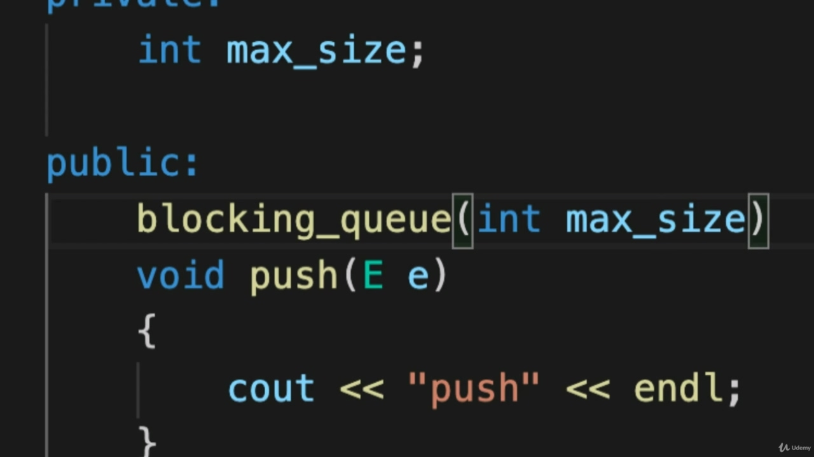

And since I don't like reading documentation in enormous detail, I'd rather just put in the synchronization, quite honestly, than you're safe. Whatever you do, you know how they're going to behave. So anyway, it's also the case that with a with a blocking view, if we want to be able to try to remove more elements from AQ even when there aren't any in it, and we want that function just to block and the same, if we try to add more elements than the maximum size of the cube. And these features may be difficult to obtain in just kind of standard C++, but we'll use I mean, you know, using the standard template library by itself without extra threads, thread related stuff. So if you look at here, we can actually use this and it has many of the methods that we need. So I could create a class that inherits from this. I could subclass this, but because I don't want to bother with worrying about all the different methods that it has and whether I should expose them or not, I'm going to create a class that just uses the kind of standard template. Q So let's go ahead and do that. So we've got blocking. Q Here, I'm going to give it a private section and let's let's give it a like a size. So I'm going to have int max size and we should initialize that from a constructor so I'll give it a constructor here. So that's going to be called blocking. Q. And it's going to accept anent max size.

> 而且，由于我不喜欢阅读大量详细的文档，所以我宁愿非常诚实地进行同步，而不是确保您的安全。无论你做什么，你都知道他们会怎么做。因此，无论如何，对于具有阻塞视图的，如果我们希望能够尝试从 AQ 中删除更多的元素，即使在 AQ 中没有任何元素的情况下，如果我们尝试添加的元素超过立方体的最大大小，那么我们也希望该函数只阻塞和相同的元素。这些特性可能很难在标准 C++中获得，但我们将使用我的意思是，你知道，使用标准模板库本身，而不需要额外的线程和线程相关的东西。所以如果你看这里，我们实际上可以使用它，它有很多我们需要的方法。所以我可以创建一个继承自此的类。我可以将其子类化，但因为我不想担心它具有的所有不同方法，以及我是否应该公开它们，所以我将创建一个只使用标准模板的类。Q 那么让我们继续做吧。所以我们遇到了阻碍。问：在这里，我将给它一个私人部分，让我们给它一种大小。所以我将有 int max 大小，我们应该从构造函数初始化它，所以我将在这里给它一个构造函数。所以这将被称为阻塞。Q、 它将接受一个最大尺寸。

## img - 350070

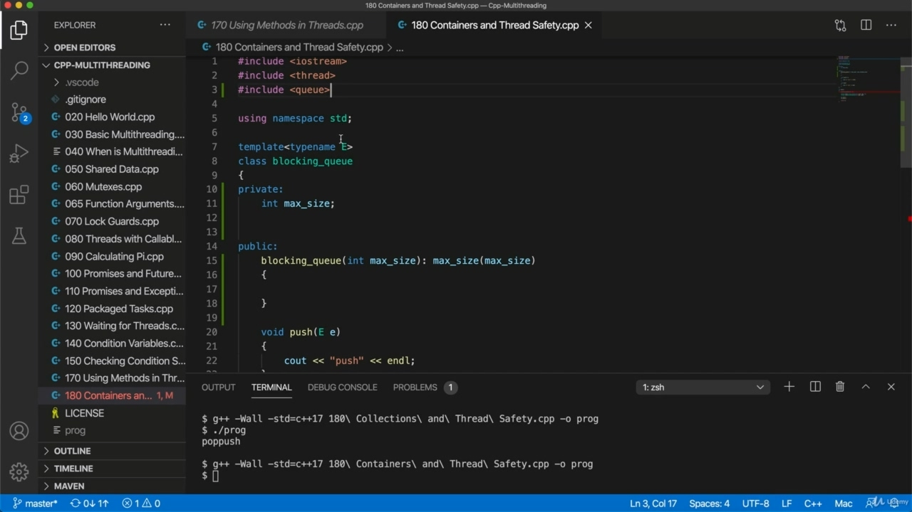

And it's going to use that to initialize the member variables, so in the initialization list here, I'm going to put size brackets max size to initialize the member variable with the parameter that I'm going to be passing in. So we also want a Q member variable, so let's have a Q in fact, I need to include it at the top here. So I'm going to include include Q and I am using namespace standard, so I don't need to prefix things

> 它将使用它来初始化成员变量，所以在这里的初始化列表中，我将放置大小括号 max size，用我要传递的参数初始化成员变量。所以我们还需要一个 Q 成员变量，因此我们有一个 Q，事实上，我需要在这里的顶部包含它。所以我将包括 include Q，并且我使用的是命名空间标准，所以我不需要为它们加前缀

## img - 420850

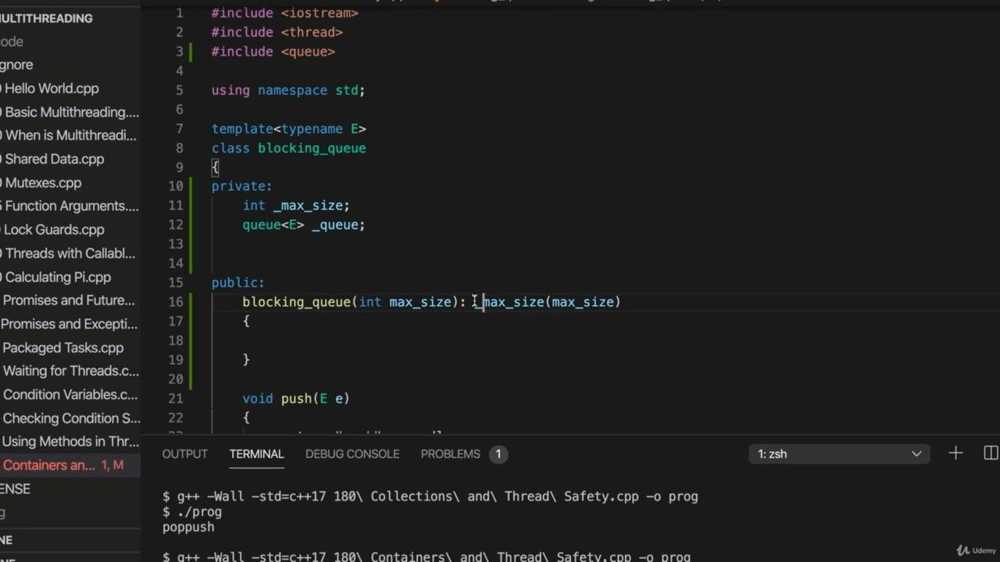

So I'm going to include include Q and I am using namespace standard, so I don't need to prefix things with standard, although if I wanted this to be reusable, really, I should want to keep the code clear here. I won't I won't bother. So let's hear do create a Q. Which is going to hold tight to whatever type is and will call that. Well, what should we call it? We could let's call it queue. I could just call it. It would actually work, at least with my implementation. C++, you see that I've been using class names as variable names. It doesn't seem to have a problem with that. I don't know if any version of C++ does, but I'll give it just an underscore. In fact, let's give max size and underscore as well to emphasize that it's a member variable. So we need to give it a on the score leading on the score there.

> 所以我将包括 include Q，并且我使用的是命名空间标准，所以我不需要用标准作为前缀，尽管如果我希望这是可重用的，真的，我应该在这里保持代码清晰。我不会，我不会打扰。所以，让我们来听听创造一个 Q，它会紧紧抓住任何类型的人，并称之为 Q。那我们该怎么称呼它呢？我们可以称之为队列。我可以称之为它。它实际上会起作用，至少在我的实现中是这样。C++，您可以看到我一直使用类名作为变量名。这似乎没什么问题。我不知道是否有任何版本的 C++会这样做，但我只给它一个下划线。事实上，让我们给出最大大小和下划线，以强调它是一个成员变量。所以我们需要在比分上领先。

## img - 511390

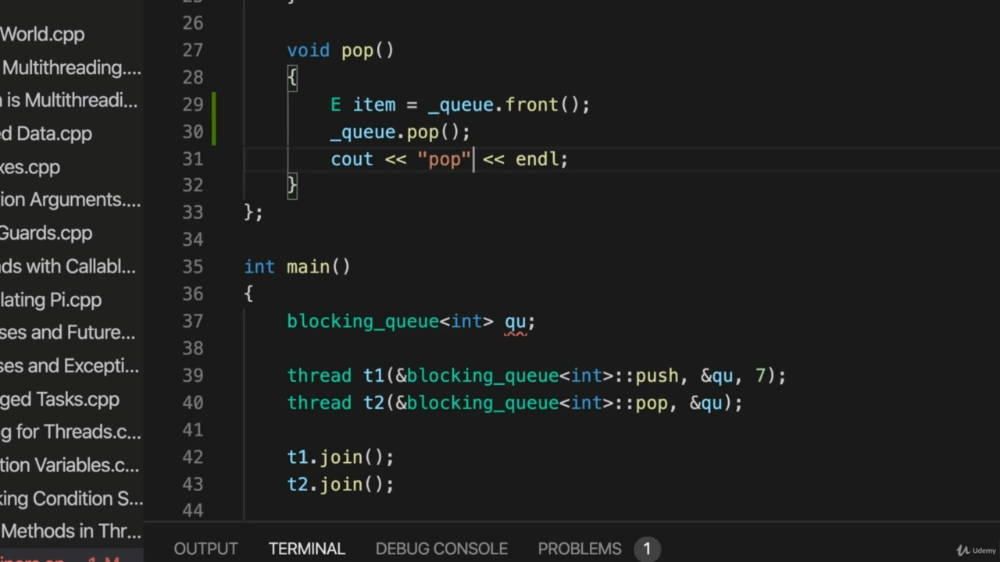

So we need to give it a on the score leading on the score there. Okay, so now we can try to implement these methods pushed in part, what should push do? Well, this is pretty simple. It does. Q Dot push and it adds this element e to the end of the queue. Then we've got pop. So this has to first get the items. This is a two step process using the standard template. Q Class. So let's say this is going to be a type E, an item equals Q dot front. So we actually access the item at the front of the queue and then we can remove it by doing Q Pop. And then we can return it's a return item.

> 所以我们需要在比分上领先。好的，现在我们可以尝试部分地实现这些推送的方法，推送应该做什么？这很简单。的确如此。Q 点推送，并将此元素 e 添加到队列的末尾。然后我们有了 pop。因此，这必须首先获得项目。这是一个使用标准模板的两步过程。Q 级。假设这是一个 E 型，一个项目等于前面的 Q 点。所以我们实际上访问了队列前面的项目，然后我们可以通过执行 Q Pop 来删除它。然后我们可以将其作为退货项目进行退货。

## img - 559390

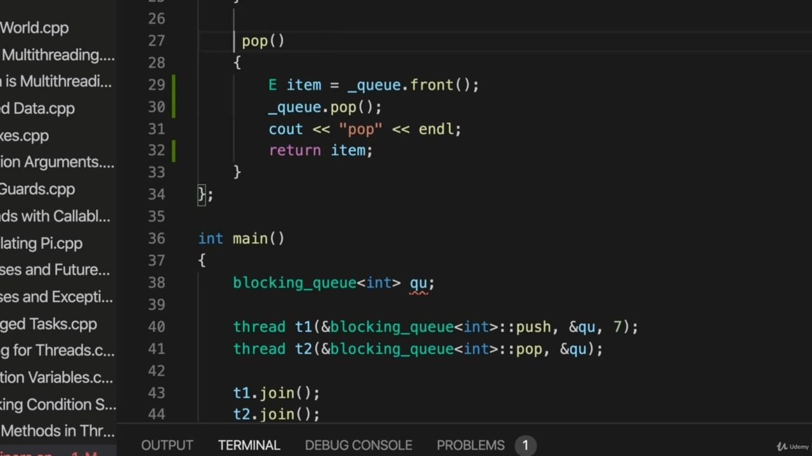

And then we can return it's a return item. And I have to change this void now to Type E, because that's the type of thing that's going to return

> 然后我们可以将其作为退货项目进行退货。我现在必须把这个空位改成 E 型，因为这是将要返回的类型

## img - 609120

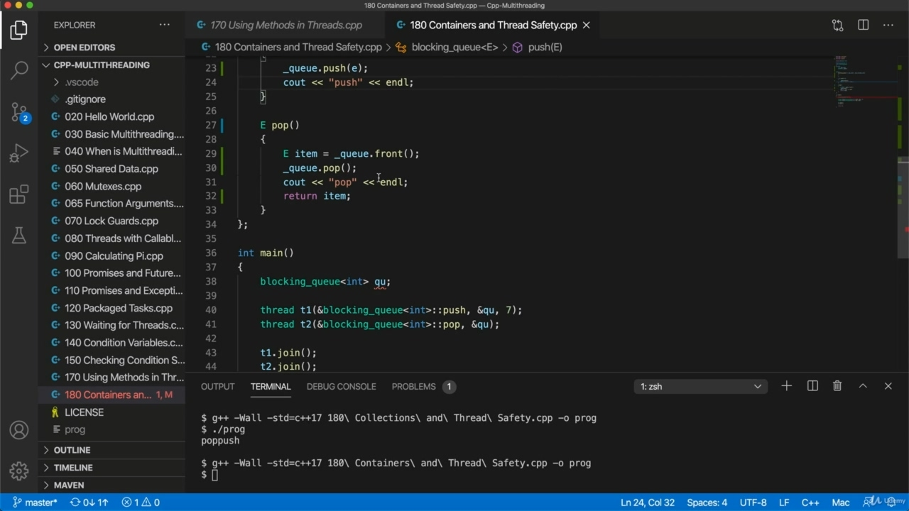

And I have to change this void now to Type E, because that's the type of thing that's going to return our template type.

> 我现在必须将这个 void 改为 Type E，因为这是返回模板类型的类型。

## img - 613440

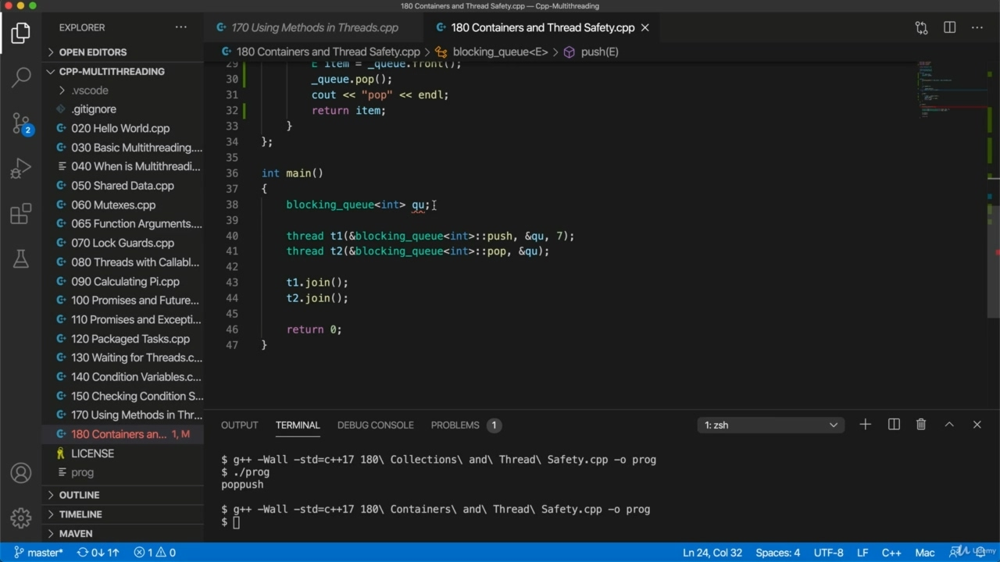

Now, let's just get this a bit of a test. There's no check here on whether the queue, whether we actually can remove items I'd want this to block if if there are no items in the queue when we try to do pop, but without doing multithreaded, I'm not really sure how I would go about that. Probably I would come up with something of I thought about it. Maybe it is even a really simple answer, but I'm not going to give it any thought because we are going to use threading. Similarly, what should we do with the size here? I really don't know. So again, probably there's some simple explanation, some simple way of dealing with the max size and creating a blocking method. But I'm going to do it using multi threading, using multi threading techniques. So I'm not going to worry about that for the moment. But let's kind of give this a bit of a test now. When we create our queue, we have to pass the max size to it, even though we haven't implemented anything

> 现在，让我们来测试一下。这里没有检查队列，我们是否真的可以删除我想要阻止的项目，如果我们尝试执行 pop 时队列中没有项目，但不执行多线程，我真的不确定该如何处理。也许我会想出一些我思考过的东西。也许这甚至是一个非常简单的答案，但我不会考虑它，因为我们将使用线程。同样，我们应该如何处理这里的尺寸？我真的不知道。同样，可能有一些简单的解释，一些处理最大大小和创建阻塞方法的简单方法。但我将使用多线程，使用多线程技术。所以我暂时不担心这个问题。但现在让我们来测试一下。当我们创建队列时，我们必须将最大大小传递给它，即使我们没有实现任何东西

## img - 713720

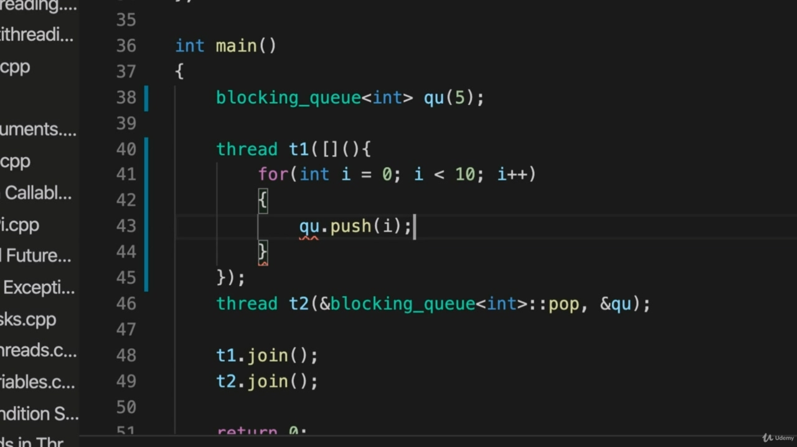

When we create our queue, we have to pass the max size to it, even though we haven't implemented anything with that yet. Let's give it a max size, let's say five. And I'm going to do something different in here to what I'm doing at the moment. Let's let's get rid of all of this stuff. And let's let's here have a lambda expression, so I'm going to put the brackets in. And here I'm going to call in a loop for and I equals naught, I less than 10, that's a plus. Plus I'm going to call, let's say, Kukushkin in a loop and we'll add on some integer. It doesn't really matter what. Let's just start on the loop index. Just add that into the queue.

> 当我们创建队列时，我们必须将最大大小传递给它，尽管我们还没有实现任何相关的功能。让我们给它一个最大尺寸，比方说五个。我将在这里做一些不同于我现在所做的事情。让我们把这些东西都扔掉。这里有一个 lambda 表达式，所以我要把括号放进去。这里我要调用一个循环，我等于零，我小于 10，这是一个加号。另外，我将在循环中调用 Kukushkin，我们将添加一些整数。这并不重要。让我们从循环索引开始。只需将其添加到队列中。

## img - 758970

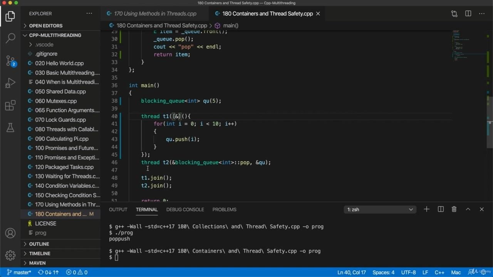

Just add that into the queue. So of course I need to capture local variables by reference and that should then work similarly in this

> 只需将其添加到队列中。因此，我当然需要通过引用来捕获局部变量，然后在这个过程中也会类似地工作

## img - 810370

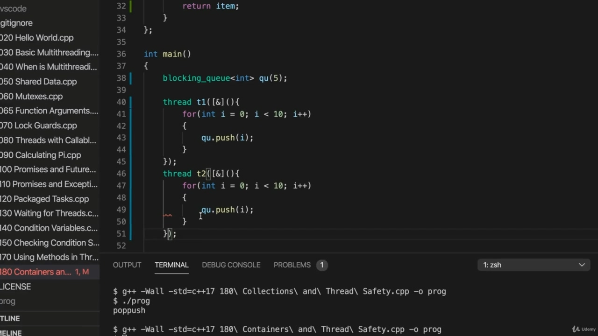

So of course I need to capture local variables by reference and that should then work similarly in this second thread here. Let's call Pop in a lambda expression. So, again, I'm going to use the loo, so in fact, I'll copy the laundry expression I've got here and paste in and we'll just modify it.

> 因此，我当然需要通过引用来捕获局部变量，然后在这里的第二个线程中，这应该是类似的。让我们在 lambda 表达式中调用 Pop。所以，再一次，我要使用厕所，所以事实上，我会复制我在这里得到的洗衣表达式并粘贴进去，我们只需修改它。

## img - 825080

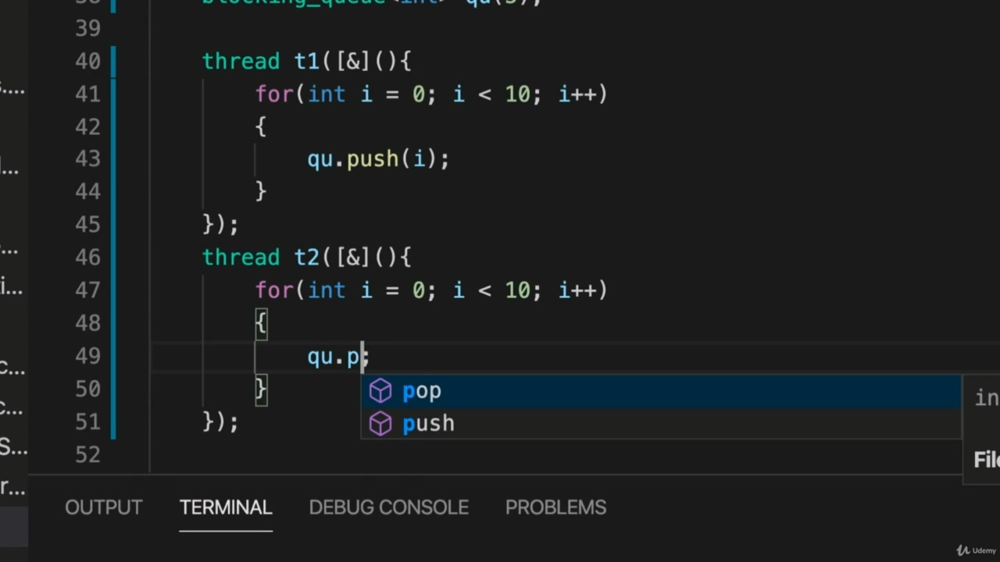

and paste in and we'll just modify it. So let's call Pop.

> 然后粘贴进去，我们就修改它。所以让我们打电话给 Pop。

## img - 841590

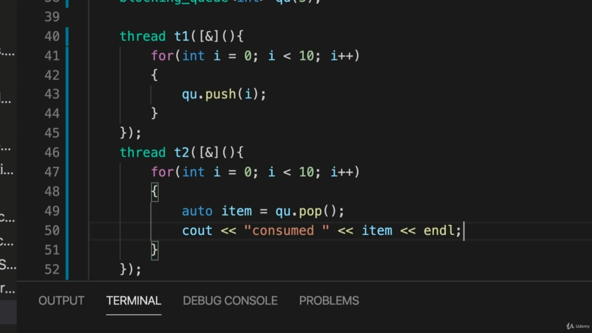

And that's going to return, in this case, an item of tight, since I could probably just use auto. And we could we could output that, we could say maybe Scouts', I say consumed. Item seem consumed because so we've got essentially a producer thread here are having problems with

> 在这种情况下，这将返回一个紧密的项目，因为我可能只使用 auto。我们可以输出，我们可以说可能是童子军，我说是消耗。项目似乎被消耗了，因为我们这里基本上有一个生产者线程

## img - 901970

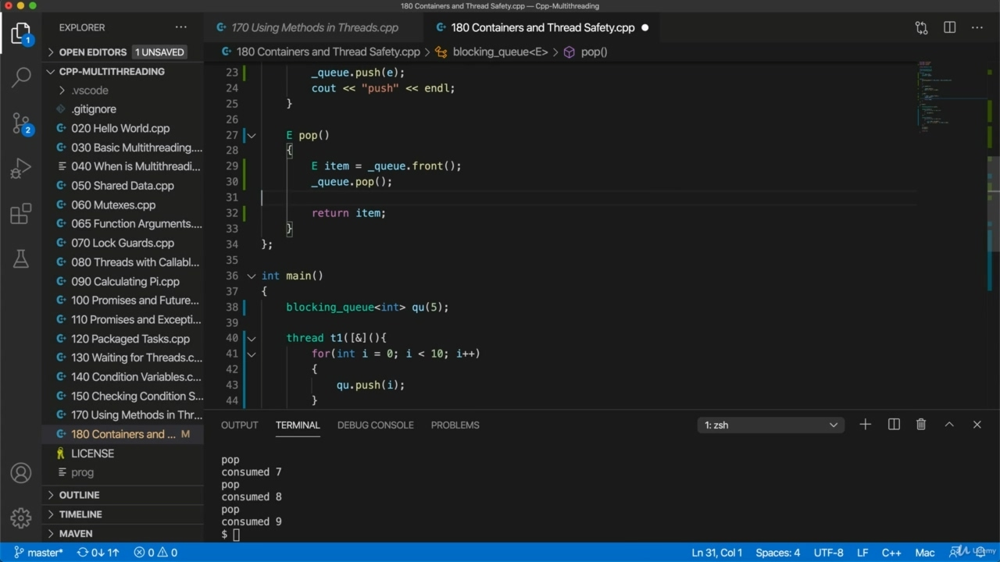

Item seem consumed because so we've got essentially a producer thread here are having problems with my zoom, which is why I keep zooming in and out. I just need to restart my computer. But here in our first thread, T1, that's a producer, is producing items and it's adding them to the queue. And the second thread is a consumer. It's consuming items from the queue. If you imagine a queue of cakes or something, the first thread is creating cakes, putting them into the queue. The second thread is taking them off and eating them, if you like. So we've got a producer and consumer thread. Now, let's try running this and see if this breaks. When we run it, we'll see what happens. So I'll compile it and I'll run it. So it seems seems actually OK, let's just scroll up, because I'm getting Depok output that I no longer

> 项目似乎被消耗了，因为我们这里有一个生产者线程，我的缩放有问题，这就是为什么我不断放大和缩小。我只需要重新启动电脑。但在我们的第一个线程 T1 中，它是一个生产者，正在生产项目，并将它们添加到队列中。第二个线程是消费者。它正在消耗队列中的项目。如果你想象一个蛋糕或其他东西的队列，第一个线程就是创建蛋糕，将它们放入队列。第二条线索是如果你愿意的话，把它们摘下来吃掉。所以我们有一个生产者和消费者线程。现在，让我们试着运行这个，看看它是否中断。当我们运行它时，我们会看到会发生什么。所以我会编译它，然后运行它。所以它看起来实际上很好，让我们向上滚动，因为我得到的是不再需要的 Depok 输出

## img - 953290

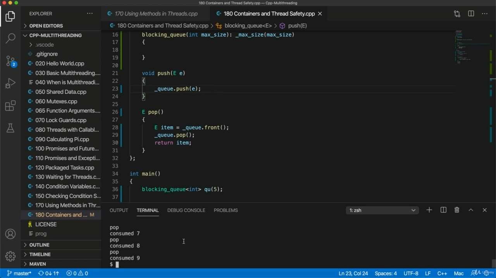

So it seems seems actually OK, let's just scroll up, because I'm getting Depok output that I no longer want, let's get rid of these scouts in the blocking cue itself. So the methods are now a lot cleaner.

> 所以看起来似乎实际上没问题，让我们向上滚动，因为我得到了我不再想要的德普输出，让我们在拦网线索本身中摆脱这些球探。因此，现在的方法要干净得多。

## img - 1010210

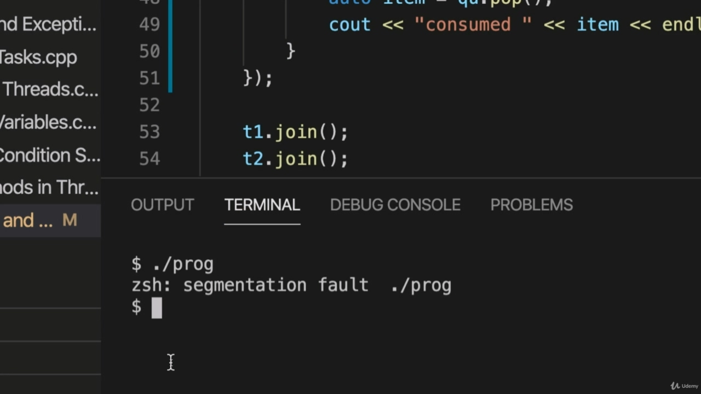

And let's do something, let's try to break it, so, I mean, it didn't it didn't seem to break then seem to be OK. So the minimal threat to safety that we've got in in the container, stunning container library seems to actually stop it from breaking at least. Here we go. So I get a segmentation fault. In fact, this time when I run it and I said this is a problem with multi threading issues, that they do tend to be intermittent. So you can write a program that works sometimes and occasionally it breaks.

> 让我们做点什么，让我们试着打破它，所以，我的意思是，它似乎没有打破，然后似乎没有问题。所以，我们在容器中得到的最小的安全威胁，惊人的容器库似乎实际上阻止了它的破坏。我们来了。所以我有一个分段错误。事实上，这一次当我运行它时，我说这是多线程问题的问题，它们往往是间歇性的。所以你可以编写一个程序，它有时会工作，有时会中断。

## img - 1042940

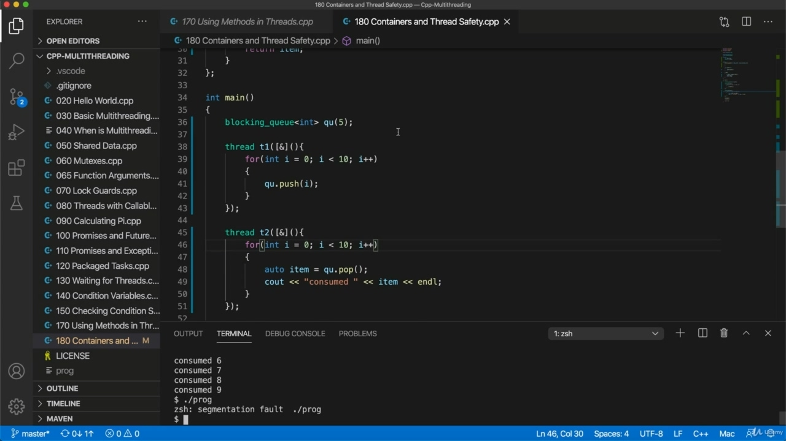

So you can write a program that works sometimes and occasionally it breaks. It might even break once and every 2000 times or something. So if in doubt, I think you really do want to put thread synchronization in there. I was going what I was going to do was to increase this loop in the sort of consumer thread to make it bigger than the producer thread, because I wanted to see what happens if we try to remove more items than are actually there. And if I look at the documentation for Q maybe that would tell me what will happen. But I just wanted to test out experimentally. Now, when you run this, you might get an error and you might not. That's just in the nature of multi threading. So, you know, it seems to be all right. Seems like every time it works, segmentation fault, so at least with my system, it works intermittently. It may be different on yours.

> 所以你可以编写一个程序，它有时会工作，有时会中断。它甚至可能每 2000 次就断裂一次或其他什么的。因此，如果有疑问，我认为您确实希望将线程同步放在那里。我要做的是在消费线程中增加这个循环，使其比生产者线程更大，因为我想看看如果我们尝试删除的项目比实际的多会发生什么。如果我看一下 Q 的文档，也许会告诉我会发生什么。但我只是想通过实验进行测试。现在，当你运行这个时，你可能会得到一个错误，而你可能不会。这正是多线程的本质。所以，你知道，这似乎是好的。似乎每次它都工作，分段故障，所以至少在我的系统中，它是间歇性工作的。你的可能不一样。

## img - 1135280

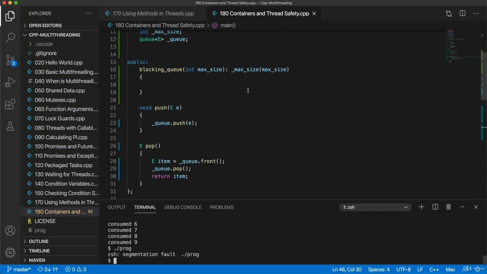

It may be different on yours. It may seem as though it works every time or it may crash every time. Who knows?

> 你的可能不一样。它似乎每次都能工作，或者每次都会崩溃。谁知道？
