Hello, in this video, we're going to finish adding a thread safety to our blocking queue so that it's actually going to work, the first thing that we need to do is at the top here. I need to include mutex and I need to include. Condition variable. Because we're going to use those and I need to give it a couple of private member variables, we need

> 您好，在本视频中，我们将完成向阻塞队列添加线程安全性，以便它能够正常工作，我们需要做的第一件事是在顶部。我需要包含互斥锁，我需要包含。条件变量。因为我们要使用这些，我需要给它一些私有成员变量，我们需要

## img - 25970

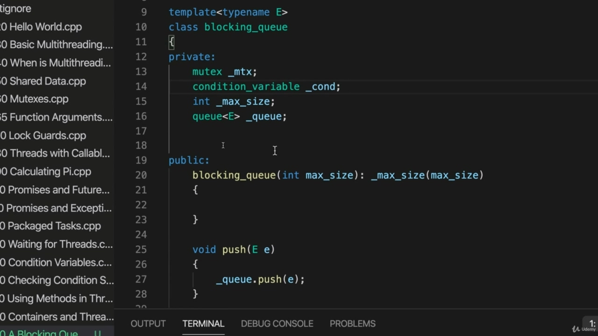

Because we're going to use those and I need to give it a couple of private member variables, we need to give it a mutex let's call it on this score MDX and the condition variable, let's call it underscore signal or underscore conned or something doesn't really matter. OK, so the first step is to put thread synchronization in place.

> 因为我们要使用这些，我需要给它一些私有成员变量，我们需要给它一个互斥体，让我们在这个分数上调用它 MDX 和条件变量，让我们称它为下划线信号或下划线连接，或者什么都不重要。好的，所以第一步是建立线程同步。

## img - 43400

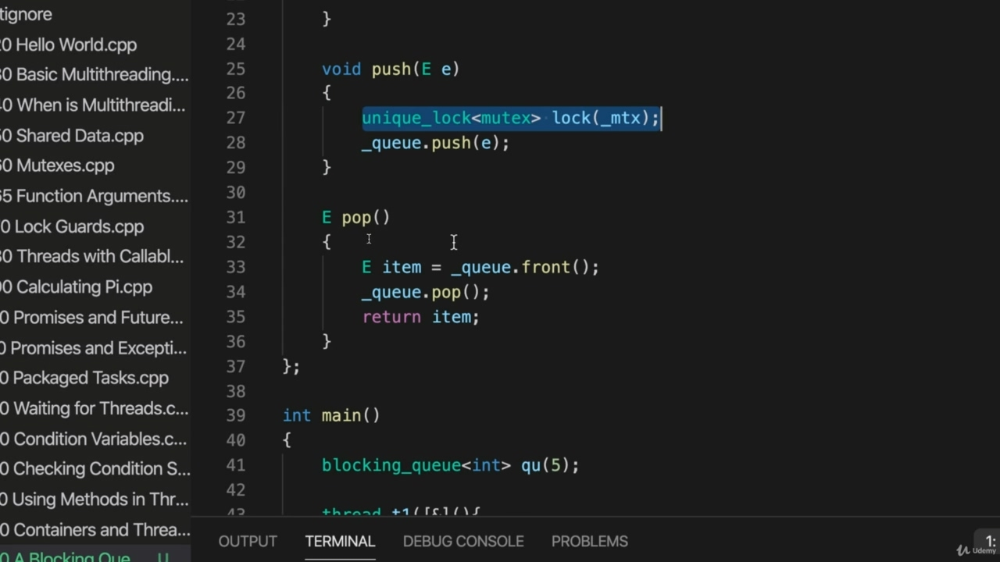

OK, so the first step is to put thread synchronization in place. That's pretty simple. So in push we were going to use a unique lock rather than lock God because we need to be able to unlock it and we're going to need to use it with a condition variable that's a unique lock that's going to use a regular type of mutex lock. And it's we need we need to pass a mutex to it. We need to do the same thing here for Pop.

> 好的，所以第一步是建立线程同步。这很简单。所以在 push 中，我们将使用一个唯一的锁，而不是锁上帝，因为我们需要能够解锁它，我们需要将它与一个条件变量一起使用，这是一个唯一锁，将使用常规类型的互斥锁。我们需要给它传递一个互斥锁。我们需要为 Pop 做同样的事情。

## img - 109740

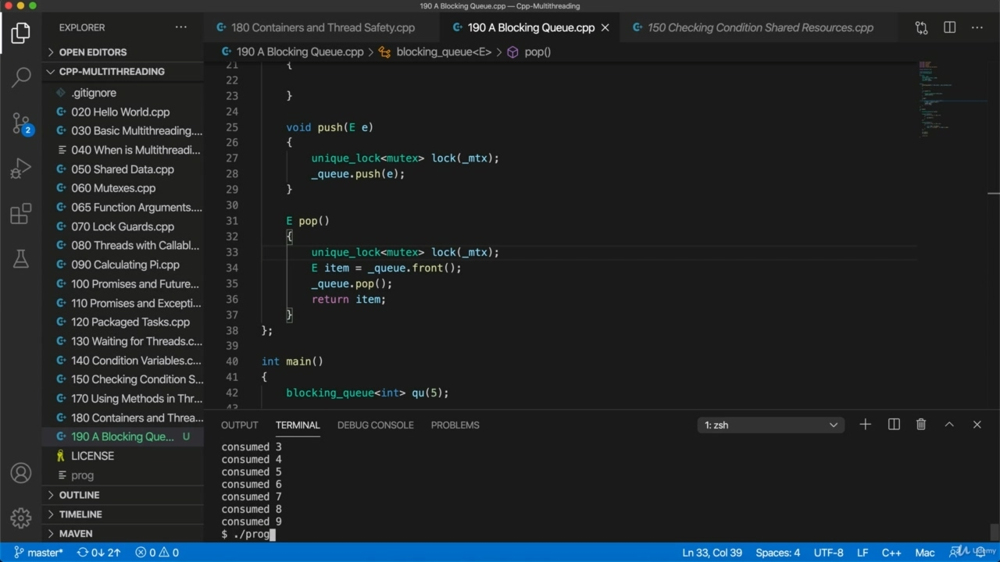

We need to do the same thing here for Pop. Now, this by itself isn't going to make our program run reliably if I build this and then run, it is going to work some of the time and occasionally it is going to crash.

> 我们需要为爸爸做同样的事情。现在，如果我构建并运行这个程序，它本身并不能使我们的程序可靠地运行，它会在某些时候工作，有时会崩溃。

## img - 125180

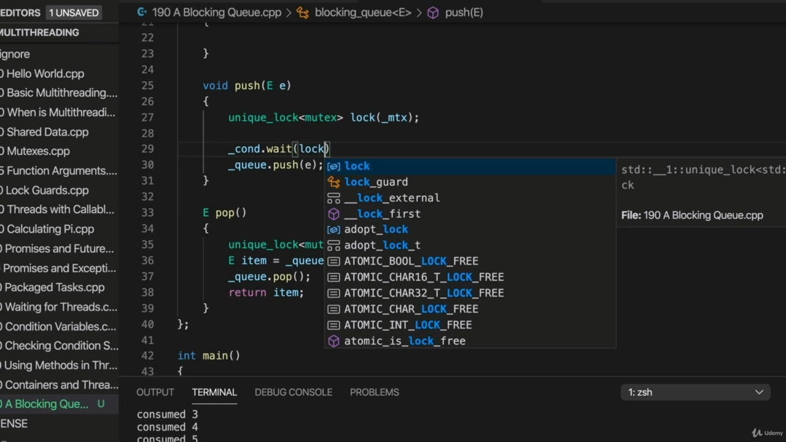

is going to work some of the time and occasionally it is going to crash. I would think maybe not. Well, it depends on the behavior of pop here, because sometimes we're going to try to pop when there isn't anything to pop. Let's look up Q C++ and look at the documentation and look at pop. So. It doesn't actually say here, I don't think does it actually say what happens or what's supposed to happen if we try to pop from an empty cue? Well, if not the previous undefined. But in any case, this isn't satisfactory. Maybe it does run reliably, but we need to do more work because we need to implement the blocking behavior. So to do that is is pretty simple. So let's put the weights in for a start. So in push, if we have the situation that the the queue has reached its maximum size, then we want to continue waiting. We only want to proceed when the queue is a less than the maximum size. So we can say here condition wait and. So he can use weights, there's also weight. For. Which which we don't need here, but we specify duration and that sort of thing, but here I'm just going to lose weight. So a condition that weight and we're going to wait for our lock and we could wrap that with a while loop that says while the queue size is greater than or equal to maximum size or as we've seen, we can

> 有时会工作，有时会崩溃。我想也许不会。好吧，这取决于这里流行的行为，因为有时我们会在没有什么可以流行的时候尝试流行。让我们查找 Q C++，查看文档并查看 pop。所以，这里并没有说，我认为它实际上并没有说如果我们试图从一个空线索中弹出，会发生什么或应该发生什么？如果不是之前的未定义。但无论如何，这并不令人满意。也许它确实运行可靠，但我们需要做更多的工作，因为我们需要实现阻塞行为。所以要做到这一点非常简单。所以，让我们先把重量放进去。所以在 push 中，如果出现队列已达到最大大小的情况，那么我们希望继续等待。我们只想在队列小于最大大小时继续。所以我们可以说这里的条件是等待和。所以他可以使用重量，还有重量。对于这在这里我们不需要，但我们指定了持续时间和类似的事情，但在这里我只想减肥。因此，一个权重条件，我们将等待我们的锁，我们可以用 while 循环来包装它，当队列大小大于或等于最大大小时，或者正如我们所看到的，我们可以

## img - 315570

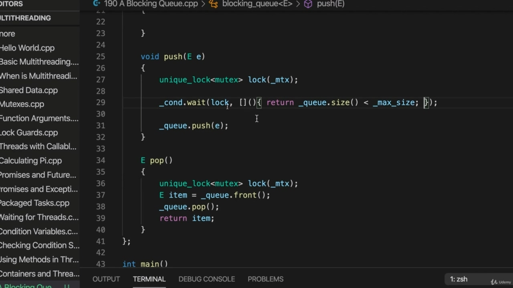

loop that says while the queue size is greater than or equal to maximum size or as we've seen, we can supply a predicate here, for example, as an expression. So here I'm going to supply a predicate. And basically this returns true when the weight is really over. So let's say return kudo's size less than max size. I should do the trick, so we return true when we can stop waiting and then we can carry on, do the

> 循环，当队列大小大于或等于最大大小时，或者正如我们所看到的，我们可以在这里提供谓词，例如，作为表达式。所以这里我要提供一个谓词。基本上，当重量真的结束时，这一点就会变为真。所以让我们假设 return kudo 的大小小于最大大小。我应该做这个把戏，这样当我们可以停止等待，然后我们可以继续，做

## img - 345570

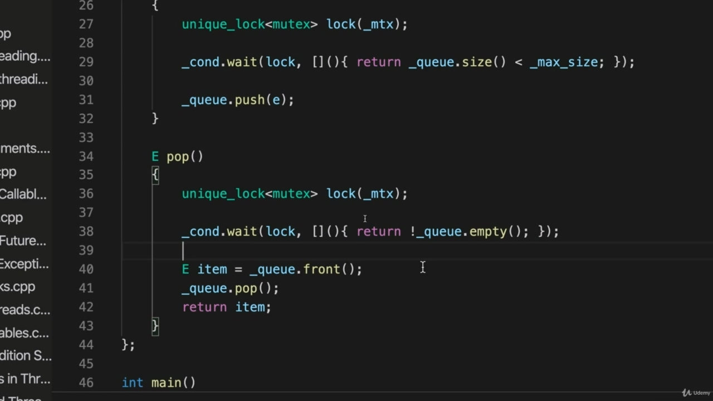

I should do the trick, so we return true when we can stop waiting and then we can carry on, do the push, let's copy that because we need to do a similar thing. And don't forget, you can only wait when you've got the lock. Weight is going to give up the lock, at least temporarily. So after we get the lock and pop, I'm going to put a weight in and this time we're going to proceed when the cue. Is not a.. This is the condition when we can proceed now we need to put the signaling in, like we need to tell

> 我应该这么做，所以当我们可以停止等待时，我们会回到现实，然后我们可以继续，做推送，让我们复制它，因为我们需要做类似的事情。别忘了，你只有拿到锁后才能等待。重量会让锁松，至少是暂时的。所以，在我们锁定并弹出后，我将加入一个权重，这次我们将在提示时继续。不是。这是我们现在可以继续的条件，我们需要发出信号，就像我们需要告诉的那样

## img - 419840

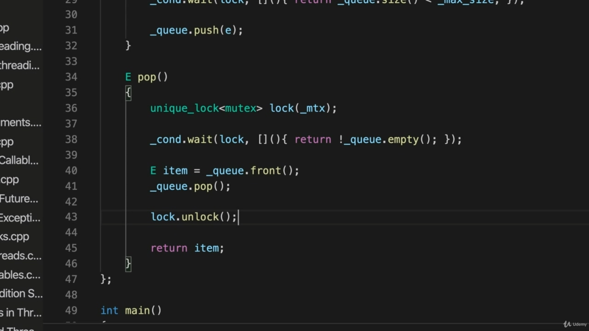

This is the condition when we can proceed now we need to put the signaling in, like we need to tell the threats when they can wake up. So, for example, in pop, after we popped an item. Then at that point, we can unlock the lock, we can release the lock, let's say lock to unlock. There's no point wacht waiting, waking up other threads until you have released the lock, because

> 这是我们可以继续的条件，现在我们需要发出信号，就像我们需要告诉威胁何时可以醒来一样。例如，在 pop 中，在我们弹出一个项目之后。然后，在那一点上，我们可以解锁，我们可以释放锁，比如说锁到解锁。等待、唤醒其他线程直到释放锁是没有意义的，因为

## img - 441650

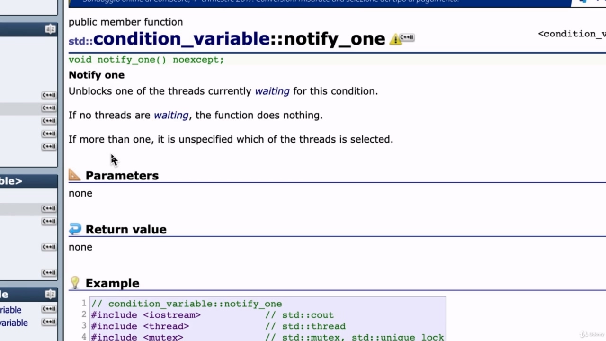

There's no point wacht waiting, waking up other threads until you have released the lock, because in order for weight to return in another thread, it has to be able to get the lock. It can't return until it gets the lock. So we first unlock here and then we say conduct, notify one and we only need to notify one other waiting three-tier which which thread will actually be woken up is is undefined. That's in the documentation of a condition variable.

> 等待、唤醒其他线程直到释放锁是没有意义的，因为为了让权重在另一个线程中返回，它必须能够获得锁。在锁上之前，它无法返回。所以我们首先在这里解锁，然后我们说进行，通知一个，我们只需要通知另一个等待的三层线程，哪个线程将被唤醒是未定义的。这在条件变量的文档中。

## img - 512880

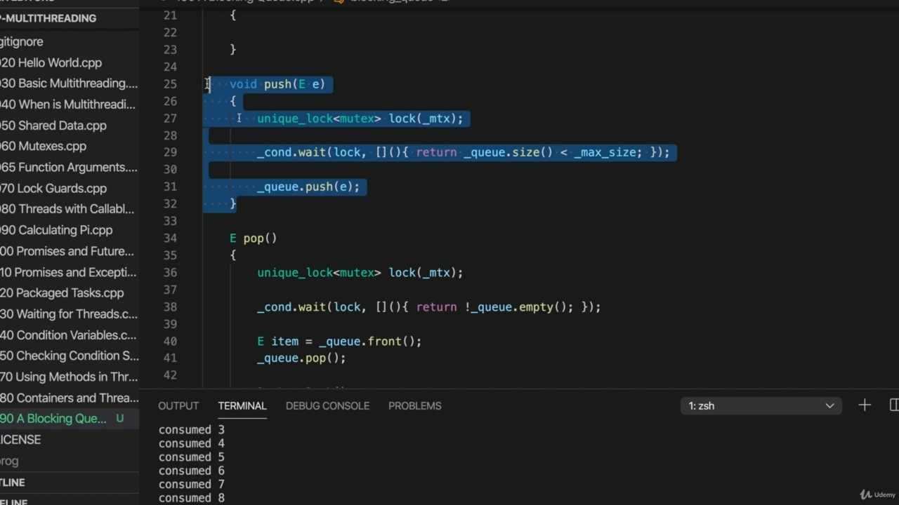

So of condition variable. Notify one if if there are more than one threads waiting it's unspecified. Which of the threads is selected for waking up. But this, this should do the trick for us. We just need to wake up one wake, one waiting thread. And even if we, for example, push in multiple threads, there's no harm apart from a slight impact

> 条件变量也是如此。如果有多个线程等待，则通知一个未指定的线程。选择哪个线程进行唤醒。但这，这应该对我们有用。我们只需要唤醒一个唤醒，一个等待线程。例如，即使我们推入多个线程，除了轻微的影响之外，也不会有任何伤害

## img - 536910

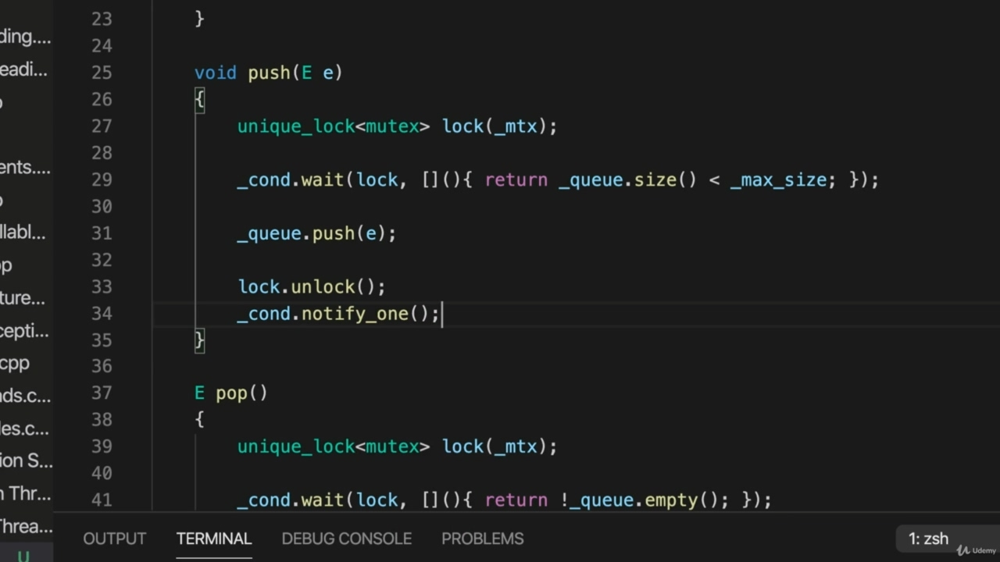

And even if we, for example, push in multiple threads, there's no harm apart from a slight impact on efficiency, from waking up a thread that can't do anything. It'll just go back to sleep again. It'll just go into weight again if it's not able to do anything useful. So, you know, I think this will do the trick for us here, even if we call push and pull from multiple threads. Okay, so similarly in push. After we do the push to the queue, we can release the lock so we can say lock to unlock. And then we can do conduct note, if I want to say that one of the waiting threads can wake up and have a go, you know, it can see if it's really time to wake up or if it needs to go into the Waitzkin.

> 例如，即使我们推入多个线程，唤醒一个不能做任何事情的线程，除了对效率有轻微影响外，没有任何害处。它会再次入睡。如果它不能做任何有用的事情，它会再次变得沉重。所以，你知道，我认为这对我们来说很有用，即使我们从多个线程调用 push 和 pull。好吧，推也一样。在我们推送到队列之后，我们可以释放锁，这样我们就可以说锁到解锁。然后我们可以做一个行为记录，如果我想说等待线程中的一个可以醒来并尝试一下，你知道，它可以看到是否真的该醒来了，或者是否需要进入 Waitzkin。

## img - 623490

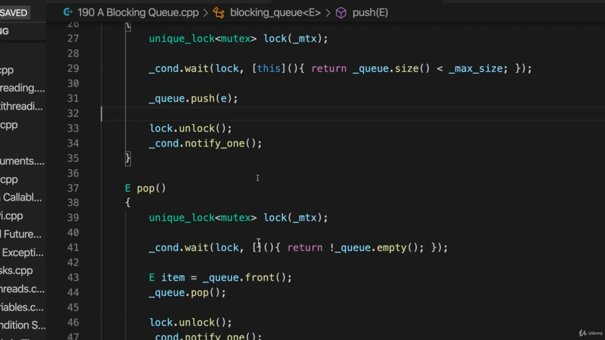

a go, you know, it can see if it's really time to wake up or if it needs to go into the Waitzkin. So I think that will do the trick. If you have any problems like you find your program, Hung's or anything, really pay close attention. Make sure you've done everything in the right order. You can only do the weight after getting the lock and there's no point calling notify until you've unlocked. And that's that's basically the gist of it. And here we've got we're using a single condition with two threads which notify each other. They can both wait, they can both notify each other, which is a very common thing to do. So let's clear the terminal, compile it and see if it works or if I've forgotten something. I've forgotten something, I've forgotten that in my lambda expressions, I need to capture this, otherwise I can't access these member variables. Let's just put this in there.

> 一次尝试，你知道，它可以看到是否真的该起床了，或者是否需要进入 Waitzkin。所以我认为这会奏效。如果你有任何问题，比如你发现你的程序，洪氏或任何东西，真的要密切关注。确保您按正确的顺序完成了所有工作。你只有在拿到锁后才能称重，在你解锁之前打电话通知是没有意义的。这就是它的基本要点。这里我们使用了一个条件，两个线程相互通知。他们都可以等待，都可以互相通知，这是一件非常常见的事情。所以让我们清除终端，编译它，看看它是否有效，或者我是否忘记了什么。我忘记了一些事情，我忘记了在 lambda 表达式中，我需要捕获这个，否则我无法访问这些成员变量。让我们把这个放进去。

## img - 722050

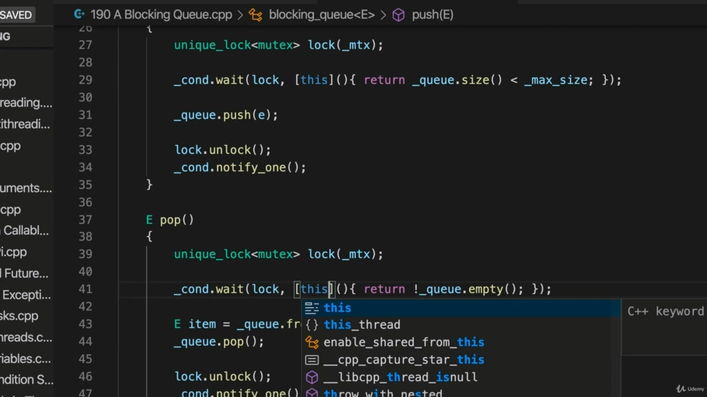

And this goes here as well.

> 这里也是如此。

## img - 722050

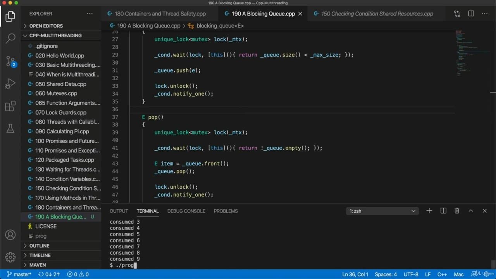

And this goes here as well. So can I compile it? Yeah, and what happens if I run it and it should work reliably every time we can also put in our pushier

> 这里也是如此。那么我可以编译它吗？是的，如果我运行它，它应该每次都能可靠地工作，那么会发生什么

## img - 736630

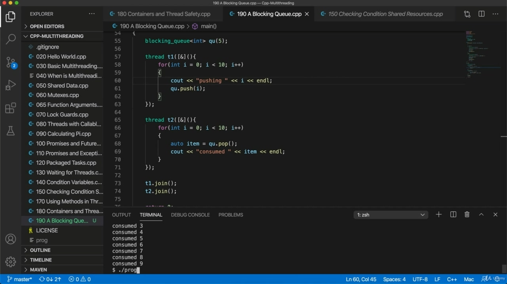

Yeah, and what happens if I run it and it should work reliably every time we can also put in our pushier we could put a Siao. And say, pushing. Pushing. I. Maybe it makes it a little bit clearer what's going on.

> 是的，如果我运行它，它会发生什么？每次我们也可以使用推送器时，它都会可靠地工作，我们可以使用 Siao。然后说，推。推一、 也许这让事情变得更清楚了。

## img - 803820

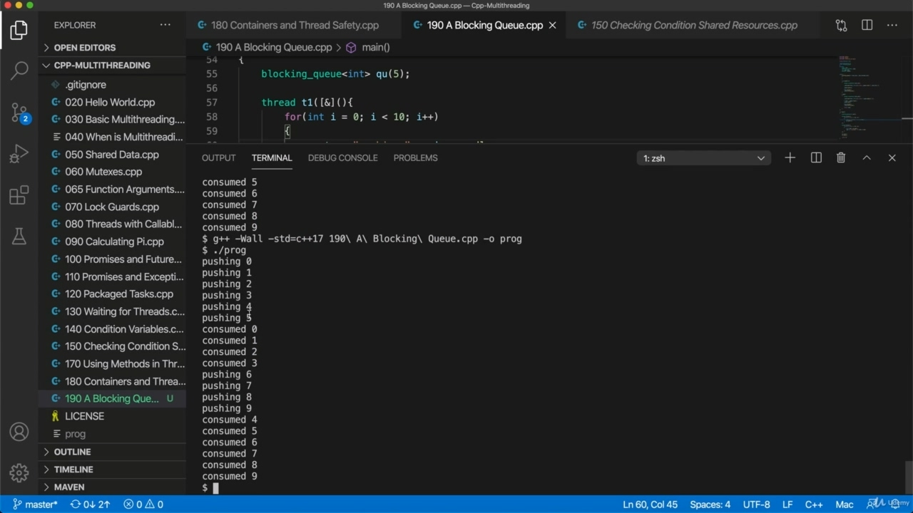

So now if I run this and we can see here that the pushing and consuming that they are interleaved.

> 所以现在，如果我运行这个，我们可以看到推送和消费是交错的。

## img - 803820

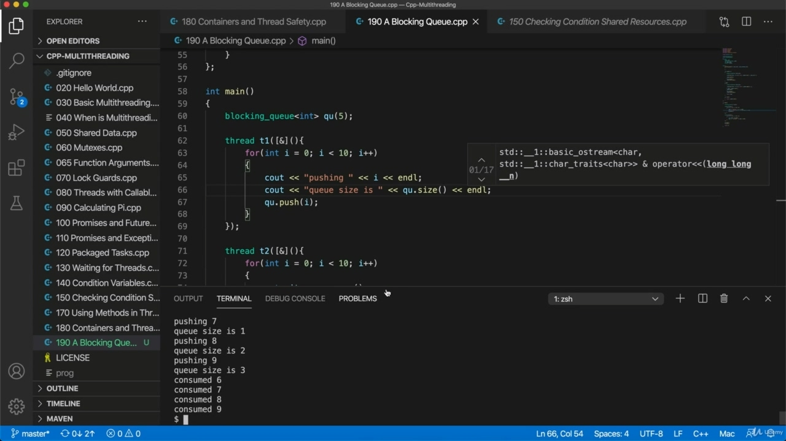

So now if I run this and we can see here that the pushing and consuming that they are interleaved. Sort of kind of fairly randomly, we could also output the queue size if we want. So let's do see out here in the sort of push queue size is. And now we can't get the Kusile here. So what should we do? Well, we can add a size method to our blocking cue, which is, I think, pretty useful. So let's add a method size that returns an end. And that's just going to return on the scorecard. Size. Then we can output that here so we can say cube size. Let's try that. There we go.

> 所以现在，如果我运行这个，我们可以看到推送和消费是交错的。有点随机，如果需要，我们也可以输出队列大小。所以让我们看看推送队列的大小。现在我们不能在这里得到 Kusile。那么我们该怎么办呢？好吧，我们可以在阻塞提示中添加一个大小方法，我认为这非常有用。因此，让我们添加一个返回结束的方法大小。这将在记分卡上得到回报。大小然后我们可以在这里输出，这样我们就可以说立方体大小。让我们试试看。好了。

## img - 908430

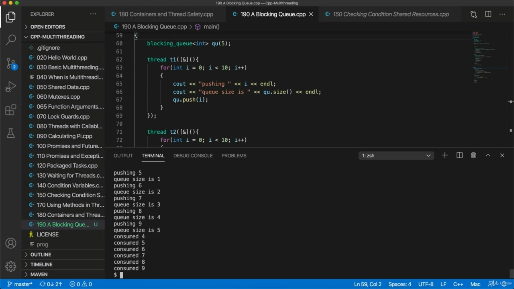

So the QSI shouldn't get above the maximum size, what did we set it to? We set it to five. And we've got queue size nought, one, two, three. Let's try running it a bit more. You know, it's not getting very high at all.

> 所以 QSI 不应该超过最大大小，我们将其设置为什么？我们将其设置为 5。我们的队列大小为 0，1，2，3。让我们试着再运行一下。你知道，它一点也不高。

## img - 928930

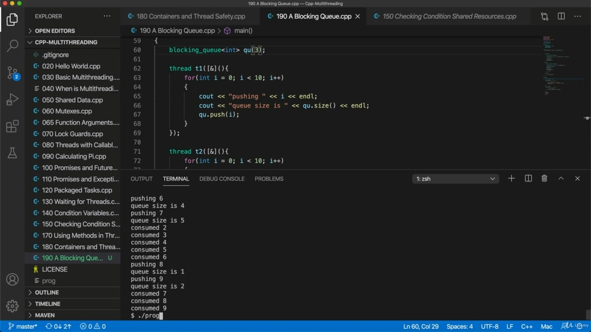

Five, that it was a five. So occasionally it's going to reach five shouldn't get beyond it, let's try it with a maximum size of three and then I'm going to leave this alone that you play around with it. That so.

> 五，那是五。所以，偶尔它会达到五个。不要超过它，让我们尝试最大尺寸为三个，然后我会让你玩这个。就是这样。

## img - 941130

That so. And was something to my terminal here. So now you say it doesn't get above three, as you can see, looks like it's working pretty well.

> 是的。这是我在这里的终点站。所以现在你说它没有超过三，正如你所看到的，看起来它工作得很好。

## img - 955470

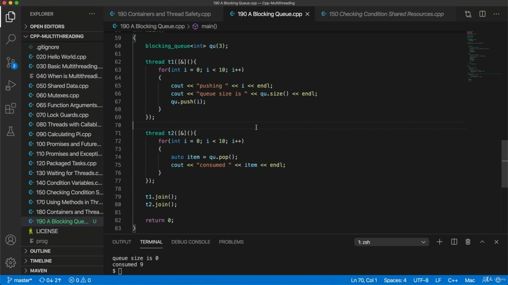

So now you say it doesn't get above three, as you can see, looks like it's working pretty well. I think that should. I think they should handle most situations and what we've got here is a producer consumer, so we've got one thread that's producing items and another thread that's consuming items. And this is a very, very useful thing to have in lots of different situations. You know, for example, if you've got a message queue, you may have a thread that's getting messages off the Internet, somehow putting them onto a queue. And you've got another thread that's processing those messages were the messages could be all sorts of things.

> 所以现在你说它没有超过三，正如你所看到的，看起来它工作得很好。我认为应该这样。我认为他们应该处理大多数情况，我们这里有一个生产者-消费者，所以我们有一个线程生产项目，另一个线程消费项目。这在很多不同的情况下都是非常非常有用的。例如，您知道，如果您有一个消息队列，那么您可能有一个线程正在从 Internet 上获取消息，以某种方式将它们放入队列。还有一个线程正在处理这些消息，因为消息可能是各种各样的。
