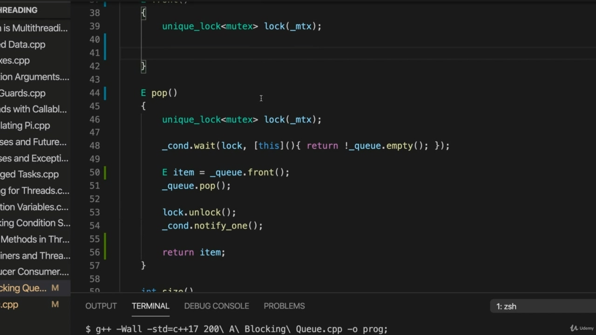
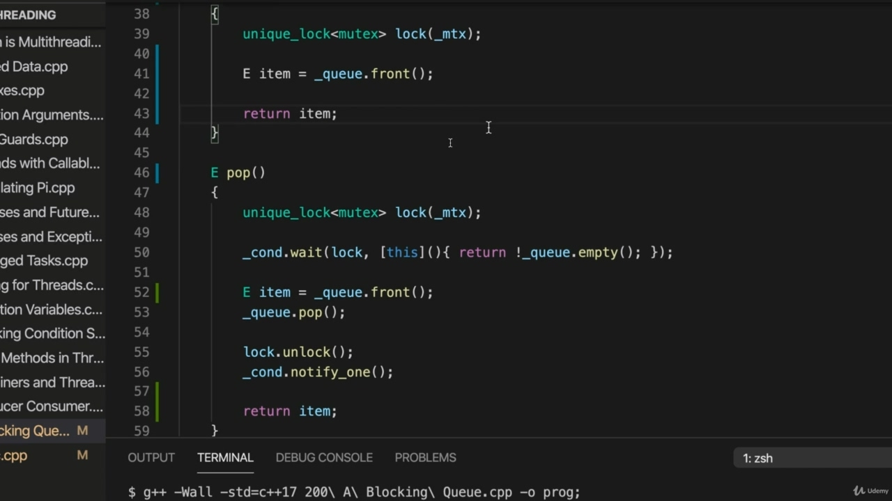
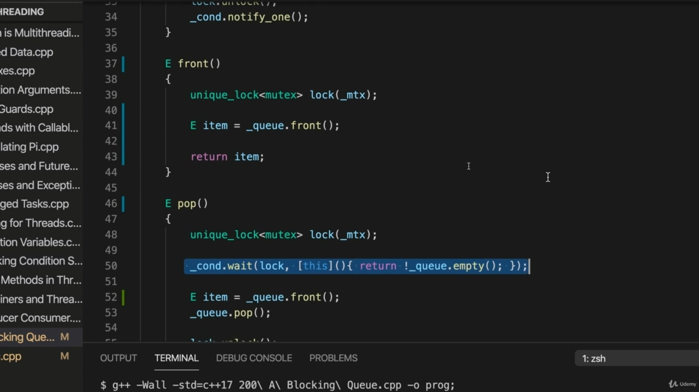
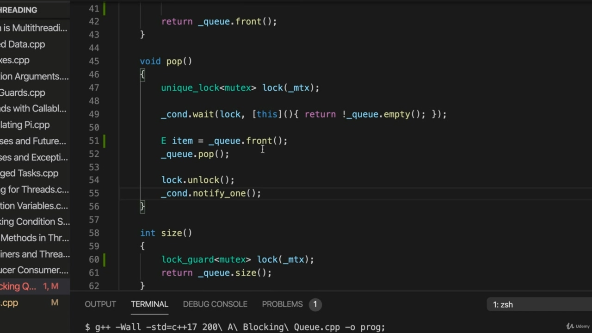
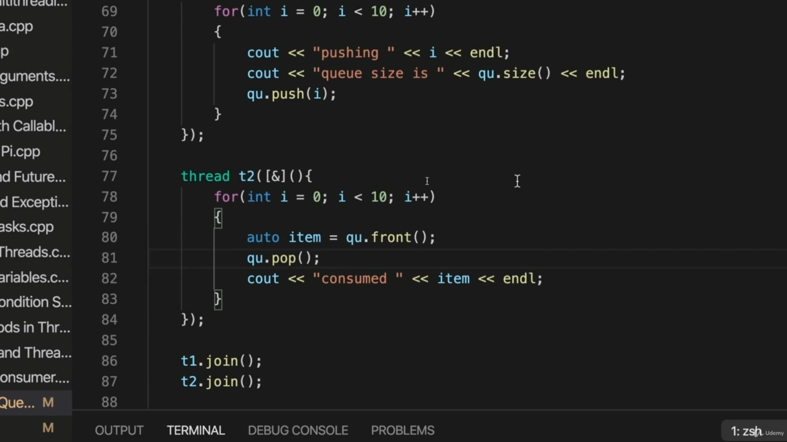
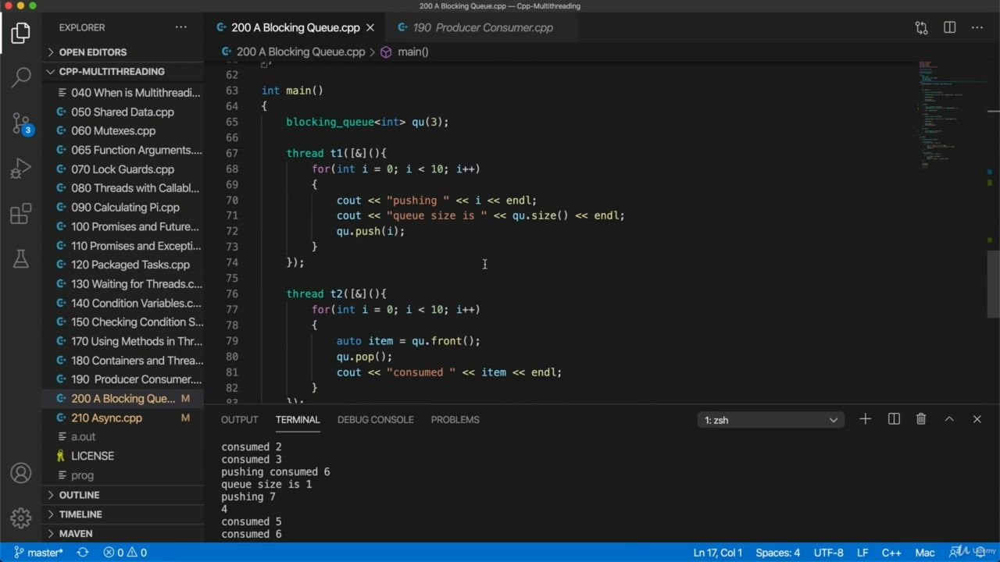

Hello, in this video, I'm going to make a couple of adjustments to the code we've got at the moment Hello, in this video, I'm going to make a couple of adjustments to the code we've got at the moment to finish off our blocking queue because I think it could be improved slightly. Now, one thing I'm going to do is pay attention to this size method here, because it returns queue size with no synchronization. What threat is that going to be access from? And can we rely on it? Well, possibly because the steel containers do have some minimal threat to safety, but I'm just not completely sure about it. So I think I'm going to add synchronization here to this size method. So let's let's use a what? We could use a unique lock, really? Or a lot. God, I don't think it matters too much. Let's use a lot God. So, God. Using a mutex and we'll call it Lokke, and it's going to just lock the mutex.

> 你好，在这段视频中，我将对目前的代码进行一些调整。现在，我要做的一件事是注意这里的这个 size 方法，因为它返回的队列大小没有同步。这将是什么威胁？我们能依靠它吗？嗯，可能是因为钢制集装箱对安全的威胁很小，但我只是不完全确定。所以我想我要在这个尺寸方法中添加同步。那么让我们用一个什么？我们可以用一把独特的锁，真的吗？或者很多。天啊，我觉得这不太重要。让我们用很多上帝。上帝啊。使用互斥锁，我们将其称为 Lokke，它将锁定互斥锁。

## img - 114770

That's probably OK, so now it has to get the lock before it can do anything with the queue and then it just returns the size of the queue. I'm also going to make this more resemble their kind of API that cue itself, as were the method to get the front item, is separated from the pop action. And the reason I'm doing this is because it is really common to to separate the two. So you have a method that lets you get in front of the queue and another method lets the lets you pop. We could leave this as it is and just start a method called peak or something to see the front of the queue. But. Bing is with C++, were often kind of obsessed with efficiency. It's kind of one of the selling points of the language. I think this method should only do the pop and we should have a separate method that gets the front of the queue. So let's have a method called front that gets the front of the queue. Now, we're going to need synchronization here. And naively, we could just well, we could get the item here.

> 这可能没问题，所以现在它必须先获得锁，然后才能对队列执行任何操作，然后只返回队列的大小。我还将使其更类似于他们的 API，即提示本身，以及获取前项的方法，与弹出动作分离。我这样做的原因是因为把两者分开是很常见的。因此，您有一个方法可以让您排在队列前面，而另一个方法让您弹出。我们可以保持原样，只需启动一个名为 peak 的方法或其他方法来查看队列的前端。但是 Bing 使用的是 C++，他们常常痴迷于效率。这是语言的卖点之一。我认为这个方法应该只做 pop，我们应该有一个单独的方法来获取队列的前端。因此，让我们使用一个名为 front 的方法来获取队列的前端。现在，我们需要同步。天真地，我们可以很好，我们可以在这里得到这个项目。

## img - 221980

And naively, we could just well, we could get the item here. Let's get the front of the queue and. We could return it.

> 天真地，我们可以很好，我们可以在这里得到这个项目。让我们排到最前面。我们可以退货。

## img - 239870

But I'm not sure that that really does the trick, because what happens if there is no item at the front of a queue, a new cold front, while it's liable to crash in this case? So what should front do if there is no item at the front because the queue is empty? And I think probably would be most useful, actually, if it just waits. So I think we should have here. Condition wait, which should wait as long as the queue is empty, so when it's not empty, then we

> 但我不确定这是否真的有效，因为如果队列的最前面没有项目，一个新的冷门，而在这种情况下它很可能崩溃，会发生什么？那么，如果队列为空，所以前端没有项目，前端应该怎么办？事实上，如果它只是等待的话，我认为这可能是最有用的。所以我认为我们应该在这里。条件等待，只要队列为空，它就应该等待，所以当队列不为空时

## img - 308420

Condition wait, which should wait as long as the queue is empty, so when it's not empty, then we should proceed. So I think on balance, that will probably serve our purpose the best. There's no there's not we're not going to be any notify here because we're not modifying the items in the queue. We're not doing anything to the queue. That could mean that some other method can then proceed. I don't think you really need to call on lock because after all, this method will unlock when we return the item. And if we could just condense this a bit, we could say return queue front when there is finally a front to return and then the pot method here. So I'm going to change the signature of that. I'm going to change it. The prototype. I'm going to just. Get rid of the return value there so we won't return item, and that means we don't need to get the

> 条件等待，只要队列为空，它就应该等待，所以当队列不为空时，我们应该继续。所以我认为，总的来说，这可能最符合我们的目的。没有，我们不会在这里收到任何通知，因为我们没有修改队列中的项目。我们没有对队列做任何事。这可能意味着可以采用其他方法。我不认为你真的需要调用 lock，因为毕竟，当我们返回物品时，这个方法会解锁。如果我们可以稍微压缩一下，我们可以说，当最后有一个要返回的前端时，返回队列前端，然后是这里的 pot 方法。所以我要更改签名。我要改变它。原型。我要去。去掉那里的返回值，这样我们就不会返回项目，这意味着我们不需要获取

## img - 400950

Get rid of the return value there so we won't return item, and that means we don't need to get the front of the queue here. We just need to call Pop. So it's the same as before, except the only thing it's doing is pop. And after that, we do need to unlock and then we can notify waiting threads. So now we can modify what we've got slightly. So the thread that previously did the pop we want to say or two item equals queued up front now. And then cue to pop. And the front will wait if the queue is empty, but so will the pop, for that matter, although it's

> 去掉那里的返回值，这样我们就不会返回项目，这意味着我们不需要在这里得到队列的前面。我们只需要打电话给爸爸。所以它和以前一样，只不过它做的是流行音乐。之后，我们确实需要解锁，然后我们可以通知等待线程。所以现在我们可以稍微修改一下我们得到的。所以，之前做过我们想说的 pop 的线程或者两个项目等于现在在前面排队。然后提示弹出。如果队列是空的，前台会等待，但酒吧也会等待，尽管它是空的

## img - 443590

And the front will wait if the queue is empty, but so will the pop, for that matter, although it's not necessary here, I think. Or is it? Yes, I think it is necessary that the pot will also wait, because between when we get the front and that finish is waiting, we could have another thread that's emptying the queue and the consumer. So I think that will do the trick. Let's just check it. Let's compile it and run it. And it should basically work as before. Looks okay to me. So now we've got we've got our final blocking queue and we're going to use this to implement a thread pool.

> 如果队列是空的，前台会等待，但酒吧也会等待，尽管我认为这里没有必要。还是这样？是的，我认为锅也有必要等待，因为在我们到达前面和结束等待之间，我们可能会有另一个线程清空队列和消费者。所以我认为这会奏效。让我们检查它。让我们编译并运行它。它应该基本上像以前一样工作。我觉得没问题。现在我们已经得到了最后一个阻塞队列，我们将使用它来实现线程池。
