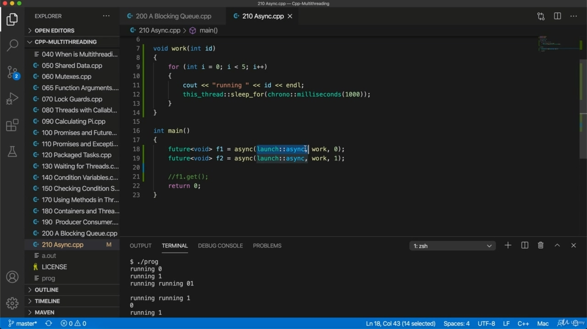

Hello, in this video, we're going to take a look at a sink sorry, sink is probably the easiest way Hello, in this video, we're going to take a look at a sink sorry, sink is probably the easiest way to run code, and it's in its own thread for most purposes. And it's particularly useful for implementing thread pools, which we're going to do shortly using the blocking queue that we created. So a sink is defined in future. So let's include that. And I will also include Crono. Just because I want to put a delay into the code that we're going to run, so to start with, let's just try having a void function so we can run stuff that's callable, basically. And I'm just going to have a loop here. And within the loop, I'm going to output some text, in fact, let's also give this a int it so that we can distinguish one thread from another and I'm going to output here. Running. EDD. And we'll have a delay in so this. Thread. Sleep for and we're going to sleep for Crono. Milliseconds. Thousands or I could put Crono seconds one, of course.

> 你好，在这段视频中，我们要看一看汇点，抱歉，汇点可能是最简单的方式你好，在本视频中，我要看一个汇点，对不起，汇点也许是运行代码的最简单方式，而且它在自己的线程中用于大多数目的。它对于实现线程池特别有用，我们将很快使用我们创建的阻塞队列来实现线程池。因此，水槽是在未来定义的。所以让我们把它包括在内。我还将包括克罗诺。因为我想在我们要运行的代码中加入一个延迟，所以首先，让我们尝试使用一个 void 函数，这样我们就可以运行基本上可调用的东西。我要在这里做一个循环。在循环中，我将输出一些文本，事实上，让我们也给它一个 int，这样我们可以区分一个线程和另一个线程，我将在这里输出。跑步艾迪。我们会推迟这样做的。线睡吧，我们要睡克罗诺。毫秒。当然，数千人或者我可以把克罗诺排在第一位。

## img - 130080

Thousands or I could put Crono seconds one, of course. All right, so let's run this in its own thread using a sink. And this is pretty simple. So we've included future so we can use it. And of course, I'm using named state namespace standard because of course, most of the things I'm using exist in the standard namespace. So normally we will be typing Usted colon, colon async. So we pass the thing that we want to run and we pass whatever arguments we want to run as well. Now, there's a little complication here, which is that a sink can run things in two modes and we can we can specify the mode for the first argument. So I can write here. Launch. Either a sink or deferred or any so any is the default and the default is a sink or deferred, you know, like within or sort of bitwise or and my understanding is that if you don't specify a launch policy here, you're basically leaving it to your system to decide and it can pick either. Now, the difference is that, as we'll see, we can get a future from a sink. And if you choose deferred, then the threat is not actually going to launch until you choose, until you could get from your future. So maybe, maybe we should take a look at that. So let's try deferred here.

> 当然，数千人或者我可以把克罗诺排在第一位。好的，让我们使用一个水槽在它自己的线程中运行这个。这很简单。所以我们已经包含了 future，所以我们可以使用它。当然，我使用的是命名状态命名空间标准，因为当然，我所使用的大多数东西都存在于标准命名空间中。所以通常我们会键入 Usted 冒号，冒号异步。所以我们传递我们想要运行的东西，我们传递我们想运行的任何参数。现在，这里有一点复杂，这就是接收器可以以两种模式运行，我们可以为第一个参数指定模式。所以我可以在这里写作。发射默认值是 sink 或 deferred 或任何其他值，默认值是 sink 或 deferied，你知道的，比如 within 或 bitwise，我的理解是，如果你不在这里指定启动策略，你基本上是让你的系统来决定，它可以选择其中之一。现在，不同的是，正如我们将看到的，我们可以从水槽中获得未来。如果你选择推迟，那么在你选择之前，威胁实际上不会发生，直到你可以从你的未来中受益。所以也许，也许我们应该看看这个。所以，让我们在这里尝试延迟。

## img - 311590

And try running this and see what happens. So I'll compile it. And while at the moment it's not working because I forgot to pass it function, they actually want to

> 试着运行这个，看看会发生什么。所以我会编译它。虽然目前它不起作用，因为我忘了传递函数，但他们实际上想

## img - 324530

And while at the moment it's not working because I forgot to pass it function, they actually want to run. Let's pass that in and compile and run. So nothing happened there, nothing at all, what we need to do if we choose deferred is we need to

> 虽然目前它不起作用，因为我忘记传递它的函数，但他们实际上想运行。让我们将其传入并编译并运行。所以那里什么都没有发生，什么都没有，如果我们选择延期，我们需要做的是

## img - 338420

So nothing happened there, nothing at all, what we need to do if we choose deferred is we need to get the future from this and we need to call get. So let's right here. We could just use two, I suppose. Well, let's write it out just to be clear, future void, and I call it EF1 equals.

> 所以那里什么都没有发生，什么都没有，如果我们选择推迟，我们需要做的是从中获得未来，我们需要调用 get。所以我们就在这里。我想我们可以用两个。好吧，让我们把它写出来，只是为了清楚，未来的空虚，我称之为 EF1 等于。

## img - 358400

And F1 gets. So that's just going to return, it's not going to return anything we can actually use because the function has a return type of void, but we need to call it now to actually make async work as compile it and run it. And now you can see it's actually working.

> F1 获得。所以这只是返回，它不会返回我们实际可以使用的任何东西，因为函数的返回类型为 void，但我们现在需要调用它，以便在编译和运行它时使异步工作。现在你可以看到它实际上在工作。

## img - 420720

It's running. On the other hand. We can choose, and this is probably more common, we can choose launch a sync.

> 正在运行。另一方面我们可以选择，这可能更常见，我们可以选择启动同步。

## img - 435380

To say that we want to run this asynchronously, let's run it. So you can see now it runs, even though I'm not calling phone get.

> 要说我们想异步运行这个，让我们运行它。所以你可以看到它现在运行了，尽管我没有打电话给 phone get。

## img - 444780

So you can see now it runs, even though I'm not calling phone get. We deferred, we would get nothing if we did this. As we've seen. There we go. OK, so we are going to usually prefer a sink here.

> 所以你可以看到它现在运行了，即使我没有打电话。我们推迟了，如果我们这样做，我们将一无所获。正如我们所见。好了。好的，所以我们通常更喜欢这里的水槽。

## img - 459330

OK, so we are going to usually prefer a sink here. Now let's try running two of these and I'm going to just get rid of that for a second and we're going to copy this. And put another one in with an idea of one. And we're going to try running this because I want to show you something that it's important to be aware

> 好的，所以我们通常更喜欢这里的水槽。现在让我们试着运行其中的两个，我将暂时删除它，我们将复制它。然后再放一个带着一个想法的。我们将尝试运行这个，因为我想向您展示一些重要的信息

## img - 517980

And we're going to try running this because I want to show you something that it's important to be aware of. So we run it and. So the first threads running second thread isn't running.

> 我们将尝试运行这个，因为我想向您展示一些重要的信息。所以我们运行它。所以运行第二个线程的第一个线程没有运行。

## img - 531740

Now, the second second threat is running what's happening? These are running synchronously, why? And if that's documented, if you look at a page on, for example, CP reference dot com for racing.

> 现在，第二个威胁正在发生什么？这些是同步运行的，为什么？如果这是有文档记录的，如果你看一个网页，例如，CP reference dot com 上的赛车。

## img - 544660

This behavior is documented. Down here somewhere. So if the standard future obtained from standard async is not moved or bound to a reference, that is to withstand a future block, and basically you get your code sync running synchronously, which is not usually what you want. So the take home messages, it's important to get the future from a sync even if you don't want a return value. If we put in here future. Future. Void EF1 equals and future void F2 equals.

> 此行为已记录在案。在这里某处。因此，如果从标准异步获得的标准未来没有被移动或绑定到引用，也就是说，要承受未来块，基本上你会得到同步运行的代码同步，这通常不是你想要的。因此，即使您不希望返回值，从同步中获得未来也很重要。如果我们把未来放在这里。将来空隙 EF1 等于，未来空隙 F2 等于。

## img - 625390

Now we get. Asynchronous behavior. So you can see now my threads are running interleaved and of course, it's a mess because outputting

> 现在我们明白了。异步行为。所以你可以看到现在我的线程是交错运行的，当然，这是一个混乱，因为输出

## img - 639070

So you can see now my threads are running interleaved and of course, it's a mess because outputting a line of text is not a atomic operation. So this is probably this kind of thing is probably the simplest way to run some code and its own thread most of the time. So specify launch a sink for the first argument here.

> 所以你可以看到现在我的线程是交错运行的，当然，这是一个混乱，因为输出一行文本不是一个原子操作。因此，这可能是大多数时候运行一些代码和自己的线程的最简单方法。因此，在这里为第一个参数指定 launch a sink。

## img - 654910

So specify launch a sink for the first argument here. Whatever arguments you want to pass to your callable entity, you can just specify as you can with thread and you must remember to get a future even if you're not planning to get a return value from your function. But let's supposing that we do have returned value here. Let's have an end and we'll pretend that it takes a while to calculate this return value. We have to do all this work and let's return to slide time seven or something. So the first one should return zero on the second one, seven in this case.

> 因此，在这里为第一个参数指定 launch a sink。无论您想传递给可调用实体的参数是什么，您都可以尽可能地使用线程进行指定，即使您不打算从函数中获取返回值，也必须记住获得未来。但假设我们确实在这里返回了值。让我们结束一下，假设需要一段时间来计算这个返回值。我们必须完成所有这些工作，让我们回到幻灯片时间七点左右。所以第一个应该在第二个上返回零，在这个例子中是七。

## img - 726620

So the first one should return zero on the second one, seven in this case. So we'll do C out. Everyone gets Andell.

> 所以第一个应该在第二个上返回零，在这个例子中是七。所以我们要做 C。每个人都有安德尔。

## img - 736450

And. Let's also do out f to get. Got a little little Aramark is here, let's take a look at. How he's doing that is try compiling it, what's wrong here? Oh, yeah, I've got to now change this into course.

> 和让我们也来做一个。有一个小阿拉马克在这里，让我们看看。他是怎么做的，就是尝试编译它，这里有什么问题？哦，是的，我现在得把这个改成课程了。

## img - 800890

Stupid. All right, it's from this. And our threads run and they're running, as you can see asynchronously, we could run a whole bunch

> 愚蠢的好吧，就是这个。我们的线程在运行，它们在运行，正如你可以看到的那样，我们可以运行一大堆

## img - 815150

And our threads run and they're running, as you can see asynchronously, we could run a whole bunch of them if you want, and at the end we get a return for our return values, which in this case are just 017 seven.

> 我们的线程在运行，它们正在运行，正如你可以看到的那样，如果你愿意，我们可以运行一大堆线程，最后我们得到返回值的返回，在本例中，返回值仅为 017 7。

## img - 821390

just 017 seven. So it's really worth trying this out. If you don't remember anything else from this course, it's probably worth remembering this. And of course, with a lot of code, you you might not even need to use conditions just if you put a lock in with a lock guard, if you've got any shared resources. But often you won't even need that if you're just returning values from threads and are not actually accessing work than actually working on some shared resource together, then of course, you don't even

> 仅 017 七。所以这真的值得一试。如果你不记得本课程中的任何其他内容，那么可能值得记住。当然，对于很多代码，如果你有任何共享资源，你甚至可能不需要使用条件，只要你用锁保护器锁上了锁。但通常情况下，如果您只是从线程返回值，而不是实际访问工作，而是实际一起处理一些共享资源，那么您甚至不需要这样做

## img - 848480

accessing work than actually working on some shared resource together, then of course, you don't even need locks in there. You don't even need new taxes.

> 访问工作，而不是实际一起处理共享资源，那么当然，您甚至不需要锁。你甚至不需要新税。
