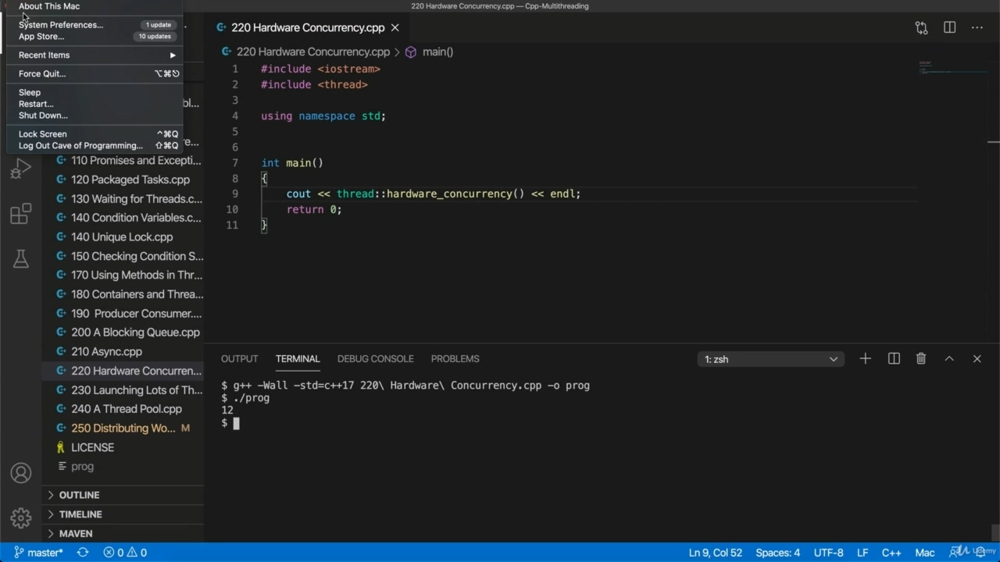
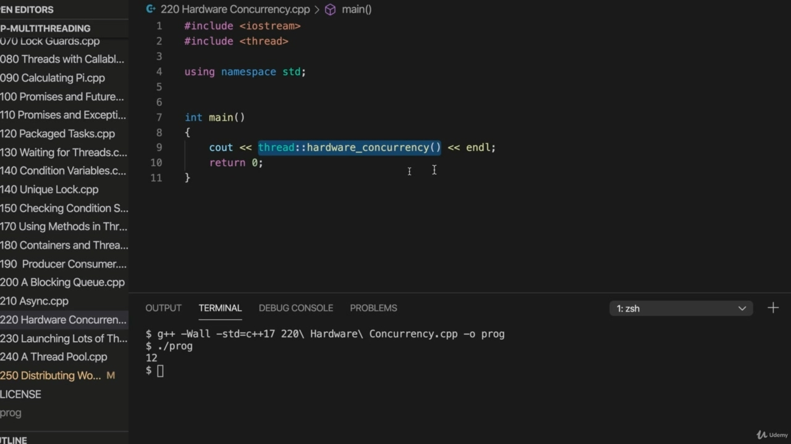
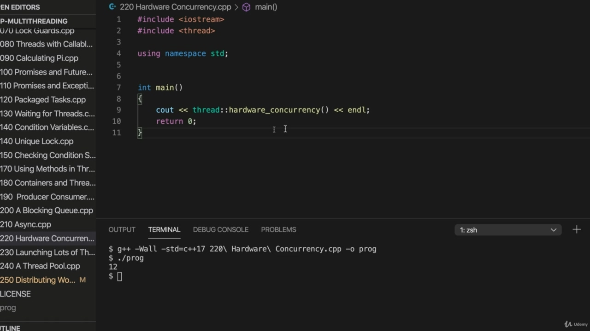
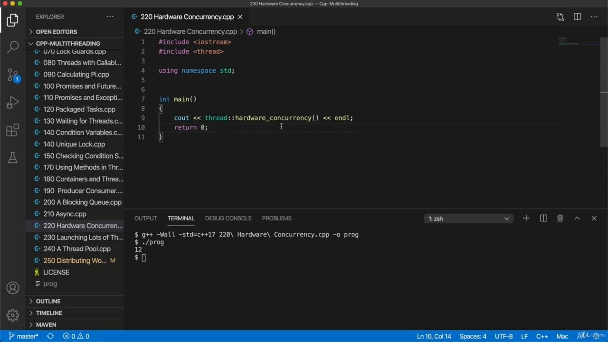

Hello, in this video, we're going to take a look at finding out how many threads we can genuinely Hello, in this video, we're going to take a look at finding out how many threads we can genuinely run at the same time, and to do that, you just need to use a static member of the thread class. So I've included thread here, and it's called hard work on currency. That's a function, so we just ran that. As it and it.

> 您好，在本视频中，我们将了解我们可以真正运行多少线程您好，在这段视频中，我将了解我们能够同时真正运行多少个线程，为此，您只需要使用线程类的一个静态成员。所以我在这里加入了线程，这叫做货币上的艰苦工作。这是一个函数，所以我们运行了它。就像它和它一样。

## img - 28910

As it and it. And for me, it says 12, and that is because I believe if I go to about this Mark, it's because I've

> 对我来说，上面写着 12，这是因为我相信如果我谈论这个马克，那是因为我

## img - 37930

And for me, it says 12, and that is because I believe if I go to about this Mark, it's because I've got this six core machine and the cause of hyper threading technology, meaning they can both run two threads at the same time, more or less. So this number is I don't know how much you can really rely on it, because according to the documentation, well, it is you know, the implementation of it is hardware specific, of course, and it's possible someone may implement it in a way that's different to other people have implemented it or whatever. I don't know what this number is really going to tell you, but if we're fingers crossed, if you're lucky, it is going to tell you how many threads you can run at the same time. And it makes sense that you would want to know that rather than, for example, how many calls you've

> 对我来说，上面写着 12，这是因为我相信，如果我谈论这个 Mark，那是因为我有这台六核机器和超线程技术，这意味着它们可以同时运行两个线程，或多或少。所以这个数字是我不知道你能在多大程度上依赖它，因为根据文档，嗯，你知道，它的实现是特定于硬件的，当然，可能有人会以不同于其他人实现它的方式来实现它。我不知道这个数字真的会告诉你什么，但如果我们是幸运的，如果你幸运的话，它会告诉你你可以同时运行多少线程。你想知道这一点，而不是你打了多少电话，这是有道理的

## img - 130920

And it makes sense that you would want to know that rather than, for example, how many calls you've got or even how many central processing units you've got, you can find stuff out with C++, but only in a way that's very, very, very platform dependent. And what this gives us, you know, bearing in mind C++ as a language has no notion of what a core is or a central processing unit, but it does now have a notion of threads. So it makes sense that it would give us a way of finding out how many threads we can genuinely run at the same time. I would I would say personally, the proof of the pudding is in the eating, meaning, you know, you

> 你想知道的不是，例如，你有多少个调用，甚至有多少个中央处理单元，你可以用 C++找到一些东西，这是有道理的，但只能以一种非常、非常、非常依赖于平台的方式。这给了我们什么，你知道，记住 C++作为一种语言，没有核心或中央处理单元的概念，但它现在有了线程的概念。因此，这将为我们提供一种方法，以了解我们可以同时真正运行多少线程。我想我个人会说，布丁的证据在吃，意思是，你知道，你

## img - 209980

I would I would say personally, the proof of the pudding is in the eating, meaning, you know, you have to try if you got some heavy processing you're doing, you can try running this many threads at the same time, see if it speeds it up. And you can try more. You can try fewer. So in other words, you can practically just find out what actually works for you rather than being

> 我个人会说，布丁的证据就在吃的过程中，这意味着，你知道，如果你在做一些繁重的处理，你必须尝试，你可以尝试同时运行这么多线程，看看它是否能加快速度。你可以尝试更多。你可以少尝试。换言之，你实际上可以找到真正适合你的东西，而不是

## img - 227110

So in other words, you can practically just find out what actually works for you rather than being a slave to this number necessarily. You know, you might get surprising results, but this gives you an indication of how many threads you can genuinely run at the same time. Now, of course, if you're waiting for something external to happen, like if you're, for example, pinging a bunch of your URLs and you want to ping them in sort of groups, it might make sense even to run 100 or 1000 threads at the same time. This is really of interest. If rather than waiting for external things to happen, what you need to do is distribute heavy processing over multiple calls and then you kind of need to know, well, how many how many threads can I really run at the same time versus how many threads, you know, because if you run more than this number of threads, that you can still create those threads, but they operate via time slicing. So you'll get more than one thread running on the same. Core language is getting a bit difficult here because one core can often run two threads now.

> 换言之，你实际上可以找到真正适合你的东西，而不必成为这个数字的奴隶。您知道，您可能会得到令人惊讶的结果，但这表明您可以同时真正运行多少线程。现在，当然，如果你在等待外部的事情发生，例如，如果你正在 ping 一堆 URL，并且你想按组 ping 它们，那么即使同时运行 100 或 1000 个线程也可能有意义。这真的很有趣。如果不是等待外部事件发生，你需要做的是在多个调用上分配繁重的处理，然后你需要知道，我可以同时运行多少个线程，而不是多少个线程。因为如果你运行的线程数超过这个数目，你仍然可以创建这些线程，但它们是通过时间切片来操作的。因此，您将在同一个线程上运行多个线程。核心语言在这里变得有点困难，因为现在一个核心通常可以运行两个线程。

## img - 337950

Core language is getting a bit difficult here because one core can often run two threads now. But for me, if I were to exceed this number of 12, it it would mean that a single core, which on my machine can run two threads at the same time. In theory, it would in fact be running three or four or however many as necessary. But that would happen via time slicing. It would happen by sharing its time out between different threads in small slices. So that's not in a way that's not genuine, multi threading at the processor level. It's just an appearance of multi threading, which, yes, it's good for if you're waiting for external things. But it's not good. If you're doing heavy processing, then you want real, genuine, multi threading all the way down, so to speak. A common thing that people make use of is is a thread pool. And the idea of that is if you've got lots of pieces of work that you want to run in their own threads, then let's say you've got 100 pieces of work. Maybe you want to run at six threads at a time or whatever. So at any given moment, you have six threads going and when one thread finishes, you start up another thread.

> 核心语言在这里变得有点困难，因为现在一个核心通常可以运行两个线程。但对我来说，如果我超过这个数字 12，这意味着一个内核，在我的机器上可以同时运行两个线程。理论上，它实际上会运行三个或四个，或者根据需要运行多个。但这将通过时间切片实现。这将通过在不同线程之间以小片段共享其超时来实现。所以这并不是真正的处理器级多线程。这只是多线程的一种外观，是的，如果您正在等待外部事物，这是很好的。但这并不好。如果您正在进行繁重的处理，那么可以说，您需要真正的、真正的、多线程。人们经常使用的一件事是线程池。这样的想法是，如果你有很多工作要在他们自己的线程中运行，那么假设你有 100 个工作。也许你想一次运行六个线程或者其他什么。所以在任何给定的时刻，你有六个线程在运行，当一个线程完成时，你就启动另一个线程。

## img - 444680

thread. So there's always six until the thing finishes. That's the that's the idea of a thread pool. And we're going to look at how to implement that later on. We're also going to just look at launching lots of threads, because sometimes you just want to launch

> 线所以在事情结束之前总有六个人。这就是线程池的概念。我们稍后将研究如何实现这一点。我们还将研究如何启动大量线程，因为有时您只想启动

## img - 500130

We're also going to just look at launching lots of threads, because sometimes you just want to launch like 12 threads or whatever, all at the same time.

> 我们还将考虑启动许多线程，因为有时您只想同时启动 12 个线程或其他线程。
