Hello, in this video, we're going to take a step towards creating a thread pool by looking at how Hello, in this video, we're going to take a step towards creating a thread pool by looking at how we can run lots of threads at the same time. So there are various ways we can do this, but we are going to use a sink. So at the top here, I'm going to include. Future. I'm also going to include my trusty Crono. And that'll do for the moment, so let's have a function and we're going to pretend that it does some serious work, let's have maybe a anent call it work. I'll make it take an I.D. so it's easy to identify and I'm going to make it output starting. ID, and then we'll simply have a delay here. This thread. What am I doing this on the score thread sleep for and let's make it sleep for some seconds, Crono. And seconds. Three. So let's let's pretend that this is some heavy work that has to be done, that we might want to distribute

> 您好，在本视频中，我们将通过查看如何创建线程池来向创建线程池迈出一步。所以我们有各种方法可以做到这一点，但我们将使用水槽。所以在这里的顶部，我将包括。将来我还将包括我信任的克罗诺。现在就可以了，所以让我们有一个函数，我们要假装它做了一些严肃的工作，让我们有个临时的工作。我会让它有一个身份证，这样很容易识别，我会开始输出。ID，然后我们将在这里延迟。这个线程。我在乐谱线程上做这件事是为了什么？让我们让它睡几秒钟吧，克罗诺。还有几秒钟。三所以，让我们假设这是一项必须完成的繁重工作，我们可能想分配

## img - 123480

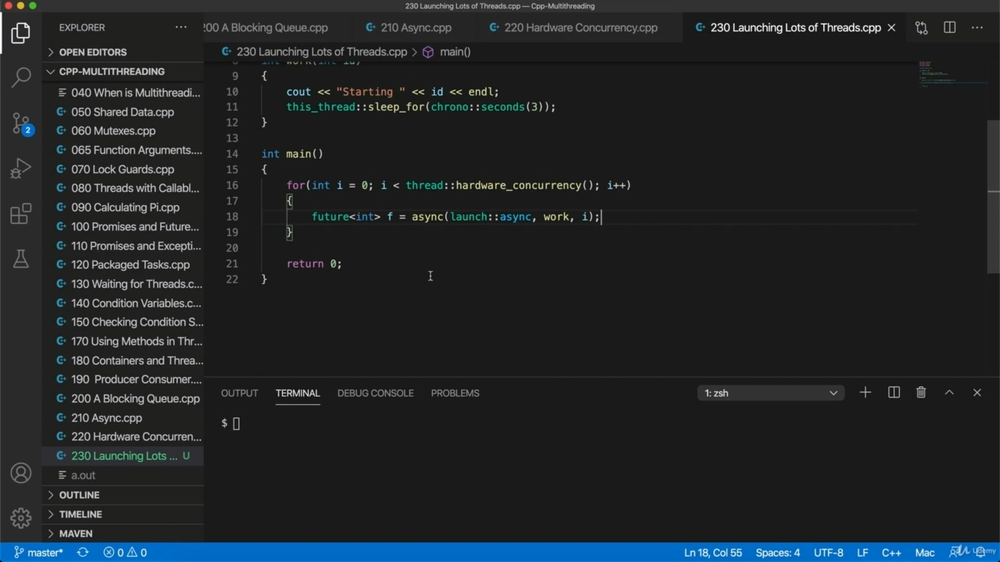

So let's let's pretend that this is some heavy work that has to be done, that we might want to distribute over multiple calls of our machine could also be something some we just want asynchronous behavior where we're waiting for something external. But let's kind of focus on the idea that it's just it's some heavy work that we want to do on multiple calls. So we'll try to launch several of these threads. So we'll do it in a loop for int i int. I equals zero, I less than now what we want to put here. Well, if we simply want the asynchronous behavior, we're waiting for some external resource, we could put some big number potentially. But if we really have some heavy work that needs to be distributed over multiple calls and run in parallel, well, there's no point running. There's no point firing more threads than thread hardware concurrency might need to put. Include. Thread the. So we get the hardware concurrency and I plus plus. So let's fire off some of these using a sink, so we'll get we'll get a future, let's say future will return type of my functions and or call it F and set it equal to a sink. Let's have a launch policy of a sink. Try spelling this correctly as well, so I think we want to run work and we want to give it an ID, so let's use the loop index there. So this is kind of naively what we might do.

> 所以，让我们假设这是一项必须完成的繁重工作，我们可能希望在机器的多个调用上进行分配。这也可能是一些我们只希望异步行为的东西，我们正在等待外部的东西。但是，让我们重点关注这样一个想法：这只是我们想在多个电话上做的一些繁重的工作。因此，我们将尝试启动其中几个线程。所以我们将在一个循环中对 int 进行计算。i 等于零，比现在要放的要少。好吧，如果我们只是想要异步行为，我们正在等待一些外部资源，我们可以潜在地输入一些大的数字。但如果我们真的有一些繁重的工作需要分布在多个调用中并并行运行，那么运行是没有意义的。触发线程数超过线程硬件并发可能需要的线程数是没有意义的。包括穿过。所以我们得到了硬件并发性和 I+plus。所以，让我们使用一个水槽来启动其中的一些，这样我们就可以得到一个未来，假设未来将返回函数的类型，或者将其称为 F，并将其设置为水槽。让我们有一个水槽的启动策略。试着拼写正确，所以我认为我们想运行工作，我们想给它一个 ID，所以让我们在那里使用循环索引。所以这是我们可能会做的天真的事情。

## img - 309150

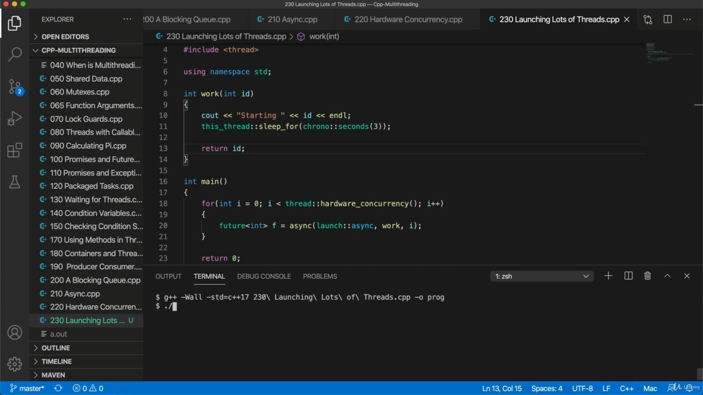

So this is kind of naively what we might do. Let's try it and see what it actually does. So C++ ifn wall IFN standard equals C++ 17 and Arunta 230. Now, if an unnecessary number come later, I found prog. OK, so I got some bracket in the wrong place here. What I do one morning. Oh, yeah, control Ritas end of non-voice function. I want to return something here as well. So I'm just going to return. It will pretend that that's the result of some lengthy and laborious calculation are on prog.

> 所以这是我们可能会做的天真的事情。让我们试试看它到底做了什么。因此，C++ifn 壁 ifn 标准相当于 C++17 和 Arunta 230。现在，如果稍后出现不必要的数字，我找到了 prog。好的，所以我把括号放错了地方。我一天早上做的事。哦，是的，控制非语音功能的 Ritas 结束。我也想在这里还一些东西。所以我要回去了。它会假装这是正在进行的一些冗长而费力的计算的结果。

## img - 349010

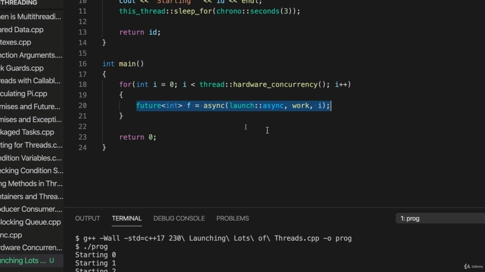

It will pretend that that's the result of some lengthy and laborious calculation are on prog. Starting zero, where are my other threads starting one? Well, this is clearly no good. It's it's running synchronously, not asynchronously. The problem is that the future here is just going out of scope and that's causing these threads to run synchronously. Essentially, we want to keep references to these return futures.

> 它会假装这是正在进行的一些冗长而费力的计算的结果。从零开始，我的其他线程从哪里开始？嗯，这显然是不好的。它是同步运行的，而不是异步运行的。问题是，这里的未来将超出范围，这将导致这些线程同步运行。本质上，我们希望保留对这些回报期货的引用。

## img - 412980

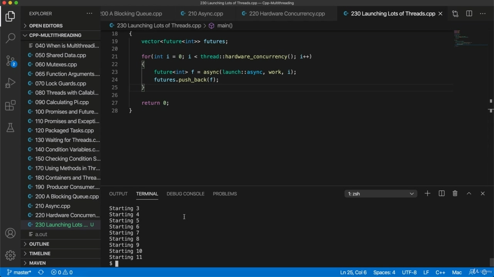

Essentially, we want to keep references to these return futures. So let's put them in a vector at the top here. I'm going to include. Victor. And here, of course, we could just use a different class, but if you want to get a return value, few, I think is particularly convenient. Some effect. What's it going to be a vector of is going to be a vector of futures. That's work with Ms. And let's call that fut.. So now we can at least sleaze factor, let's try it, let's say fut.. Don't push back F. Does this work? It doesn't work, but let's try it.

> 本质上，我们希望保留对这些回报期货的引用。让我们把它们放在顶部的向量中。我要包括在内。胜利者。当然，在这里，我们可以使用不同的类，但是如果你想得到一个返回值，我认为很少有这样的类特别方便。有些影响。这将是一个向量，这将是未来的向量。这是和女士的工作，让我们称之为未来。。所以现在我们至少可以把这个因素丑化，让我们试试，让我们说 fut。。不要推回 F。这行吗？它不起作用，但让我们试试看。

## img - 503560

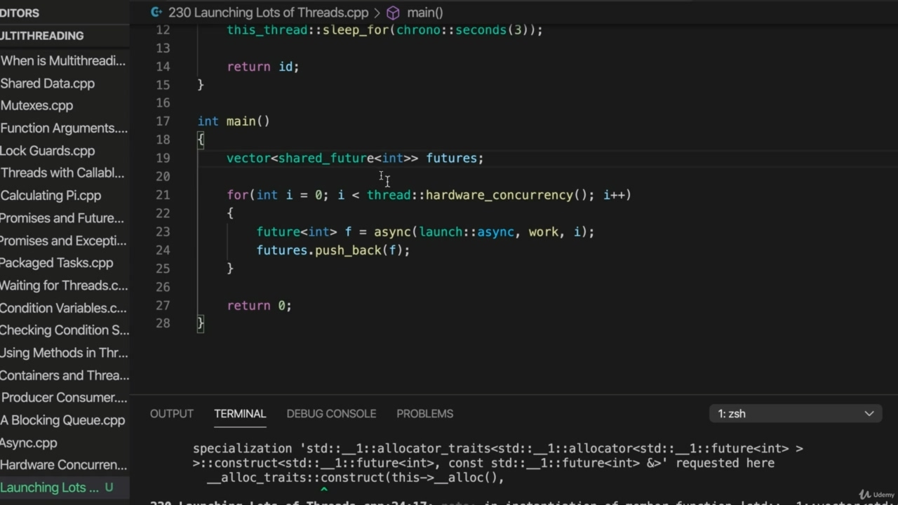

It doesn't work, but let's try it. Try to compile it. It's no good. The issue is here that we can't copy a future. It's not copyable, but there is a thing called a shared future. Let's change this to shed on the school future.

> 它不起作用，但让我们试试。试着编译它。它没用。问题是我们不能复制未来。这是不可复制的，但有一种东西叫做共享未来。让我们改变这一点，以了解学校的未来。

## img - 519830

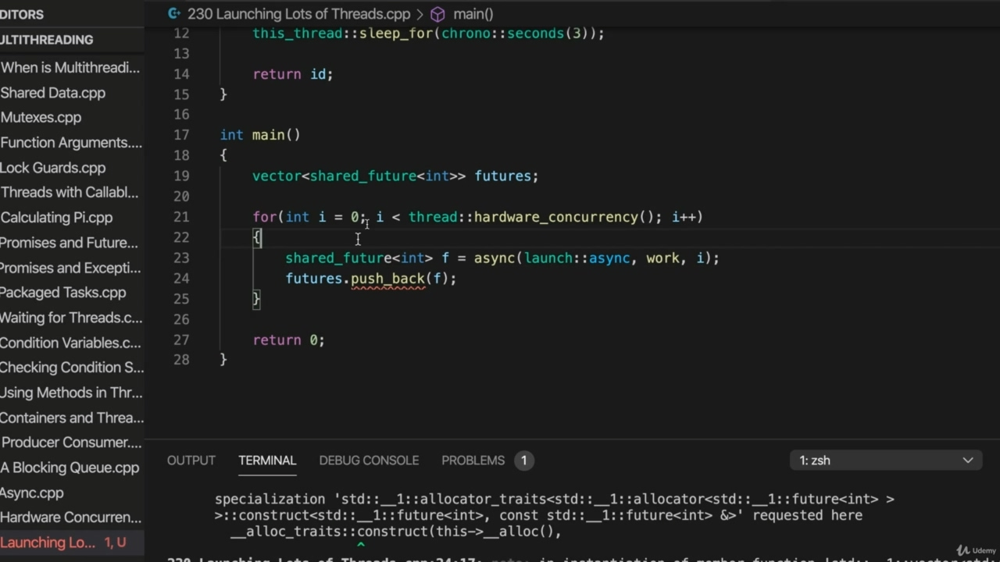

A shared future is copyable. So change this as well, because it turns out a future as a constructor sorry, shared future as a constructor

> 共享的未来是可复制的。所以也要改变这一点，因为它是一个未来的构造函数对不起，共享未来的构造函数

## img - 528590

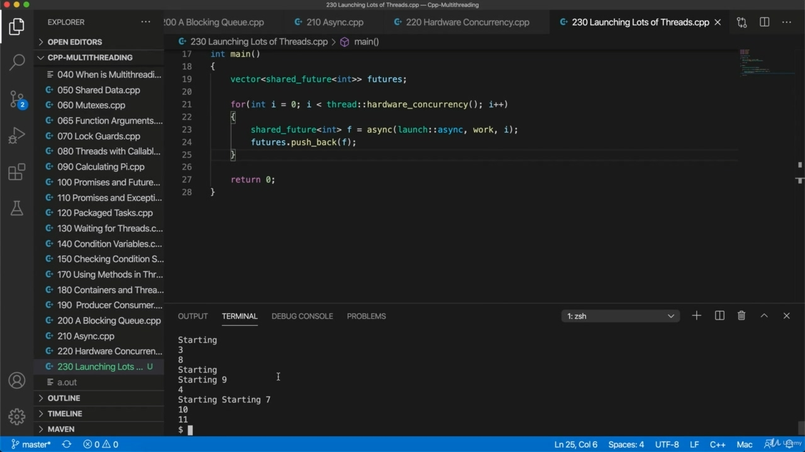

So change this as well, because it turns out a future as a constructor sorry, shared future as a constructor that accepts a future. So simply by changing the return type here, we do end up with a actually with a shared future and we can now add those to our vector. Let's try compiling it. Now, much better, the output here is horribly garbled because writing a line of text is not any kind

> 所以也要改变这一点，因为它变成了一个未来的构造函数对不起，共享的未来是一个接受未来的构造函数。因此，只需改变这里的返回类型，我们就可以得到一个共享的未来，现在我们可以将它们添加到向量中。让我们试着编译它。现在，更好的是，这里的输出非常混乱，因为写一行文本是不可能的

## img - 555870

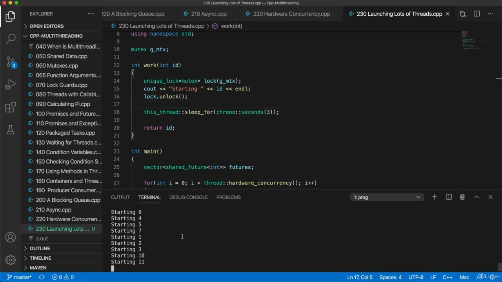

Now, much better, the output here is horribly garbled because writing a line of text is not any kind of atomic operation, but we could actually fix that and make this look a bit nicer using a mutex. So let's include at the top. Mutex. And I'm going to have a global mutex here, since I'm not I'm not really doing anything that's terribly object oriented while I'm using objects, I'm just not defined in classes. So I can't have a member variable. So that's life here. A mutex. On the score, MICEX. And then in work now I want something that I can unlock because I just want to surround this one bit that's doing the see out. I just want to make sure that all of this can only be run by one thread at a time so that my output doesn't get confused. So let's run. Let's do let's use unique lock, which has the has an unlocked method that's going to work with a just normal mutex and let's call it. Lock and passenger mutex. And then after without this tax, we can unlock it, so let's say lock to unlock, that will ensure that we get a nice tidy lines of tax, not sort of garbled output. Let's let's run this. I looks pretty good so we can see that we've started in the case of this particular computer, 12 threads

> 现在，更好的是，这里的输出非常混乱，因为写一行文本不是任何一种原子操作，但我们实际上可以解决这个问题，并使用互斥锁使其看起来更好。所以让我们把它放在顶部。Mutex 公司。我这里将有一个全局互斥锁，因为我不是，我在使用对象时，并没有真正做任何非常面向对象的事情，我只是没有在类中定义。所以我不能有一个成员变量。这就是这里的生活。互斥锁。关于分数，MICEX。然后在工作中，我想要一些我可以解锁的东西，因为我只想围绕着这一点，这一点可以让我看到。我只想确保所有这些一次只能由一个线程运行，这样我的输出就不会混淆。所以让我们跑吧。让我们使用唯一的锁，它有一个解锁的方法，它将与一个普通的互斥锁一起工作，我们称它为.lock 和 passenger 互斥锁。然后，在没有这项税收之后，我们可以解锁它，所以让我们说锁对锁，这将确保我们获得一个整洁的税收，而不是混乱的输出。让我们运行这个。我看起来很好，所以我们可以看到，我们已经开始使用这台特定的计算机，12 个线程

## img - 725100

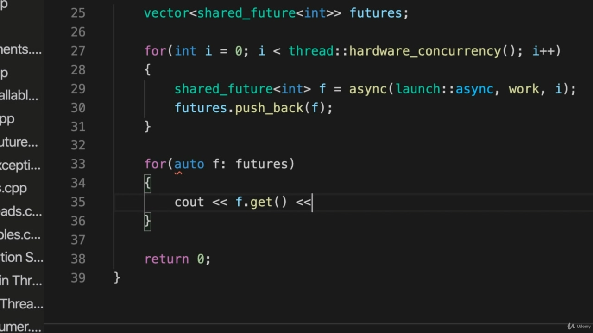

I looks pretty good so we can see that we've started in the case of this particular computer, 12 threads and of course, we could get a return values now quite easily if we do for. Auto, let's call it F in Fut.. We can do Scouts' after get.

> 我看起来很好，所以我们可以看到，我们已经开始使用这个特定的计算机，12 个线程，当然，如果我们这样做，我们现在可以很容易地得到返回值。汽车，让我们称之为 F 在 Fut。。我们可以在得到后做童子军。

## img - 744080

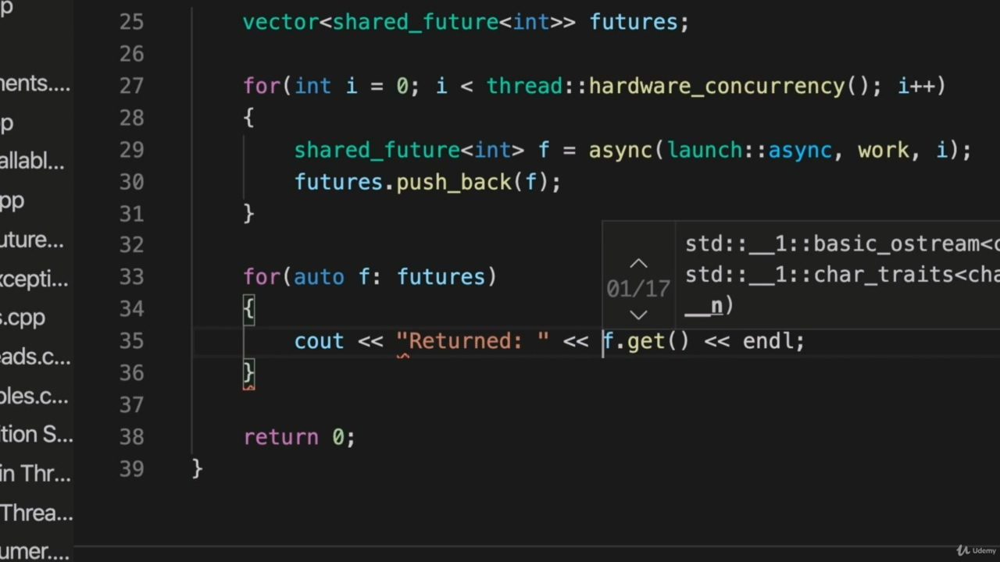

And that's right, returned. And try that.

> “没错，”他回答。试试看。

## img - 747260

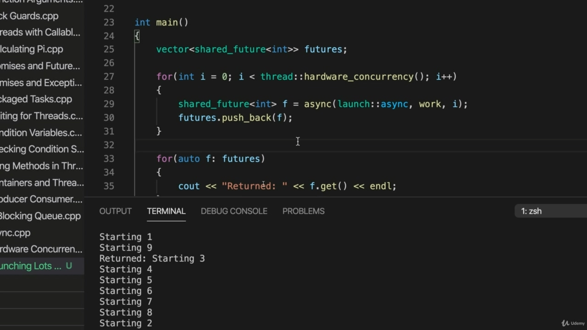

And try that. OK, there we go. So starting you can see that the order of them is, you know, it's kind of all over the place that is just going to depend on how long it takes to throw to start up the fact that we're doing them in. And Lou, doesn't mean that they all start up in a tidy order. Zero, one, two, three, four, five. You know, so therefore, this is going to come out in unpredictable order, depending on exactly when each one gets started. But that's OK. That doesn't matter. And we can see that we've got all our return values. Finally, one, two, three, four, five, six, seven, eight, nine, 10, 11. And they are in order because we push the futures to the vector in order. It's just that because this takes very surmounts of time to start up. Initially, the IDs come out in, you know, kind of order. That's. It's a bit all over the place. OK, so now we can we've seen how to run a bunch of threads, but supposing we've got like a thousand pieces of work or something and we want to run whatever the hard work concurrency is, we want to run

> 试试看。好了，我们开始了。所以，开始你可以看到，它们的顺序是，你知道，这是一种在整个地方，这只是取决于我们需要多长时间来开始事实上，我们正在做它们。而楼，并不意味着它们都以整齐的顺序开始。零，一，二，三，四，五。你知道，因此，这将以不可预测的顺序出现，具体取决于每一个开始的时间。但没关系，没关系。我们可以看到，我们得到了所有的返回值。最后，一、二、三、四、五、六、七、八、九、十、十一。它们是有序的，因为我们将期货按顺序推到向量上。只是因为这需要很长时间才能启动。最初，你知道，身份证是按照某种顺序出来的。那是。到处都是。好的，现在我们可以看到如何运行一堆线程了，但假设我们有一千个工作或其他什么，我们想运行任何困难的并发，我们想

## img - 906890

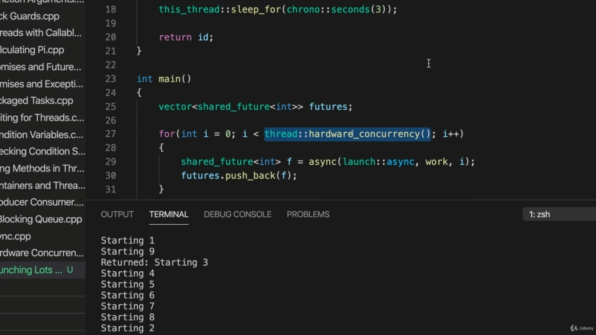

pieces of work or something and we want to run whatever the hard work concurrency is, we want to run that many threads at a time. We're going to we're going to need a thread pool for that. And this one piece, one piece of work finishes. We can start up another thread. That sort of thread pulled us and we will look at that. If you are working with a machine that is by modern standards, a bit underpowered and only has one core, I don't know how likely that is these days, but you can still follow this. You don't have to use hardware concurrency here. And of course, a thread pool is also useful for the situation where you're waiting for some external

> 我们想运行任何困难的并发，我们想一次运行那么多线程。我们需要一个线程池。这一件，一件作品完成了。我们可以启动另一个线程。那条线拉着我们，我们会看看的。如果你使用的是一台现代标准的机器，动力有点不足，只有一个核心，我不知道现在这种可能性有多大，但你仍然可以遵循这一点。这里不必使用硬件并发。当然，线程池对于等待外部线程的情况也很有用

## img - 942980

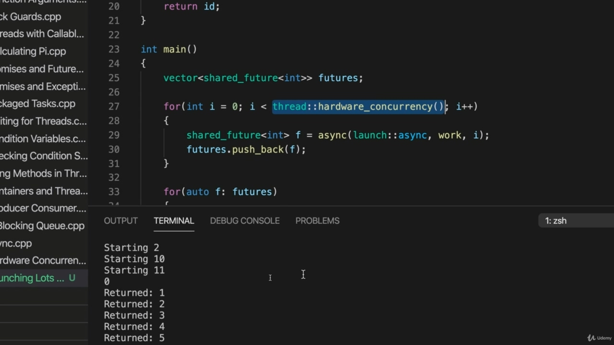

And of course, a thread pool is also useful for the situation where you're waiting for some external resource, in which case maybe you want to run 100 threads at a time or for learning purposes like three threads at a time or whatever.

> 当然，线程池对于等待外部资源的情况也很有用，在这种情况下，您可能希望一次运行 100 个线程，或者出于学习目的，比如一次运行三个线程，等等。
