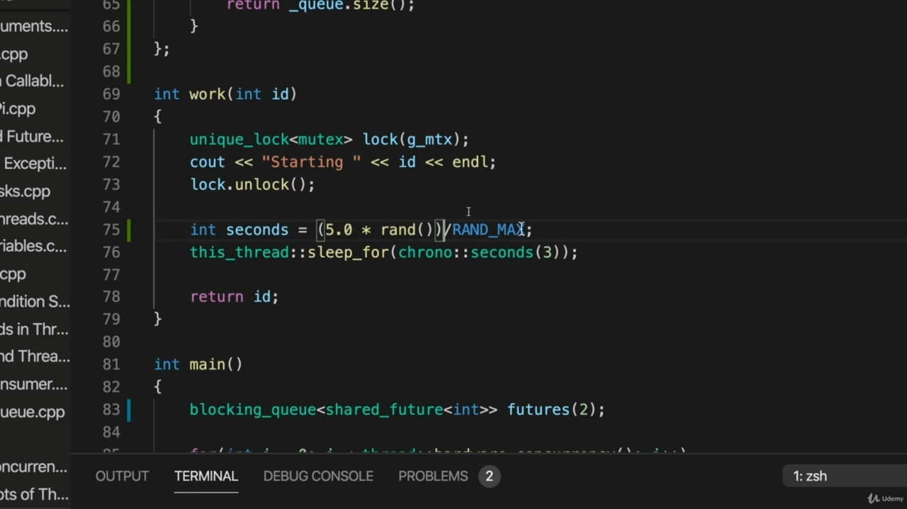
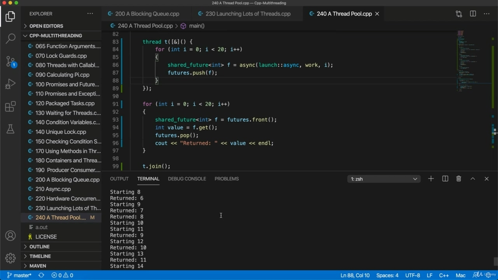

Hello, in this video, we're going to create a thread pool, so I'm going to start from this code that we created last time, which just fires off a bunch of threads. And I'm going to go to my code for a blocking queue and I'm going to copy the blocking queue class that

> 大家好，在本视频中，我们将创建一个线程池，所以我将从上次创建的代码开始，它只是启动了一堆线程。我将转到阻塞队列的代码，然后复制阻塞队列类

## img - 18360

And I'm going to go to my code for a blocking queue and I'm going to copy the blocking queue class that we created because we're going to use that. And of course, I haven't packaged it was I normally would in a separate file, so I'm just going to copy the thing. So let's paste it into our code now from the last video underneath this global mutex. So now we've got our blocking queue and I need to adhere to include queue because blocking queue uses

> 我将转到阻塞队列的代码，我将复制我们创建的阻塞队列类，因为我们将使用它。当然，我还没有把它打包成一个单独的文件，所以我只是复制它。现在，让我们将它粘贴到这个全局互斥锁下面的最后一段视频中的代码中。现在我们得到了阻塞队列，我需要坚持使用 include 队列，因为阻塞队列使用

## img - 41640

So now we've got our blocking queue and I need to adhere to include queue because blocking queue uses that. OK, now let's check that the code that we've got and alter it appropriately, so instead of using a vector, I'm going to use a blocking Q. Now we're going to supply a number to the constructor of blocking queue, and this is going to be one less than the total number of threads that we want to create, one less, because as we see, that's just kind of an artifact of how I've implemented this. Now, what should the number of threats that we create actually be? Well, if you've got if your function that's doing your work is a CPU intensive function and you want to distribute the work efficiently over however many threads you can actually run at the same time, literally run at the same time on different calls, then you probably want to set this number to, well, it would be one less than hardware concurrency.

> 所以现在我们有了阻塞队列，我需要坚持使用 include 队列，因为阻塞队列使用了它。好的，现在让我们检查我们得到的代码，并适当地修改它，所以我将使用一个阻塞 Q，而不是使用向量。现在我们将向阻塞队列的构造函数提供一个数字，这将比我们要创建的线程总数少一个，因为正如我们所看到的，这只是我实现这一点的一种假象。现在，我们实际制造的威胁数量应该是多少？如果你的工作函数是一个 CPU 密集型函数，你想将工作有效地分配到你可以同时运行的线程上，实际上可以同时在不同的调用上运行，那么你可能想将这个数字设置为，比硬件并发少一个。

## img - 154130

Because you want if let's say you've got four calls, you want to run for thread's at the same time for maximum efficiency to get through to work as fast as possible, if you're waiting for some external resource and you just want asynchronous functions here, then you might choose a number that's much bigger than that. But for demonstration purposes here. That's right, too. In other words, we're going to run a maximum of three threads at any given time to make this a bit more realistic. I'm going to alter this work function a little bit. Let's have a int milliseconds here or actually let's call it in seconds. Equals and I'm going to choose a random number of seconds to do that, actually, let's add at the top here the header. Include CMF.

> 因为如果假设您有四个调用，您希望同时运行线程，以获得最大的效率，从而尽可能快地完成工作，如果您正在等待一些外部资源，而您只需要这里的异步函数，那么您可以选择一个比这大得多的数字。但出于演示目的。这也是对的。换句话说，我们将在任何给定的时间最多运行三个线程，以使这一点更加现实。我要稍微改变一下这个功函数。我们在这里设一个 int 毫秒，或者实际上以秒为单位。等于，我会选择一个随机的秒数，实际上，让我们在顶部添加标题。包括 CMF。

## img - 254280

And then I can use the function rund to calculate the number of seconds so I can use Rund, which returns a number up to run marks, if I were to divide it by run marks, I get a number from zero to one, at least if I do floating point division. And if I multiply that by, let's say, five point nought. Then I should get a number from zero to five.

> 然后我可以使用 rund 函数来计算秒数，这样我就可以使用 rund，它返回一个直到运行标记的数字，如果我用运行标记来除它，我得到一个从零到一的数字，至少如果我做浮点除法。如果我把它乘以五分零。然后我应该得到一个从零到五的数字。

## img - 325450

And let's maybe add let's maybe add sort of to Montvale, something of three, I just want them all to finish at different times, to take different amounts of times to make this a bit more realistic. And I'm going to put. Seconds in here probably also have to come to an end. OK, I think that'll will do the trick now. So let's take a look at our loop here, so we're going to be running maximum three threads at any given time, one more than the figure we supply here. But I want to run a total of, let's say, 20 threads, which I'm just going to type there. So we create we fire off our thread using a sink. And then I'm going to use push to add that future to our cue. And what happens is because the queue size is too. When after we've already done this twice. The next time Bush is going to block so we do this two times, we add those to our queue is no problem, then we create another thread, a third thread. So we've got three threads running. And when we try to push it, that will now block. And that's what we want. We want to be constrained so we can only run three threads at a given time. And that's why this number for this particular code has to be one less than the total number of threads that we want to run at a given time, because we're going to fire off that thread and then find that this blocks this has this code here. We should run it in its own thread because at the same time, we want to be popping values off the queue later on. So to do that, let's just use the thread class, let's use thread and we'll have a lambda expression. And I'm going to catch a local variables, variables by reference, just because I want blocking here and I'm going to move this into that lambda expression, move this loop in there. So it looks like this now we're going to sort of go through the cue, starting with the front of the

> 让我们再加上一点，让我们再给蒙代尔加上三点，我只是希望他们都能在不同的时间完成，花费不同的时间，让这更现实一点。我要把。这里的几秒钟可能也要结束了。好的，我想现在就可以了。所以让我们看看这里的循环，所以我们在任何给定的时间最多运行三个线程，比我们这里提供的数字多一个。但我想运行总共 20 个线程，我将在那里键入这些线程。因此，我们创建并使用水槽启动线程。然后我将使用 push 将未来添加到我们的提示中。发生这种情况是因为队列大小太大。当我们已经做了两次之后。下一次 Bush 要阻塞时，我们会这样做两次，我们将它们添加到队列中。这没问题，然后我们创建另一个线程，第三个线程。所以我们有三个线程在运行。当我们试图推动它时，它现在会被阻挡。这就是我们想要的。我们希望受到约束，因此在给定时间只能运行三个线程。这就是为什么这个特定代码的数量必须比我们在给定时间内要运行的线程总数少一个，因为我们要启动那个线程，然后发现这个块，这里有这个代码。我们应该在它自己的线程中运行它，因为同时，我们希望稍后从队列中弹出值。为此，让我们只使用线程类，让我们使用线程，我们将得到一个 lambda 表达式。我将捕捉一个局部变量，通过引用获取变量，因为我想在这里进行阻塞，我将把它移到 lambda 表达式中，把这个循环移到那里。所以现在看起来像这样，我们要从前面开始

## img - 534020

So it looks like this now we're going to sort of go through the cue, starting with the front of the queue. So I haven't haven't got haven't implemented sort of range based for the functionality for my Q But I know that I'm going to create 20 threads in total, so I'm going to just loop 20 times here in the main thread. And for each loop, I'm going to do shared future of and we'll call it F equals futures are blocking

> 所以现在看起来像这样，我们要从队列的前面开始，来完成提示。所以我还没有为我的 Q 实现基于范围的功能，但我知道我将总共创建 20 个线程，所以我将在主线程中循环 20 次。对于每一个循环，我要做的是共享未来，我们称之为 F 等于期货阻塞

## img - 603180

And for each loop, I'm going to do shared future of and we'll call it F equals futures are blocking Q dot front. So we're going to get the front of the queue and then we're going to say in value equals get. So we actually now we block here, we wait for the thread to finish and then we get the value that it returns, that it somehow calculates and after it does that we're going to output the value. And here's the really important bit. After each thread finishes, then we're going to do futures dot pop. So we're going to pop off the front of the queue. So the number of futures that this thread here can actually push onto the queue is constrained by the size of the queue. And that in turn ends up being constrained by how rapidly we remove items from the queue.

> 对于每一个循环，我将做一个共享的未来，我们称之为 F。所以我们将得到队列的最前面，然后我们将说 in 值等于 get。所以我们现在实际上在这里阻塞，我们等待线程完成，然后我们得到它返回的值，它以某种方式计算，然后我们将输出该值。这是最重要的一点。每个线程完成后，我们将进行期货点弹出。所以我们要从队列的前面跳出来。因此，这个线程可以实际推送到队列中的期货数量受到队列大小的限制。而这反过来又受制于我们从队列中移除项目的速度。

## img - 657390

And that in turn ends up being constrained by how rapidly we remove items from the queue. And that means we're only going to be creating maximum, in this case three three threads at any one time. Let's also put in here at the end join. Otherwise we'll end up finishing the main thread a little bit prematurely and cutting this thread. I forgot to call it T to call it T here or call it something, but I need to wait. I need my main threat to wait until this is totally finished, otherwise I'll get an error message. So that's why I need to join. OK, let's try this or compile it. And runit. And we find it starts three threads, they take various amounts of time to finish, but as soon as one

> 而这反过来又受制于我们从队列中移除项目的速度。这意味着我们只会创建最大值，在本例中，任何时候都会创建三个三线程。让我们在这里加入最后的连接。否则，我们将过早地完成主线，并切割此线。我忘了叫它 T，在这里叫它 T 或者叫它什么，但我需要等待。我需要我的主要威胁等待，直到完全完成，否则我会收到一条错误消息。所以这就是我需要加入的原因。好的，让我们试试这个或编译它。然后运行它。我们发现它从三个线程开始，它们需要不同的时间来完成，但只要一个线程

## img - 738110

And we find it starts three threads, they take various amounts of time to finish, but as soon as one finishes, then I start another one.

> 我们发现它启动了三个线程，它们需要不同的时间来完成，但一旦一个线程完成，我就启动另一个线程。

## img - 740960

finishes, then I start another one. So once once I've created three, the queue is then blocking. It's not letting me add that third thread to the queue. And I have to wait for a thread to finish until I can add another thread. Until that push will let me add another thread to the queue and I'm popping them off basically as soon as each one finishes. So at any given time now you can see, I think that it's not easy to see, but I've got three threads running at any given time. So that's that's our thread pool and we can work through in this case, we're working through 23 ads that are all doing something, but we only run three threads at a time. And typically, if we add CPU intensive work, would want to fire off a number of threads at a given That's equal to, of course, the number of threats that we can genuinely run simultaneously equal to our hardware. Concurrency and this is just an incredibly useful pattern is extremely useful if you've got a bunch of threats that you want to run because you don't usually want to run them all at the same time. If you've got loads of threats, you want to work through them in groups. And this ensures that at any point in time you've got three balls in the air, you've got three threats. In this case, running at any given time is the bit annoying, the way I've implemented this, that I have to put one less than the actual number of threats that we want to run here. But that's very minor inconvenience.

> 完成，然后我开始另一个。所以一旦我创建了三个，队列就会阻塞。它不允许我将第三个线程添加到队列中。我必须等待一个线程完成，直到可以添加另一个线程。在推送之前，我可以将另一个线程添加到队列中，基本上每一个线程完成后，我都会将它们弹出。所以在任何给定的时间，你都可以看到，我认为这不容易看到，但我在任何给定时间都有三个线程在运行。这就是我们的线程池，我们可以通过它来工作。在这种情况下，我们正在处理 23 个广告，它们都在做一些事情，但我们一次只运行三个线程。通常，如果我们增加 CPU 密集型工作，我们会希望在给定的时间内启动多个线程。当然，这等于我们可以真正同时运行的威胁数量，等于我们的硬件。并发，这是一个非常有用的模式，如果你有一堆威胁，你想运行，因为你通常不想同时运行它们，那么这个模式非常有用。如果你有大量的威胁，你想分组处理。这确保了在任何时候你有三个球在空中，你有三种威胁。在这种情况下，在任何给定的时间运行都有点烦人，我实现这一点的方式是，我必须比我们希望在这里运行的实际威胁数量少一个。但这是很小的不便。
