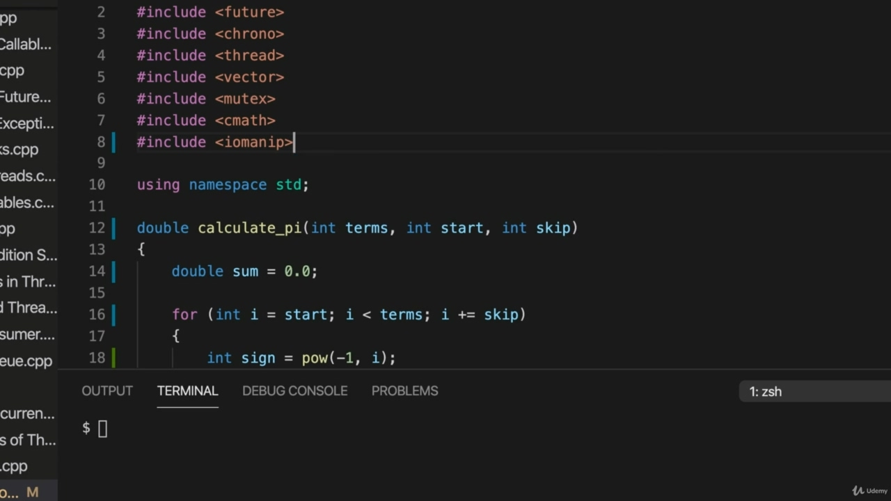

Hello, in this video, we're going to take a look at an actual example of distributing some CPU intensive Hello, in this video, we're going to take a look at an actual example of distributing some CPU intensive work between multiple cores. So I'm going to calculate PI using the function that I wrote previously. And I'm going to start from this code that I wrote for an example of distributing, of running sorry, running lots of threads at the same time. So back from the video and launching lots of threads where we didn't use a thread pool, we just launched lots of threads at the same time using a sink. I'm going to start from that code. I don't see any of any advantage here to using thread pool. If I wanted to kind of go easy on my computer, I suppose I could use lots of threads and put small delays in all of them and then maybe run them in a thread, pull something over a long period of time. But here my aim is just to calculate PI and run my computer flat out, get it calculated as quickly as possible. So I'm going to go to the video on Calculating Pi and copy the function from that and paste it into this code from the video on launching lots of threads at the same time.

> 您好，在本视频中，我们将查看在多个内核之间分配一些 CPU 密集型工作的实际示例。所以我要用我之前写的函数来计算 PI。我将从我为分发、运行抱歉、同时运行许多线程的示例编写的代码开始。因此，回到视频中，在我们没有使用线程池的情况下启动了很多线程，我们只是使用一个汇点同时启动了许多线程。我将从代码开始。我看不出使用线程池有什么好处。如果我想在我的计算机上轻松一点，我想我可以使用很多线程，并在所有线程中放置一些小延迟，然后在线程中运行它们，在很长一段时间内拉动一些东西。但在这里，我的目标只是计算 PI 并运行我的计算机，尽可能快地进行计算。所以我要去看关于计算圆周率的视频，从中复制函数，并将其粘贴到视频中同时启动许多线程的代码中。

## img - 123370

this code from the video on launching lots of threads at the same time. So that has this work function in it and there's also a mutex there. I'm going to get rid of those and replace them with calculate pi.

> 这段代码来自同时启动多个线程的视频。这里面有一个功函数，还有一个互斥锁。我要去掉这些，用计算圆周率代替它们。

## img - 132450

I'm going to get rid of those and replace them with calculate pi. Now, the question is, how can we actually calculate PI in multiple threads rather than in a single thread? One thing is I just need to add some math here because I use the power function from that and calculate PI. So I wrote my function in a way it's not optimized at all deliberately. But what it does do is it it has this index that runs up to a specified number of terms and it calculates something for each of those indexes and adds all of those together. So let's say I wanted to split this into two threads. And actually, if you want to if you want an exercise, you could pause the video and see if you can work out how to do this. But you can probably see that if we had one function that was starting with AI equal to zero and then calculating the values for two, four, six, eight, ten and so on and adding those up, then we could have another function where I starts with one and calculates values for one three five seven nine eleven and so on and adds those up. And then we bring those two results together at the end and we have pi.

> 我要去掉这些，用计算圆周率代替它们。现在，问题是，我们如何在多个线程中而不是在单个线程中实际计算 PI？一件事是，我只需要在这里添加一些数学，因为我使用了其中的幂函数并计算 PI。所以我用一种完全没有刻意优化的方式来编写函数。但它所做的是，它有一个索引，可以运行到指定数量的项，它为每个索引计算一些值，并将所有这些值相加。假设我想把它分成两个线程。事实上，如果你想锻炼，你可以暂停视频，看看你能不能想出怎么做。但你可能会看到，如果我们有一个函数，从 AI 等于零开始，然后计算 2、4、6、8、10 等的值，然后将它们相加，那么我们可以有另一个函数。然后我们把这两个结果放在一起，得到 pi。

## img - 246300

And then we bring those two results together at the end and we have pi. Similarly, I could I could have three functions where we start with the value zero one and two and one function adds three to pi every time another function adds, while they all are three to pi every time. But they start from different positions in the sequence. Hopefully you can see what I mean, but let's actually implement that. So I've got an internal parameter here. I'm going to also have an inside start and an Inskip parameter and start is going to control where I start. I from an SEP is going to control what I add to PI at I every time.

> 然后我们把这两个结果放在一起，得到 pi。类似地，我可以有三个函数，我们从值零一和零二开始，一个函数每次增加三个 pi，而它们每次都是三个 pi。但它们从序列中的不同位置开始。希望你能明白我的意思，但让我们真正实现这一点。所以这里有一个内部参数。我还将有一个内部启动和一个 Inskip 参数，启动将控制我的启动位置。来自 SEP 的我将控制每次在 PI 中添加的内容。

## img - 341750

So this gives me a function that I can interleave if I set start to zero and I set Skip to one, that will be the same as the function we originally had. Now, I'm going to take this. I'm going to scroll down and go to where we previously launched this work function. I'm going to launch calculate PI instead. So the first argument this function requires is the number of times to calculate I'm going to put 187. The second one is now were to start from where to start calculating from in terms of the index that it uses for that, I'm going to use I from this loop here. And the last parameter is going to be that skip value, which should be set to this hard work on currency value. It's going to be set to the same as the number of threads that we actually start up. Let's actually take this out of there and create a constant. Concurrency. He calls that and then I can use that here. And also here.

> 所以这给了我一个函数，如果我将 start 设置为 0，将 Skip 设置为 1，我可以交错，这将与我们最初的函数相同。现在，我要接受这个。我将向下滚动并转到我们之前启动此工作功能的位置。我将启动计算 PI。所以这个函数需要的第一个参数是计算的次数，我要放 187。第二个问题是，现在要从哪里开始计算，根据它使用的索引，我将在这里使用这个循环中的 I。最后一个参数将是跳过值，它应该设置为货币值上的艰苦工作。它将被设置为与我们实际启动的线程数相同。让我们把它去掉，创建一个常数。并发性。他这样称呼我，然后我就可以在这里使用了。还有这里。

## img - 503130

And we also need to make this shared future work with the tight double instead of. So if you look at this code, hopefully you can't you can't convince yourself that indeed. This will calculate PI in multiple threads. So when we get the return values, we need to add them up of all these different threads, so let's say here, double some equals nought point nought. And I'm going to add on top get futa top get every time, so some plus equals aftercare and then at the end we can output the value that we've got.

> 我们还需要让这种共享的未来与紧密的双重作用而不是。所以，如果你看了这段代码，希望你不能，你确实无法说服自己。这将在多个线程中计算 PI。所以当我们得到返回值时，我们需要将所有这些不同的线程相加，所以让我们在这里说，加倍一些等于零点零。我打算每次都在上面加上一个，然后再加上一点，这样加上一些就等于善后，最后我们就可以输出我们得到的价值。

## img - 541720

the end we can output the value that we've got. That's including manip at all. Include Io Manit.

> 最后我们可以输出我们得到的值。这包括玛尼普在内。包括 Io Manit。

## img - 555580

And I'm going to do here setout. And I'm actually going to output the value of pi here. Using the constant Amanda SCoPI from C math, because I want to other or authoritative version of what it actually is for some reason, this is code likes to give me an error here, but there is no error is perfectly fine. And let's also output are calculated by. So that's going to be this some. I want to set precision as well, so set precision 15.

> 我要在这里出发。我实际上要在这里输出 pi 的值。使用 C math 中的常量 Amanda SCoPI，因为出于某种原因，我想要其他或权威版本的实际情况，这是代码喜欢在这里给我一个错误，但没有错误。我们也可以通过计算输出，这就是一些。我也想设置精度，所以设置精度 15。

## img - 632320

I want to set precision as well, so set precision 15. And it's copy that and put it into the second one also.

> 我也想设置精度，所以设置精度 15。这是复制，并将其放入第二个。

## img - 646120

OK, so I'll try to compile this in spite of visual studio code thinking, I've got an error, it actually does compile and if I run it, we get very quickly a value for PI, which is OK.

> 好的，所以我将尝试编译这个，尽管 visual studio 代码在思考，我有一个错误，它确实编译了，如果我运行它，我们很快就会得到 PI 的值，这是可以的。

## img - 653770

does compile and if I run it, we get very quickly a value for PI, which is OK. Actually, it would be better if I aligned this a bit better. Let's just put an extra space in the. And run it again. So you can see this is pretty good value up to a certain point, I could actually, of course, try more figures here, but what I'm going to do is not I've got this working in the next video. I'm just going to put in some code to time this.

> 如果我运行它，我们会很快得到 PI 的值，这是可以的。事实上，如果我更好地对齐它会更好。让我们在里面放一个额外的空间。然后再次运行。所以你可以看到这在一定程度上是很好的价值，当然，我可以在这里尝试更多的数字，但我要做的是，我在下一个视频中得到了这一点。我只是想输入一些代码来计时。
