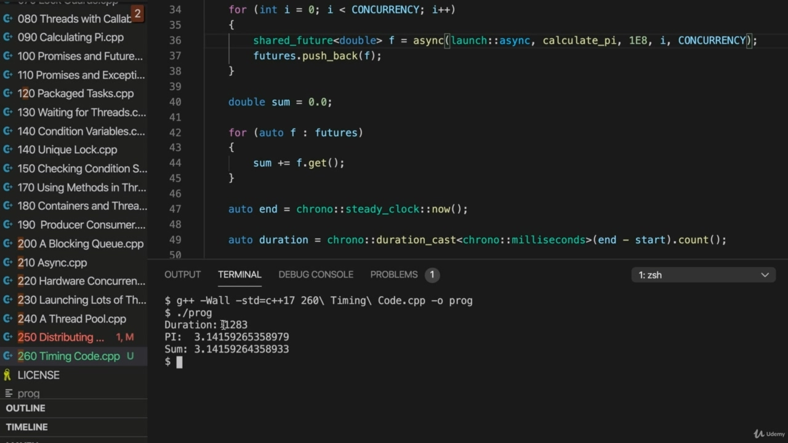

Hello, in this video, I'm just going to try to somehow, roughly time the code that I've got just Hello, in this video, I'm just going to try to somehow, roughly time the code that I've got just to see what kind of speed up we get from running it in multiple threads. And in fact, if you look at the documentation for Crono Time point, that's got exactly an example

> 你好，在这段视频中，我将尝试以某种方式大致计时我得到的代码你好，在这个视频中，我们将尝试以何种方式大致计时代码，看看我们在多个线程中运行它会获得什么样的速度。事实上，如果您查看 Crono 时间点的文档，这就是一个示例

## img - 18380

And in fact, if you look at the documentation for Crono Time point, that's got exactly an example in it of finding a time interval so that we can make use of this Crono study clock time point. Let's do that. So. I'll go up to before we run anything. Let's maybe start here, because at this point, we definitely have an attempted to calculate anything yet we haven't even started up a thread and let's say or to begin equals or maybe start. Auto start equals Crono. Steady clock now. And when we finished calculating things down here, let's say auto.

> 事实上，如果你看一下 Crono 时间点的文档，里面正好有一个例子，就是找到一个时间间隔，这样我们就可以利用这个 Crono 研究时钟时间点。让我们这样做吧。所以，在我们做任何事情之前，我会去的。让我们从这里开始，因为在这一点上，我们肯定已经尝试过计算任何东西，但我们甚至还没有启动线程，让我们说，或开始等于或开始。自动启动等于 Crono。现在时钟稳定。当我们计算完这里的东西时，让我们假设自动。

## img - 105210

And when we finished calculating things down here, let's say auto. And equals Crono. Steady clock. Now, again, and I will take the difference between the two so we can do.

> 当我们计算完这里的东西时，让我们假设自动。并且等于克罗诺。时钟稳定。现在，再次，我将考虑两者之间的差异，以便我们能够做到。

## img - 118930

Now, again, and I will take the difference between the two so we can do. And minus start. And then according to the documentation. If we called account function on that, and then we have to use this Crono duration cast. To get it into the form that we want and I can right here, Crono. Milliseconds. And that will return as a number of milliseconds. Between, between and and.

> 现在，再次，我将取两者之间的差值，这样我们就可以做了。然后根据文件。如果我们调用了帐户函数，那么我们必须使用这个 Crono 持续时间强制转换。把它变成我们想要的形式，我可以在这里，克罗诺。毫秒。这将以毫秒数返回。介于、介于和之间。

## img - 157280

Between, between and and. Start. So let's try that, and that's that's actually I've literally just taken this code from the documentation here, more or less, pretty much exactly the same, almost. OK, so let's output this. Let's do see out. Duration. And we'll try it. So at the moment, I've got my concurrency value is set to hardworking currency, which for my system is twelve. So that means we're going to be running 12 threads at the same time. Let's run this, compile it and run it. And I find that the duration is 22 milliseconds. Now, supposing I change concurrency to one. So we're not running it multithreaded at all, basically, let's see how long it takes then to calculate

> 介于、介于和之间。开始所以让我们尝试一下，这就是我从这里的文档中得到的代码，或多或少，几乎完全相同。好的，让我们输出这个。让我们看看。期间现在，我的并发值设置为工作货币，我的系统是 12。这意味着我们将同时运行 12 个线程。让我们运行这个，编译并运行它。我发现持续时间是 22 毫秒。现在，假设我将并发性更改为 1。所以我们根本没有多线程运行它，基本上，让我们看看计算需要多长时间

## img - 302780

So we're not running it multithreaded at all, basically, let's see how long it takes then to calculate PI. So compile it and run it, and we've got 131 milliseconds and I've tried this with I've tried this even

> 所以我们根本没有多线程运行它，基本上，让我们看看计算 PI 需要多长时间。所以编译并运行它，我们有 131 毫秒的时间，我已经试过了，我甚至试过了

## img - 316400

So compile it and run it, and we've got 131 milliseconds and I've tried this with I've tried this even with increasing this number of terms in the calculation to get a more accurate value of PI, I've tried increasing that and I get similar results there. So 22 times, 12 is not 131 is is the bottom line here. By running 12 threads, even though apparently that's the number of threads that my computer can genuinely run at the same time, I didn't get a 12 time speed up. Now, I think there are a variety of complicated reasons for that, which I don't understand well, but we have to remember, for one thing, that the computer is doing other things, a lot of things besides running our code, but apparently also with hyper threading. So where you have one core that can run two or more threads at the same time, you don't get a genuine kind of two time speed up by dividing one thread into two and running them at the same time. Because there are there things that have to happen as kind of a cost to running these two threads. They have to somehow synchronize with each other or whatever, and you don't get a full time speed up. If I actually had one or two independent central processing units, then yes, I would get pretty much 12 times speed up by running 12 threads instead of one. But the fact is, I don't I don't know, 12 genuinely independent central processing units. I've got one central processing unit with six cores that are doing sort of hyper threading, that are

> 所以编译并运行它，我们得到了 131 毫秒的时间，我已经尝试过了，我甚至尝试过增加计算中的项的数量，以获得更精确的 PI 值，我尝试过增加它，我得到了类似的结果。所以 22 次，12 不是 131 是这里的底线。通过运行 12 个线程，尽管这显然是我的计算机可以同时运行的线程数，但我并没有获得 12 倍的速度。现在，我认为这有很多复杂的原因，我不太明白，但我们必须记住，一方面，计算机在做其他事情，除了运行代码之外，还有很多事情，但显然也有超线程。因此，如果有一个内核可以同时运行两个或多个线程，那么通过将一个线程分成两个并同时运行它们，就不会获得真正的两倍速度。因为运行这两个线程需要付出一些代价。它们必须以某种方式相互同步，或者其他什么的，而你不能得到全时的速度。如果我实际上有一个或两个独立的中央处理器，那么是的，通过运行 12 个线程而不是一个线程，我的速度会提高 12 倍。但事实是，我不知道，12 个真正独立的中央处理器。我有一个中央处理单元，它有六个内核，可以进行超线程处理

## img - 455900

I've got one central processing unit with six cores that are doing sort of hyper threading, that are running two threads each. So it's not as spectacular as you might imagine. But there is clearly the there is a massive speed up and he would really notice it. Or you you will if I increase the number of terms or you would you know, I mean, this could this could be something that takes days to do. And you would definitely be grateful for getting like a very significant speed up like this. Let's just run this. And so if I run this now. Now, there's a really noticeable delay, now it's taking one to three milliseconds, more than the

> 我有一个中央处理单元，它有六个内核，正在执行某种超线程，每个内核运行两个线程。所以这并不像你想象的那么壮观。但很明显，这是一个巨大的速度，他会真的注意到它。或者你，如果我增加条款的数量，你会知道，我的意思是，这可能需要几天的时间才能完成。你肯定会很感激这样一个非常显著的速度。让我们运行这个。所以如果我现在运行这个。现在，有一个非常明显的延迟，现在需要一到三毫秒，比

## img - 532050

Now, there's a really noticeable delay, now it's taking one to three milliseconds, more than the second, if I change this back to hard work on currency.

> 现在，有一个非常明显的延迟，现在需要一到三毫秒，而不是一秒钟，如果我把这改回货币方面的努力。

## img - 539600

Let's try it. Whereas now it's you can hardly see there's a delay, 171 milliseconds, so it seems to scale like that,

> 让我们试试看。现在你几乎看不到有 171 毫秒的延迟，所以它看起来像这样，

## img - 549430

Whereas now it's you can hardly see there's a delay, 171 milliseconds, so it seems to scale like that, we don't get 12 times speed. But it really can make a big difference nevertheless. OK, so we'll leave it there for this video.

> 而现在，你几乎看不到有 171 毫秒的延迟，所以它看起来是这样的，我们没有得到 12 倍的速度。但它确实可以带来很大的不同。好的，所以我们就把它放在这里看这个视频。
