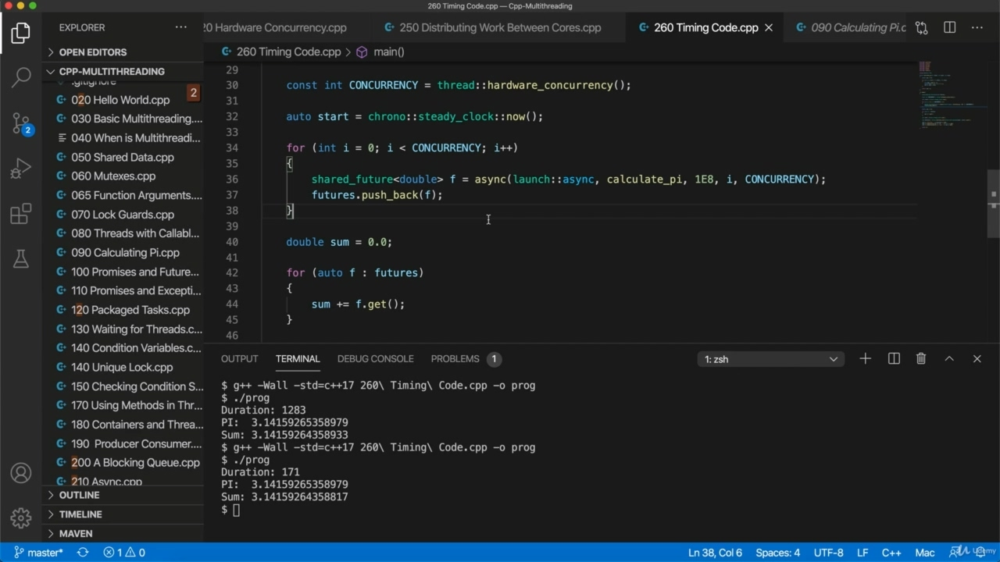
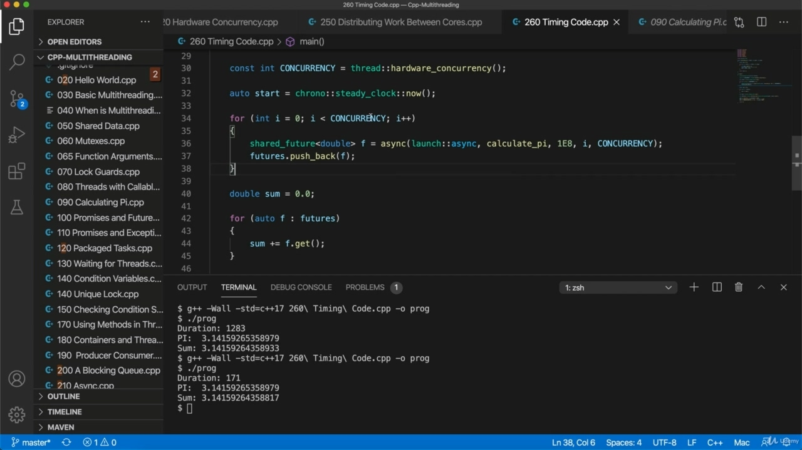
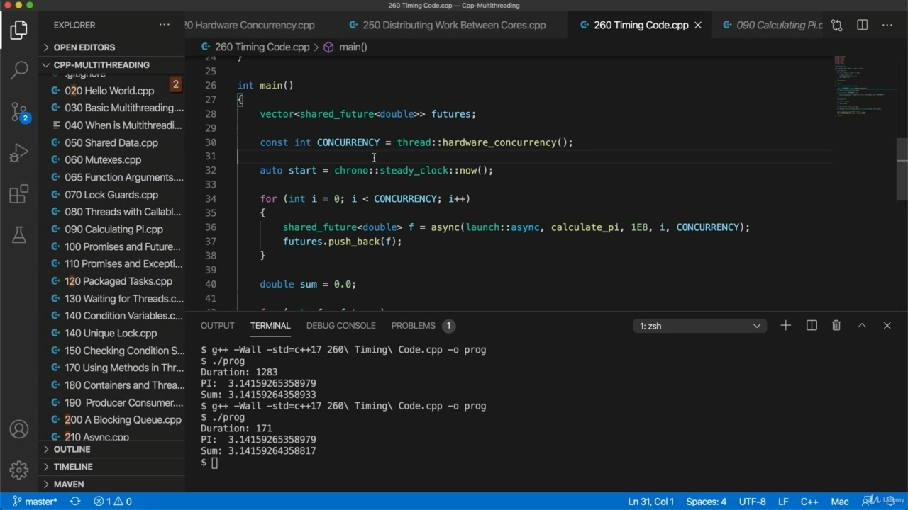
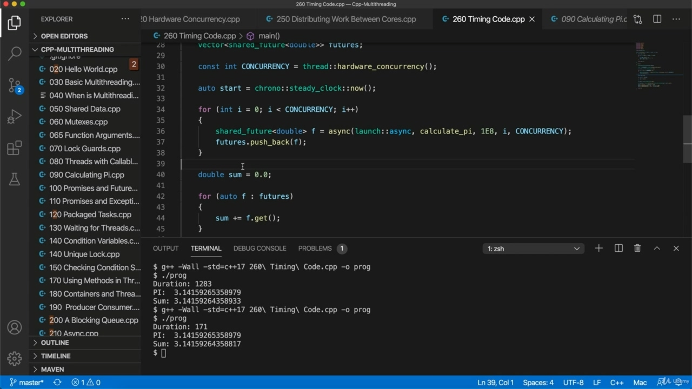
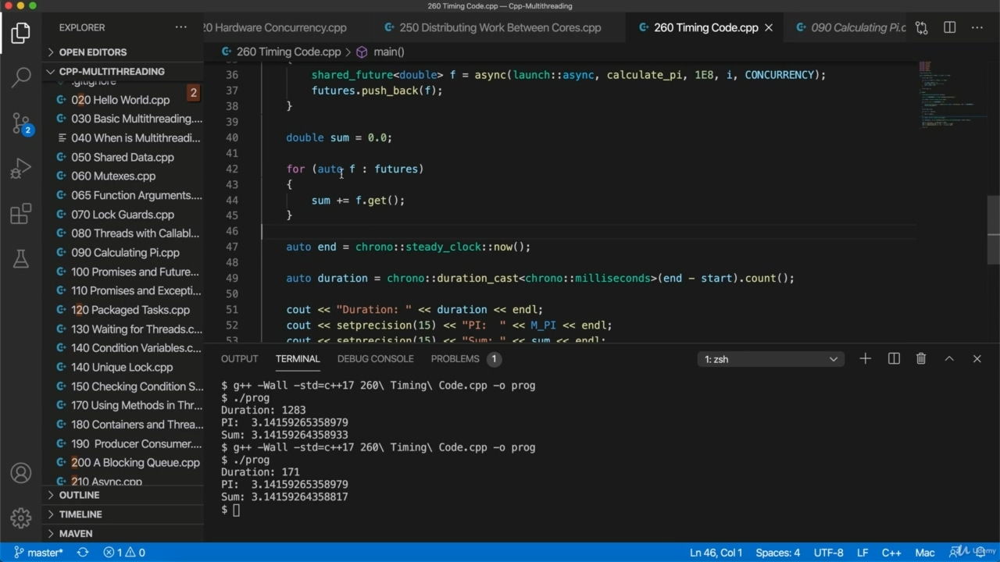
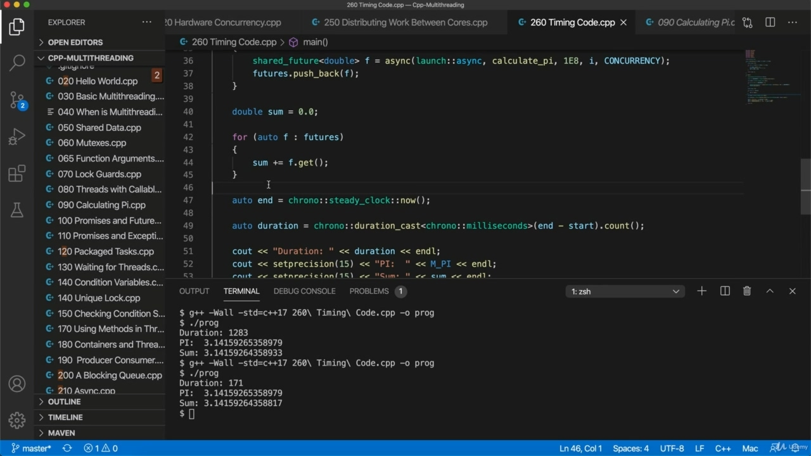

Hello. So we've come to the end of the course, there are things that I haven't shown you in the C++ API,

> 你好所以我们已经到了课程的最后，有些东西我没有在 C++API 中向您展示，

## img - 8370

So we've come to the end of the course, there are things that I haven't shown you in the C++ API, but I figure now we've really got to the point where you understand multi threading. And rather than let me show you more stuff, probably you're better off just looking you're looking it up in the documentation, otherwise it will just get really boring. So, for example, we haven't looked at timed mutex is that kind of expire after after a while and release the lock.

> 所以我们已经到了课程的最后，有些东西我还没有在 C++API 中向您展示，但我想现在我们已经真正了解了多线程。与其让我给你看更多的东西，也许你最好只是在文档中查找，否则会变得很无聊。因此，例如，我们还没有研究过定时互斥锁，它是在一段时间后过期并释放锁。

## img - 31770

the lock. And we haven't looked at lock, which can attempt to get a lock in and give up if it can't get it. We haven't looked to those sorts of things, but these are things that you could easily figure out from just looking at the API docs if if you need them for any reason. If this is your first introduction to multi threading, you know.

> 锁。我们还没有研究锁，它可以尝试获得锁，如果无法获得锁，就放弃。我们还没有考虑过这类问题，但如果您出于任何原因需要，只要查看 API 文档，就可以很容易地找到这些问题。如果这是您第一次介绍多线程，您知道。

## img - 54160

If this is your first introduction to multi threading, you know. Well, congratulations. I know before I looked into multi threading much, I heard about it. I kind of knew what it was, but I always heard it's really complicated because of this issue of synchronizing between threads. And when she studied a little bit, you see, it's not as bad as you imagine and you really feel you've achieved something. I think when you understand how to use multi threading, the the key thing is just to avoid. Race conditions and deadlocks, situations where, for example, you got threads that are locking and unlocking threads and different locking and unlocking new taxes in different orders because that can lead to a deadlock.

> 如果这是您第一次介绍多线程，您知道。恭喜你。我知道在我研究多线程之前，我听说过它。我有点知道它是什么，但我总是听说它非常复杂，因为线程之间的同步问题。当她学习一点的时候，你看，并没有你想象的那么糟糕，你真的觉得自己已经有所成就。我认为，当您了解如何使用多线程时，关键是要避免。竞争条件和死锁，例如，您的线程锁定和解锁线程，以及不同顺序的不同锁定和解锁新税，因为这可能导致死锁。

## img - 143580

So you don't want situations where you've got a thread that's got a lock and it won't release that lock until something else happens. But that's something else can't happen until another thread gets the same lock. You don't want that sort of thing happening. So you always have to think a little bit with multithreaded code, but with using kind of resource acquisition is initialization kind of paradigms and, you know, just kind of following kind of standard patterns and procedures like making use of like blocking cues. When you want to thread pull, for example, generally you can avoid these sorts of conditions that

> 因此，您不希望出现这样的情况：您的线程有一个锁，并且在发生其他事情之前，它不会释放该锁。但在另一个线程获得相同的锁之前，这是不可能发生的。你不希望这种事情发生。所以你总是需要对多线程代码进行一些思考，但是使用资源获取是一种初始化，一种范式，你知道，只是遵循一种标准模式和过程，比如使用类似的阻塞线索。例如，当你想拉动螺纹时，通常可以避免以下情况

## img - 216700

When you want to thread pull, for example, generally you can avoid these sorts of conditions that might make your program hang. You just have to proceed a bit carefully. Okay, so that's it.

> 例如，当您想要线程拉动时，通常可以避免这些可能导致程序挂起的情况。你只需要小心一点。好的，就这样。

## img - 225040

Okay, so that's it. Thank you for watching this course.

> 好的，就这样。谢谢你观看本课程。
